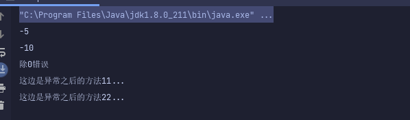

# 关于``Exception``的处理细节

## 背景1

**万事先讲背景,在写需求时,需要有一个场景也是第一次遇到. 调用某第三方接口,除了返回正常值时,都是会报出异常,然后需要将异常在当前层处理一部分,然后再抛到外层处理剩余部分,可能描述有点抽象,给出一点代码**

```java
public class ExceptionDemo {
    public static void main(String[] args) {
        try {
            divideNum(0);
        } catch (Exception e) {
            e.printStackTrace();
            System.out.println("此处是除零异常(外部)");
        }
    }

    public static void divideNum(Integer i){
        try {
            Integer res  =  10 / i;
        } catch (Exception e) {
            if (e instanceof ArithmeticException) System.out.println("此处是除零异常(内部)");
            throw e;
        }
    }
}
```

结果截图:

  

可以看出使用了 ``throw`` 依然可以将本层的异常抛出,的确也是平时很少会接触到的

## 背景2

> 关于异常处理,然后又遇到了另一个场景,一个方法报了某个异常,那么他是否还会继续往下走呢?

```java
public class ExceptionDemo {
    public static void main(String[] args) {
        try {
            divideNum(0);
            System.out.println("这边是异常之后的方法11...");
        } catch (Exception e) {
            e.printStackTrace();
            System.out.println("此处是异常(外部)");
        }

        System.out.println("这边是异常之后的方法22...");
    }
    public static void divideNum(Integer i){
        try {
            Integer res  =  10 / i;
        } catch (Exception e) {
            if (e instanceof ArithmeticException) System.out.println("此处是除零异常(内部)");
            throw e;
        }
    }
}
```
  

可观察到,```try``内部的代码将不会往下执行,但是外部的代码以及方法会继续执行,

> 那么,新的问题来了,如何也停止外部的方法执行呢,其实这个很简单

  

  

可以看到加了``return``关键字时,就直接将整个方法返回出去了


### 常用应用

> 在这次开发需求中,其实也发现了一些新的世界,分享一下

> 在异常处理时,我是在一个``for``循环内部进行异常的捕捉并处理

```java
public static void main(String[] args) {
        try {
            divideNumNoParam();
            System.out.println("这边是异常之后的方法11...");
        } catch (Exception e) {
            e.printStackTrace();
            System.out.println("此处是异常(外部)");
            return;
        }
        System.out.println("这边是异常之后的方法22...");
}

public static void divideNumNoParam(){
        try {
            for (int i = -2; i < 2; i++) {
                System.out.println(10 / i);
            }
        } catch (Exception e) {
            System.out.println("除0错误");
        }
}
```

运行截图:

  

**可以看到,报异常之后,将会推出``for``循环体,但是跳出子程序之后,程序依然会往下走**

> 但是我们如果再内部中将异常丢出

  

结果截图:

  

**外部捕捉到的异常之后将不会再继续运行下去**

#### 小结论
我们可以看出在``Java``程序中,如果当前程序报错之后,将会直接跳出,跳出当前子集程序,如果没有父类了,将会抛给虚拟机.


> 那问题来了,那我们在``for``循环过程中,如何继续运行``for``循环体呢?

#### 1. ``try``内部使用``for``

```java
public static void main(String[] args) {
        try {
            testException();
        } catch (Exception e) {
            System.out.println("外部错误");
            e.printStackTrace();
    }
}
public static void testException() {
    for (int i = -2; i < 2; i++) {
        try {
            System.out.println(10 / i);
        } catch (Exception e) {
            System.out.println("除0错误");
            //continue  可加可不加
        }
    }
}
```

结果截图:

  


如果将``try``放在了``for``循环内部,则捕捉之后将可以继续运行

#### 2. 使用``Stream``流

```java
public static void userStream(){
        ArrayList<Integer> list = new ArrayList<>();
        list.add(-2);
        list.add(-1);
        list.add(-0);
        list.add(1);
        AtomicInteger i = new AtomicInteger();
        list.stream()
                .forEach(m -> {
                    try {
                        System.out.println(10/m);
                    } catch (Exception e) {
                        System.out.println("报错了");
                        e.printStackTrace();
                    }
            });
}
```

结果截图:

  


可以知道``Stream``流报了异常之后还会回继续运行循环体
