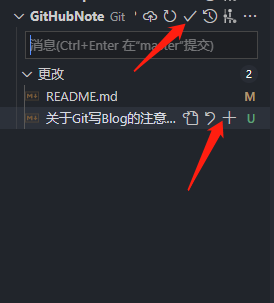
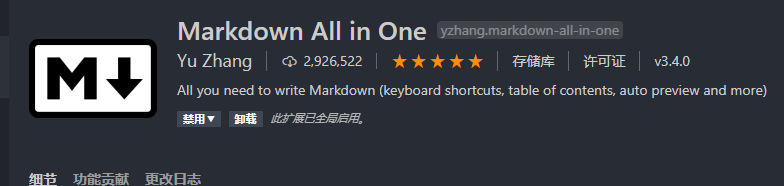
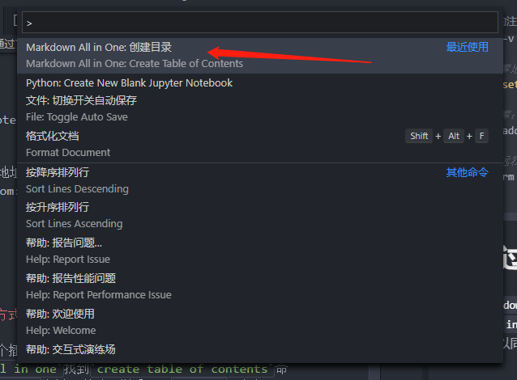

# 关于本地``Git``传送``Blog``的注意点

> 一般会使用的到指令

```bash
# 拷贝仓库资源
git clone ""(远程仓库地址,`Https``或者``git``都可以)

# 因为一般是拉下来的,所以在本地修改完之后需要重新拉一下
git pull origin master (master分支,如果是其他分支,就改成其他分支)

# 此时其实是需要本地版本库的一次存储的
```
此时其实是需要本地版本库的一次存储的 , 我一般都是采用``VsCode``图形化操作

  

```bash
#进行推送
git push origin master

#仓库路径查询查询：
git remote -v

#修改远程仓库地址：
git remote set-url origin <remote-url>

#添加远程仓库：
git remote add origin <你的项目地址> //注:项目地址形式为:https://gitee.com/xxx/xxx.git或者 git@gitee.com:xxx/xxx.git

#删除指定的远程仓库：
git remote rm origin

```

# 关于通过`README`文件生成目录的方式

需要下载`Markdown All in One`这个插件，光标点入`md`文档的开头，然后`cmd(ctrl)+shift+p`输入`mardkown all in one`找到`create table of contents`命令即可，这个生成目录的原理跟`gh-md-toc`类似，所以同样适用于`github`，但如果只是本地浏览目录直接使用```[TOC]``即可
 
  

  

