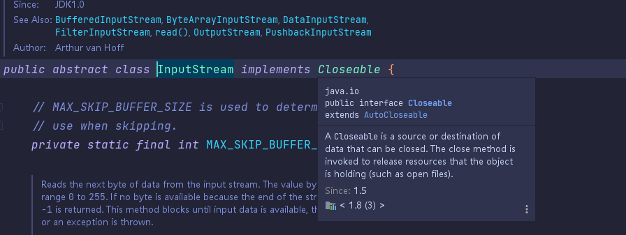

# 关于 ``Try-With-Source`` 的使用以及注意点

## 在``JDK 1.7 ``之前 , 资源需要手动关闭

```java
Charset charset = Charset.forName("US-ASCII");
String s = ...;
BufferedWriter writer = null;
try {
 writer = Files.newBufferedWriter(file, charset);
 writer.write(s, 0, s.length());
} catch (IOException x) {
 System.err.format("IOException: %s%n", x);
} finally {
 if (writer != null) writer.close();
}
```
在 ``JDK 7`` 之前，你一定要牢记在 ``finally`` 中执行 ``close`` 以释放资源

## ``JDK 7`` 中的 ``try-with-resources`` 介绍

``try-with-resources`` 是 ``JDK 7`` 中一个新的异常处理机制，它能够很容易地关闭在 ``try-catch`` 语句块中使用的资源。所谓的资源``（resource）``是指在程序完成后，必须关闭的对象。``try-with-resources ``语句确保了每个资源在语句结束时关闭。所有实现了 ``java.lang.AutoCloseable ``接口（其中，它包括实现了 ``java.io.Closeable`` 的所有对象），可以使用作为资源。

例如，我们自定义一个资源类
```java
public class Demo { 
 public static void main(String[] args) {
    try(Resource res = new Resource()) {
    res.doSome();
    } catch(Exception ex) {
    ex.printStackTrace();
    }
  }
}

class Resource implements AutoCloseable {
    void doSome() {
    System.out.println("do something");
 }

 @Override 
 public void close() throws Exception {
    System.out.println("resource is closed");
 }
}
```

执行输出如下：
```java
do something
resource is closed
```

可以看到，资源终止被自动关闭了。

再来看一个例子，是同时关闭多个资源的情况：
```java
public class Main2 { 
 public static void main(String[] args) {
    try(ResourceSome some = new ResourceSome();
    ResourceOther other = new ResourceOther()) {
        some.doSome();
        other.doOther();
    } catch(Exception ex) {
        ex.printStackTrace();
    }
 }
}

class ResourceSome implements AutoCloseable {
 void doSome() {
    System.out.println("do something");
 }

 @Override 
 public void close() throws Exception {
    System.out.println("some resource is closed");
 }
}

class ResourceOther implements AutoCloseable {
    void doOther() {
    System.out.println("do other things");
 }

 @Override 
 public void close() throws Exception {
    System.out.println("other resource is closed");
 }
}
```
最终输出为：

```java
do something
do other things
other resource is closed
some resource is closed
```

## ``try-with-resources`` 在 ``JDK 9`` 中的改进

作为 ``Milling Project Coin`` 的一部分, ``try-with-resources`` 声明在 ``JDK 9`` 已得到改进。如果你已经有一个资源是 ``final`` 或等效于 ``final`` 变量,您可以在 ``try-with-resources`` 语句中使用该变量，而无需在 ``try-with-resources`` 语句中声明一个新变量。

例如,给定资源的声明
```java
// A final resource final Resource resource1 = new Resource("resource1");
// An effectively final resource
Resource resource2 = new Resource("resource2");
```
老方法编写代码来管理这些资源是类似的:
```java
// Original try-with-resources statement from JDK 7 or 8 
try (Resource r1 = resource1;Resource r2 = resource2) {
 // Use of resource1 and resource 2 through r1 and r2.
}
```
而新方法可以是
```java
// New and improved try-with-resources statement in JDK 9 
try (resource1;resource2) {
 // Use of resource1 and resource 2.
}
```
## 使用注意点

类似于``java.io.InputStream、java.sql.Connection`` 等都是可以使用该语法实现自动关闭,是因为他实现了``AutoCloseable``接口
  

  

所以限制点就在于这个


