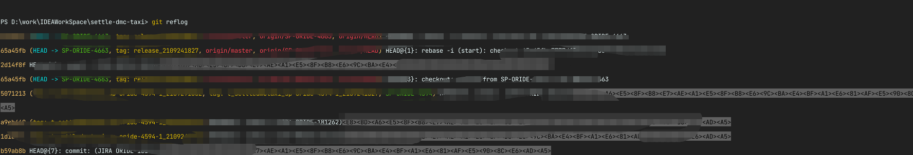
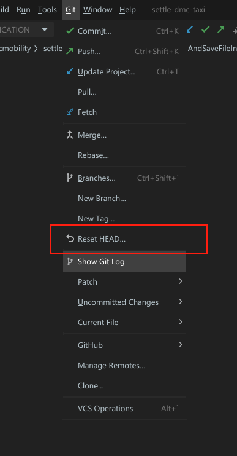
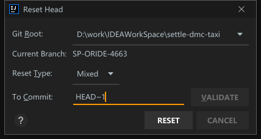

# 关于在`IDEA`中使用`Git`的一些操作

今天在项目中使用`Git`想撤销已`Commit`但是没有`Push`的版本

一不小心点了`Drop`,导致代码全部丢失,瞬间人就没了,于是在紧急中我决定寻找救济方案

 

首先执行`git reflog`查看本地记录,记录都是从最新的翻页显示到历史的,

  

退出浏览是在英文状态下按`Q`键

找到想回退的那一行操作,最前面是`HASH`值

然后在 `Terminal`中输入

`git reset --hard (hashValue)`

  

就可以了

吓死我了

同时如果在`IDEA`中想撤销上一次`Commit`,

  

在输入框中输入`HEAD~1`即可撤销上一次`Commit`

  

有惊无险!!!