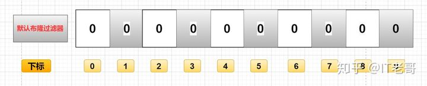
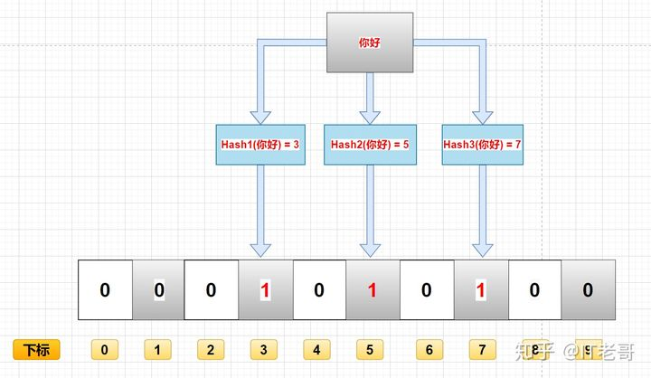
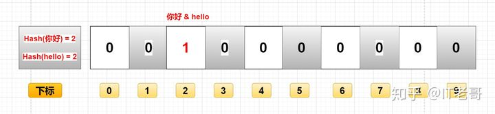

# 布隆过滤器

## 什么是布隆过滤器


布隆过滤器（`Bloom Filter`），是1970年，由一个叫布隆的小伙子提出的，距今已经五十年了，和老哥一样老。

它实际上是一个很长的二进制向量和一系列随机映射函数，二进制大家应该都清楚，存储的数据不是`0`就是`1`，默认是`0`。

主要用于判断一个元素是否在一个集合中，`0`代表不存在某个数据，`1`代表存在某个数据。

懂了吗？作为暖男的老哥在给你们画张图来帮助理解：

  

## 布隆过滤器用途

- 解决`Redis`缓存穿透（今天重点讲解）
- 在爬虫时，对爬虫网址进行过滤，已经存在布隆中的网址，不在爬取。
- 垃圾邮件过滤，对每一个发送邮件的地址进行判断是否在布隆的黑名单中，如果在就判断为垃圾邮件。

以上只是简单的用途举例，大家可以举一反三，灵活运用在工作中。


## 布隆过滤器原理
> 存入过程

布隆过滤器上面说了，就是一个二进制数据的集合。当一个数据加入这个集合时，经历如下洗礼（这里有缺点，下面会讲）：

通过K个哈希函数计算该数据，返回K个计算出的hash值
这些K个hash值映射到对应的K个二进制的数组下标
将K个下标对应的二进制数据改成1。
例如，第一个哈希函数返回x，第二个第三个哈希函数返回y与z，那么： X、Y、Z对应的二进制改成1。

如图所示：

  

> 查询过程
布隆过滤器主要作用就是查询一个数据，在不在这个二进制的集合中，查询过程如下：

通过`K`个哈希函数计算该数据，对应计算出的`K`个`hash`值
通过`hash`值找到对应的二进制的数组下标
判断：如果存在一处位置的二进制数据是`0`，那么该数据不存在。如果都是`1`，该数据存在集合中。（这里有缺点，下面会讲）
> 删除过程
一般不能删除布隆过滤器里的数据，这是一个缺点之一，我们下面会分析。

## 布隆过滤器的优缺点

> 优点
由于存储的是二进制数据，所以占用的空间很小
它的插入和查询速度是非常快的，时间复杂度是`O（K）`，可以联想一下`HashMap`的过程
保密性很好，因为本身不存储任何原始数据，只有二进制数据
> 缺点
这就要回到我们上面所说的那些缺点了。

添加数据是通过计算数据的`hash`值，那么很有可能存在这种情况：两个不同的数据计算得到相同的`hash`值。

  

例如图中的“你好”和“hello”，假如最终算出hash值相同，那么他们会将同一个下标的二进制数据改为1。

这个时候，你就不知道下标为2的二进制，到底是代表“你好”还是“hello”。

## 由此得出如下缺点：

1. 存在误判
假如上面的图没有存`"hello"`，只存了"你好"，那么用`"hello"`来查询的时候，会判断`"hello"`存在集合中。

因为“你好”和`“hello”`的`hash`值是相同的，通过相同的`hash`值，找到的二进制数据也是一样的，都是1。

2. 删除困难

到这里我不说大家应该也明白为什么吧，作为你们的暖男老哥，还是讲一下吧。

还是用上面的举例，因为“你好”和`“hello”`的`hash`值相同，对应的数组下标也是一样的。

这时候老哥想去删除“你好”，将下标为`2`里的二进制数据，由1改成了`0`。

那么我们是不是连`“hello”`都一起删了呀。（`0`代表有这个数据，`1`代表没有这个数据）


## 实现布隆过滤器

> 引入依赖

```xml
<dependency>
  <groupId>com.google.guava</groupId>
  <artifactId>guava</artifactId>
  <version>29.0-jre</version>
</dependency>
```
```java
public class BloomFilterCase {

    /**
     * 预计要插入多少数据
     */
    private static int size = 1000000;

    /**
     * 期望的误判率
     */
    private static double fpp = 0.01;

    /**
     * 布隆过滤器
     */
    private static BloomFilter<Integer> bloomFilter = BloomFilter.create(Funnels.integerFunnel(),size,fpp);


    public static void main(String[] args) {
        //插入10万条样本数据
        for (int i = 0; i < size; i++) {
            bloomFilter.put(i);
        }

        //用另外十万条测试数据,测试误判率
        int count = 0;
        for (int i = size; i < size + 1000000; i++) {
            if (bloomFilter.mightContain(i)){
                count++;
                System.out.println(i+"误判了");
            }
        }

        System.out.println("总共误判了:" + count);
    }


}
```
  

`100`万数据里有`947`个误判，约等于`0.01%`，也就是我们代码里设置的误判率：`fpp = 0.01。`

## 深入分析代码

核心`BloomFilter.create`方法

```java
@VisibleForTesting
  static <T> BloomFilter<T> create(
      Funnel<? super T> funnel, long expectedInsertions, double fpp, Strategy strategy) {
    。。。。
}
```
这里有四个参数：

- `funnel`：数据类型(一般是调用`Funnels`工具类中的)
- `expectedInsertions`：期望插入的值的个数
- `fpp`：误判率(默认值为`0.03`)
- `strategy`：哈希算法
  
我们重点讲一下`fpp`参数


### 情景总结

- 误判率可以通过`fpp`参数进行调节
- `fpp`越小，需要的内存空间就越大：`0.0`1需要`900`多万位数，`0.03`需要`700`多万位数。
- `fpp`越小，集合添加数据时，就需要更多的`hash`函数运算更多的`hash`值，去存储到对应的数组下标里。（忘了去看上面的布隆过滤存入数据的过程）

上面的`numBits`，表示存一百万个`int`类型数字，需要的位数为`7298440`，`700`多万位。理论上存一百万个数，一个`int`是`4`字节`32`位，需要`481000000=3200`万位。如果使用`HashMap`去存，按`HashMap50%`的存储效率，需要`6400`万位。可以看出`BloomFilter`的存储空间很小，只有`HashMap`的`1/10`左右

上面的`numHashFunctions`表示需要几个`hash`函数运算，去映射不同的下标存这些数字是否存在（`0 `or` 1`）。


## 解决`Redis`缓存雪崩
上面使用`Guava`实现的布隆过滤器是把数据放在了本地内存中。分布式的场景中就不合适了，无法共享内存。

我们还可以用`Redis`来实现布隆过滤器，这里使用`Redis`封装好的客户端工具`Redisson`。

其底层是使用数据结构`bitMap`，大家就把它理解成上面说的二进制结构，由于篇幅原因，`bitmap`不在这篇文章里讲

> 代码实现

`pom`配置：

```xml
<dependency>
  <groupId>org.redisson</groupId>
  <artifactId>redisson-spring-boot-starter</artifactId>
  <version>3.13.4</version>
</dependency>
```

`Java`代码

```Java
public class RedissonBloomFilter {

  public static void main(String[] args) {
    Config config = new Config();
    config.useSingleServer().setAddress("redis://127.0.0.1:6379");
    config.useSingleServer().setPassword("1234");
    //构造Redisson
    RedissonClient redisson = Redisson.create(config);

    RBloomFilter<String> bloomFilter = redisson.getBloomFilter("phoneList");
    //初始化布隆过滤器：预计元素为100000000L,误差率为3%
    bloomFilter.tryInit(100000000L,0.03);
    //将号码10086插入到布隆过滤器中
    bloomFilter.add("10086");

    //判断下面号码是否在布隆过滤器中
    //输出false
    System.out.println(bloomFilter.contains("123456"));
    //输出true
    System.out.println(bloomFilter.contains("10086"));
  }
}
```


