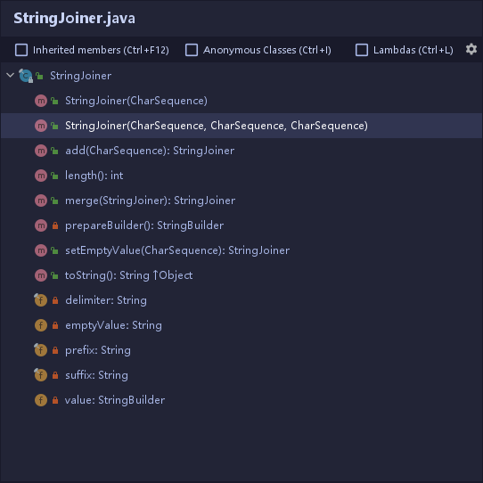
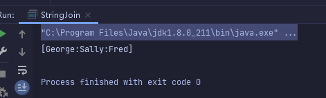
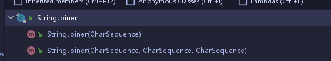
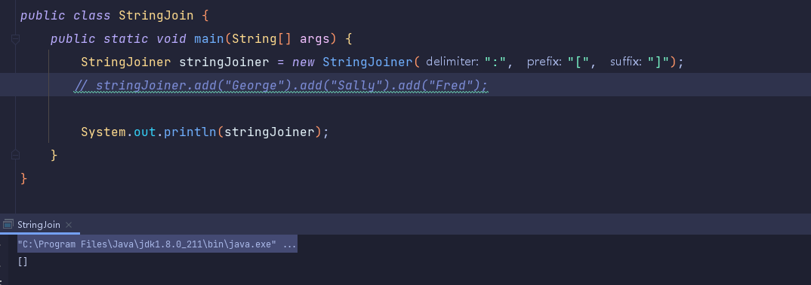
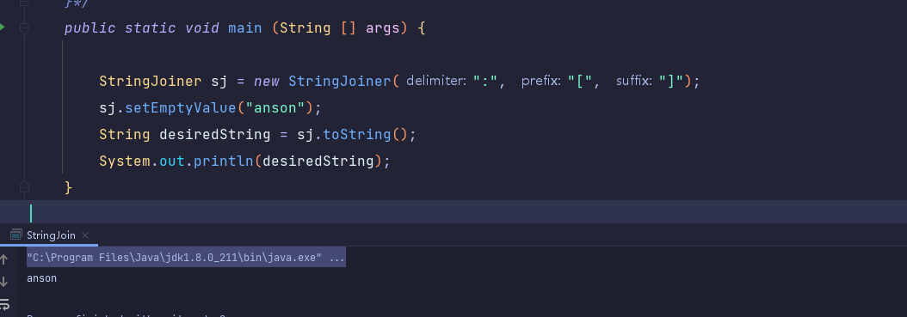
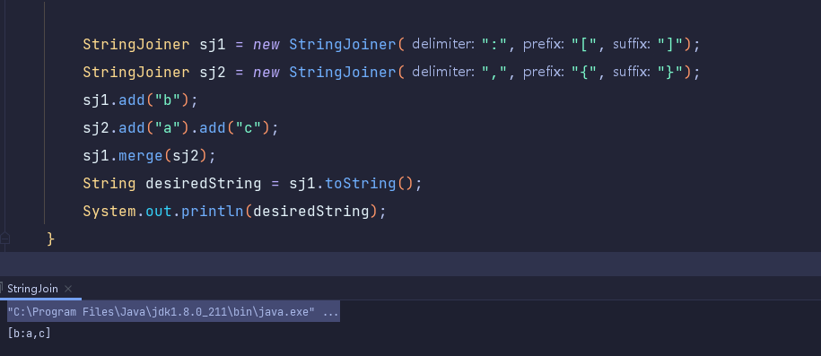

# 超级好用的``StringJoiner``

主要先说一下自己的最近的需求,类似于
```java
//&lt;402162465.20106.1625035747695.JavaMail.saicapp@deployment-invoiceservice-7bc58468c5-gtqb7&gt;

//其实是读取的时候 <> 大小于号 变成了字符串,所以现在要做的就是把他还原成
//<402162465.20106.1625035747695.JavaMail.saicapp@deployment-invoiceservice-7bc58468c5-gtqb7>
```

需要做的有两步,将``&lt;`` ``&gt;`` 去掉,然后再加前后缀 ``<``,``>``

基本上的做法就是:
```java
public static String messageIdHandle(String messageId) {
    //&lt;402162465.20106.1625035747695.JavaMail.saicapp@deployment-invoiceservice-7bc58468c5-gtqb7&gt;
    //去除前后缀
    String noPreMessageId = StrUtil.removePrefix(messageId, "&lt;");
    String noPreAndSufMessageId = StrUtil.removeSuffix(noPreMessageId, "&gt;");
    //拼接<> 号
    StringJoiner stringJoiner = new StringJoiner("", "<", ">");
    StringJoiner realMessageId = stringJoiner.add("").add(noPreAndSufMessageId);

    return realMessageId.toString();
}
```

所以我觉得``StringJoiner``挺好玩的!

## ``StringJoiner``类详解

  


我们可以构造由定界符分隔的字符序列，并可选地以提供的前缀开头并以提供的后缀结尾。然后调用``add``方法添加字符串。例子代码如下：

```java
StringJoiner stringJoiner = new StringJoiner(":", "[", "]");
stringJoiner.add("George").add("Sally").add("Fred");

System.out.println(stringJoiner);
```
打印结果:

  


### 参数

StringJoiner总共有五个参数：
```java
private final String prefix;    //前缀
private final String delimiter; //分隔符
private final String suffix;    //后缀
private StringBuilder value;  
private String emptyValue;   
```
```java
private StringBuilder value; 
//其实是Joiner的底层，说到底StringJoiner还是调用的StringBuiler方法，只是这层封装里加上了有关于前缀，后缀和连接符的操作，让我们可以方便一些。
```

```java
/*
* By default, the string consisting of prefix+suffix, returned by
* toString(), or properties of value, when no elements have yet been added,
* i.e. when it is empty.  This may be overridden by the user to be some
* other value including the empty String.
*/
 private String emptyValue;
//emptyValue 你可以把它看作是当你的StringJoiner对象没有进行任何add的操作时，调用toString() 方法会return 这个字符串而不是空。具体的用法后面看到setEmptyValue的时候再举例子。
```
### 构造器

  

参数比较多的构造器

```java
public StringJoiner(CharSequence delimiter,CharSequence prefix,CharSequence suffix) 
{
    Objects.requireNonNull(prefix, "The prefix must not be null");
    Objects.requireNonNull(delimiter, "The delimiter must not be null");
    Objects.requireNonNull(suffix, "The suffix must not be null");
    // make defensive copies of arguments
    this.prefix = prefix.toString();
    this.delimiter = delimiter.toString();
    this.suffix = suffix.toString();
    this.emptyValue = this.prefix + this.suffix;
}
```
这里面三个参数分别是前缀后缀和连接符，然后这里有一个操作就是将``emptyValue``赋值了前缀+后缀的字符串。也就是说当你用了这个构造器的时候，``emptyValue``就已经有值了，就是前缀+后缀拼接。当你``StringJoiner``不执行``add``方法直接``toString()``时，会``return``的对象就是你的前缀+后缀。例子：

  

参数比较少的构造器:

```java
public StringJoiner(CharSequence delimiter) {
    this(delimiter, "", "");
}
```
其实还是调用的三参构造器，只不过前后缀默认值为``""``,也就是没有前后缀。这种情况下``emptyValue``是什么呢？ 其实和上面一样的，``""+""``就是``""``,不难理解。

### 方法

先看上面提到最多的``toString().``
```java
 @Override
    public String toString() {
        if (value == null) {
            return emptyValue;
        } else {
            if (suffix.equals("")) {
                return value.toString();
            } else {
                int initialLength = value.length();
                String result = value.append(suffix).toString();
                // reset value to pre-append initialLength
                value.setLength(initialLength);
                return result;
            }
        }
    }
```

当``value``为空(也就是``StringBuilder``为空)时，会``return emptyVaule``， 如果不为空，就会加上一个给你加后缀的操作。当然这里加后缀你可以看作一次性的，他在加之前会取一个长度，不管你后缀多长，加完之后会``set``到初始长度。

知道了后缀是这里加的，那前缀呢。

来看最核心的``add``方法：

```java
public StringJoiner add(CharSequence newElement) {
    prepareBuilder().append(newElement);
    return this;
}

private StringBuilder prepareBuilder() {
    if (value != null) {
        value.append(delimiter);
    } else {
        value = new StringBuilder().append(prefix);
    }
    return value;
}
```

前缀就是在你调用第一个add的时候就加上了，为什么是第一个呢，因为第一次调用``add``的时候，你的``value``肯定是空的，所以它会走``else``的逻辑给你构造一个``StringBuilder``出来，这个时候会把前缀加好。所以你后面不管有几个``add``，都是基于一个``StringBuilder``上在加字符串。当你的``value``不为空了，就会给你拼接上连接符，最后再拼接上``add()``方法里的参数。完美。

再结合``toString``方法来看，当你没有调用过``add``方法而直接``toString``时，``value``为空，它就会``return emptyValue``了。

再来看个和``emptyValue``有关的方法``setEmptyValue(CharSequence emptyValue)：``
```java
 public StringJoiner setEmptyValue(CharSequence emptyValue) {
    this.emptyValue = Objects.requireNonNull(emptyValue,
        "The empty value must not be null").toString();
    return this;
}
```
这个方法其实是暴露给开发者主动设置``emptyValue``值的方法，也就是说，当你没有调用``set``方法，``emptyValue``默认值为前缀+后缀，不管前后缀是否为空；当你调用了``set``方法，``emptyValue``就是设置的值。 举个例子：

  

这里的打印结果就是``anson``，注意不是``[anson]``哦。

还有一个有关字符串操作的方法 ``merge(StringJoiner)``
```java
public StringJoiner merge(StringJoiner other) {
    Objects.requireNonNull(other);
    if (other.value != null) {
        final int length = other.value.length();
        // lock the length so that we can seize the data to be appended
        // before initiate copying to avoid interference, especially when
        // merge 'this'
        StringBuilder builder = prepareBuilder();
        builder.append(other.value, other.prefix.length(), length);
    }
    return this;
}
```
这里面调用了一个``StringBuilder``的``append()``重载方法：

```java
 public StringBuilder append(CharSequence s, int start, int end) {
    super.append(s, start, end);
    return this;
}
```
也就是说``merge``操作是把另一个``StringJoiner(简称sj2)``的从前缀开始(不包括前缀)包括连接符但是不包括后缀的字符串加进去``sj1``里面。

上个例子:  
  

前后缀都是``sj1``的，``ac``间的连接符是``sj2``的。

最后再看个简单的方法收尾
```java
 public int length() {
    // Remember that we never actually append the suffix unless we return
    // the full (present) value or some sub-string or length of it, so that
    // we can add on more if we need to.
    return (value != null ? value.length() + suffix.length() :
            emptyValue.length());
}
```
``length()``方法大家最熟悉，获取长度。这里能看到有一个好处就是当你没有调用``add``方法也就是没有初始化``StringBuilder``时，调用这个方法不会空指针，因为有默认的``emptyValue。``

## 总结
总结一下，``Java 8``的新类``StringJoiner``用法很简单，其实就是一个披着``StringJoiner``皮的``StringBuilder``而已嘛。不过有人帮你封装好了加减后缀和连接符的方法也是好的！


