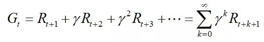
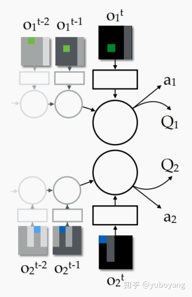
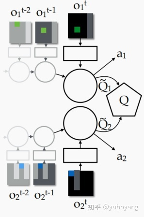

大家好，我今天给大家带来的是。。。

本文探讨了近年来流行的集中分散训练(CTDE)模式下多智能体强化学习(MARL)任务的基于价值的解决方案。然而，VDN和QMIX是使用将联合行动-价值函数分解成单个函数的思想进行分散执行的典型例子。VDN和QMIX由于可分解MARL任务的结构约束(如可加性和单调性)，仅占可分解MARL任务的一小部分。本文提出了一种新的马尔l - QTRAN分解方法，该方法不受这种结构约束，并采用一种新的方法将原始的联合作用值函数转换为具有相同最优作用的易于分解的函数。QTRAN保证比VDN或QMIX更通用的因子分解，因此比以前的方法覆盖更广泛的MARL任务类。我们对多域高斯压缩和改进的捕食者-食饵任务的实验证明了QTRAN的优越性能，特别是在收益惩罚非合作行为更具有侵略性的博弈中具有更大的裕度。

对一个认知科学家来说，一个最基本的问题是“如何学习新知识？”。回答这样一个问题的idea是，人通过学习获得某种知识，或者拥有某一种技能。而对于机器而言，可以通过学习、训练去完成更多只有人能完成的任务，实现真正的人工智能。

虽然目前无法完全回答这个问题，但是有些事实是很清楚的：即在忽略skill的前提下，可以通过与环境的交互进行学习，这是强化学习相对于其他机器学习非常显著的特点之一。无论人学习驾驶汽车还是婴儿学习走路，这样的学习方式都是基于与环境的交互，从交互中学习是学习和智力理论的基础概念。

什么是强化学习？

在维基百科中是这样介绍强化学习的：强化学习(RL)作为机器学习的一个子领域，其灵感来源于心理学中的行为主义理论，即智能体如何在环境给予的奖励或惩罚的刺激下（即与环境的交互中），逐步形成对刺激的预期，产生能获得最大利益的习惯性行为。

什么意思呢？举出一个游戏的例子。。。

它强调如何基于环境而行动，以取得最大化的预期利益。通俗的讲：就是根据环境学习一套策略，能够最大化期望奖励。由于它具有普适性而被很多领域进行研究，例如自动驾驶，博弈论、控制论、运筹学、信息论、仿真优化、多主体系统学习、群体智能、统计学以及遗传算法。

首先，做一个简单的类比。假如你家有一只宠物，如下图的小狗。

平常你会带它到附近的公园去玩，但你不是局限于简单的遛狗，而是买了一个犬笛（一种训练响片），训练它来完成一些游戏。比如，通过犬笛让狗坐下，当它完成这个动作之后，你会给它一个奖励（例如一个好吃的）。这实质上是reinforce你的狗以完成一个good action。随着时间的推移，小狗会习惯于这种声音并在每次听到咔哒声时做出respond。通过这样的训练方式，可以训练你的狗在需要时完成一个good action。

现在，在这个类比的例子中，用进行如下替换：

l 宠物（狗）变成一个人造agent；
l 对狗的奖励变成奖励函数；
l 一个good action（狗坐下）变成一个result action；

以上类比的例子，就是强化学习一个简单的“模样”，即是强化学习最典型的一个例子。要在人造agent上实现此功能，需要添加一个反馈循环来强化agent。当所执行的action是正确的，会奖励它；在错误的情况下，会惩罚它。将上图的狗换成猫咪结构图为：

进一步抽象为：

从上图可以一个典型的强化学习模型的结构包含两部分：环境和agent，描述包含：

l agent有限的状态集S，即agent能够处于多少种转态，例如在上面的类比中，狗是agent，人则是environment；那么，转态state则是人通过犬笛发出不同声音，给出不同的指令；
l Agent有限的动作集A，例子中则是狗根据人发出的指令需要完成的动作，比如坐下，趴下等；
l 回报函数R，狗完成不同动作之后，人给予不同的奖励；
l 折扣因子，用来计算累积的回报（reward）r，反映agent在序列决策中考虑未来一段时间回报的折扣；当r=0时，可以认为这个agent“目光短浅”，只考虑了眼前利益；当r接近于1时，可以认为这个学习体“目光长远”，考虑了将来可能带来的整体利益。

这是一个序列化过程，在时刻t，agent基于当前状态St发出动作At，环境做出回应，生成新的状态S(t+1)和对应的回报R(t+1)。需要强调一点的是，状态S和回报R是成对出现的。学习体的目标就是，通过更加明智地执行动作，从而最大化接下来的累计奖励，公式为：

当学习体并不是随机地产生可能的动作，而是经过对过去经历的思考得来的时，我们可以把这样的动作称为策略policy。从数学的角度来讲，策略就是由state到action的映射，它有两种形式，“确定性策略”和“非确定性策略”，前者指给定状态输出唯一的确定性动作，后者指给定状态输出所有动作的概率。一旦确定了策略时，那么学习体在每一个时刻都会按照该策略发出新的动作。

强化学习的分类：

解决强化学习问题，agent可以有多种工具组合，比如通过建立对状态的value估计来解决问题，或者通过直接建立对策略的估计来解决问题。因此，根据agent内包含的“工具”进行分类，可以把agent分为如下三类：

- 仅基于价值函数的Value Based：在此类agent中，有对状态的价值估计函数，但是没有直接的策略函数，策略函数由价值函数间接得到。而这类强化学习又包含基于蒙特卡洛的强化学习，基于时间差分的强化学习等。
- 仅直接基于策略的Policy Based：这样的agent中行为直接由策略函数产生，agent并不维护一个对各状态价值的估计函数。这类包括基于策略梯度的强化学习，基于置信域策略优化的强化学习，基于确定性策略的强化学习，基于引导策略搜索的强化学习等。
- 演员-评判家形式Actor-Critic：agent既有价值函数、也有策略函数。两者相互结合解决问题。

此外，根据agent在解决强化学习问题时是否建立一个对环境动力学的模型，将其分为两大类：

l 不基于模型的agent：这类agent并不视图了解环境如何工作，而仅聚焦于价值和/或策略函数。
l 基于模型的agent：agent尝试建立一个描述环境运作过程的模型，以此来指导价值或策略函数的更新。

接下来开始讲整篇文章的技术背景,

这篇文章是从VDN和QMIX演化而来的，那么什么叫做VDN和QMIX？

VDN ---

在传统合作的MA(multi-agent)环境中，团队有一个共同的reward，每个agent没有自己单独的奖励。当完全集中化的训练时（将所有的agent结合作为一个大的agent进行训练，其中观测空间、动作空间都是全局的），这样一个整体的reward就不能很好的体现出每个agent的“贡献大小”，当有一个优秀的agent时，可能其他agent就会“不作为”，也就是文中所说的“lazy agent”，因为它的探索可能导致整体的team reward降低；而当完全分散的训练时，由于环境是动态的，因此学习的不稳定是一个问题，同时它的reward也无法判断是由它自己还是队友产生的，因此可能会有reward的误导，也就是文中的“ spurious reward”。

VDN为每个agent单独设置一个 Q ，然后取每个agent最大的Q值（同时采取产生最大Q值这个动作，但有  \varepsilon  的机率选择随机动作进行探索），然后将 Max Q 加和作为整体的 Q max ，最后 Q total 与 team reward的误差反向学习Q ，从而可以体现每个agent的影响大小,，也就是集中训练，分散执行。

在独立agent 中  每个agent都有自己单独的Q网络，然后分别计算每个agent的Q值并单独进行自己的更新，结构如图1：

然后后来改进版本的 VDN 就是 价值分解个体架构 ：

在VDN里就是各个agent的Q值的加和(式3)：

式3. VDN中Q_total的组成
其中， Q 拔  是每个agent根据自己local observation得到的Q值，在VDN中，由于每个agent按照贪心选择Q值最大的动作，因此也就相当于整体的 Q total  也是取最大值,使训练与执行的单调性相同。同时为了说明这个想法的合理性，文章举了一个例子：在一个two-agents的环境中，设定：

即环境的总的reward是由两个agent的reward叠加产生。因此有式5：

式5
其中，

式6
简单来说就是把证明整体reward拆解的过程。也就是：

QMIX

QMIX是一个多智能体强化学习算法，具有如下特点： 1. 学习得到分布式策略。 2. 本质是一个值函数逼近算法。 3. 由于对一个联合动作-状态只有一个总奖励值，而不是每个智能体得到一个自己的奖励值，因此只能用于合作环境，而不能用于竞争对抗环境。 4. QMIX算法采用集中式学习，分布式执行应用的框架。通过集中式的信息学习，得到每个智能体的分布式策略。 5. 训练时借用全局状态信息来提高算法效果。是后文提到的VDN方法的改进。 6. 接上一条，QMIX设计一个神经网络来整合每个智能体的局部值函数而得到联合动作值函数，VDN是直接求和。 7. 每个智能体的局部值函数只需要自己的局部观测，因此整个系统在执行时是一个分布式的，通过局部值函数，选出累积期望奖励最大的动作执行。 8. 算法使联合动作值函数与每个局部值函数的单调性相同，因此对局部值函数取最大动作也就是使联合动作值函数最大。 9. 算法针对的模型是一个分布式多智能体部分可观马尔可夫决策过程（Dec-POMDP）。

在多智能体强化学习中一个关键的问题就是如何学习联合动作值函数，因为该函数的参数会随着智能体数量的增多而成指数增长，如果动作值函数的输入空间过大，则很难拟合出一个合适函数来表示真实的联合动作值函数。另一个问题就是学得了联合动作值函数后，如何通过联合值函数提取出一个优秀的分布式的策略。这其实是单智能体强化学习拓展到MARL的核心问题。

-----------------

上文“多智能体强化学习核心问题”提到的就是QMIX解决的最核心问题。其是在VDN上的一种拓展，由于VDN只是将每个智能体的局部动作值函数求和相加得到联合动作值函数，虽然满足联合值函数与局部值函数单调性相同的可以进行分布化策略的条件，但是其没有在学习时利用状态信息以及没有采用非线性方式对单智能体局部值函数进行整合，使得VDN算法还有很大的提升空间。

QMIX就是采用一个混合网络对单智能体局部值函数进行合并，并在训练学习过程中加入全局状态信息辅助，来提高算法性能。

为了能够沿用VDN的优势，利用集中式的学习，得到分布式的策略。主要是因为对联合动作值函数取 [公式] 等价于对每个局部动作值函数取 [公式] ，其单调性相同，如下所示

[公式]

因此分布式策略就是贪心的通过局部 [公式] 获取最优动作。QMIX将(1)转化为一种单调性约束，如下所示

[公式]

若满足以上单调性，则(1)成立，为了实现上述约束，QMIX采用混合网络（mixing network）来实现，其具体结构如下所示

图(c)表示每个智能体采用一个DRQN来拟合自身的Q值函数的到 [公式] ，DRQN循环输入当前的观测 [公式] 以及上一时刻的动作 [公式] 来得到Q值。

图(b)表示混合网络的结构。其输入为每个DRQN网络的输出。为了满足上述的单调性约束，混合网络的所有权值都是非负数，对偏移量不做限制，这样就可以确保满足单调性约束。

为了能够更多的利用到系统的状态信息 [公式] ，采用一种超网络（hypernetwork），将状态 [公式] 作为输入，输出为混合网络的权值及偏移量。为了保证权值的非负性，采用一个线性网络以及绝对值激活函数保证输出不为负数。对偏移量采用同样方式但没有非负性的约束，混合网络最后一层的偏移量通过两层网络以及ReLU激活函数得到非线性映射网络。由于状态信息 [公式] 是通过超网络混合到 [公式] 中的，而不是仅仅作为混合网络的输入项，这样带来的一个好处是，如果作为输入项则 [公式] 的系数均为正，这样则无法充分利用状态信息来提高系统性能，相当于舍弃了一半的信息量。

QMIX最终的代价函数为

[公式]

更新用到了传统的DQN的思想，其中b表示从经验记忆中采样的样本数量， [公式] ， [公式] 表示目标网络。

由于满足上文的单调性约束，对 [公式] 进行 [公式] 操作的计算量就不在是随智能体数量呈指数增长了，而是随智能体数量线性增长，极大的提高了算法效率。

QTRAN

对三个神经网络进行集中训练，每个智能体使用自己的分解个体行动价值函数Qi 在分散执行期间采取行动。接下来详细阐述每个网络。

1. 对于每个行动者来说，行动价值网络取其自己的行动观察历史τi 作为输入，并产生行动值Qi(τi，·)作为输出。这个行动-价值网络用于每个代理通过计算给定τ的行动值来决定它自己的行动i。由(5)定义，Q0jt 就是所有主体的输出的总和。

2. 联合行动价值网络联合行动价值网络近似于Qjt。它将所选动作作为输入，并将所选动作的q值作为输出。为了提高可扩展性和样本效率，我们将该网络设计如下。首先，我们利用所有个体行动价值网络抽样的行动向量来更新联合行动价值网络。由于联合行动空间是U N，寻找一个最优行动需要很高的复杂性，随着代理N的数量增长，而在每个单独的网络中获得一个最优行动是通过分散的策略与线性时间单独arg max操作。第二，联合行动-价值网络共享个体网络的底层参数，其中联合行动-价值网络结合了个体网络中hi(τi, ui) = [hQ,i(τi, ui)， hV,i(τi)]的隐式特征。这种参数共享用于以牺牲表达能力为代价实现具有良好样本效率的可扩展训练。

3. 状态值网络状态值网络负责计算一个标量状态值，类似于决斗网络中的V (s) (Wang et al.， 2016)。Vjt 需要提供灵活性，以匹配Qjt和Q0jt + Vjt在最大参数。如果没有状态值网络，部分可观测性将限制Q的表示复杂度0jt。在给定的τ下，状态值独立于被选择的行动。因此，这个价值网络并不有助于选择一个行动，而是用来计算损失(4)。与联合行动-价值网络一样，我们使用组合的隐藏特征 P h (τ)from个体网络i V,i i 作为可扩展性价值网络的输入。

