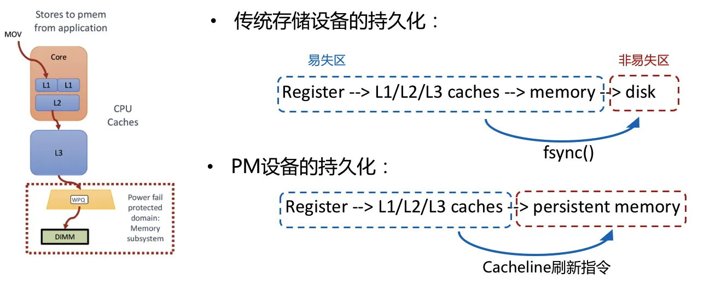
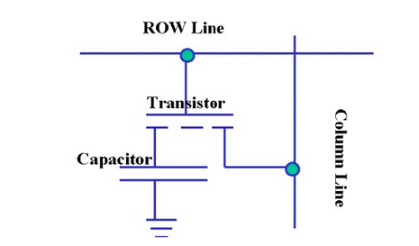
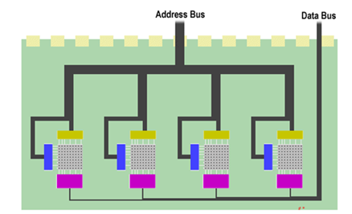
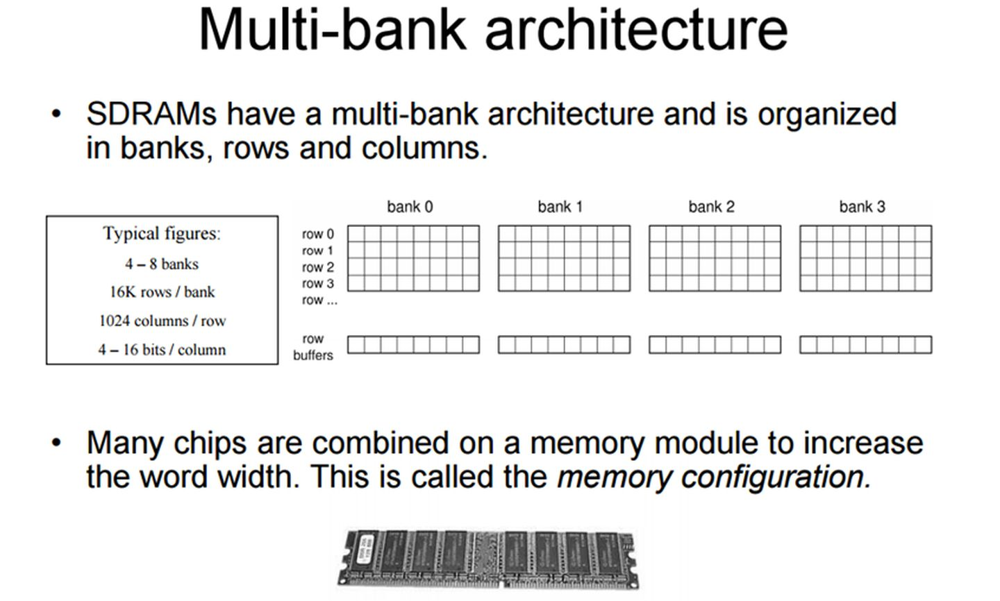
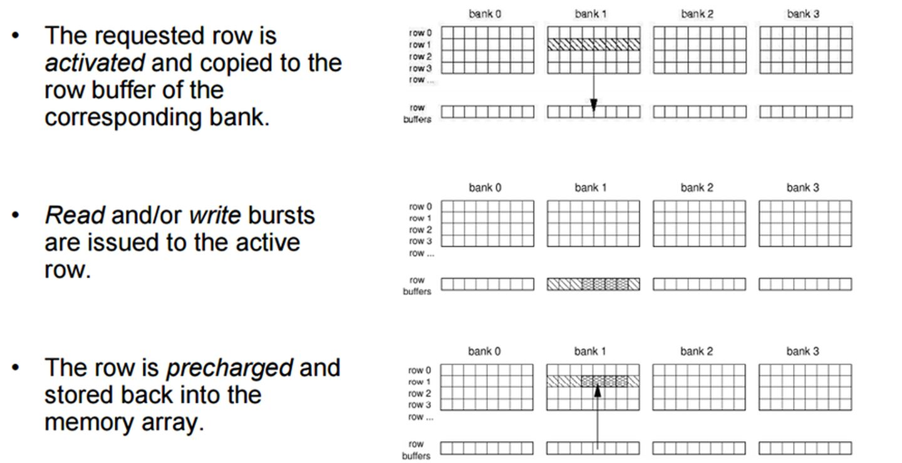
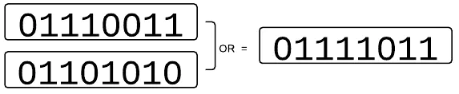
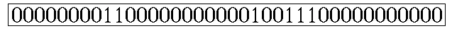
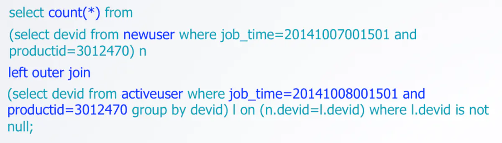
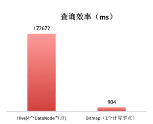
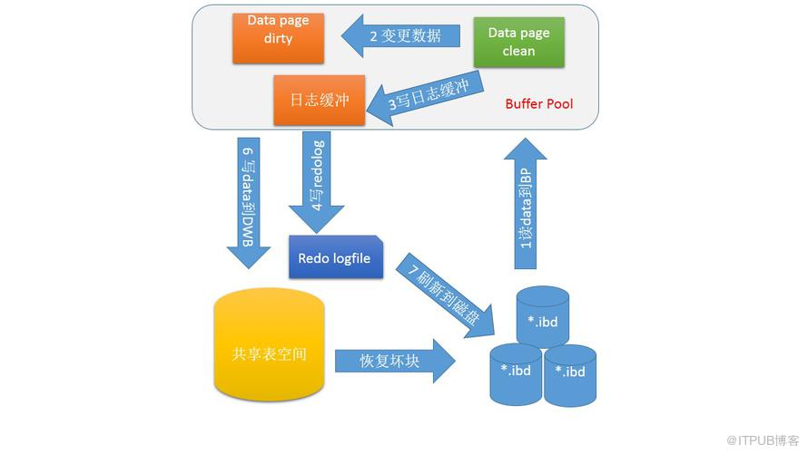

# ``ArchTM: Architecture-Aware, High Performance Transaction for Persistent Memory``

## 

## 1. ``persistent memory (PM)`` 

什么是内存接口？

  
  ``PM``是很特殊的设备，它既是内存接口，又有非易失的存储特性。因此：作为内存，它即面临内存所特有的``cache coherence``等问题；作为存储，它也面临外存系统所特有的崩溃一致性、持久化等问题。

  - 持久化 (``Durability``)
  
    然而，对``PM``的``store``操作后并不能保证数据肯定存储到PM上，这是因为``CPU``和``PM``之间还有几层``cache``，要保证持久化，我们需要用flush / fence相关的指令。

    当使用PM时，CPU对内存的store操作可能会暂存在硬件管理的cache或者write buffer中，若用户我强制刷cacheline到内存，无法保证store操作的数据何时写到内存中。在原来的情况下，内存为掉电易失的DRAM，所以刷或者不刷cacheline只可能牵扯到系统的性能，而不会影响系统的正确性；但是在使用PM时，由于持久化的存储是我们的目标之一，我们就要额外注重数据持久化的时机，以进行更精确的控制。

    在使用块设备时，类似的问题一致存在。写操作一般会被缓存到系统的page cache中，因此需要用户调用fsync等函数来进行磁盘同步，让数据真正持久化地存储到磁盘上。解决PM cache数据写回的问题和块设备同步磁盘问题的思路是类似的，只不过方法不同。如下图，在x86平台中，当数据离开CPU cache进入PM或者进入电容保护的持久区(虚线框)，便意味着数据已经被持久化，因此只要使用将数据刷出cache并写回PM的指令，就可以保证相应数据持久化存储到PM了。

    

    由于一般在使用``PM``时，是通过内存映射的方式进行的，所以使用操作系统实现的``msync``函数是可行的(msync和fsync具有相同的语义)。除此之外，用户也可以直接调用x86平台的cache刷新指令进行数据同步。

    上表列出了其他的cache刷新指令，它们的行为各有不同，需要依据场景进行选择。除表中最后一项外，其他指令都是可以在用户空间直接使用的。在用户控件调用``cacheline``刷新指令的好处是不用切换到内核态，且用户能更清楚地知道哪块数据需要马上写回PM，所以用户的控制更精细，刷新指令的性能也要好于msync。但是，一些PM感知文件系统也需要msync的控制权，因为数据刷入PM若需要造成PM感知文件系统的``metadata``改变，那么用户空间使用cacheline刷新指令将导致PM感知文件系统``metadata``的不一致。所以用户程序应该仅在确保文件系统安全的情况下才使用``cacheline``刷新指令。

   - 原子性 (Atomic Updating)

     这里的原子性指的是原子更新粒度(原子操作)或并发时的原子可见性(隔离性)，而非ACID事务的原子性。虽然ACID事务的原子性也是需要借助原子操作实现，这里的原子性更类似与ACID中的I(isolation, 隔离性)。

        PM是内存接口，其原子性操作和内存类似，因此其访问原子性也和内存一样，在无锁保护的情况下， x86 平台上支持8、16 或 64 字节原⼦性更新：

        - 8 字节原子更新: 64 位处理器的 store 命令都是 8 字节粒度的原⼦更新。
        - 16 字节原子更新: 现代处理器可以使⽤加 LOCK 前
        缀的 ``cmpxchg16b`` 指令实现 16 字节的原⼦写。
        - 64 字节 (``cacheline`` 粒度) 原子更新: 利⽤硬件事务型内存 (``hardware transactional memory, HTM``) 可以实现 64 字节的原⼦更新。Intel 平台对应的技术称 为 ``RTM(Restricted Transactional Memory)``，``RTM`` 可以在事务内保证可以保证某个 ``cacheline`` 的所有数据不被刷⼊内存。要原⼦地更新某个 ``cacheline``，⾸先⽤ ``XBEGIN`` 开始⼀个 ``RTM`` 事务，然后在是事务内对⽬标 ``cacheline`` 进⾏所需的修改，最后写 ``XEND`` 结束这个事务。在事务完成后，再进⾏ ``clflush`` 等命令，保证被修改过的 ``cacheline`` 就被原⼦地写回``PM``。

        内存中的数据结构存在多线程并发访问的问题，PM数据结构也同样这样的问题，除了借助上述原子性更新设计无锁数据结构和加锁等方法外，近期工作中还常用HTM事务的方式保证数据结构的并发访问。如前文所述，Intel平台的HTM技术被称为TSX或RTM；IBM POWER8等平台的也支持类似的技术。使用HTM时，程序员以XBEGIN和XEND开始或结束一个事务，事务中可以执行需要保护的代码。HTM从硬件上事务相关的各个cacheline的原子可见性。若事务直到XEND都没有发生冲突，则所有的修改将被提交，若中途发生冲突，所有修改将被丢弃，事务将尝试从XBEGIN重新执行。很多PM相关工作也将HTM用于PM+DRAM混合数据结构的DRAM部分。

        虽然HTM可以保证某个事务执行过程中一个或多个cacheline的原子可见(或并发安全)，但是在XEND之后，这些cacheline仍处于不可控状态，如前文所讨论，cache与PM之间的传输粒度为64字节，所以同一事务中的多个cacheline仍然无法被原子地写回PM；另外，也不能依靠电容保护的cache刷新来保证断电时的持久性，因为断电时，单一事务不一定已经完成，这种持久化会违背事务的原子可见性。

- 崩溃一致性 ``(Crash Consistency)``

    首先，本文定义两种存储系统崩溃一致性模型的定义：

    PM作为一个非易失设备，为PM设计存储软件系统时，也面临存储系统普遍存在的崩溃一致性问题(``Crash Consistency``)，这个问题同时涉及PM的持久性和原子性问题。

    崩溃一致性的简介可以参考我之前的文章 [2]。简单说，存储系统的崩溃一致性其实类似数据库系统事务要实现的ACID性质，我们可以把存取请求看成事务。Atomicity即保证请求完全成功或者完全失败，Consistency即保证存储系统中所有元数据之间甚至元数据和数据之间是一致的或者说合理的，Isolation即在并发的情况下，保证两次请求互相不会看到各自执行到一半的状态，Durability即保证存储系统的某次请求若执行完成则相关的数据一定已经被写到存储设备中。在使用非易失的PM设备情况下，我们就是要在上两小节所述的原子性和持久化条件下实现存储系统的“崩溃一致性”。
      
## ``DRAM``

``RAM，Random-Access Memory``，即随机存取存储器，其实就是内存，断电会丢失数据。主要分为``SRAM``（static）和``DRAM``（dynamic)。主要的区别在于存储单元，``DRAM``使用电容电荷进行存储。需要一直刷新充电。SRAM是用锁存器锁住信息，不需要刷新。但也需要充电保持。关于DRAM，其基本的存储单元如下，利用一个晶体管进行控制电容的充放电。

DRAM一般的寻址模式，控制的晶体管集成在单个存储单元中。

现在的``DRAM``一般都是``SDRAM``，即``Synchronous Dynamic Random Access Memory``，同步且能自由指定地址进行数据读写。其结构一般由许多个``bank``组成并利用以达到自由寻址。

而``RRAM``，指的是``Resistive Random Access Memory``，这是最近才新研究的技术，并不成熟。利用``Memositor``（一种记忆电阻，其阻值会根据流过的电流而变化）作为存储单元，优点十分明显，并且和``DRAM``比起来在``array``中可以减少控制晶体管的数量，在``CMOS chip``上已经有所应用。 

> ram 是随机存储器，掉电的话就over了，SRAM是静态RAM不需要刷新，容量不会太大，SDRAM是同步动态RAM，存储电荷的电容需要刷新。

## 崩溃一致性模型

首先，我们提出两种存储系统崩溃一致性模型的定义：

- 顺序写(ordered write)模型： 规定一组原子的数据存储单元间有一定的因果顺序(或依赖关系)，先存的数据不依赖于后存的数据，因此，当数据按这个顺序存储到存储设备的过程中，无论何时发生断电或崩溃，系统仍是一致的。

    早期的Unix文件系统FFS便是以同步写的方式保证写的顺序性，但是同步导致的阻塞降低了性能；与这种低效但一致的机制相反，若挂载FFS时加入async选项，FFS的所有写操作便异步且无序地进行，虽然这样性能会很好，但顺序一致性无法保证，系统崩溃可能会导致文件系统的损坏。Soft updates方案则是将同步顺序写改为异步顺序写，兼顾了性能和一致性。SoupFS就是在Soft updates方案基础上针对PM进行改进的PM感知文件系统。

- 事务(transactional)模型： 规定某一组原子的数据单元间是存在相互依赖关系的，先存的数据和后存的数据相互依赖，因此，只有保证整组数据全部存到磁盘或者全部没有存到存储设备，系统才是一致的。

    由于原子写粒度小于整组数据大小或者数据分散于多个写单元这两种情况是非常常见的，使用事务模型就需要额外的机制保证事务一致性，比如``logging(journaling)、log-structuring、copy-on-write``等。

    显然，顺序写模型对一致性的要求弱于事务模型。而且，事务模型一般就是建立在顺序写模型基础上的(比如日志要先于数据写到磁盘上)。使用哪种模型要取决于所存数据的实际依赖关系和系统设计者对系统一致性的需求。例如，要保证文件系统的bitmap和inode两种metadata之间的一致性就必须采用事务模型，因为文件系统中bitmap的用于指示存储空间的分配状况，各个文件的inode也存储有各个文件的大小及数据块位置，那么这两种数据便存在相互依赖关系，在用户对某个文件的写操作导致文件增大时，bitmap和inode需要同时改变，在这次用户操作前后的一致性就必须采用事务模型保证。

    很多存储系统中会结合两种模型。例如，ext4是一种基于WAL(write ahead logging)的文件系统，具体提供了3种logging模式：journal, ordered(default), writeback。这三种方法对一致性的强度依次减弱，其中journal是把所有data、metadata先进行logging，即对data和metadata都采用事务一致性模型；ordered是用顺序一致性模型保证data和metadata之间的一致性，用事务模型保证不同类别metadata之间的一致性，即先写data完成，再写metadata，并且对metadata进行logging。

3.2 保证PM存储系统一致性所面临的难题
虽然对于某种存储系统，我们可以用不同的崩溃一致性模型或不同的一致性强度为系统设计合适的一致性机制，但是我们并不能直接将适用于块设备的一致性机制直接移植到PM，这是内存系统和I/O系统硬件或架构不同导致的，原因主要有三个方面：

原子持久化粒度和传输粒度不匹配问题： 使用块设备时，块设备是与内存进行数据传输的，他们间的原子持久化单元512字节；PM的原子持久化粒度(failure-atomic)是8字节。但在保证崩溃一致性的问题上，PM与块设备不只是原子持久化大小不同：块设备的传输和持久化单元都是512字节，PM与cache的传输粒度是64字节，大于原子持久化粒度8字节，这是因为虽然CPU位宽是64比特，当前处理器和内存的cache flush指令却是对应8次数据传输，也就是数据传输的粒度是64比特 × 8 = 64字节。

这与前文所述的原子更新粒度并不等价，我们可以用当前平台普遍的8字节、加LOCK前缀的cmpxchg16b指令的16字节和用RTM(HTM)保护的64字节为更新粒度。但是进行持久化时，16字节或64字节的传输依然可能被断电或崩溃打断。

non-TSO平台store指令乱序执行问题[5]： 而且由于PM接入内存总线，需要注意硬件平台的内存一致性协议，x86等平台使用TSO(total store ordering)协议，所有store指令之间不会被打乱执行顺序。所有store指令之间不会被打乱执行顺序。arm等平台使用协议可以对应地称为non-TSO，即store指令之间也可能被打乱顺序，这时不只是cacheline刷新指令后需要加fence指令，必要时store命令后也要加fence指令。(fence指令的开销虽然不能忽视，但相对cacheline刷新指令开销要小很多。)

Cacheline刷新不可控问题[6]： 另外，cacheline还存在过早自动刷新的问题，在文献[6]中称之为“premature cache evictions”。由于cache替换策略是由硬件实现的，
虽然cache和PM间以cacheline为粒度，但若不使用RTM事务加以保证，即使不调用cache刷新指令，cacheline也可能随时被刷出cache，因此要注意，若使用顺序写模型，每次进行(8字节、16字节或RTM保护的64字节)原子更新都要以clflush+sfence进行刷新。否则可能会发生错误：比如，我们先后store了位于两个cacheline的变量A和B，若没有在store A之后加入clflush+sfence，B所在的cacheline可能会被先于A所在cacheline被刷入PM，这时若A还在cacheline并发生了断电，那么下次启动时，只有B在内存中，A不在内存中，不符合store的顺序。在易失的DRAM中是没有这个问题的，因为DRAM断电易失，CPU到cache若已经考虑了store A先于store B，就不用再考虑cache到DRAM的顺序问题。

所以在为PM设计使用顺序写模型的存储系统时，需要注意一下几点：
1. 每个原子更新的数据单元小于8字节、16字节或64字节；
2. 若以8字节或16字节进行原子更新(即直接store指令更新)且在non-TSO平台下，要在每个store命令之后加入fence指令，防止store指令被乱序执行。
3. 要及时刷新其所在的cacheline并加fence指令防止cacheline刷新被乱序执行；

使用事务模型时，在需要保证刷新cacheline顺序时，同样需要注意上述问题。

> ram 是随机存储器，掉电的话就over了，SRAM是静态RAM不需要刷新，容量不会太大，SDRAM是同步动态RAM，存储电荷的电容需要刷新。

## ``bitMap``
a) Bitmap如何做到多维交叉计算的？

Bit即比特，是目前计算机系统里边数据的最小单位，8个bit即为一个Byte。一个bit的值，或者是0，或者是1；也就是说一个bit能存储的最多信息是2。
Bitmap可以理解为通过一个bit数组来存储特定数据的一种数据结构；由于bit是数据的最小单位，所以这种数据结构往往是非常节省存储空间。比如一个公司有8个员工，现在需要记录公司的考勤记录，传统的方案是记录下每天正常考勤的员工的ID列表，比如2012-01-01:[1,2,3,4,5,6,7,8]。假如员工ID采用byte数据类型，则保存每天的考勤记录需要N个byte，其中N是当天考勤的总人数。另一种方案则是构造一个8bit（01110011）的数组，将这8个员工跟员工号分别映射到这8个位置，如果当天正常考勤了，则将对应的这个位置置为1，否则置为0；这样可以每天采用恒定的1个byte即可保存当天的考勤记录。

综上所述，Bitmap节省大量的存储空间，因此可以被一次性加载到内存中。再看其结构的另一个更重要的特点，它也显现出巨大威力：就是很方便通过位的运算（AND/OR/XOR/NOT），高效的对多个Bitmap数据进行处理，这点很重要，它直接的支持了多维交叉计算能力。比如上边的考勤的例子里，如果想知道哪个员工最近两天都没来，只要将昨天的Bitmap和今天的Bitmap做一个按位的“OR”计算，然后检查那些位置是0，就可以得到最近两天都没来的员工的数据了，比如：

再比如，我们想知道哪些男员工没来？我们可以在此结果上再“And”上一个Bitmap就能得到结果。

b) Bitmap如何做到高速运算的？

回忆一下前面，浪费的有两个部分：其一是存储空间的浪费，Bitmap比文件强多了，但是仍然有浪费的嫌疑。它需要保存到外部存储（数据库或者文件），计算时需要从外部存储加载到内存，因此存储的Bitmap越大，需要的外部存储空间就越大；并且计算时I/O的消耗会更大，加载Bitmap的时间也越长。其二是计算资源的浪费，计算时要加载到内存，越大的Bitmap消耗的内存越多；位数越多，计算时消耗的cpu时间也越多。

对于第一种浪费，最直觉的方案就是可以引入一些文件压缩技术，比如gzip/lzo之类的，对存储的Bitmap文件进行压缩，在加载Bitmap的时候再进行解压，这样可以很好的解决存储空间的浪费，以及加载时I/O的消耗；代价则是压缩/解压缩都需要消耗更多的CPU/内存资源；并且文件压缩技术对第二种浪费也无能为力。因此只有系统有足够多空闲的CPU资源而I/O成为瓶颈的情况下，可以考虑引入文件压缩技术。
那么有没有一些技术可以同时解决这两种浪费呢？好消息是有，那就是Bitmap压缩技术；而常见的压缩技术都是基于RLE（Run Length Encoding，详见http://en.wikipedia.org/wiki/Run-length_encoding）。
RLE编码很简单，比较适合有很多连续字符的数据，比如以下边的Bitmap为例：

可以编码为0,8,2,11,1,2,3,11

其意思是:第一位为0，连续有8个，接下来是2个1，11个0，1个1，2个0，3个1，最后是11个0（当然此处只是对RLE的基本原理解释，实际应用中的编码并不完全是这样的）。

可以预见，对于一个很大的Bitmap，如果里边的数据分布很稀疏（说明有很多大片连续的0），采用RLE编码后，占用的空间会比原始的Bitmap小很多。
同时引入一些对齐的技术，可以让采用RLE编码的Bitmap不需要进行解压缩，就可以直接进行AND/OR/XOR等各类计算；因此采用这类压缩技术的Bitmap，加载到内存后还是以压缩的方式存在，从而可以保证计算时候的低内存消耗；而采用word（计算机的字长，64位系统就是64bit）对齐等技术又保证了对CPU资源的高效利用。因此采用这类压缩技术的Bitmap，保持了Bitmap数据结构最重要的一个特性，就是高效的针对每个bit的逻辑运算。

常见的压缩技术包括BBC（有专利保护）,
WAH（http://code.google.com/p/compressedbitset/）
和EWAH(http://code.google.com/p/javaewah/)。在Apache Hive里边使用了EWAH。

c) Bitmap在大数据计算上的能力？
我们用一个TalkingData Analytics中用户留存的例子来看Bitmap如何做到用户回访的统计。比如想知道某个应用，昨天新增的用户中，有多少人今天又开启了应用（次日留存）。使用过Hive的工程师，不难理解下面语句的含义：

同时，我们使用Bitmap技术后，同样实现上述的计算，对比测试显示出效率的差异是巨大的：

d) 引入Bitmap技术后，分析系统可能的处理流程大体是什么样的？

数据收集系统收集设备上传数据，然后分发给实时处理系统和批量处理系统；
实时系统采用自有计数器程序，或者基于Storm之类中间件的计数器程序，计算各类简单计数器，然后批量（比如30s或者1min）更新到Redis或者HBase之类的存储；前端供应计数器类数据的服务通过访问后台计算器程序或者是计数器存储来给报表系统提供服务；
批量系统对该批的数据按用户进行去重生成/修改某天/某个应用的活跃用户Bitmap，同时可以根据需要，将机型、地域、操作系统等等各种数据提炼成属性Bitmap，备用。
报表中针对分析需要，提取各种Bitmap（用户、属性……Bitmap），高效的利用CPU/内存，通过组合And/Or/Not等基础计算，最终完成多维交叉计算功能，反馈客户结果。

## ``Copy On Write``

写入时复制（CopyOnWrite，简称COW）思想是计算机程序设计领域中的一种通用优化策略。其核心思想是，如果有多个调用者（Callers）同时访问相同的资源（如内存或者是磁盘上的数据存储），他们会共同获取相同的指针指向相同的资源，直到某个调用者修改资源内容时，系统才会真正复制一份专用副本（private copy）给该调用者，而其他调用者所见到的最初的资源仍然保持不变。这过程对其他的调用者都是透明的（transparently）。此做法主要的优点是如果调用者没有修改资源，就不会有副本（private copy）被创建，因此多个调用者只是读取操作时可以共享同一份资源。

通俗易懂的讲，写入时复制技术就是不同进程在访问同一资源的时候，只有更新操作，才会去复制一份新的数据并更新替换，否则都是访问同一个资源。

JDK 的 CopyOnWriteArrayList/CopyOnWriteArraySet 容器正是采用了 COW 思想，它是如何工作的呢？简单来说，就是平时查询的时候，都不需要加锁，随便访问，只有在更新的时候，才会从原来的数据复制一个副本出来，然后修改这个副本，最后把原数据替换成当前的副本。修改操作的同时，读操作不会被阻塞，而是继续读取旧的数据。这点要跟读写锁区分一下。

## 合并写(``write combining`` )

现代CPU采用大量的技术来抵消内存访问延迟。 从DRAM存储中读取或者写入数据的时间CPU可以执行上百个指令。

用来降低这种延迟的主要手段是使用多层次的SRAM（静态随机存取存储器）缓存。此外，也有SMP系统采用消息传递协议来实现缓存之间的一致性。即便如此，现代CPU是如此之快，是缓存根本无法企及的。因此，为了进一步降低延迟一些鲜为人知的缓冲区（buffers ）也被使用。

本文探讨“合并写存储缓冲区（``write combining store buffers``）”，以及我们如何编写代码可以有效地使用它们。 

  CPU缓存是一个高效的非链式结构的hash map，每个桶（bucket）通常是64个字节。被称为之为一个“缓存行（cache line）”。缓存行（cache line）是内存传输的有效单元。例如，主存中地址A会映射到一个给定的缓存行C。

  如果CPU需要访问的地址hash之后并不在缓存行（cache line）中，那么缓存中对应位置的缓存行（cache line）会失效，以便让新的值可以取代该位置的现有值。例如，如果我们有两个地址，通过hash算法hash到同一缓存行，那么新的值会覆盖老的值。

当CPU执行存储指令（store）时，它会尝试将数据写到离CPU最近的L1缓存。如果这时出现缓存失效，CPU会访问下一级缓存。这时无论是英特尔还是许多其他厂商的CPU都会使用被称为“合并写（write combining）”的技术。

    当请求L2缓存行的所有权的时候，最典型的是将处理器的store buffers中某一项写入内存的期间， 在缓存子系统( cache sub-system)准备好接收、处理的数据的期间，CPU可以继续处理其他指令。当数据不在任何缓存层中缓存时，将获得最大的优势。

    当连串的写操作需要修改相同的缓存行时，会变得非常有趣。在修改提交到L2缓存之前，这连串的写操作会首先合并到缓冲区（buffer）。 这些64字节的缓冲（buffers ）维护在一个64位的区域中，每一个字节（byte）对应一个位（bit），当缓冲区被传输到外缓存后，标志缓存是否有效。

也许你要问如果程序要读取一些已被写入缓冲区（buffer）的数据，会发生什么事呢？我们的硬件会友好的处理，它们在读取缓存之前会先读取缓冲区。

    这一切对我们的程序意味着什么呢？

    如果我们可以在缓冲区被传输到外缓存之前能够填补这些缓冲区（buffers ），那么我们将大大提高传输总线的效率。如何才能做到这一点呢？大部分程序花费其大部分时间在循环的处理某项任务。

由于这些缓冲区的数量是有限的，并且它们根据CPU的型号有所不同。例如在Intel CPU，你只能保证在同一时间拿到4个。这意味着，在一个循环中，你不应该同时写超过4个截然不同的内存位置，否则你讲不能从合并写（write combining）的中受益。

## ``double write``是什么？

Double write 是InnoDB在 tablespace上的128个页（2个区）是2MB；

其原理：

    为了解决 partial page write 问题 ，当mysql将脏数据flush到data file的时候, 先使用memcopy 将脏数据复制到内存中的double write buffer ，之后通过double write buffer再分2次，每次写入1MB到共享表空间，然后马上调用fsync函数，同步到磁盘上，避免缓冲带来的问题，在这个过程中，doublewrite是顺序写，开销并不大，在完成doublewrite写入后，在将double write buffer写入各表空间文件，这时是离散写入。
如果发生了极端情况（断电），InnoDB再次启动后，发现了一个Page数据已经损坏，那么此时就可以从doublewrite buffer中进行数据恢复了。

> double write的缺点是什么?

位于共享表空间上的double write buffer实际上也是一个文件，写DWB会导致系统有更多的fsync操作, 而硬盘的fsync性能, 所以它会降低mysql的整体性能. 但是并不会降低到原来的50%. 这主要是因为: 
1) double write 是一个连接的存储空间, 所以硬盘在写数据的时候是顺序写, 而不是随机写, 这样性能更高. 
2) 将数据从double write buffer写到真正的segment中的时候, 系统会自动合并连接空间刷新的方式, 每次可以刷新多个pages;

## 顺序写和随即写

随机和顺序读写，是存储器的两种输入输出方式。

随机读写占用空间多，但速度快，便于进行数据处理，而顺序读写速度慢，空间小，数据处理复杂

随机和顺序读写，是存储器的两种输入输出方式。

操作系统会将数据文件依次写入磁盘，当有些数据被删除时，就会空出该数据原来占有的存储空间，时间长了，不断的写入、删除数据，就会产生很多零零散散的存储空间，就会造成一个较大的数据文件放在许多不连续的存贮空间上，读写些这部分数据时，就是随机读写，磁头要不断的调整磁道的位置，以在不同位置上的读写数据，相对于连续空间上的顺序读写，要耗时很多。在开机时、启动大型程序时，电脑要读取大量小文件，而这些文件也不是连续存放的，也属于随机读取的范围。

改善方法：做磁盘碎片整理，合并碎片文件，但随后还会再产生碎片造成磁盘读写性能下降，而且也解决不了小文件的随机存取的问题，这只是治标。更好的解决办法：更换电子硬盘（SSD），电子盘由于免除了机械硬盘的磁头运动，对于随机数据的读写极大的提高。

举个例子，SSD的随机读取延迟只有零点几毫秒，而7200RPM的随机读取延迟有7毫秒左右，5400RPM硬盘更是高达9毫秒之多，体现在性能上就是开关机速度。

## 双重写入

什么是双重写入？

双重写入描述了您在两个个系统（例如数据库和Apache Kafka）中更改数据时的情况，而没有额外的层来确保两个服务上的数据一致性。
只要两个操作都成功，一切就OK了。即使第一笔交易失败，也还是可以的。但是，如果您成功提交了第一笔交易而第二笔交易失败，则说明您遇到了问题。您的系统现在处于不一致状态，没有容易修复的方法。