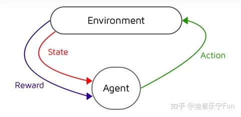

强化学习(RL)作为机器学习的一个子领域，其灵感来源于心理学中的行为主义理论，即智能体如何在环境给予的奖励或惩罚的刺激下（即与环境的交互中），逐步形成对刺激的预期，产生能获得最大利益的习惯性行为。它强调如何基于环境而行动，以取得最大化的预期利益。通俗的讲：就是根据环境学习一套策略，能够最大化期望奖励。由于它具有普适性而被很多领域进行研究，例如自动驾驶，博弈论、控制论、运筹学、信息论、仿真优化、多主体系统学习、群体智能、统计学以及遗传算法。

什么是强化学习？

平常你会带它到附近的公园去玩，但你不是局限于简单的遛狗，而是买了一个犬笛（一种训练响片），训练它来完成一些游戏。比如，通过犬笛让狗坐下，当它完成这个动作之后，你会给它一个奖励（例如一个好吃的）。这实质上是reinforce你的狗以完成一个good action。随着时间的推移，小狗会习惯于这种声音并在每次听到咔哒声时做出respond。通过这样的训练方式，可以训练你的狗在需要时完成一个good action。

现在，在这个类比的例子中，用进行如下替换：

l 宠物（狗）变成一个人造agent；
l 对狗的奖励变成奖励函数；
l 一个good action（狗坐下）变成一个result action；

以上类比的例子，就是强化学习一个简单的“模样”，即是强化学习最典型的一个例子。要在人造agent上实现此功能，需要添加一个反馈循环来强化agent。当所执行的action是正确的，会奖励它；在错误的情况下，会惩罚它。将上图的狗换成猫咪结构图为：

从上图可以一个典型的强化学习模型的结构包含两部分：环境和agent，描述包含：

l agent有限的状态集S，即agent能够处于多少种转态，例如在上面的类比中，狗是agent，人则是environment；那么，转态state则是人通过犬笛发出不同声音，给出不同的指令；
l Agent有限的动作集A，例子中则是狗根据人发出的指令需要完成的动作，比如坐下，趴下等；
l 回报函数R，狗完成不同动作之后，人给予不同的奖励；
l 折扣因子，用来计算累积的回报（reward）r，反映agent在序列决策中考虑未来一段时间回报的折扣；当r=0时，可以认为这个agent“目光短浅”，只考虑了眼前利益；当r接近于1时，可以认为这个学习体“目光长远”，考虑了将来可能带来的整体利益。

这是一个序列化过程，在时刻t，agent基于当前状态St发出动作At，环境做出回应，生成新的状态S(t+1)和对应的回报R(t+1)。需要强调一点的是，状态S和回报R是成对出现的。学习体的目标就是，通过更加明智地执行动作，从而最大化接下来的累计奖励，公式为：

当学习体并不是随机地产生可能的动作，而是经过对过去经历的思考得来的时，我们可以把这样的动作称为策略policy。从数学的角度来讲，策略就是由state到action的映射，它有两种形式，“确定性策略”和“非确定性策略”，前者指给定状态输出唯一的确定性动作，后者指给定状态输出所有动作的概率。一旦确定了策略时，那么学习体在每一个时刻都会按照该策略发出新的动作。

## 强化学习的分类

解决强化学习问题，agent可以有多种工具组合，比如通过建立对状态的value估计来解决问题，或者通过直接建立对策略的估计来解决问题。因此，根据agent内包含的“工具”进行分类，可以把agent分为如下三类：

- l 仅基于价值函数的Value Based：在此类agent中，有对状态的价值估计函数，但是没有直接的策略函数，策略函数由价值函数间接得到。而这类强化学习又包含基于蒙特卡洛的强化学习，基于时间差分的强化学习等。
- l 仅直接基于策略的Policy Based：这样的agent中行为直接由策略函数产生，agent并不维护一个对各状态价值的估计函数。这类包括基于策略梯度的强化学习，基于置信域策略优化的强化学习，基于确定性策略的强化学习，基于引导策略搜索的强化学习等。
- l 演员-评判家形式Actor-Critic：agent既有价值函数、也有策略函数。两者相互结合解决问题。

此外，根据agent在解决强化学习问题时是否建立一个对环境动力学的模型，将其分为两大类：

l 不基于模型的agent：这类agent并不视图了解环境如何工作，而仅聚焦于价值和/或策略函数。
l 基于模型的agent：agent尝试建立一个描述环境运作过程的模型，以此来指导价值或策略函数的更新。

- l 监督学习是一种目标变量是已知的学习，并且在训练期间明确使用该信息（监督），即模型在目标的监督下训练，直接给出预测结果或者未来的输出，主要用于解决分类问题和回归问题。例如，如果想要为手写数字构建分类模型，则输入将是图像集（训练数据），目标变量将是分配给这些图像的标签，即0-9的类。
- l 无监督学习是对由目标未知的输入数据组成的数据集进行推断。最常见的无监督学习方法是聚类分析，用于探索、分析数据，以发现隐藏的模式或数据分组。其评价是定性或不明确的，不能进行预测。
- l 强化学习是在给定某种情况/环境的情况下，机器决定采取什么动作，以便最大化奖励。 监督和强化学习之间的区别在于奖励信号，它简单地告诉agent采取的行动（输入）是好还是坏。它没有告诉agent什么是最好的行动。 在这种类型的学习中，既没有训练数据也没有目标变量。

# 可加性

可加性是指对于某种变换来说，特定的“加法”和该变换的顺序可颠倒而不影响结果，这样一种性质。 例如对于两个实数 x 和y，我们可以先执行加法x+y、后把结果乘以二；也可以先各自乘以二然后再相加，两边结果是一样的。 那么我们说变换“乘以二”具有可加性。

# VDN
VDN

VDN论文全称为：Value-Decomposition Networks For Cooperative Multi-Agent Learning
  在合作式多智能体强化学习问题中，每个智能体基于自己的局部观测做出反应来选择动作，来最大化团队奖励。对于一些简单的合作式多智能体问题，可以用中心式(centralized)的方法来解决，将状态空间和动作空间做一个拼接，从而将问题转换成一个单智能体的问题。这会使得某些智能体在其中滥竽充数。

  另一种极端方式式训练独立的智能体，每个智能体各玩各的，也不做通信，也不做配合，直接暴力出奇迹。这种方式对于每个智能体来说，其它智能体都是环境的一部分，那么这个环境是一个非平稳态的(non-stationary)，理论上的收敛性是没法证明的。还有一些工作在对每个智能体都基于其观测设计一个奖励函数，而不是都用一个团队的团队奖励，这种方式的难点在于奖励函数的设计，因为设计的不好很容易使其陷入局部最优。

  VDN中提出一种通过反向传播将团队的奖励信号分解到各个智能体上的这样一种方式。其网络结构如下图所示：

> 多智能体强化学习核心问题

在多智能体强化学习中一个关键的问题就是如何学习联合动作值函数，因为该函数的参数会随着智能体数量的增多而成指数增长，如果动作值函数的输入空间过大，则很难拟合出一个合适函数来表示真实的联合动作值函数。另一个问题就是学得了联合动作值函数后，如何通过联合值函数提取出一个优秀的分布式的策略。这其实是单智能体强化学习拓展到MARL的核心问题。

从上图可以一个典型的强化学习模型的结构包含两部分：环境和agent，描述包含：

l agent有限的状态集S，即agent能够处于多少种转态，例如在上面的类比中，狗是agent，人则是environment；那么，转态state则是人通过犬笛发出不同声音，给出不同的指令；
l Agent有限的动作集A，例子中则是狗根据人发出的指令需要完成的动作，比如坐下，趴下等；
l 回报函数R，狗完成不同动作之后，人给予不同的奖励；
l 折扣因子，用来计算累积的回报（reward）r，反映agent在序列决策中考虑未来一段时间回报的折扣；当r=0时，可以认为这个agent“目光短浅”，只考虑了眼前利益；当r接近于1时，可以认为这个学习体“目光长远”，考虑了将来可能带来的整体利益。

这是一个序列化过程，在时刻t，agent基于当前状态St发出动作At，环境做出回应，生成新的状态S(t+1)和对应的回报R(t+1)。需要强调一点的是，状态S和回报R是成对出现的。学习体的目标就是，通过更加明智地执行动作，从而最大化接下来的累计奖励，公式为：

当学习体并不是随机地产生可能的动作，而是经过对过去经历的思考得来的时，我们可以把这样的动作称为策略policy。从数学的角度来讲，策略就是由state到action的映射，它有两种形式，“确定性策略”和“非确定性策略”，前者指给定状态输出唯一的确定性动作，后者指给定状态输出所有动作的概率。一旦确定了策略时，那么学习体在每一个时刻都会按照该策略发出新的动作。

