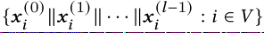

# 基于会话推荐的图神经网络信息丢失处理

解决了哪两个问题：
- 有损``Session``编码问题和无效的长期依赖捕获问题
- 无效的长期依赖捕获问题

第一个问题是有损Session编码问题。由于从Session到图的有损编码以及聚合消息传递期间不变的排列，因此忽略了有关Session转换的一些顺序信息。第二个问题是无效的长期依赖捕获问题。由于层数有限，因此无法捕获Session中的某些长期依赖性。为了解决第一个问题，提出了一种无损编码方案和基于GRU的边缘顺序保留聚合层，该层专门设计用于处理无损编码图。为了解决第二个问题，我们提出了一个捷径图关注层，该层通过沿捷径连接传播信息来有效地捕获远程依赖关系。通过将两种类型的层组合在一起，能够构建一个不存在信息丢失问题并且在三个公共数据集上胜过最新模型的模型

- 主要贡献：
  
    - 首次提出基于GNN的基于会话的推荐方法的两个信息丢失问题，包括有损会话编码问题和低效的远程依赖捕获问题。
    - 为了解决有损会话编码问题，提出了将会话转换为有向多图的无损编码方案，以及使用GRU聚合传播信息的EOPA层。
    - 为了解决无效的远程依赖捕获问题，提出了一个SGAT层，该层使用注意力机制有效地沿捷径连接传播信息。
    - 通过结合这两种解决方案，构建了一个不存在信息丢失问题的GNN模型，并且在三个公共数据集中优于现有的方法。

- 为了构建没有信息丢失问题的GNN模型，堆叠了多个EOPA和SGAT层。并非将所有EOPA层放在所有SGAT层之后，反之亦然，将EOPA层与SGAT层交织，其原因如下：
    - 快捷方式图是原始会话的有损转换，因此连续堆叠多个SGAT层将引入有损会话编码问题。对于更多的SGAT层，此问题更加严重，因为信息丢失量不断累积。通过交错EOPA和SGAT层，丢失的信息可以保留在后续的EOPA层中，而SGAT层可以仅专注于捕获远程依赖关系。

    - 交错两种类型的层的另一个优点是，每种类型的层都可以有效利用另一种类型的层所捕获的特征。由于EOPA层更能捕获本地上下文信息，而SGAT层更能捕获全局依赖关系，因此将两种层进行交织可以有效地结合两者的优势，并提高模型学习更复杂依赖关系的能力。

    为了进一步促进特征复用，引入了密集连接。原先的当前层输入只有前一层的信息，这里当前层的输入为之前所有层的输入（拼接）：
    

