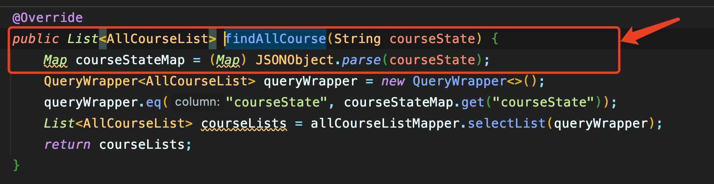

## 需要导入依赖

```xml
 <!--fastJson-->
<dependency>
    <groupId>com.alibaba</groupId>
    <artifactId>fastjson</artifactId>
    <version>1.2.75</version>
</dependency>
```


## 实体类转换为``Json``字符串


```java
JSON.toJSONString(实体类)
```


## ``Json``字符串转换为实体类

```java
JSON.parseObject(str(json字符串), (实体类).class);
```





## 常见使用

```java
// 把JSON文本parse为JSONObject或者JSONArray 
public static final Object parse(String text); 
// 把JSON文本parse成JSONObject    
public static final JSONObject parseObject(String text)； 
// 把JSON文本parse为JavaBean 
public static final <T> T parseObject(String text, Class<T> clazz); 
// 把JSON文本parse成JSONArray 
public static final JSONArray parseArray(String text); 
//把JSON文本parse成JavaBean集合 
public static final <T> List<T> parseArray(String text, Class<T> clazz); 
 // 将JavaBean序列化为JSON文本 
public static final String toJSONString(Object object);
// 将JavaBean序列化为带格式的JSON文本 
public static final String toJSONString(Object object, boolean prettyFormat); 
//将JavaBean转换为JSONObject或者JSONArray。
public static final Object toJSON(Object javaObject); 
```
