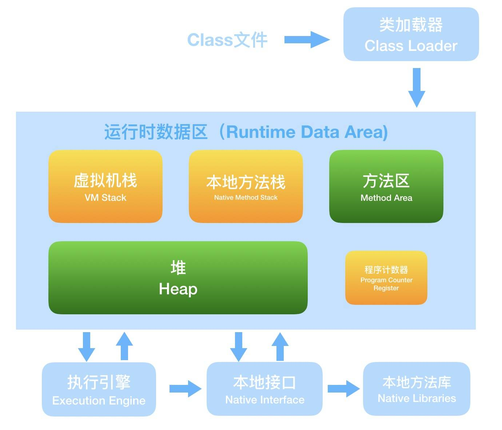
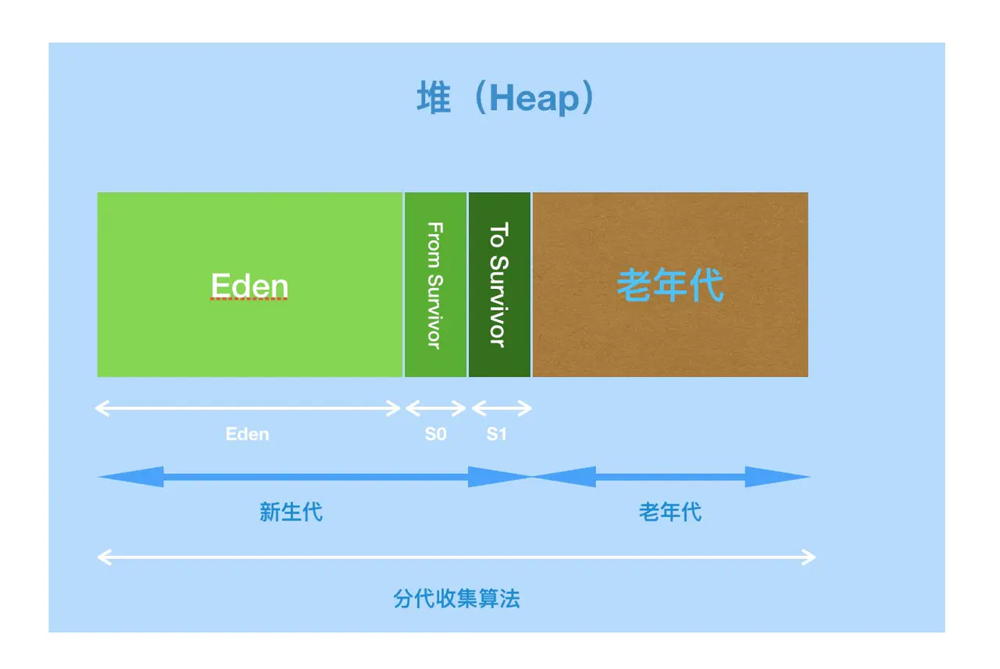
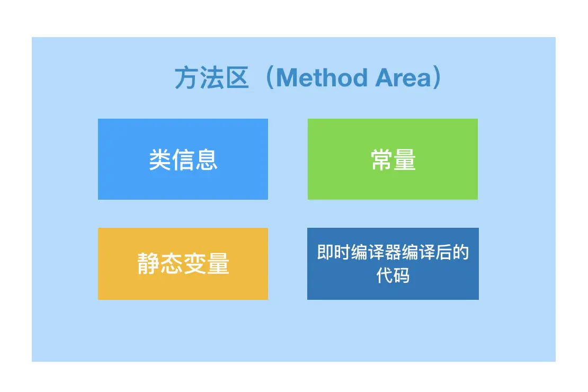
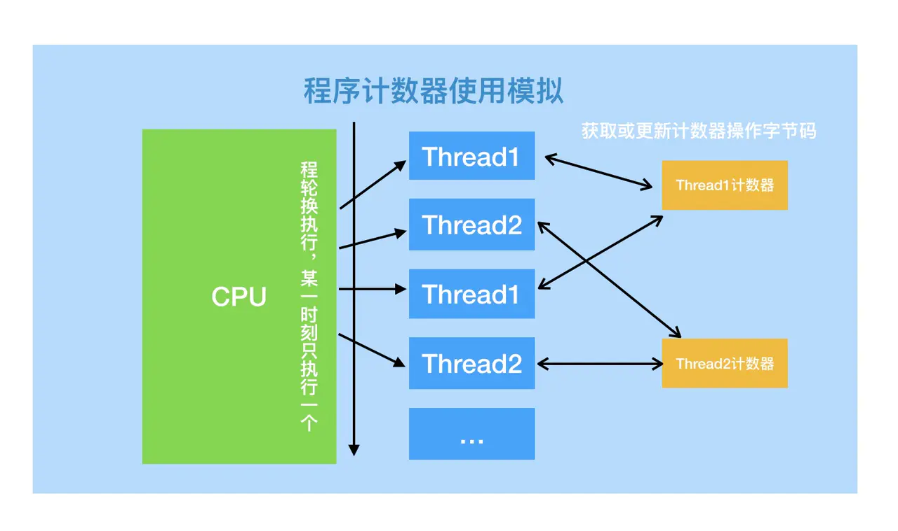
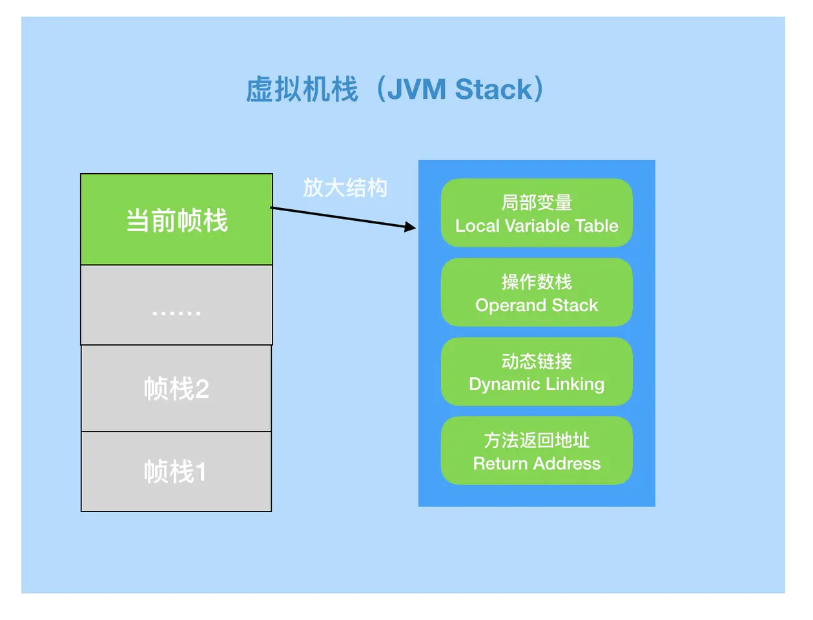
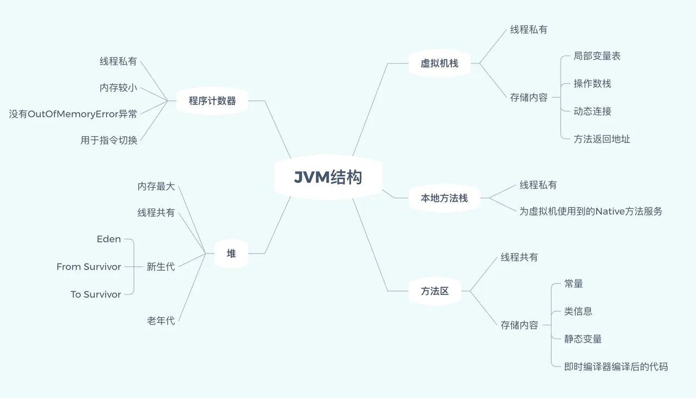

# ``Jvm``原理的第一次接触

## ``JVM``内存结构

- 第一，``JVM``分为五个区域：虚拟机栈(``VM Stack``)、本地方法栈(``Native Method Stack``)、方法区(``Method Area``)、堆(``Heap``)、程序计数器(``Program Counter Register``)。``PS``：大家不要排斥英语，此处用英文记忆反而更容易理解。
- 第二，``JVM``五个区中虚拟机栈、本地方法栈、程序计数器为线程私有，方法区和堆为线程共享区。图中已经用颜色区分，绿色表示“通行”，橘黄色表示停一停（需等待）。
- 第三，``JVM``不同区域的占用内存大小不同，一般情况下堆最大，程序计数器较小。那么最大的区域会放什么？当然就是``Java中最多的“对象”``了。
学习延伸：如果你记住了这张图，是不是就可以说出关于``JVM``的内存结构了呢？可以尝试一下，切记不用死记硬背，发挥你的想象。

## 堆(``Heap``)

上面已经得出结论，堆内存最大，堆是被线程共享，堆的目的就是存放对象。几乎所有的对象实例都在此分配。当然，随着优化技术的更新，某些数据也会被放在栈上等。

枪打出头鸟，树大招风。因为堆占用内存空间最大，堆也是``Java``垃圾回收的主要区域（重点对象），因此也称作``“GC堆”``（``Garbage Collected Heap``）。

关于``GC``的操作，我们后面章节会详细讲，但正因为``GC``的存在，而现代收集器基本都采用分代收集算法，堆又被细化了。

同样，对上图呈现内容汇总分析。

- 第一，堆的``GC``操作采用分代收集算法。
- 第二，堆区分了新生代和老年代；
- 第三，新生代又分为：``Eden``空间、``From Survivor（S0）``空间、``To Survivor（S1）``空间。

``Java``虚拟机规范规定，``Java``堆可以处于物理上不连续的内存空间中，只要逻辑上是连续的即可。也就是说堆的内存是一块块拼凑起来的。要增加堆空间时，往上“拼凑”（可扩展性）即可，但当堆中没有内存完成实例分配，并且堆也无法再扩展时，将会抛出``OutOfMemoryError``异常。

## 方法区``（Method Area）``

方法区与堆有很多共性：线程共享、内存不连续、可扩展、可垃圾回收，同样当无法再扩展时会抛出``OutOfMemoryError``异常。

正因为如此相像，``Java``虚拟机规范把***方法区描述为堆***的一个逻辑部分，但目前实际上是与``Java``堆分开的（``Non-Heap``）。

方法区个性化的是，它存储的是***已被虚拟机加载的类信息、常量、静态变量***即时编译器编译后的代码等数据。

方法区的内存回收目标主要是针对***常量池的回收和对类型的卸载***，一般来说这个区域的回收“成绩”比较难以令人满意，尤其是类型的卸载，条件相当苛刻，但是回收确实是有必要的。

## 程序计数器（``Program Counter Register``）

关于程序计数器我们已经得知：占用内存较小，现成私有。它是唯一没有``OutOfMemoryError``异常的区域。

程序计数器的作用可以看做是当前线程所执行的**字节码的行号指示器**，字节码解释器工作时就是通过改变计数器的值来选取下一条字节码指令。其中，分支、循环、跳转、异常处理、线程恢复等基础功能都需要依赖计数器来完成。

``Java``虚拟机的多线程是通过线程轮流切换并分配处理器执行时间的方式来实现的，在任何一个确定的时刻，一个处理器（对于多核处理器来说是一个内核）只会执行一条线程中的指令。

因此，为了线程切换后能恢复到正确的执行位置，每条线程都需要有一个独立的程序计数器，各条线程之间的计数器互不影响，独立存储，我们称这类内存区域为“线程私有”的内存。

如果线程正在执行的是一个``Java``方法，这个计数器记录的是正在执行的虚拟机字节码指令的地址；如果正在执行的是``Natvie``方法，这个计数器值则为空（``Undefined``）。

## 虚拟机栈（``JVM Stacks``）

虚拟机栈线程私有，生命周期与线程相同。

栈帧(``Stack Frame``)是用于支持虚拟机进行方法调用和方法执行的数据结构。栈帧存储了方法的局部变量表、操作数栈、动态连接和方法返回地址等信息。每一个方法从调用至执行完成的过程，都对应着一个栈帧在虚拟机栈里从入栈到出栈的过程。

局部变量表(``Local Variable Table``)是一组变量值存储空间，用于``存放方法参数``和``方法内定义``的局部变量。包括8种基本数据类型、对象引用（``reference``类型）和``returnAddress``类型（指向一条字节码指令的地址）。

其中``64位``长度的``long``和``double``类型的数据会占用2个局部变量空间（``Slot``），其余的数据类型只占用``1``个。

如果线程请求的栈深度大于虚拟机所允许的深度，将抛出``StackOverflowError``异常；如果虚拟机栈动态扩展时无法申请到足够的内存时会抛出``OutOfMemoryError``异常。

操作数栈(``Operand Stack``)也称作操作栈，是一个``后入先出栈(LIFO)``。随着方法执行和字节码指令的执行，会从局部变量表或对象实例的字段中复制常量或变量写入到操作数栈，再随着计算的进行将栈中元素出栈到局部变量表或者返回给方法调用者，也就是出栈/入栈操作。

动态链接：``Java``虚拟机栈中，每个栈帧都包含一个指向运行时常量池中该栈所属方法的符号引用，持有这个引用的目的是为了支持方法调用过程中的动态链接(``Dynamic Linking``)。

方法返回：无论方法是否正常完成，都需要返回到方法被调用的位置，程序才能继续进行。

## 本地方法栈（``Native Method Stacks``）

本地方法栈（``Native Method Stacks``）与虚拟机栈作用相似，也会抛出``StackOverflowError和OutOfMemoryError``异常。

区别在于虚拟机栈为虚拟机执行``Java``方法（``字节码``）服务，而本地方法栈是为虚拟机使用到的``Native``方法服务。

## 小结

