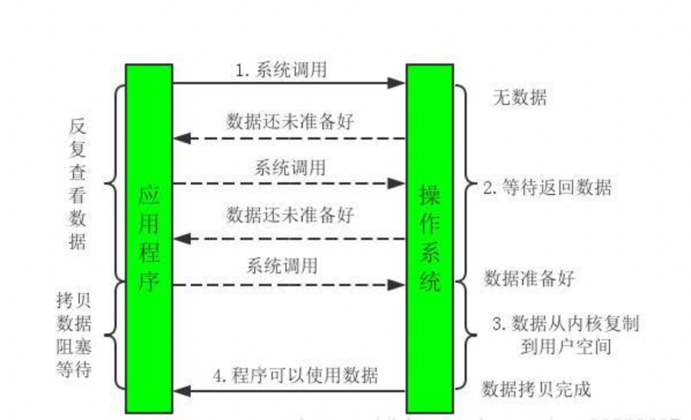

## 问题手册：

现在开始做最完整的总结。

### 一：JAVA基础相关

1. **Object的九大方法.**

   九大方法分别是:
   - ``clone()``
   - ``equals()``
   - ``finalize()``
   - ``getClass()``
   - ``hashCode()``
   - ``notify()``
   - ``notifyAll()``
   - ``toString()``
   - ``wait()``

   

2. **重载与重写的区别？以及构造器是否能被``override``？**

   1. 重写是子类和父类之间的关系，是垂直关系，而重载是同一个类中方法之间的关系，是水平关系。

      重写要求参数列表相同，而重载要求参数列表不同。

   2. 构造器不能被继承，方法也不能被重写，但是在同一个类中，构造器可以被重载。

      

3. **``String StringBuffer``和``String StringBuilder``的区别，以及。``String``为什么是不可变的，``final``关键字的原理（深入内存模型理解）？**

   1. ``String Buffer``与``String Builder``的区别？

      1. 区别1：线程安全

         ``StringBuffer`` 是线程安全，``StringBuilder``是线程不安全的，``StringBuffer``所有公开的方法都是通过``synchronized``关键字修饰。

      2. 区别2：缓冲区

         ``StringBuffer``每次获取``toString``都会直接使用缓存区的``toStringCache``值来构造一个字符串。

         ``StringBuilder``每次都需要复制一个字符数组，再来构造一个字符串。

      3. 区别3：性能

         ``String Builder``由于不是同步的，没有加锁的操作，所以性能高于``String Buffer``。

   2. ``String``为什么是不可变的？

      通过阅读``String``的源代码，可以发现其在类上和成员变量上使用``final``关键字修饰，而一旦将引用声明为``final``，就不能改变这个引用，即被``final``修饰的变量只能被赋值一次。

      1. 修饰类、方法

         1. ``final``修饰方法

         ​	把方法锁定，以防止任何继承类修改它的含义，不能被重写。

         ​	``final``方法比非``final``方法速度快，在编译的时候就已经静态绑定了。

         1. ``final``修饰类

         ​	表明类不能被继承。

         ​	``final``类中的成员变量可以根据需要设为``final``，但是``final``类中的成员方法都会被隐式地指定为``final``方法。

      2. ``final``的底层原理？

         对于``final``域，编译器和处理器需要遵守两个重排序规则。

         1. 在构造函数内对一个``final``域的写入，与随后把这个被构造对象的引用值给一个引用变量，这两个操作之间不能重排序。

            （先写入``final``变量，后调用该对象引用）

            原因：编译器会在``final``域的写之后，插入一个``StoreStore``屏障

         2. 初次读一个包含``final``域的对象的引用，与随后初次读这个``final``域，这两个操作之间不能重排序。

            （先读对象的引用，后读``final``变量）

            原因：编译器会在读``final``域操作的前面插入一个``LoadLoad``屏障 
            
            

4. **接口和抽象类的区别？**

   2. 接口不能有方法的实现，抽象类可以有方法体。
   2. 接口中的成员变量默认为``public static final``。而抽象类中的成员变量默认为``default``.
   4. 接口中的所有的方法都是``public、abstract``的,而抽象类中的方法可以在子类中被重新定义与复制，抽象方法被``abstract``修饰。
   5. 一个类可以通过``implements``实现多个接口，但一个类只能只能通过``extends``实现一个抽象类。接口强调特定功能的实现，而抽象类强调所属关系。

   

5. **``==``与``equals``比较？**

   1. 第一种情况没有重写``equals``方法时，``==``比较的是对象的地址，以及基本数据类型的值。``equals``方法与==作用相同。
   2. 第二种情况，重写``equals``方法后，``equals``方法比较的是对象的值。

6. **``hashCode`` 与 ``equals``，为什么重写``equals``时，必须重写``hashCode``方法？**

   1. 相同的对象必须有相同的哈希值，不同的对象，哈希值不一定不同。
   2. 以``hashSet``为例，将对象加入``HashSet``时，``HashSet``会先计算对象的``HashCode``来判断对象加入的位置，同时也会与该位置的已存在对象的``hashCode``值作比较，如果没有相同的``hashCode``，``HashSet``会假设对象没有重复出现，如果有相同值的``Hash Code``，这时会调用``equals``方法来检查``hashCode``相同的对象是否相同，如果两者相同，``hashSet``加不会让其操作成功，如果不同的会啊，就会重新散列到其他的位置，这样就可以减少比较的次数，提高执行速度。

   总结：根据规定，相同的对象就需要有相同的``hashCode``的值

   ​			当``hashCode`` 相同时，对象不一定相同，当``equals``为``true``是，``hashCode``一定相同。

   

7. **浅拷贝与深拷贝？**

   浅拷贝拷贝的是对象的引用，而深拷贝拷贝的是对象本身。
   
   

8. **``BIO、NIO、AIO``有什么区别？**

   1. ``BIO：（Bolking I/O）``同步阻塞``I/O``模式，数据的读入与写入阻塞在同一个线程内完成，在活动连接数不是特别高的情况下，这种模型的效果不错，但是面对十万甚至百万连接时，传统的``BIO``模式就无能为力了。

      

   2. ``NIO：（New I/O）``同步非阻塞``I/O``模型，是一种基于通道技术的``I/O``操作方法，对于高负载、高并发的应用，可以使用``NIO``来开发。

     

      1. 多路复用：

         

         ​	多路复用采用的是操作系统底层的模型，``select poll epoll``模型，相比于传统的``NIO``模式，多路复用调用底层的``select\poll\epoll``等操作,将轮询的过程交给操作系统,这样的好处是一个单线程就能调度很多``IO``请求业务.

      2. ``Netty``：是由``JBOSS``提供的一个``Java``开源框架，是基于``NIO``的客户、服务器编程框架。``Netty``提供异步的、事件驱动的网络应用程序框架和工具，可以简化应用开发过程。

   3. ``AIO：（Asynchronous　I/O）````AIO``时``NIO``的升级版，它是异步阻塞的``I/O``模型，基于事件和回调机制实现，当应用操作结束后直接返回，不会阻塞在那里。但是该技术应用不是很广泛。

9. 多路复用机制之``select poll epoll``之间的区别,以及使用场景.（待补充）

   1. ``select``的时间复杂度为``O(n)``

      无差别轮询所有流,通过遍历``fdset（位图``）找,到有文件描述符(fd)就绪的,再进行后续操作.其中,文件描述符最大的数量一般为1024实际使用只有1021左右 .

   2. ``poll``的时间复杂度为``O(n)``

      在 本质上与``select``是一样的操作,但是,``poll``使用的是链表存储,所以就没有数量的限制.

   3. ``epoll``的时间复杂度为``O(1)``

      通过在内存上开辟一块事件列表空间，用来管理存储的信息，这快空间的结构式红黑树的结构，通过``epoll_ctl``函数，将``socket``信息注册到该空间中。还有一个是就绪列表空间，存储就绪信息，用``epoll_wait``函数访问，将就绪列表中就绪的``socket``接连，拷贝到用户态，唤醒用户态进程进行读取。

     
      
      有两种工作模式：
      
      1. ``LT``水平触发：事件就绪后，用户可以选择处理或者不处理，如果用户本次不处理，那么下次调用``epoll_wait``时仍然将未处理的事件打包给用户态。
      2. ``ET``边缘触发：事件就绪后，用户必须处理，ET模式在很大程度上减少了``epoll``事件被重复触发的次数，效率高于``LT``。

10. **序列化？**

   4. 什么是对象序列化，反序列化。

      对象序列化就是将对象以**二进制的形式保存在硬盘**上，而反序列化就是**将二进制文件转化为对象读取**。

   5. 在实现序列化接口的时候一般生成一个``serialVersionUID``，有什么作用。

      通过声明``serialVersionUID``的字段，显式声明自己类的``serialVersionUID``。来标注类的序列号。

      

11. 反射机制?

   6.  获取``Class``对象方式一:``Class.forName()``;

   7.  获取``Class``对象方式二:``TargetClass.newInstance()``;

   8.  静态编译与动态编译:静态编译在编译时确定对象,动态编译在运行时确定对象.

   9.  ``Spring`` 框架的``IOC``以及``AOP``功能都与反射有关系.

   

12. 设计模式的问题合集？

    设计模式共有23种，分为三大类：创建型模式、结构型模式、行为型模式。这里就介绍主要的几种模式。

    1. **单例模式**？ 

       单例模式保证单例对象的类只有一个实例的存在。整个系统只有一个实例。优点：不会频繁的创建和销毁对象，浪费系统的资源。

       ```java
       //在开始代码之前，需要知道静态方法的加载顺序，首先是静态代码块（随类的加载而执行）->构造器->静态方法调用.
       
       //单例模式的代码实现
       //饿汉模式
       public class Singleton{
       	private static final Singleton instance = new Singleton();
           public static Singleton getInstance(){
               return instance;
           }
       }
       
       //单例模式的调用
       public class Lesson7 {
           public static void main(String[] args) {
               Singleton singleton1 = Singleton.getInstance();
               Singleton singleton2 = Singleton.getInstance();
               System.out.println(singleton1 == singleton2); 
           }
       }
       true
           
       //单例模式的延迟加载代码
       //懒汉模式
       class SingletonLazy{
           private static SingletonLazy instance = null;
           private static SingletonLazy getInstance(){
               if(instance == null){
                   instance = new SingletonLazy();
               }
               return instance;
           }
       }
       
       //使用synchronized+方法来保证线程安全的单例模式延迟加载
       //懒汉模式优化1，单锁
       class SingletonLazy{
           private static SingletonLazy instance = null;
           private static synchronized SingletonLazy getInstance(){
               if(instance == null){
                   instance = new SingletonLazy();
                   if(instance == null){
                       instance = new SingletonLazy();
                   }
               }
               return instance;
        }
       }
       
       //使用synchronized+代码块实现线程安全的单例模式延迟加载
       //懒汉模式优化2，单锁,双重校验
       Class SingletonLazy{
           private static SingletonLazy instance = null;
           private staic SingletonLazy getInstance(){
               if(instance == null){
                   synchronized(SingletonLazy.class){
                       if(instance == null){
                           instance = new SingletonLazy();
                       }
                   }
               }
               return instance;
           }
       }
       
       //使用reentrantLock+代码块进行单例模式的实现
       //相当于懒汉优化2，单锁，双重校验
       Class SingletonLazy{
       	private static SingletonLazy instance = null;
           Private static ReentrantLock lock = new ReentrantLock(false);
           public static SingletonLazy instance(){
               if(instance == null){
                   lock.lock();
                   try{
                       if(instance == null){
                           instance = new SingletonLazy();
                       }
                   } finally{
                       lock.unlock();
                   }
               }
               return instance;
           }
       }
       
       //静态方法内部类方法实现
       Class SingletonLazy{
           private SingletonLazy(){};
           private static class SingletonLAzy2{
               private static final SingletonLazy instance = new SingletonLazy();
           }
           
           public static SingletonLazy getInstance(){
               return SingletonLazy2.instance;
           }
           
           public static void mian(String[] args){
               //
           }
       }
       
       //枚举实现单例模式
       public enum Persion1{
           person1;
           String name = new String("ssss");
           public String getName(){
               return name;
           }
           public void setName(String name){
               this.name = name;
           }
       }
       public class test{
           public static void main(String[] args){
               Person1 person1 =Person1.person1;  
               Person1 person2=Person1.person1 ;  
               person1.setName("aaa");  
               person2.setName("bbb");  
               System.out.println(person1.getName());   
               System.out.println(person2.getName());   
           }
       }
        bbb bbb
       ```

    

    2. **工厂模式**？

    工厂模式又称静态工厂方法模式，建立一个工厂，把实现了同一接口的一些类进行实例的创建。例如饮料机可以理解为工厂模式，你需要的饮料如咖啡，奶茶，可乐，他就会按你的要求进行生产。

    **优点**：工厂类含有必要的逻辑判断，可以决定在什么时候创建哪一个产品类的实例。

       **缺点**：不易扩展，一旦添加新的类型就需要修改类的逻辑。
    
       ```java
       //工厂模式的代码实现
       class Factory {
           public static String createProduct(String product) {
               String result = null;
               switch (product) {
                   case "Mocca":
                       result = "摩卡";
                       break;
                   case "Latte":
                       result = "拿铁";
                       break;
                   default:
                       result = "其他";
                       break;
               }
               return result;
        }
      }
       ```

       1. **抽象工厂模式**？
    
    抽象工厂模式是基于简单的工厂模式，将未来需要修改的代码抽象出来，通过继承的方式让子类去做决定。
          
    ```java
    public class AbstractFactoryTest {
       public static void main(String[] args) {
           // 通过抽象工厂的方式创建实例
           String result = (new CoffeeFactory()).createProduct("Latte");
           System.out.println(result); // output:拿铁
       }
    }
    // 抽象工厂（相当于一个模板，一个集团公司的入口）
    abstract class AbstractFactory{
       public abstract String createProduct(String product);
    }
    // 啤酒工厂(子公司)
    class BeerFactory extends AbstractFactory{
       @Override
       public String createProduct(String product) {
           String result = null;
           switch (product) {
               case "Hans":
                   result = "汉斯";
                   break;
               case "Yanjing":
                   result = "燕京";
                   break;
               default:
                   result = "其他啤酒";
                   break;
           }
           return result;
       }
    }
    //咖啡工厂（子公司）
    class CoffeeFactory extends AbstractFactory{
       @Override
       public String createProduct(String product) {
           String result = null;
           switch (product) {
               case "Mocca":
                   result = "摩卡";
                   break;
               case "Latte":
                   result = "拿铁";
                   break;
               default:
                   result = "其他咖啡";
                   break;
           }
           return result;
    }
}
    ```

       1. 观察者模式：观察者模式是定义对象间的一种一对多依赖关系，是的每当一个对象状态发生改变时，其相关依赖对象皆得到通知并自动更新。（``Tomcat``）

    优点：观察者模式可以实现表示层与数据层的分离，并定义了稳定的消息更新传递机制，抽象了更新接口，是的可以有各种各样不同			的表示层作为具体观察者角色。

    缺点：如果一个观察目标对象有很多直接和间接的观察者的话，将所有的观察者都通知到会花费很多时间。

    ​			如果在观察者和观察目标之间有循环依赖的话，观察目标会触发他们之间进行循环调用，导致系统奔溃。
    
       1. 装饰器模式：指动态地给一个对象增加一些额外的功能，同时又不改变其结构。（I/O流）
       2. 代理模式：给某一个对象提供一个dialing，并由代理对象控制原对象的引用。（AOP）
       3. 适配器模式：将一个类的接口变成客户端所期望的另一个接口，从而使原本接口不匹配而无法一起工作的两个类能够在一起工作。（I/O流）
       4. 原型模式：用于创建重复对象，同时又能保证性能。当创建对象的代价比较大时，可以采用这种模式（Clone）。


### 二：JVM相关

1. **内存区域？**

   根据JVM规范，定义了``JVM``内存的5个部分，**虚拟机栈**、**本地方法栈**、**程序计数器**、**方法区**、**堆**。这五个区域也称为运行时数据区。其中，程序计数器是唯一一个不会出现内存溢出的情况，它的生命周期随着线程的创建而创建，随着线程的结束而死亡。

   

   1. 在``JDK1.8``之前，线程共享的是：堆、方法区、直接内存。而线程私有的是：虚拟机栈、本地方法栈、程序计数器。

      
      1. 1.8之后，方法区由元空间来实现，存储``.class``信息、类的信息、方法的定义、静态变量等，而常量池移到了堆中。

      

2. **堆与栈的区别？以及堆的结构**。

   1. ``Java``虚拟机中的堆结构。

      

      在JDK1.8之前，Java虚拟机将内存划分为新生代、老年代和永久代，永久代是HotSpot虚拟机特有的概念，其实是方法区的实现，只不过方法区的叫法是JVM规范中定义的。在JDK1.8中，使用元空间（``metaspace``）代替了永久代。

      1. 新生代

         ``HotSpot``虚拟机将新生代分为三块，一块是较大的``Eden``空间和两块较小的``Survivor``空间，默认比例为``8：1：1``。当``Eden``区内存空间不够时，虚拟机将发起一次``Minor GC``。

         ``HotSpot``新生代的垃圾回收算法采用的是复制算法。``GC``开始时，对象只会存在``Eden``区和``From Survivor``区，``To Survivor``区是空的。``GC``进行时，``Eden``区中所有存活的对象,会被复制到``To Survivor``区，而在``From Survivor``区中，根据存活对象的年龄来决定去留，当对象的年龄达到年龄阈值，（默认为``15``，每熬过一次``minor GC``，存活对象的年龄就会``+1``），就会被移到老年代中，没有达到阈值的对象就复制到``To Survivor``区中。接着清空``Eden``区和``From Survivor``区。接着，调换``From Survivor``区和``To Survivor``区的角色。若``To Survivor``区存放不下所有的存活对象，则会将剩下的对象放在老年代中。

      2. 老年代

         在新生代中经历了多次``GC``后任然存活下来的对象会进入老年代中，老年代的对象生命周期较长，存活率比较高，采用``Full GC``（标记整理算法）来回收对象。

      3. 永久代

         永久代存储类信息、常量、静态变量、即时编译器编译后的代码等数据，对这一区域而言，其垃圾回收是与老年代及进行绑定，无论谁的内存满了，都会进行垃圾回收。

      4. 元空间

         ``JDK１.８``之后的产物，存储类信息、静态变量、常量、编译后的代码等。
         
         ``Metaspace``的内存管理：
         
         ​	与永久代不同，在``metaspace``中，类和其元素的生命周期与其对应的类加载器相同，只要类的加载器是存活的，``Metaspace``中的类元素也是存活的，不能被回收。当``GC``发现某个类加载器不再存活，就会把对应的整个空间回收。

   2. ``Java``虚拟机中堆与栈的主要区别？

      1. 存储：栈存储的是变量、对象的引用；而堆存储的是实例对象。
      2. 速度：栈的存取速度快；堆的存储速度慢。
      3. 数据结构：栈的数据结构就是栈，而堆的数据结构是一颗完全二叉树。

3. 对象创建的过程？

   1. 对象创建过程分为5个步骤。类加载检查->分配内存->初始化零值->设置对象头->执行``init``方法。

      1. **类加载检查**：虚拟机遇到一条``new``指令时，首先检查这个指令的参数是否在常量池中定位到这个类的引用，并且检查这个引用代表的类是否已经被加载过、解析过、初始化过，如果没有，那必须先执行相应的类加载过程。

      2. **分配内存**：在类加载检查之后，接下来虚拟机将为新生对象分配内存，为对象分配空间的任务等同于把一块确定大小的内存从``java``堆中划分出来。分配的方式有两种：指针碰撞和空闲列表，选择哪种方式有``Java``堆是否规整决定，而``Java``堆时否规整又由所采用的垃圾收集器是否带有压缩整理功能决定。

         1. 指针碰撞：适用场合：堆内存规整的情况下。

         2. 空闲列表：使用场合：堆内存不规整的情况下。

         3. **内存分配并发问题**

            在创建对象的时候有一个很重要的问题，就是线程安全，虚拟机采用两种方式来保证线程安全：

            - **``CAS``+失败重试：** ``CAS`` 是乐观锁的一种实现方式。**虚拟机采用 ``CAS`` 配上失败重试的方式保证更新操作的原子性。**
            - **``TLAB``：** 为每一个线程预先在 ``Eden`` 区分配一块儿内存，``JVM`` 在给线程中的对象分配内存时，首先在 ``TLAB`` 分配，当对象大于 ``TLAB`` 中的剩余内存或 ``TLAB`` 的内存已用尽时，再采用上述的`` CAS`` 进行内存分配。

      3. **初始化零值**：内存分配完成后，虚拟机需要将分配到的内存空间都初始化为零值（不包括对象头），这一步操作保证了对象的实例字段在 ``Java`` 代码中可以不赋初始值就直接使用，程序能访问到这些字段的数据类型所对应的零值。

      4. **设置对象头**：初始化零值完成之后，**虚拟机要对对象进行必要的设置**，例如这个对象是那个类的实例、如何才能找到类的元数据信息、对象的哈希码、对象的 ``GC`` 分代年龄等信息。 **这些信息存放在对象头中。** 另外，根据虚拟机当前运行状态的不同，如是否启用偏向锁等，对象头会有不同的设置方式。

      5. **执行``init``方法**：在上面工作都完成之后，从虚拟机的视角来看，一个新的对象已经产生了，但从 Java 程序的视角来看，对象创建才刚开始，`<init>` 方法还没有执行，所有的字段都还为零。所以一般来说，执行 ``new`` 指令之后会接着执行 `<init>` 方法，把对象按照程序员的意愿进行初始化，这样一个真正可用的对象才算完全产生出来。

4. 对象访问定位的两种方式？

   1. **句柄**：如果使用句柄的话，那么 ``Java`` 堆中将会划分出一块内存来作为句柄池，``reference`` 中存储的就是对象的句柄地址，而句柄中包含了对象实例数据与类型数据各自的具体地址信息；
   2. **直接指针：** 如果使用直接指针访问，那么 ``Java`` 堆对象的布局中就必须考虑如何放置访问类型数据的相关信息，而 ``reference`` 中存储的直接就是对象的地址。

5. 如何判断对象是否死亡？

   1. 引用计数法：给对象中添加一个引用计数器，每当有一个地方引用它，计数器就加 1；当引用失效，计数器就减 1；任何时候计数器为 0 的对象就是不可能再被使用的。**这个方法实现简单，效率高，但是目前主流的虚拟机中并没有选择这个算法来管理内存，其最主要的原因是它很难解决对象之间相互循环引用的问题。** 所谓对象之间的相互引用问题，如下面代码所示：除了对象 ``objA`` 和 ``objB`` 相互引用着对方之外，这两个对象之间再无任何引用。但是他们因为互相引用对方，导致它们的引用计数器都不为 0，于是引用计数算法无法通知 ``GC`` 回收器回收他们。
   2. 可达性分析法：这个算法的基本思想就是通过一系列的称为 **“GC Roots”** 的对象作为起点，从这些节点开始向下搜索，节点所走过的路径称为引用链，当一个对象到 ``GC Roots`` 没有任何引用链相连的话，则证明此对象是不可用的。

6. **强引用、软引用、弱引用、虚引用？**

   Reference源码:

   

   软引用\弱引用\虚引用都继承自``java.lang.ref.Reference``,是直接子类.但引用对象是与垃圾收集器紧密协作而实现的,所以不能自定义引用类型.

   ``Reference``有四种状态:

   ``Active:``	引用刚被创建时的状态,如果GC检测到该实例引用的对象的可达性发生了改变,状态则会变成``Pending``或者``Enqueued``.如果,``reference``在创建引用时注册了引用队列,则会进入``Pending``的状态,并将``Reference``加入到``pending-Reference``链表中,如果没有,则会进入``Enqueued``的状态.

   ``Pending``:	当引用实例被放置在``pending-Reference``链表中时,该实例等待一个叫``Reference-handler``的线程进行``enqueued``操作.

   ``Enqueued``:	当``Reference``从队列中移除的时候,就会进入此状态.

   ``Inactive``:	一旦某个``Reference``处于此状态,他的状态将不会改变,同时说明该引用实例所执行放入实际对象一定会被``GC``回收.

   1. **强引用**

      以前我们使用的大部分引用实际上都是强引用，这是使用最普遍的引用。如果一个对象具有强引用，那就类似于**必不可少的生活用品**，垃圾回收器绝不会回收它。当内存空间不足，``Java`` 虚拟机宁愿抛出 ``OutOfMemoryError`` 错误，使程序异常终止，也不会靠随意回收具有强引用的对象来解决内存不足问题。

   2. **软引用（``SoftReference``）**

      如果一个对象只具有软引用，那就类似于**可有可无的生活用品**。*如果内存空间足够，垃圾回收器就不会回收它，如果内存空间不足了，就会回收这些对象的内存*。只要垃圾回收器没有回收它，该对象就可以被程序使用。软引用可用来实现内存敏感的高速缓存。软引用可以和一个引用队列（``ReferenceQueue``）联合使用，如果软引用所引用的对象被垃圾回收，``JAVA ``虚拟机就会把这个软引用加入到与之关联的引用队列中。

   3. **弱引用（``WeakReference``）**

      如果一个对象只具有弱引用，那就类似于**可有可无的生活用品**。 不会活过下个垃圾回收。引用与软引用的区别在于：只具有弱引用的对象拥有更短暂的生命周期。在垃圾回收器线程扫描它所管辖的内存区域的过程中，一旦发现了只具有弱引用的对象，不管当前内存空间足够与否，都会回收它的内存。不过，由于垃圾回收器是一个优先级很低的线程， 因此不一定会很快发现那些只具有弱引用的对象。

      实例:``weakHashMap``,触发GC之后,就没有了值.

   4. **虚引用（PhantomReference）**

      "虚引用"顾名思义，就是形同虚设，与其他几种引用都不同，虚引用并不会决定对象的生命周期。如果一个对象仅持有虚引用，那么它就和没有任何引用一样，在任何时候都可能被垃圾回收。虚引用不能单独使用,也不能通过它访问对象,必须和引用队列(``RefenceQueue``)联合使用.

      虚引用的主要作用是跟踪对象垃圾回收的状态,设置虚引用的唯一目的就是在这个对象被回收器回收的时候收到一个系统通知或者后续添加进一步的处理.

      1. 引用队列``(ReferenceQueue)``

         用来配合引用工作的,没有引用队列一样可以运行.创建引用的时候,可以指定关联的队列,当``GC``释放对象内存的时候,将引用加入到引用队列中,如果发现某个虚引用已经被加入到引用队列中,那么就可以在所引用的对象的内存被回收之前采取必要的行动,这相当于一种通知机制.

         

7. **垃圾收集算法**。

   1. **标记清除**

      该算法分为“标记”和“清除”阶段：首先标记出所有需要回收的对象，在标记完成后统一回收所有被标记的对象。

      缺点：

      1. 效率问题
      2. 空间问题（标记清除后会产生大量不连续的碎片）

      [](https://camo.githubusercontent.com/69ab21ea2f949fee9a164be47a9207814611ad0d189628feea07b6f1a48e0ec1/687474703a2f2f6d792d626c6f672d746f2d7573652e6f73732d636e2d6265696a696e672e616c6979756e63732e636f6d2f31382d382d32372f36333730373238312e6a7067)

   2. **复制算法**

      解决效率问题，将内存分为大小相同的两块，每次使用其中的一块。当这一块的内存使用完后，就将还存活的对象复制到另一块去，然后再把使用的空间一次清理掉。

      [](https://camo.githubusercontent.com/ae3a3aeb5eec633e50929aa44f24f64a59513aefe9682a6d76859d2029a0d003/687474703a2f2f6d792d626c6f672d746f2d7573652e6f73732d636e2d6265696a696e672e616c6979756e63732e636f6d2f31382d382d32372f39303938343632342e6a7067)

   3. **标记整理**

      标记过程仍然与“标记-清除”算法一样，但后续步骤不是直接对可回收对象回收，而是让所有存活的对象向一端移动，然后直接清理掉端边界以外的内存。

      [](https://camo.githubusercontent.com/4ab4b34d09e35834e5cb4279ce4171b79db440fc23415909327d14e460d972d1/687474703a2f2f6d792d626c6f672d746f2d7573652e6f73732d636e2d6265696a696e672e616c6979756e63732e636f6d2f31382d382d32372f39343035373034392e6a7067)

   4. **分代收集算法**

      当前虚拟机的垃圾收集都采用分代收集算法，根据对象存活周期的不同将内存分为几块。一般将 ``java`` 堆分为新生代和老年代，根据各个年代的特点选择合适的垃圾收集算法。**比如在新生代中，每次收集都会有大量对象死去，选择复制算法。而老年代的对象存活几率是比较高的，而且没有额外的空间对它进行分配担保，所以我们必须选择“标记-清除”或“标记-整理”算法进行垃圾收集。**

8. **垃圾收集器**？

   1. **``Serial``收集器**：

      ``Serial（串行）``收集器。是一个单线程收集器了。使用一条垃圾收集线程去完成垃圾收集工作，该线程进行垃圾收集工作的时候必须暂停其他所有的工作线程（ **``"Stop The World"``** ），直到收集结束。

      **新生代采用复制算法，老年代采用标记-整理算法。** [](https://camo.githubusercontent.com/03aa0ded06151039335f0c7814dd1dda07e35a843ac56a0552cfd85938fce966/687474703a2f2f6d792d626c6f672d746f2d7573652e6f73732d636e2d6265696a696e672e616c6979756e63732e636f6d2f31382d382d32372f34363837333032362e6a7067)

      ``Serial`` 收集器由于没有线程交互的开销，自然可以获得很高的单线程收集效率。

   2. **``PerNew``收集器**：

      ``ParNew`` 收集器其实就是 ``Serial`` 收集器的多线程版本，除了使用多线程进行垃圾收集外，其余行为（控制参数、收集算法、回收策略等等）和 ``Serial`` 收集器完全一样。

      **新生代采用复制算法，老年代采用标记-整理算法。** [](https://camo.githubusercontent.com/796e9b6e3482117a62c224351195507fdf459ff3a7f086b0776c5278856e938f/687474703a2f2f6d792d626c6f672d746f2d7573652e6f73732d636e2d6265696a696e672e616c6979756e63732e636f6d2f31382d382d32372f32323031383336382e6a7067)

      **并行和并发概念补充：**

      - **并行（``Parallel``）** ：指多条垃圾收集线程并行工作，但此时用户线程仍然处于等待状态。
      - **并发（``Concurrent``）**：指用户线程与垃圾收集线程同时执行（但不一定是并行，可能会交替执行），用户程序在继续运行，而垃圾收集器运行在另一个 ``CPU`` 上。
   3. **``CMS``收集器**：

      ``CMS（Concurrent Mark Sweep）``收集器是 第一款真正意义上的并发收集器，实现了让垃圾收集线程与用户线程同时工作。

      ``CMS`` 收集器是一种 **“标记-清除”算法**实现的。整个过程分为四个步骤：

      - **初始标记：** 暂停所有的其他线程，并记录下直接与 ``root`` 相连的对象，速度很快 ；
      - **并发标记：** 同时开启 ``GC`` 和用户线程，用一个闭包结构去记录可达对象。但在这个阶段结束，这个闭包结构并不能保证包含当前所有的可达对象。因为用户线程可能会不断的更新引用域，所以 ``GC`` 线程无法保证可达性分析的实时性。
      - **重新标记：** 重新标记阶段就是为了修正并发标记期间因为用户程序继续运行而导致标记产生变动的那一部分对象的标记记录
      - **并发清除：** 开启用户线程，同时 ``GC`` 线程开始对为标记的区域做清扫。

      

      从它的名字就可以看出它是一款优秀的垃圾收集器，主要优点：**并发收集、低停顿**。但是它有下面三个明显的缺点：

      - **对 CPU 资源敏感；**
      - **无法处理浮动垃圾；**
      - **它使用的回收算法-“标记-清除”算法会导致收集结束时会有大量空间碎片产生。**

   4. **``G1``收集器：**

      ``G1 (Garbage-First)`` 是一款面向服务器的垃圾收集器。

      它具备一下特点：

      - 并行与并发：``G1`` 能充分利用 ``CPU``、多核环境下的硬件优势，使用多个 ``CPU``来缩短 ``Stop-The-World ``停顿时间。部分其他收集器原本需要停顿 ``Java ``线程执行的 ``GC`` 动作，``G1`` 收集器仍然可以通过并发的方式让 ``java ``程序继续执行。
      
      - 分代收集：虽然 ``G1`` 可以不需要其他收集器配合就能独立管理整个 ``GC`` 堆，但是还是保留了分代的概念。在内存空间上，``G1``  将内存划分为很多小块，每一个小块可以被标记为``O\S\E``种的一个。从而使得垃圾回收变成更彻底。
      
     
   - **可预测的停顿**：这是 ``G1`` 相对于 ``CMS`` 的另一个大优势， ``G1`` 除了追求低停顿外，还能建立可预测的停顿时间模型，能让使用者明确指定在一个长度为 M 毫秒的时间片段内。
     
        **实现原理**：``G1``的一个显著特点是他能够让用户设置应用的暂停时间，``G1``收集器回收的第四步是选择一个内存来回收，而不是整代内存，这使得回收内存所需时间就取决于内存大小，以及实际垃圾的多少。所以，到底回收多少垃圾就取决于用户配置的暂停时间，时间多一点就多回收一些垃圾，实现伸缩的自如。
      
      ``G1`` 收集器的运作大致分为以下几个步骤：

      - **初始标记**：在垃圾回收的最开始有一个短暂的时间段会停止应用。
      - **并发标记**：继续运行程序，同时``G1``开始标记。
      - **最终标记**：再次停止应用来做最后的标记。
      - **筛选回收**：根据``Garbage First``的原则，选择一个内存块进回收。
      
      ``G1`` 收集器在后台维护了一个优先列表，每次根据允许的收集时间，优先选择回收价值最大的 ``Region``。这种使用 ``Region`` 划分内存空间以及有优先级的区域回收方式，保证了 ``G1`` 收集器在有限时间内可以尽可能高的收集效率。
      
      

9. 类加载过程与类加载器？

   1. 类的生命周期：加载->连接->初始化->使用->卸载.连接过程又分为：验证->准备->解析。

   2. 类加载器：``JVM`` 中内置了三个重要的 ``ClassLoader``，除了 ``BootstrapClassLoader`` 其他类加载器均由 Java 实现且全部继承自`java.lang.ClassLoader`：

      1. **``BootstrapClassLoader``(启动类加载器)** ：最顶层的加载类，由C++实现，负责加载 `%JAVA_HOME%/lib`目录下的jar包和类或者或被 `-Xbootclasspath`参数指定的路径中的所有类。
      2. **``ExtensionClassLoader``(扩展类加载器)** ：主要负责加载目录 `%JRE_HOME%/lib/ext` 目录下的jar包和类，或被 `java.ext.dirs` 系统变量所指定的路径下的jar包。
      3. **``AppClassLoader``(应用程序类加载器)** :面向我们用户的加载器，负责加载当前应用classpath下的所有jar包和类。

   3. ``Thread.currentThread.getContextLoader()``（上下文类加载器）。

      ``Java``提供了很多服务提供者接口（``Service Provider Interface SPI``）,允许第三方为这些接口提供实现，例如``JDBC、JNDI、JBI``等。

      线程上下文类加载器，可以打破双亲委派机制，实现逆向调用类加载器来加载当前线程中类加载其加载不到的类。

   4. 双亲委派：

      ### 双亲委派模型介绍

      每一个类都有一个对应它的类加载器。系统中的 ``ClassLoder`` 在协同工作的时候会默认使用 **双亲委派模型** 。即在类加载的时候，系统会首先判断当前类是否被加载过。已经被加载的类会直接返回，否则才会尝试加载。加载的时候，首先会把该请求委派该父类加载器的 `loadClass()` 处理，因此所有的请求最终都应该传送到顶层的启动类加载器 `BootstrapClassLoader` 中。当父类加载器无法处理时，才由自己来处理。当父类加载器为``null``时，会使用启动类加载器 `BootstrapClassLoader` 作为父类加载器。

      [](https://camo.githubusercontent.com/daadd57b44169f84101f3e0c7bbf00f10b88c776ae70e260e08c8db90b9dfe86/68747470733a2f2f6d792d626c6f672d746f2d7573652e6f73732d636e2d6265696a696e672e616c6979756e63732e636f6d2f323031392d362f636c6173736c6f616465725f5750532545352539422542452545372538392538372e706e67)

   5. 打破双亲委派机制

      1. 为了避免双亲委托机制，我们可以自己定义一个类加载器，然后重写 `loadClass()` 即可。

      2. ``tomcat``中的打破双亲委派机制：先加载``JVM``的类->``tomcat``的类->自己定义的类->应用程序的类->公共的类。

         顺序：1 使用``bootstrap``引导类加载器加载 （``JVM`` 的东西 ）

         ​			2 使用``system``系统类加载器加载 （``tomcat``的启动类``Bootstrap``包）

         ​			3 使用``WebAppClassLoader`` 加载 ``WEB-INF/classes`` （应用自定义的``class``）

         ​			4 使用``WebAppClassLoader`` 加载在``WEB-INF/lib`` （应用的依赖包）

         ​			5 使用``common``类加载器在``CATALINA_HOME/lib``中加载 （``tomcat``的依赖包，公共的，被各个应用共享的）

         

10. ``Minor GC``与``Full FC？``

    ``Minor GC``用于新生代的垃圾回收，会有短暂的暂停，每一次``minor GC ``都会增加对象的生命，达到某个阈值进入老年代。而``Full GC``用于回收大对象，用于老年代的回收。

11. ``GC``调优策略？

    **策略 1**:将新对象预留在新生代，由于 ``Full GC`` 的成本远高于 ``Minor GC``，因此尽可能将对象分配在新生代是明智的做法，实际项目中根据 ``GC`` 日志分析新生代空间大小分配是否合理，适当通过“``-Xmn``”命令调节新生代大小，最大限度降低新对象直接进入老年代的情况。

    **策略 2:**大对象进入老年代，虽然大部分情况下，将对象分配在新生代是合理的。大对象如果首次在新生代分配可能会出现空间不足导致很多年龄不够的小对象被分配的老年代，破坏新生代的对象结构，可能会出现频繁的 full gc。因此，对于大对象，可以设置直接进入老年代（当然短命的大对象对于垃圾回收来说简直就是噩梦）。`-XX:PretenureSizeThreshold` 可以设置直接进入老年代的对象大小。

    **策略 3:**合理设置进入老年代对象的年龄，``-XX:MaxTenuringThreshold`` 设置对象进入老年代的年龄大小，减少老年代的内存占用，降低 ``full gc ``发生的频率。

    **策略 4：**设置稳定的堆大小，堆大小设置有两个参数：`-Xms` 初始化堆大小，`-Xmx` 最大堆大小。

    **策略5：**注意： 如果满足下面的指标，**则一般不需要进行 ``GC ``优化：**

    > ``MinorGC`` 执行时间不到``50ms``； ``Minor GC`` 执行不频繁，约10秒一次； ``Full GC`` 执行时间不到``1s``； ``Full GC`` 执行频率不算频繁，不低于10分钟1次。

    
    
    

### 三：集合\容器

1. ``List,Set,Map``三者的区别?

   1. ``List``与``Set``继承自``Collection``,基于``List``实现的方法有``ArrayList``-``Vector``-``LinkedList``;基于``Set``实现的方法有``HashSet``-``LinkedHashSet``-``TreeSet``;基于``Map``实现的有``HashMap``-``LinkedHashMap``-``HahTable``-``TreeMap``;
   2. ``LIst``接口存储一组不唯一,有序的对象;
   3. ``Set``接口存储不允许重复的对象;
   4. ``Map``使用键值对存储.

   

2. ``ArrayList``与``LinkedList``区别,以及``ArrayLIst``与``Vector``的区别?

   1. ``ArrayList``底层使用的时数组结构,``LinkedList``底层使用的时双向链表数据结构.
   2. 插入元素与删除元素时间复杂度受数组和链表的影响.
   3. ``ArrayList``与``LinkedList``是线程不安全的,而``Vector``是线程安全的.

   

3. ``ArrayList``与``HashMap``的扩容机制?

   1.`` ArrayList``是使用懒加载的方式,每次扩容通过``Arrays.copyOf(elementData, newCapacity)``来实现的,即将当前数组元素拷贝到新的数组中,每次扩容后的容量为原来容量的``1.5``倍.
   2. ``HashMap``底层采用的是``数组+链表+红黑树``的数据结构来实现.扩容扩展的是数组的长度,无参构造时默认``第一次扩容16单位``.阈值=``数组长度*负载因子``.默认的负载因子是``0.75``,例如,``16X0.75 = 12``,当元素个数超过``12``时,容量扩容为原来的``2``倍,当容量扩大至``Integer.MAX_VALUE``时,容量设置为``Integer.MAX_VALUE``,且不在增长.

   

4. ``HashMap``与``HashTable``的区别,以及``HashMap``与``HashSet``的区别?

   1. 线程是否安全:``HashMap``是非线程安全的,``HashTable``是线程安全的,具体实现方式是通过``synchronized``修饰.
   2. ``HashMap``中,``null``值可以作为``key``,这压根的``key``只能有一个,而值可以有多个或一个为``null``.
   3. ``HashMap``与``HashTable``的扩容机制不同以及初融容量不同,``HashMap``初始容量是``16``,每次扩容为想在容量的``两倍``,``HashTable``的初始容量为``11``,每次扩容是现有容量的``2n+1``.
   4. 底层的数组结构,``HashMap``在链表长度大于8的时候会转为红黑树,而``HashTable``没有这样的机制.
   5.`` HashSet``基于``HashMap``实现,实现的是``Set``的接口.

   

5. ``HashMap``底层实现的原理?

   1. ``HashMap``底层是数组+链表+红黑树实现.为了减少``Hash``碰撞,将数据尽量均匀分配,``HashMap``的容量是``2的幂次方``.``Hash``值范围前后加起来大概有``40亿``,直接使用,内存是放不下的,所以需要与数组下标&运算,这也就解释了为什么长度是``2的幂次方``.

   

6. ``ConcurrentHashMap``和``HashTable``的区别?

   1. 在底层数据结构上,``ConcurrentHashMap``使用的是``分段数组+链表+红黑树``的实现,``HashTable``使用的是数组+链表.

   2. ``ConcurrentHashMap``与``HashTable``的区别主要体现在实现线程安全的方式上不同.在``JDK1.7``之前,``ConcurrentHashMap``对整个数组进行了分割和分段,每一段有一把锁,在访问不同段里面的数据时就不会存在锁竞争.在``JDK1.8``之后,``ConcurrentHashMap``摒弃了数组分段的概念,直接是用``数组+链表+红黑树``的结构,并发控制使用的是``Synchronized``和``CAS``来控制,看起来是优化过且线程安全的``HashMap``.

   
7. **红黑树**

   红黑树是一个自平衡的二叉查找树。但其与平衡二叉树``（ALV）``的区别在于平衡二叉树是严格的平衡，适用于插入和删除操作少，查询多的情况，而红黑树是一颗弱平衡二叉树，相同情况下，树的高度会高于平衡二叉树。

   1. 特性：

      1. 每个节点或者是黑色或者是红色，且根节点是黑色，每个叶子节点（``NULL``空值节点）也是黑色。
      2. 如果一个节点是红色，则它的子节点必须是黑色。
      3. 从一个节点到该节点的子孙节点的所有路径上包含相同数目的黑色节点。
      4. 红黑树最长路径的长度不超过最短路径的两倍。

   2. 操作：

      1. 左旋

         

         ```c
         LEFT-ROTATE（T，x）
             y <- right[x] 		//假设X节点的右孩子是y。
             right[x] <- left[y]	//将y节点的左孩子设为x节点的右孩子
             P[left[y]] <- x		//将x设置为y节点左孩子的父亲
             p[y] <- p[x]		//将x的父亲设置为y的父亲
             if p[x] = nil[T]	//情况1：如果x的父节点是空姐点，则将y设置为根节点
                 root[T] <- y
             else if x = left[p[x]]
                 left[p[x]] <- y	//情况2：如果x是其父节点的左孩子，则将y设置为其父节点的左孩子
             else
                 right[p[x]] <- y //情况3：如果x是其父节点的右孩子，则将y设置为其父节点的额右孩子
             left[y] <- x 		//将x设置为y的左孩子
             p[x] <- y			//将x节点的父亲设置为y
             
         ```

         

      2. 右旋

         

         ```c
         Right-AOTATE(T,y)
             x <- left[y]			//设置x为y节点左孩子
             left[y] <- right[x]		//将x的右孩子设置为y的左孩子
             p[right[x]] <- y		//将y设置为x右孩子的父亲
             p[x] <- p[y] 			//将y的父亲设为x的父亲
             if p[y] = nil[T]		
                 root[T] <- x		//情况1，如果y的父亲是空节点，则将x设为根节点
             else if y = right[p[y]]  
                     then right[p[y]] ← x   // 情况2：如果 y是它父节点的右孩子，则将x设为“y的父节点的左孩子”
                     else left[p[y]] ← x    // 情况3：(y是它父节点的左孩子) 将x设为“y的父节点的左孩子”
           right[x] ← y            // 将 “y” 设为 “x的右孩子”
           p[y] ← x                // 将 “y的父节点” 设为 “x”
         ```

      3. 添加与删除节点操作

         

### 四：计算机网络

1. ``TCP/IP``各层的结构与功能,都有哪些协议?
   
   1. 七层网络结构：物理层、数据链路层、网络层（``IP``）、传输层（``TCP，UDP``）、会话层、表示层、应用层（``HTTP，HTTPS，SMTP，DNS``）。
   
2. **``TCP``三次握手与四次握手**

   1. 三次握手的流程：

      1. ``TCP``服务器进程先创建传输控制块，时刻准备着接受客户进程的连接请求，此时服务器就进入了``LISTEN``状态。
      2. ``TCP``客户进程也是先创建传输控制块``TCB``，然后像服务器发送连接请求报文，这时报文首部中的``SYN=1``，同时产生一个初始序列号``seq=x``，此时，``TCP``客户端进程进入``SYN-SENT``状态。
      3. ``TCP``服务器收到请求报文后，如果同意连接，则发送确认报文，这时确认报文中``ACK＝１，SYN＝１``，确认号是``ack=x+1``，同时自己也初始化一个序列号``seq=y``，此时，``TCP``服务器进程进入``SYN-RCVD``状态。
      4. ``TCP``客户端进程收到确认后，还要向服务器给出确认，确认报文``ACK=1，ack=1``，自己的序列号``seq=x+1``，此时，``TCP``连接建立，客户端进入``ESTABLISHED``状态，
      5. 当服务器收到客户端的确认后也进入``ESTABLISHED``状态，此后，双方就可以开始通信了。					


   2. ``TCP``四次握手流程：

      1. 客户端进程发送连接释放报文，并且停止发送数据，释放数据报文首部，此时``FIN=1``，序列号为``seq=u``，此时客户端进入``FIN-WAIT-1``状态
      2. 服务器收到连接释放报文，发出确认报文，此时``ACK=1，ack=u+``，并且带上自己序列号``seq=v``，此时服务器就进入``CLOSED-WAIT``状态。
      3. 客户端收到服务器的确认请求后，客户端就进入``FIN-WAIT-2``状态，等待服务器发送释放连接的报文。
      4. 服务器将最后的数据发送完毕后，就像客户端发送连接释放报文，``FIN=1，ack=u+1``，此时的序列号为服务器就进入``LAST-ACK``状态，等待客户端的确认。
      5. 客户端收到服务器的连接释放报文后，必须发送确认，``ACK=1，ack=w+1``，而自己的序列号是``seq=u+1``，此时，客户端就进入了``TIME-WAIT``状态。此时``TCP``连接还没有释放，必须经过``2*MSL（最长报文段寿命）``的时间后，当客户端撤销相应的``TCB``后，才进入``CLOSED``状态。
      6. 服务器只要收到客户端发送的确认，立即进入``CLOSED``状态，同样，撤销``TCB``后，就结束了这次的``TCP``连接。

    

   3. 为什么客户端还要等待2个报文寿命时间？

      1. 第一：保证客户端发送的最后一个``ACK``报文能够到达服务器，因为这个``ACK``报文可能丢失，而客户端就能在这个``2MSL``时间内收到这个重传的报文，接着给出回应报，并且重计``2MSL``时间。
      2. 防止类似与”三次握手“中提到的”已经失效的连接请求报文段”出现在本连接中。客户端发送完最后一个确认报文后，在这个``2MSL``时间中，就可以使本链接持续的时间内所产生的所有报文段都从网络中消失。

   4. 如果已经连接了连接，凡是客户端突然出现故障了怎么办？

      1. ``TCP``还有一个保活计时器，如果客户端出现故障，服务器不能一直等下去。服务器每收到一次客户端的请求后都会重新复位这个计时器。时间一般为2小时，若两个小时都还没收到客户端的任何数据，服务器就会发送一个探测报文段，以后每个75秒发送一次，若连续发送10个探测报文段都没有反应，服务器就认为客户端出现了故障，接着关闭连接。

3. ``TCP``与``UDP``的区别，以及使用场景？

   & | ​TCP	| UDP
   -----|---|---
   可靠性		|	可靠	   | 不可靠
   连接性		|	面向连接	| 连接
   报文		    |	面向字节流	| 面向报文
   效率			|	效率低		| 效率高
   双工性		| 	一对一		| 一对多，多对一，多对多
   拥塞控制		|	慢开始、拥塞避免、快重传 | 	无
   应用场景		|	对效率要求低	|对传输效率要求高
   常见使用场景  | ``SMTP、HTTP、FTP``	| ``DNS``、视频连接

   

4. 滑动窗口与流量控制、拥塞控制．

   1. ``TCP``利用滑动窗口实现流量控制，流量控制是为了控制发送方发送速率，保证接收方来得及接受，接收方发送的确认报文中的窗口字段可以用来控制发送方窗口大小，从而影响发送方的发送速率，将窗口字段设置为``0``，则发送方不能发送数据。

   2. 拥塞控制：拥塞控制的四种算法：慢开始、拥塞控制、快重传、快恢复。

      ​	发送方从拥塞窗口为``1``开始发送数据，以指数的形式扩大发送的窗口值，当达到设置的阈值后，开始进入拥塞避免阶段，开始以线性增加窗口值，直到发送的收据出现丢失，出现拥塞的现象，然后从慢开始重新传递。并更新阈值。

      快速重传：发送方丢失报文，接收方连续三次重复确认丢失报文之前的报文段，发送方立即重新传递丢失的报文，接收方确认。

      

      快恢复：接收方收到三个相同的确认后，立即快重传，之后进入快恢复阶段，阈值更新为目前的1/2然后进入拥塞避免的阶段。


5. 浏览器输入``URL``之后的流程

   1. ``DNS``解析->``TCP`` 连接->发送``HTTP``请求->服务器处理请求并返回``HTTP``报文->浏览器解析渲染画面->连接结束。
      1. **``DNS``解析过程**:
         1. 在浏览器中输入域名,操作系统会先检查自己本地的``hosts``文件是否含有这个网址映射关系,如果有,就先调用这个``IP``地址映射,完成域名解析.
         2. 如果``hosts``里灭有这个域名的映射,则查找本地``DNS``解析器缓存,是否有这个网址映射关系,如果有,直接返回,完成域名解析.
         3. 如果,本地``hosts``文件和本地``DNS``缓存没有对应的网址映射关系，则会查找本地``DNS``服务器，如果要查询的域名包含在本地``DNS``区域资源中，则返回解析结果给客户端，完成域名解析．
         4. 如果本地``DNS``服务器＼本地缓存文件＼``hosts``文件都失效了，则根据本地``DNS``服务器的设置进行查询，如果没有用转发模式，本地``DNS``服务器就把请求发送至``13``台根``DNS``服务器，根服务器会根据域名的信息来判断是谁来授权管理这个域名的服务器，将请求交给管理者``DNS``服务器，如果自己无法解析，就会找下一级的``DNS``服务器地址给本地``DNS``服务器．
         5. 如果用的是转发模式，本地``DNS``服务器会把请求转发至上一级``DNS``服务器，又上一级服务器进行解析，如果上一级服务器不能解析，再找上上级服务器，以此循环．
         
         

6. 常见的状态码


    & | * | $ | ^
    -----|---|---|---
    1XX	| 信息性状态码	|		处理的请求正在处理	| 100客户端继续发送请求，部分请求服务器已经接受
    2XX	| 成功状态码	|		请求正常处理完毕	|200服务器已经成功接收请求	
      202 , 204  | 202服务器已经接受请求但不知道会不会处理	| 	204服务器已经处理了请求，但没有返回任何的内容。
    3XX	| 重定向状态码	| 需要进行附加操作以完成请求	| 301客户端请求的网页已经永久移动到新的位置
    4XX |	客户端错误状态码 |	服务器无法处理请求	| 404请求失败，客户端请求的资源没有找到或者不存在
    5XX |	服务器错误状态码 |	服务器处理请求出错	| 500服务器遇到未知的错误，导致无法完成客户端的请求	
    503 | 503服务器由于临时服务器过载或者是维护无法完成当前的请求	

7. ``Http``的长连接与短链接

   1. ``Http/1.0``默认使用的是短连接，``1.1``起默认使用长连接，用以保持连接的``HTTP``特性


8. ````Cookie````的作用的是什么，和``Session``的作用的区别？

   1. ``Cookie``和``Session``都是用来跟踪浏览器用户身份的会话方式，``Cookie``是浏览器中保留的数据，而``Session``是服务器中保留的数据。``Session``的安全性更高。
9.  单个``cookie``保存的数据不能超过4k，而``session``随想没有对存储数据量的限制。
   
10. ``Http``与``Https``的区别？

   2. 端口：``HTTP``默认使用的是80端口，而``HTTPS``默认使用的是``443``端口
   3. 安全性和资源消耗，``HTTP``运行于``TCP``之上，所传输的内容是明文；``HTTPS``运行在``SSL/TLS``之上，所传输的内容经过加密，加密的方式采用对称加密，但对称加密的密钥用服务器放的证书进行了非对称加密。
      1. 对称加密：密钥只有一个，加密解密为同一个密码，且加密解密速度快，典型的算法有``DES``和``AES``
      2. 非对称加密：密钥成对出现，加密解密使用不同的密钥，相对于对称加密读书较慢，典型的非对称加密算法有``RSA、DSA``等


### 五： 操作系统（并发，多线程）

1. **简述线程、进程、协程的概念，以及他们之间的关系**？
   
   1. 进程：是程序运行的基本单位，也是操作系统分配资源的基本单位。
      1. 僵尸进程
      2. 孤儿进程
   2. 线程：一个进程可以产生多个线程，是比进程更小的执行单位，是``CPU``时间分配的基本单位。
   3. 协程：比线程更轻量级的存在，子程序的切换不是线程的切换，因此，没有线程切换的开销。第二个优势是没有多线程的锁机制，也不存在写冲突。
   4. 在进程进行上下文切换的时候需要保存寄存器、用户栈等信息。如果是线程进行上下文切换，则分两种情况，第一种若是线程不属于同一进程，切换过程和进程上下文切换一样。若线程属于同一进程，则只需要切换线程私有的数据、寄存器等不共享的数据。
   
2. **内核态与用户态的区别**？

   1. 内核态：指操作系统在系统态运行，运行操作系统本身的程序。特权指令：指的是在系统态下运行的指令。
   2. 用户态：指运行应用程序，而应用程序只能在用户态运行。非特权指令：指的是用户用运行下的指令。
   3. 状态切换：用户态切换到内核态的唯一途径只有中断、异常、陷入这三种方式。而内核态切换到用户态的途径通过设置程序。

   

3. 进程间通信的几种方式？

   1. **管道（``pipe``）及命名管道（``named pipe``）**：管道可用于具有亲缘关系的父子进程间的通信，有名管道除了具有管道所具有的功能外，它还允许无亲缘关系进程间的通信；
   2. **信号（``signal``）**：信号是一种比较复杂的通信方式，用于通知接收进程某个事件已经发生；
   3. **消息队列**：消息队列是消息的链接表，它克服了上两种通信方式中信号量有限的缺点，具有写权限得进程可以按照一定得规则向消息队列中添加新信息；对消息队列有读权限得进程则可以从消息队列中读取信息；
   4. **共享内存**：可以说这是最有用的进程间通信方式。它使得多个进程可以访问同一块内存空间，不同进程可以及时看到对方进程中对共享内存中数据得更新。这种方式需要依靠某种同步操作，如互斥锁和信号量等；
   5. **信号量**：主要作为进程之间及同一种进程的不同线程之间得同步和互斥手段；
   6. **套接字**：这是一种更为一般得进程间通信机制，它可用于网络中不同机器之间的进程间通信，应用非常广泛。

   

4. 线程的运行状态？

   1. 新建->可运行状态->运行状态->阻塞状态->死亡状态。

      阻塞状态分为：等待阻塞（``wait``），同步阻塞（多线程锁），其他阻塞。
      
      

5. ``Wait（）``与``Sleep（）``方法的区别？

   1. 来自不同的类，一个是``Thread``，一个是``Object``。
   2. ``Wait``方法释放了锁，``Sleep``方法没有释放锁。

   

6. 什么是死锁，如何避免死锁？

   1. 在两个或者多个并发进程中，如果每个进程持有某种资源而又等待其它进程释放它或它们现在保持着的资源，在未改变这种状态之前都不能向前推进，称这一组进程产生了死锁。通俗的讲，就是两个或多个进程无限期的阻塞、相互等待的一种状态。
   2. 打破四个必要条件
      1. 循环等待
      2. 不剥夺
      3. 互斥
      4. 请求与保持
      
      

7. 操作系统进程调度策略？

   1. **``FCFS``(先来先服务，队列实现，非抢占的)**：先请求``CPU``的进程先分配到``CPU``
   2. **SJF(最短作业优先调度算法)**：平均等待时间最短，但难以知道下一个``CPU``区间长度
   3. **优先级调度算法(可以是抢占的，也可以是非抢占的)**：优先级越高越先分配到``CPU``，相同优先级先到先服务，存在的主要问题是：低优先级进程无穷等待``CPU``，会导致无穷阻塞或饥饿；解决方案：老化
   4. **时间片轮转调度算法(可抢占的)**：队列中没有进程被分配超过一个时间片的``CPU``时间，除非它是唯一可运行的进程。如果进程的``CPU``区间超过了一个时间片，那么该进程就被抢占并放回就绪队列。
   5. **多级队列调度算法**：将就绪队列分成多个独立的队列，每个队列都有自己的调度算法，队列之间采用固定优先级抢占调度。其中，一个进程根据自身属性被永久地分配到一个队列中。
   6. **多级反馈队列调度算法**：与多级队列调度算法相比，其允许进程在队列之间移动：若进程使用过多``CPU``时间，那么它会被转移到更低的优先级队列；在较低优先级队列等待时间过长的进程会被转移到更高优先级队列，以防止饥饿发生。

   

8. 页面置换算法？

   1. **``FIFO``先进先出算法**：在操作系统中经常被用到，比如作业调度（主要实现简单，很容易想到）；
   2. **``LRU（Least recently use）``最近最少使用算法**：根据使用时间到现在的长短来判断；
   3. **``LFU（Least frequently use）``最少使用次数算法**：根据使用次数来判断；
   4. **``OPT（Optimal replacement）``最优置换算法**：理论的最优，理论；就是要保证置换出去的是不再被使用的页，或者是在实际内存中最晚使用的算法。

   

9. **``Synchronized``关键字原理**？

   ``synchronized``关键字用于解决多线程之间访问资源的同步性，可以在实例方法、静态方法、代码块使用，在``JDK1.6``之前，``synchronized``是一种重量级锁，在1.6之后，``Java``对其进行了优化，引入了如自旋锁、适应性自旋锁、锁销除、锁粗化、偏向锁、轻量级锁等技术，减少锁操作的开销。**锁主要存在四中状态，依次是：无锁状态、偏向锁状态、轻量级锁状态、重量级锁状态。**他们会随着竞争的激烈而逐渐升级。注意锁可以升级不可降级，这种策略是为了提高获得锁和释放锁的效率。

   1. 详细的优化？
      1. **自旋锁**：就是让该线程等待一段时间，不会被立即挂起（就是不让前来获取该锁（已被占用）的线程立即阻塞），看持有锁的线程是否会很快释放锁。

      2. **适应自旋锁**：线程如果自旋成功了，那么下次自旋的次数会更加多，因为虚拟机认为既然上次成功了，那么此次自旋也很有可能会再次成功，那么它就会允许自旋等待持续的次数更多。反之，如果对于某个锁，很少有自旋能够成功的，那么在以后要或者这个锁的时候自旋的次数会减少甚至省略掉自旋过程，以免浪费处理器资源。

      3. **锁消除**：为了保证数据的完整性，我们在进行操作时需要对这部分操作进行同步控制，但是在有些情况下，``JVM``检测到不可能存在共享数据竞争，这是``JVM``会对这些同步锁进行锁消除。锁消除的依据是逃逸分析的数据支持。 

      4. **锁粗化**：就是将多个连续的加锁、解锁操作连接在一起，扩展成一个范围更大的锁。

      5. **轻量级锁**：轻量级锁在当前线程的栈帧中建立一个名为锁记录的空间，用于存储锁对象目前的指向和状态。如果没有竞争，轻量级锁使用``CAS``操作避免了使用互斥量的开销，但如果存在锁竞争，除了互斥量的开销外，还额外发生了``CAS``操作，因此**在有竞争的情况下，轻量级锁会比传统的重量级锁更慢。**

      6. **偏向锁**：偏向锁的释放采用了一种只有竞争才会释放锁的机制，线程是不会主动去释放偏向锁，需要等待其他线程来竞争。偏向锁的撤销需要等待全局安全点（这个时间点是上没有正在执行的代码）。

      7. **重量级锁**：　重量级锁通过对象内部的监视器（``monitor``）实现，其中``monitor``的本质是依赖于底层操作系统的``Mutex Lock``实现，操作系统实现线程之间的切换需要从用户态到内核态的切换，切换成本非常高。

      8. **``CAS``**？

         ``compare and swap``,``CAS``操作需要输入两个数值，一个旧值（期望操作前的值）和一个新值，在操作期间先比较旧值有没有发生变化，如果没有发生变化，才交换成新值，发生了变化则不交换。有三个参数``V``，``except,update``。

         ``ABA``：使用``CAS``乐观锁会造成``ABA``的问题，什么``ABA``，简单来说，就是一个线程对数据进行了修改，然后又修改回原来的数据，此时，一个正在执行的线程在修改前和修改后取到了相同的数据。

         什么方法避免``ABA``问题：

         ​	使用``AtomicStampReference``，版本戳来解决。

      9. ``synchronized``作用于代码块和方法上的区别？

         1. 简单来说就是粗粒度锁和细粒度多的区别，作用于代码块，被同步的方法一次只能有一个线程进入，其他线程等待，而作用于代码块，则会更加灵活，通过锁定对象。

      10. **``synchronized``与``reentrantLock``的异同**？

         1. 两者都是可重入锁。自己可以再次获取自己的内部锁。比如一个线程获得了某个对象的锁，此时这个对象锁还没有释放，当其再次想要获取这个对象的锁的时候还是可以获取的，如果不可锁重入的话，就会造成死锁。同一个线程每次获取锁，锁的计数器都自增1，所以要等到锁的计数器下降为0时才能释放锁。

         2. ``synchronized`` 依赖于 ``JVM`` 而 ``ReentrantLock`` 依赖于 ``API``

            ``synchronized`` 是依赖于 ``JVM`` 实现的，前面我们也讲到了 虚拟机团队在 ``JDK1.6`` 为 ``synchronized`` 关键字进行了很多优化，但是这些优化都是在虚拟机层面实现的，并没有直接暴露给我们。``ReentrantLock`` 是 ``JDK`` 层面实现的（也就是 ``API`` 层面，需要 ``lock() ``和 ``unlock()`` 方法配合 ``try/finally`` 语句块来完成），所以我们可以通过查看它的源代码，来看它是如何实现的。

      11. **``synchronized``底层原理**？

          通过Javap命令查看字节码相关文件可以看到，``synchronied``同步语句块实际上是使用了``monitorenter``和``monitorexit``指令。当线程获取锁之后，锁计数器会+1，当退出锁之后，锁计数器会-1.

10. ``ReentrantLock``锁详解。

    ``ReentrantLock``除了实现``synchronized``的功能外，还实现了额外的功能。

    1. 公平锁

       公平锁是指当锁可用时，在锁上等待时间最长的线程将获得锁的使用权，而非公平锁是随机分配这种使用权，默认情况下是非公平锁，在创建``ReentrantLock``的时候通过传入参数``true``来设置公平锁。虽然非公平锁的性能会更好，但是会导致饥饿的问题。

    2. 可响应中断

       当使用``synchronized``实现锁时，如果造成死锁，在外界不干扰的情况下，将一直等待，而``ReentrantLock``可以实现响应中断。

    3. 获取锁时限时等待

       ``ReentrantLock``还给我们提供了获取锁限时等待的方法`tryLock()`,可以选择传入时间参数,表示等待指定的时间,无参则表示立即返回锁申请的结果:``true``表示获取锁成功,``false``表示获取锁失败。我们可以使用该方法配合失败重试机制来更好的解决死锁问题。

    **结合``Condition``实现等待通知机制**

    ​	使用``synchronized``结合``Object``上的``wait``和``notify``方法可以实现线程间的等待通知机制，``ReentrantLock``结合``Condition``接口同样可以实现这个功能。而且相比前者使用起来更加清晰。``Condition``接口在使用前必须先调用``ReentrantLock``的``lock()``方法获得锁，之后调用``Condition``接口的``await()``将释放锁，并且在该``Condition``上等待，直到有其他线程调用``Condition``的``signal()``方法唤醒线程。

    **使用``Condition``实现简单的阻塞队列**

    入队和出队线程安全，当队列满时，入队线程会被阻塞，当队列为空时，出队线程会被阻塞。

11. ``Volatile``关键字``JMM``内存模型？

       12. ``JMM``内存模型？

           ``Java``内存模式是一种虚拟机规范。``Java``虚拟机规范中定义了``Java``内存模型（`Java Memory Model`，``JMM``），用于屏蔽掉各种硬件和操作系统的内存访问差异，以实现让``Java``程序在各种平台下都能达到一致的并发效果，``JMM``规范了``Java``虚拟机与计算机内存是如何协同工作的：规定了一个线程如何和何时可以看到由其他线程修改过后的共享变量的值，以及在必须时如何同步的访问共享变量。

       2. ``Volatile``（原子性（不保证），可见性，顺序性）：线程可以把变量保存**本地内存**（比如机器的寄存器）中，而不是直接在主存中进行读写。这就可能造成一个线程在主存中修改了一个变量的值，而另外一个线程还继续使用它在寄存器中的变量值的拷贝，造成**数据的不一致**。 **``volatile``** 关键字的主要作用就是保证变量的可见性（也就是当一个线程修改了一个被``volatile``修饰共享变量的值，新值总数可以被其他线程立即得知）然后还有一个作用是防止指令重排序。

          1. **内存屏障**？

             内存屏障，又称内存栅栏，是一个``CPU``指令，它的作用有两个，一是保证特定操作的执行顺序，二是保证某些变量的内存可见性（利用该特性实现``volatile``的内存可见性）。

   12. ``synchronized``与``volatile``之间的区别？

       1. **``volatile``关键字**是线程同步的**轻量级实现**，所以``volatile``性能肯定比``synchronized``关键字要好。但是**``volatile``关键字只能用于变量而``synchronized``关键字可以修饰方法以及代码块**。
       2. **多线程访问``volatile``关键字不会发生阻塞，而``synchronized``关键字可能会发生阻塞**
       3. **``volatile``关键字能保证数据的可见性，但不能保证数据的原子性。``synchronized``关键字两者都能保证。**（例如两个线程同时i++，自增操作是多个原子性操作，还没有完成操作就阻塞了）
       4. **``volatile``关键字主要用于解决变量在多个线程之间的可见性，而 ``synchronized``关键字解决的是多个线程之间访问资源的同步性。**

13. **``ThreadLocal`` 面试题?**

    ``ThreadLocal``是除了加锁这种同步方式之外的一种规避多线程访问同一变量造成线程不安全的方法,当我们在创建一个变量后,如果每个线程对其进行访问的时候都是自己的变量,这样就不会存在线程不安全的问题.

    1. ``ThreadLocal``实现原理:

       Thread类中有两个变量``threadLocals``和``ingeritableThreadLocals``,两者都是``ThreadLocal``内部类``ThreadLocalMap``类型的变量.线程的本地变量不是存放在``ThreadLocal``的实例中,而是放在调用线程的``ThreadLocals``变量里面.也就是说,使用``set``赋值,是给自己线程里面的变量赋值而不是给实例赋值.

    2. ``ThreadLocal``不支持继承

       同一个``ThreadLocal``变量在父线程中被设置值后,在子线程中是获取不到的.

    3. ``InheritableThreadLocal``实现子线程访问父线程.

       ``InheritableThreadLocal``类继承了``ThreadLocal``类，并重写了``childValue``、``getMap``、``createMap``三个方法。其中``createMap``方法在被调用（当前线程调用``set``方法时得到的``map``为``null``的时候需要调用该方法）的时候，创建的是``inheritableThreadLocal``而不是``threadLocals``。同理，``getMap``方法在当前调用者线程调用``get``方法的时候返回的也不是``threadLocals``而是``inheritableThreadLocal``。

    4. ``ThreadLocal``使用不当造成的内存泄漏

       从源代码中可以知道,``ThreadLocalMap``是一个类似于``hashmap``的数据结构,而且其``key``的引用是弱引用,.当线程调用``ThreadLocal``的``set``方法设置变量的时候,当前线程的``ThreadLocalMap``就会存放着一个记录,这个记录的``key``值为``ThreadLocal``的弱引用,``value``通过``set``方法设置.接下去的情况就与弱引用的``weakhashMap``一样,当``key``值被``GC``回收的时候,``value``值还存在,从而造成内存的泄漏.

14. 多线程启动的三种方式，以及``Runnable``接口与``Callable``接口的区别？

    1. 继承``Thread``类，新建一个当前类对象，并且运行其``start（）``方法。

    2. 实现``Runnable``接口，然后新建当前类对象，接着新建``Thread``对象时把当前类对象传进去，最后运行``Thread``对象的``start()``方法。

    3. 实现``Callable``接口，新建当前类对象，在新建``FutureTask``类对象时传入当前类对象，接着新建``Thread``类对象时传入``FutureTask``类对象，最后运行``Thread``对象的``start()``方法。

    4. ``callable``提供了比``Runnable``更强大的功能。

       **1.``Callable``可以在任务结束的时候提供一个返回值，``Runnable``无法提供这个功能**

       **2.``Callable``的``call``方法分可以抛出异常，而``Runnable``的``run``方法不能抛出异常。**

15. ``ThreadPoolExecutor`` 7大参数  作用 流程


    ```java
    public ThreadPoolExecutor(int corePoolSize,
                　　　　　　　　　　　int maximumPoolSize,
                                  long keepAliveTime,
                                  TimeUnit unit,
                                  BlockingQueue<Runnable> workQueue,
    　　　　　　　　　　　　　　　　　　ThreadFactory threadFactory,
                                  RejectedExecutionHandler handler) {
    
    }
    参数含义：
        corePoolSize:		1					线程池核心线程数             
    	maximumPoolSize:	Integer.Max_VALUE	线程池最大数                   
    	keepAliveTime:		60s					空闲线程存活时间
    	unit:				TimeUnit.SECONDS	时间单位
    	workQueue:			Integer.MAX_VALUE	线程池所使用的缓冲队列
    	threadFactory:							线程池创建线程使用的工厂
    	handler:			AbortPolicy()		线程池对拒绝任务的处理策略
    ```

    线程池处理流程：

    ​			当线程数小于核心线程数时，创建线程。

    ​			当线程数大于等于核心线程数时，且任务队列未满，将任务放入到任务对列中。

    ​			当线程数大于等于核心线程数时，且任务队列已满

    ​					若线程数小于最大线程数，则创建线程。

    ​					若线程数等于最大线程数，抛出异常，拒绝任务。

16. ``Future`` 机制

    ``Future``表示异步计算的结果，``Future``接口提供了检查计算是否完成、检查计算是否被取消、等待计算完成并获取计算结果等方法。

    ``Future``是一个接口，有多种实现方式，比较常见的一种是``FutureTask``，这个类继承了``RunnabelFuture``，然后``RunnabelFuture``又实现了``Future``接口。在成功执行``run()``方法就，可以通过``Future``访问执行结果，通过``get()``方法，当未执行完时，会进行阻塞，等待执行结束。

    

17. 阻塞队列 ``Queue`` ，7 种阻塞队列， 消费者生产者模式

    阻塞队列是一个支持两个附加操作的队列，在队列为空时，获取元素的线程会等待会裂变为非空，当队列满时，存储元素的线程会等待队列可用。

    七种阻塞队列：


    - ``ArrayBlockingQueue``：是一个用数组实现的有界阻塞队列，此队列按照先进先出（``FIFO``）的原则对元素进行排序。支持公平锁和非公平锁。【注：每一个线程在获取锁的时候可能都会排队等待，如果在等待时间上，先获取锁的线程的请求一定先被满足，那么这个锁就是公平的。反之，这个锁就是不公平的。公平的获取锁，也就是当前等待时间最长的线程先获取锁】
    - ``LinkedBlockingQueue``：一个由链表结构组成的有界队列，此队列的长度为``Integer.MAX_VALUE``。此队列按照先进先出的顺序进行排序。
    - ``PriorityBlockingQueue``： 一个支持线程优先级排序的无界队列，默认自然序进行排序，也可以自定义实现``compareTo()``方法来指定元素排序规则，不能保证同优先级元素的顺序。
    - ``DelayQueue：`` 一个实现``PriorityBlockingQueue``实现延迟获取的无界队列，在创建元素时，可以指定多久才能从队列中获取当前元素。只有延时期满后才能从队列中获取元素。（``DelayQueue``可以运用在以下应用场景：1.缓存系统的设计：可以用``DelayQueue``保存缓存元素的有效期，使用一个线程循环查询``DelayQueue``，一旦能从``DelayQueue``中获取元素时，表示缓存有效期到了。2.定时任务调度。使用``DelayQueue``保存当天将会执行的任务和执行时间，一旦从``DelayQueue``中获取到任务就开始执行，从比如``TimerQueue``就是使用``DelayQueue``实现的。）
    - ``SynchronousQueue：`` 一个不存储元素的阻塞队列，每一个``put``操作必须等待``take``操作，否则不能添加元素。支持公平锁和非公平锁。``SynchronousQueue``的一个使用场景是在线程池里。``Executors.newCachedThreadPool()``就使用了``SynchronousQueue``，这个线程池根据需要（新任务到来时）创建新的线程，如果有空闲线程则会重复使用，线程空闲了60秒后会被回收。
    - ``LinkedTransferQueue：`` 一个由链表结构组成的无界阻塞队列，相当于其它队列，``LinkedTransferQueue``队列多了``transfer``和``tryTransfer``方法。
    - ``LinkedBlockingDeque：`` 一个由链表结构组成的双向阻塞队列。队列头部和尾部都可以添加和移除元素，多线程并发时，可以将锁的竞争最多降到一半。

18. ``AQS`` (**``AbstractQueuedSynchronizer``**) 共享锁``CountDownLatch``，排他锁``ReentrantLock``。

    ``AQS（AbstractQueuedSynchronizer）``抽象队列同步器，为线程的同步和等待操作提供一个基础模板类，即该类使用的时模板模式。通过子类继承该模板实现自己的功能即可，例如``CountDownLatch``和``ReentrantLock``。``AQS``中有两个重要的概念，``State``和``CLH``队列，``State``表示锁的状态，``CLH``表示线程的阻塞队列。其中``state``被``volatile``修饰，表证了内存的可见性。``CLH``队列是一个双向链表的数据结构。根据节点类型的不同可以实现上述的不同类型的锁。

    1. 独占资源

       


### 六：数据库

#### ``Mysql``

1. **``MyISAM``和``InnoDB``引擎的区别**？

   1. ``MyISAM``是``MySQL``的默认数据库引擎（``5.5版``之前）。虽然性能极佳，而且提供了大量的特性，包括全文索引、压缩、空间函数等，但``MyISAM``不支持事务机制和行级锁，而且最大的缺陷就是崩溃后无法安全恢复。``5.5版本``之后，``MySQL``引入了``InnoDB``。大多数时候我们使用的都是 ``InnoDB`` 存储引擎，但是在某些情况下使用 ``MyISAM`` 也是合适的比如读密集的情况下。

2. **索引？（重点）**

   1. 为什么要使用索引，索引的缺点？
      1. 通过创建唯一性索引，保证表中每一行数据的唯一性。
      2. 加快数据的检索速度。
      3. 将随机``IO``变成顺序``IO``。
      4. 帮助服务器避免排序。
      
      **缺点**：占用物理空间，对标进行改动时，维护成本高。
      
   2. **``Mysql``中使用的是``B+Tree``索引，在``MYSIAM``和``InnoDB``索引的实现方式上有些区别？**
      
      1. ``MyISAM`` ：使用的是非聚簇索引，``B+Tree``叶节点的``data``区域存放的是数据记录的地址，然后找到对应的地址读取数据记录。
      2. ``InnoDB`` :  使用的是聚簇索引，其数据文件本身就是索引文件，叶节点``data``域保存了完整的数据记录，这个索引的``key``是数据表的主键。
      
   3. **``B+树``比``B树``的好处**

      1. ``B+树``的数据都存储在叶子节点，而``B树``存储在各层节点中，利用上下文局部性的原理查询效率高。
      2. ``B+树``比``B树``矮，``IO``更少。
      3. ``B+树``的叶子节点之间有索引，有利于数据库的扫描。

   4. 索引的类型？

      1. 种类：
         1. 聚簇索引：叶子节点存储的是数据行。
         2. 非聚簇索引：叶子节点存储的是数据行的地址。
            1. 回表操作：指在非聚簇索引中找到了目标数据的地址，然后在根据地址去查询其他索引。
            2. 索引覆盖：将查询的字段联合索引里面去。
         3. ``UNIQUE``唯一性索引。

   5. **索引的优化**？（重要）

      1. 索引失效情况：
         1. 范围查询的列之后还有查询条件。
         2. 对列进行了运算操作。
         3. 字符串没有加  ``‘ ’`` ；
      2. 尽量使用覆盖索引，避免使用``select *``；需要回表查询。
      3. 对于``or``语句分割的条件，如果``or``前的条件中的列有索引，中间是``or``进行连接的是不走索引的。
      4. 模糊匹配，``%`` 加在 条件之前，会造成索引失效，可以通过覆盖索引来解决。
      5. 尽量使用符合索引，减少使用单列索引。

3. 事务？四大特性？（重点）

   1. ``原子性A``：事务是最小的执行单位，不允许分割。事务的原子性确保动作要么全部完成，要么完全不起作用；
   2. ``一致性C``： 执行事务前后，数据保持一致，多个事务对同一个数据读取的结果是相同的；
   3. ``隔离性I``： 并发访问数据库时，一个用户的事务不被其他事务所干扰，各并发事务之间数据库是独立的；
   4. ``持久性D``：一个事务被提交之后。它对数据库中数据的改变是持久的，即使数据库发生故障也不应该对其有任何影响。

   **原子性实现原理**：``undo log``

   ​		实现原子性的关键在于``undo log``日志。当事务回滚时能够撤销所有已经成功执行的``sql``语句，当事务对数据库进行修改时，``InnoDB``会生成对应的``undo log``，与操作相反的语句。``undo log``属于逻辑日志。

   **持久性实现原理**：``redo log``

   ​		当数据修改时，除了修改``buffer``中的数据，还会生成``redo log``日志记录，当事务提交时，会调用``fsync``接口对``redo log``进型更新。当数据库宕机重启时，读取``redo log``中的数据，对数据库进行恢复操作。

   ​		除了``redo log``还有一个``bin log``，也可以用来记录操作信息，``bin log``是二进制日志，存储二进制的信息，也是用来主从复制的关键。

   **隔离性实现原理**：

   ​与第4点隔离机制一样。

   ​``MVCC``多版本并发控制协议实现原理：

   ​``MVCC``最大的优点是读不加锁，并发性能好，主要是通过以下技术和数据结构：

   ​	1. 隐藏列：``Innodb``中每行数据都有隐藏列，存储着本行数据的事务``id``，指向``undo log``的指针等信息。
   
   ​	2. 基于``undo log``的版本链：每条``undo log``也会指向更早版本的``undo log``，从而形成一条版本链。

   ​	3. ``ReadView``：通过隐藏列和版本链，``Mysql``可以将数据恢复到指定的版本，具体恢复到哪个版本就是通过``ReadView``（事务系统快照）来确定。事务进行读操作的时候，会将读取到事务``ID``与快照找的信息进行比较，从而判断数据对该``ReadView``是否可见。

4. **事务隔离机制**,以及脏读\不可重复读\幻读的区别？

   1. 数据出现的错误情况:

      ​	脏读:	指一个事务修改了数据还没有提交,另一个线程来读取了修改后未提交的数据,导致数据不是真实的.

      ​	不可重复读:	指一个事务还没有结束,另一个事务读取并修改了数据,导致,当前事务的数据不一致.

      ​	幻读:	指一个事务执行操作的时候(有关全表数据的操作),另一个事务进行了操作,这种操作可能是``增加/删除``等,导致第一个事务发现数据表中出现了没有修改的数据行,就像发生了幻觉一样.

   2. **隔离机制**

      1. **``READ-UNCOMMITTED``(读取未提交)：** 最低的隔离级别，允许读取尚未提交的数据变更，**可能会导致脏读、幻读或不可重复读**。
      2. **``READ-COMMITTED``(读取已提交)：** 允许读取并发事务已经提交的数据，**可以阻止脏读，但是幻读或不可重复读仍有可能发生**。
      3. **``REPEATABLE-READ``(可重复读)：** 对同一字段的多次读取结果都是一致的，除非数据是被本身事务自己所修改,通过MVCC版本控制实现，**可以阻止脏读和不可重复读，但幻读仍有可能发生**。(Mysql的隔离机制)
      4. **``SERIALIZABLE``(可串行化)：** 最高的隔离级别，完全服从``ACID``的隔离级别。所有的事务依次逐个执行，这样事务之间就完全不可能产生干扰，也就是说，**该级别可以防止脏读、不可重复读以及幻读**。

      | 隔离级别         | 脏读 | 不可重复读 | 幻影读 |
      | ---------------- | ---- | ---------- | ------ |
      | ``READ-UNCOMMITTED`` | √    | √          | √      |
      | ``READ-COMMITTED``   | ×    | √          | √      |
      | ``REPEATABLE-READ``  | ×    | ×          | √      |
      | ``SERIALIZABLE``     | ×    | ×          | ×      |

   3. **如何解决幻读**?

      ``Mysql``在``RR``级别下确实解决了幻读,但是有两种情况.

      1. 在快照读的情况下,``MySQL``通过``MVCC``来避免.
      2. 在当前读的情况下,``Mysql``通过间隙锁+ 行锁实现.

      此外,通过序列化的隔离机制也可以解决幻读.
      

5. ``Mysql``中的锁机制与``InnoDB``锁算法？

   **``MyISAM``和``InnoDB``存储引擎使用的锁：**

   1. ``MyISAM``采用表级锁(``table-level locking``)。
   2. InnoDB支持行级锁(``row-level locking``)和表级锁,默认为行级锁.

6. 冷热数据分离？

   1. 设计分库：比如有一个订单表，日均写入几万几十万数据进去，存储数据的时候存储双份，``order``表存一份数据，``order_history``表同样也存一份数据，然后，``order``表设置一个定时任务，每天定期删除30天以上的数据，``order_history``表不做任何删除操作，只插入新的数据，保留最原始的数据。
   2. 优化？
      1. 限定数据的范围。
      2. 读/写分离。

7. ``sql``优化

   1. 对于查询的``sql``语句优化：
      1. 查看``sql``语句执行频次，通过命令``show status like``；
      2. 定位低效率执行的``sql``，有两种方式，根据需求不同，选择不同。
         1. 通过慢查询日志。
         2. ``show processlist``；命令，查看实时执行时间。
      3.    通过``explain``命令，查看``Extra``字段，如果存在``Using File Sort``，或者``Using temporary``字段，则需要进行优化。
   2.  对于大量数据插入的``sql``语句优化``load``命令：
      4. 尽量使用主键顺序插入。
      5. 关闭唯一性校验。
      6. 手动提交事务。
   3. 对于``insert``语句的优化：
      1. 将多次插入改为一条语句，或者将事务提交改为手动提交。
   4. 对于``order by``语句的优化：
      1. 两种排序模式，``Using FileSort，Using index``。
         1. 对于``USing fileSort``排序有两种实现方式，一次扫描排序，两次扫扫描排序，对于使用哪种算法，会根据一些字段来比较。
      2. 

8. 解释一下什么是池化设计思想。什么是数据库连接池?为什么需要数据库连接池?

   我们常见的如``java``线程池、``jdbc``连接池、``redis``连接池等就是这类设计的代表实现。这种设计会初始预设资源，解决的问题就是抵消每次获取资源的消耗，如创建线程的开销，获取远程连接的开销等。就好比你去食堂打饭，打饭的大妈会先把饭盛好几份放那里，你来了就直接拿着饭盒加菜即可，不用再临时又盛饭又打菜，效率就高了。


#### ``Postgres``

1. 与``Mysql``相比，优势何在？
   1. ``Mysql``使用多线程，``Postgresql``使用多进程。
   2. ``PG``的稳定新极强，在高并发读写，负载极限的情况下，``PG``还能稳定速率不下降。
   3. 数据同步方式不同，``MySQL``时异步同步的方式，而且是基于``binlog``的逻辑复制，``pg``可以实现同步复制、异步复制、半同步复制，而且基于``wal``复制。
   4. ``PG``是志愿者在维护，``Mysql``是商业公司在维护。

#### ``Redis``

1. **``CAP？Nosql``中的特性**。

   1. C： ``Consistency`` （一致性）：即访问所有的节点得到的数据应该是一样的。
   2. A： ``Availability ``（可用性）：所有的节点都保持高可用性。
   3. P： ``Partition Tolerance`` （分区容错性）：这里指网络意义的分区，在节点不能通信的时，要保证系统可以继续正常服务。

   一个分布式系统，不可能同时满足``C、A、P``这３个条件。

   

2. 为什么要用``redis``做缓存？

   1. 高性能：``redis``运行于内存中，相比于传统的运行于磁盘的数据库非常的高效。
   2. 高并发：直接操作缓存能够承受的请求是远远大于直接访问数据库的，所以我们可以考虑把数据库中的部分数据转移到缓存中去，这样用户的一部分请求会直接到缓存这里而不用经过数据库。

   优点：

   1. 读写性能优异， ``Redis``能读的速度是110000次/s，写的速度是81000次/s。
   2. 支持数据持久化，支持``AOF``和``RDB``两种持久化方式。
   3. 支持事务，``Redis``的所有操作都是原子性的，同时``Redis``还支持对几个操作合并后的原子性执 行。
   4. 数据结构丰富，除了支持``string``类型的``value``外还支持``hash、set、zset、list``等数据结构。
   5. 支持主从复制，主机会自动将数据同步到从机，可以进行读写分离。

   缺点：

   1. 数据库容量受到物理内存的限制，不能用作海量数据的高性能读写，因此``Redis``适合的场景主 要局限在较小数据量的高性能操作和运算上。
   2. ``Redis`` 不具备自动容错和恢复功能，主机从机的宕机都会导致前端部分读写请求失败，需要 等待机器重启或者手动切换前端的``IP``才能恢复。
   3. 主机宕机，宕机前有部分数据未能及时同步到从机，切换``IP``后还会引入数据不一致的问题， 降低了系统的可用性。
   4. ``Redis`` 较难支持在线扩容，在集群容量达到上限时在线扩容会变得很复杂。为避免这一问 题，运维人员在系统上线时必须确保有足够的空间，这对资源造成了很大的浪费。

3. ``redis``应用场景

   1. 计数器
   2. 缓存
   3. 会话缓存
   4. 全页缓存（``FPC``）
   5. 查找表
   
4. 为什么要用``redis``而不用``map/guava``做缓存呢？

   缓存分为本地缓存和分布式缓存。以`` Java ``为例，使用自带的 ``map`` 或者 ``guava`` 实现的是本地缓存，最主要的特点是轻量以及快速，生命周期随着 ``jvm`` 的销毁而结束，并且在多实例的情况下，每个实例都需要各自保存一份缓存，缓存不具有一致性。使用 ``redis`` 或 `memcached` 之类的称为分布式缓存，在多实例的情况下，各实例共用一份缓存数据，缓存具有一致性。缺点是需要保持 ``redis`` 或 `memcached`服务的高可用，整个程序架构上较为复杂。

   

5. ``redis``常见的数据结构？

   1. ``String``：``String``数据结构是简单的``key-value``类型，``value``其实不仅可以是``String``，也可以是数字。 常规``key-value``缓存应用； 常规计数：``微博数，粉丝数``等。

   2. ``Hash：hash`` 是一个 ``string`` 类型的 ``field`` 和 ``value`` 的映射表，``hash`` 特别适合用于存储对象，后续操作的时候，你可以直接仅仅修改这个对象中的某个字段的值。 比如我们可以 ``hash`` 数据结构来存储``用户信息，商品信息``等等。

   3. ``List``：``list`` 就是链表，``Redis`` ``list`` 的应用场景非常多，也是``Redis``最重要的数据结构之一，比如微博的关注列表，粉丝列表，消息列表等功能都可以用``Redis``的 ``list`` 结构来实现。

      ``Redis`` ``list`` 的实现为一个双向链表，即可以支持反向查找和遍历，更方便操作，不过带来了部分额外的内存开销。

      另外可以通过 ``lrange`` 命令，就是从某个元素开始读取多少个元素，可以基于 ``list`` 实现分页查询，这个很棒的一个功能，基于 ``redis`` 实现简单的高性能分页，可以做类似微博那种下拉不断分页的东西（一页一页的往下走），性能高。

   4. ``Set``：``set`` 对外提供的功能与``list``类似是一个列表的功能，特殊之处在于 ``set`` 是可以自动排重的。

      当你需要存储一个列表数据，又不希望出现重复数据时，``set``是一个很好的选择，并且``set``提供了判断某个成员是否在一个``set``集合内的重要接口，这个也是``list``所不能提供的。可以基于 ``set`` 轻易实现交集、并集、差集的操作。

      比如：在微博应用中，可以将一个用户所有的关注人存在一个集合中，将其所有粉丝存在一个集合。``Redis``可以非常方便的实现如共同关注、共同粉丝、共同喜好等功能。

   5. ``Sort Set``：和``set``相比，``sorted set``增加了一个权重参数``score``，使得集合中的元素能够按``score``进行有序排列。

      原理：使用字典（``dict``）+跳表（``skiplist``)，当数据比较少的时候用``ziplist``编码结构存储。

      

      ​	``ziplist``编码的Zset使用紧挨在一起的压缩列表节点来保存，第一个节点保存member，第二个节点爆粗你``score``。``ziplist``内的集合元素按``score``从小到大排序。

      跳跃表十一总有序数据结构，它通过在每个节点中维持多个指向其他节点的指针，从而达到快速访问节点的目的。

6. ``redis``设置过期时间

    ```sql
    redis> SET cache_page "www.google.com"
    OK

    redis> EXPIRE cache_page 30  # 设置过期时间为 30 秒
    (integer) 1

    redis> TTL cache_page    # 查看剩余生存时间
    (integer) 23

    redis> EXPIRE cache_page 30000   # 更新过期时间
    (integer) 1

    redis> TTL cache_page
    (integer) 29996
    ```

   1. 定期删除：``redis``默认是每隔 ``100ms`` 就**随机抽取**一些设置了过期时间的``key``，检查其是否过期，如果过期就删除。注意这里是随机抽取的。为什么要随机呢？你想一想假如 ``redis`` 存了几十万个 ``key`` ，每隔100ms就遍历所有的设置过期时间的 ``key`` 的话，就会给 ``CPU`` 带来很大的负载！
   2. 惰性删除：定期删除可能会导致很多过期 ``key`` 到了时间并没有被删除掉。所以就有了惰性删除。假如你的过期 ``key``，靠定期删除没有被删除掉，还停留在内存里，除非你的系统去查一下那个 ``key``，才会被``redis``给删除掉。这就是所谓的惰性删除！
   3. 定时删除：超过设置时间的数据就会立马删除，占用``cpu``资源。

7. ``redis``内存淘汰机制，当内存不够时进行的操作。

   1. 检测易失数据：
      1. ``volatile-lru``：从已设置过期时间的数据集中挑选最近最少使用的数据淘汰。
      2. ``volatile-ttl``：从已设置过期时间的数据集中挑选将要过期的数据淘汰。
      3. ``volatile-random``：从已设置过期时间的数据集中随机选择数据淘汰。
      4. ``vlotile-lfu``：从已设置过期时间的数据集中挑选最不经常使用的数据淘汰。
   2. 检测全库数据：
      1. ``allkeys-lru``：当内存不足以容纳新写入数据时，在键空间中，移除最近最少使用的key。
      2. ``allkeys-random``：从数据集中任意选择数据淘汰。
      3. ``allkeys-lfu``：当内存不足以容纳新写入数据时，在键空间中，一处最不经常使用的key。
   3. ``n o-eviction``：静止驱逐数据，也就是说当内存不足以容纳新写入数据时，新写入操作会报错。

8. ``redis``持久化机制。

   1. 快照（``RDB``）：``Redis``可以通过创建快照来获得存储在内存里面的数据在某个时间点上的副本。``Redis``创建快照之后，可以对快照进行备份，可以将快照复制到其他服务器从而创建具有相同数据的服务器副本（``Redis``主从结构，主要用来提高``Redis``性能），还可以将快照留在原地以便重启服务器的时候使用。
      1. 通过``save``指令保存``rdb``文件，但是会占用线程，阻塞。
      2. 通过``bgsave``指令进行后端保存，不占用线程。
         1. ``bgsave``发送指令后，返回消息，然后调用fork函数生成子进程，通过子进程创建``rdb``文件。
      3. 自动执行，配置文件。
         1. 在``conf``文件中，命令 ``save 60 10000``，在``60``秒内有``10000``个操作就进行
   2. 追加文件（``AOF``）：与快照持久化相比，``AOF``持久化 的实时性更好，因此已成为主流的持久化方案。默认情况下``Redis``没有开启``AOF``（``append only file``）方式的持久化，可以通过``appendonly``参数开启。将指令先加到缓存中。
      1. 写数据三种策略（``appendfsync``）。
         1. ``always``每次，不建议使用。
         2. ``everysecond``每秒，默认配置。
         3. ``no``系统控制，有系统控制，不可控。
      2. ``AOF``重写
         1. 规则：对于进程内已经超时的数据不在写入文件；忽略无效指令，合并``set``指令。
         2. 调用``bgrewriteaof``指令。与``bgsave``指令一样时``fork``一个子进程进行重写。
         3. 自动调用，通过配置文件设置，参数，

9.  数据库与缓存一致性问题。

   提供了两种解决方法，结合业务和技术代价选择使用。

   1. 采用延时双删策略

      在写库前后都进行``redis.del(key)``操作，并且设置合理的超时时间。

   2. 异步更新缓存

      基于订阅``bin log``日志的同步机制，增删改对``MySQL``进行操作之后，通过``bin log``分析，利用消息队列推送至各台的``redis``缓存数据。 

11. ``redis``事务？

   ``redis``具有原子性，一致性，隔离性，并且放``redis``运行在某种特定的持久化模式下，也就有持久性。

11. 缓存雪崩和缓存击穿？

12. 主从复制

    1. 什么是主从复制？

       主从复制是用于读写分离的一种实现，将数据操作的读写用到不同的``redis``服务器上，一般的是``master``主机用于写，``slave``从机用于读数据。有效的提高``redis``服务器的性能。

    2. 主从复制的流程：

       1. 首先是``slave``服务器向``master``服务器发起连接请求，告诉``master``有一个``slave``需要连接，``master``接收到后，将``id``和指令缓冲队列的``offset``发送给``slave``。建立一个``socket``连接。
       2. 之后``slave``开始``rdb``数据的复制。全量复制。
       3. 全量复制结束之后，通过判断``offset``的值是否相等，如果相等则开始局部复制，而这个复制的是命令缓冲队列里面的命令，到``slave``上在执行命令。

    3. 心跳机制：

       1. 为了保证集群的高可用，``master``与``slave``之间通过``ping``命令来相互访问，确定``master``节点和``slave``节点还存活。

13. 哨兵机制

    1. 哨兵机制用于监督集群的运行状态，若``master``服务器宕机了，通过哨兵会发起一个选举机制，一般哨兵的数量是奇数个，当有``n/2+1``个哨兵检测到``master``节点宕机，则开始重新选举``master``。

   1.  缓存雪崩：缓存同一时间大面积的失效，请求直接落到数据库上，造成数据库短时间内承受大量请求而崩掉。

   2.  缓存击穿：同一时间，大量的连接访问同一个``key``，这个``key``在``mysql``数据库上，这样就会造成缓存的击穿。

          1. 对于缓存的击穿的解决有两类方式，通过道和术。

   3.  缓存穿透：``key``对应的数据在数据源并不存在，每次针对此``key``的请求从缓存获取不到，请求都会到数据源，从而可能压垮数据源。比如用一个不存在的用户id获取用户信息，不论缓存还是数据库都没有，若黑客利用此漏洞进行攻击可能压垮数据库。

14. 布隆过滤器？

       布隆过滤器是一个非常神奇的数据结构，通过它我们可以非常方便地判断一个给定数据是否存在与海量数据中。我们需要的就是判断 ``key`` 是否合法，把所有可能存在的请求的值都存放在布隆过滤器中，当用户请求过来，我会先判断用户发来的请求的值是否存在于布隆过滤器中。不存在的话，直接返回请求参数错误信息给客户端，存在的话才会走下面的流程。

    ​	**原理:**

    ​			

    ​	布隆过滤器的核心是实现一个超大位数组和几个哈希函数.假设为数组的长度为``m``,哈希函数的个数为``k``.具体操作流程如下:

    ​		> 将数组进行初始化,每个位置设置为``0``.

    ​		> 对于集合中的每一个元素,将元素依次通过``k``个哈希函数映射.每次映射都会长生一个哈希值,这个值对应位数组上面的一个点,并	将该点编注为1.

    ​		> 查询``W``元素是否存在集合中的时候,将``W``一次通过``k``个哈希函数的计算,如果k个点有一个不为1,那么该元素一定不在集合中.

    ​		> 存在误判率,假设``w``经过``k``个哈希函数映射出来的值并不是来自一个已存在的映射,就是误判.

15. 如何解决``redis``的并发竞争``Key``问题？

    同一时间，多个请求需要堆同一个``key``值处理，不同的处理顺序结果也不相同,可用的处理结果如下.

    1. 可以通过分布式锁(``redis``自身的分布式锁或者``Zookeeper``)+时间戳来实现。
    2. 利用消息队列,将请求进行串行化.

### 七：消息队列

#### ``Kafka``

​	``Kafka``是一个分布式的，基于发布/订阅模式的消息队列。

1. 应用场景：
   1. 缓冲和削峰:有过多数据时,把消息暂存于``kafka``中,达到一个缓冲的作用.
   2. 解耦于扩展性:解耦重要的业务流程.
   3. 冗余:可以采用一对多的方式,一个生产者发布消息,可以被多个订阅的``topic``的服务消费到,供多个毫无关联的业务使用.
   4. 健壮性:即使业务端短时间挂机,消息队列中的消息不会丢失.
   5. 异步通信:用户不想也不需要立即处理的消息,将其放入``kafka``中,等到需要处理的时候在处理.
   
2. ``kafka``消息丢失与重复消费?

   1. 保证消息不丢失？

      1. 生产者丢失消息的情况。

         消息可能因为网路问题没有发送出去，所以在``send``方法之后，不能确定消息是否发送成功。可以添加回调函数的形式，如果消息发送失败，就检查失败的原因，重新发送。‘

      2. 消费者丢失的情况。

         消息被加到``Partition``时，会分配一个偏移量，当消费者拉取到分区的消息之后，消费者会自动提交``offset``，加入此刻，突然挂机，消息还没有被消费，而``offset``已经提交，造成数据丢失的情况。若关闭自动提交，则在消费完消息后突然挂机，则会重复消费。

      3. ``Kafka``丢失消息。

         分区的副本有很多，有``leader``和``follower``，而倘若``leader``突然挂机，``follower``副本还没有完成全部消息的复制，则就会造成消息的丢失。

   2. 调优``broker``参数防止消息丢失。

    

3. ``lsr``?

   > ``producer 的deliver guarantee`` 可以通过``request.required.acks``参数的设置来进行调整：
   >
   > ``0`` ，相当于异步发送，消息发送完毕即``offset``增加，继续生产；相当于``At most once``
   > ``1``，``leader``收到``leader replica`` 对一个消息的接受``ack``才增加``offset``，然后继续生产；
   > ``-1``，``leader``收到所有``replica`` 对一个消息的接受``ack``才增加``offset``，然后继续生产

   ``Kafka``结合同步复制和异步复制，使用``ISR``（与``Partition`` ``Leader``保持同步的``Replica``列表）的方式在确保数据不丢失和吞吐率之间做了平衡。``Producer``只需把消息发送到``Partition`` ``Leader``，``Leader``将消息写入本地``Log。Follower``则从``Leader pull``数据。``Follower``在收到该消息向``Leader``发送``ACK``。一旦``Leader``收到了``ISR``中所有``Replica``的``ACK``，该消息就被认为已经``commit``了，``Leader``将增加``HW（high watermark``，最后 ``commit`` 的 ``offset``）并且向``Producer``发送ACK。这样如果``leader``挂了，只要``Isr``中有一个``replica``存活，就不会丢数据。

4. 解释``Kafka``的``Zookeeper``是什么?我们可以在没有``Zookeeper``的情况下使用Kafka吗?

   ``Zookeeper``是一个开放源码的、高性能的协调服务，它用于``Kafka``的分布式应用。 
   不，不可能越过``Zookeeper``，直接联系``Kafka broker``。一旦``Zookeeper``停止工作，它就不能服务客户端请求。 
   ``Zookeeper``主要用于在集群中不同节点之间进行通信 
   在``Kafka``中，它被用于提交偏移量，因此如果节点在任何情况下都失败了，它都可以从之前提交的偏移量中获取 
   除此之外，它还执行其他活动，如: ``leader``检测、分布式同步、配置管理、识别新节点何时离开或连接、集群、节点实时状态等等

### 八：``Elasticsearch+ELK``

1. **``Elasticsearch``是什么**？

   ``ES``是一个基于分布式的，近实时的，具有``RestFul``风格的企业级搜索引擎。

2. 倒排索引？

   倒排索引是``ES``搜索引擎的核心，也是``ES``搜索速度快的原因。倒排索引是一种像散列图的数据结构，传统的检索是通过文章逐个遍历找到对应的关键词，而倒排索引是通过分词策略，形成词与文章的映射关系表，这个词+映射表的模式就是倒排索引。我们可以通过``term``字典，找到对应的``docid``，在通过相应的得分计算，获得权重进行排序。s

3. ``es``数据写入与数据读取的过程，数据搜索的过程？

   1. 数据写入：客户端将请求发送到协调节点，再由协调节点发送到对应的``node``节点，``node``节点处理请求后，将数据通过到分片，处理完后，将响应结果返回给客户端。
   2. 数据读取：同理，客户端发送请求到协调节点，协调节点在路由至对应的节点上，此时，数据的读取可以是分片也可以是主节点上的数据，请求负载均衡，然后将结果返回给客户端。
   3. 数据搜索：客户端发送请求到协调节点，协调节点将搜索请求转发到所有的``shard``对应的``primary shard``和``replica shard``。每个``shard``将自己的搜索结果返回给协调节点，再由协调节点进行数据的合并、排序、分页等操作，最后产生结果。

4. ``es``数据删除和更新过程？

   1. 磁盘上的每个段都有一个相应的``.del`` 文件。当删除请求发送后，文档并没有真的被删除，而是在``.del`` 文件中被标记为删除。该文档依然能匹配查询，但是会在结果中被过滤掉。当段合并时，在``.del`` 文件中被标记为删除的文档将不会被写入新段。
   2. 在新的文档被创建时，``Elasticsearch`` 会为该文档指定一个版本号，当执行更新时，旧版本的文档在``.del`` 文件中被标记为删除，新版本的文档被索引到一个新段。旧版本的文档依然能匹配查询，但是会在结果中被过滤掉。

5. ``es``的``master``选举过程，如何解决脑裂问题？

   1. 发起选举的时间点是集群初始化启动、``Master``节点奔溃或者是``Master``节点没有得到``n/2+1``节点的认可。
   2. 第一步，通过``ping``，获取存活的``Master``节点，筛选``activeMasters``，并不包括本地节点。筛选``masterCandidates``列表，是当前集群有资格成为``Master``的节点。
   3. 第二步，判断``activeMaster``列表是否为空，如果不为空，则从``active Master``种选举，如果为空，则从``MasterCandidate``种选举。
   4. 第三步：上述两种情况中的任何一种产生的``Master``，如果是本地节点，则等待集群的其他成员投票，超过``n/2+1``则称为``master``，若果不是本地节点，则向``Master``节点申请加入集群的请求。
   5. 避免脑裂，需要得到``n/2+1``上的票才可以成为``Master``，如果只剩两节点集群，则集群就挂了。

6. ``es``在数据量很大的时候如何提高性能？

   1. 写优化：处理大量数据写入的时候
      1. 批量提交，``bulk API``
      2. 优化存储设备
      3. 合理使用合并，提高段合并速度
      4. 减少``Refresh``使用的次数
      5. 减少副本的数量
   2. 读优化，适用于读取大量数据的情况
      1. 使用``Scroll``：将分页查询的数据一次性读取，减少查询和排序的次数。
      2. 选择合适的路由，避免查询所有的分片。
      3. 定期删除：删除``.del``文件。
      4. 设置堆大小，初始堆内存太小。
   

### 九：框架

#### ``Spring``

1. 什么是``Spring``框架?

   1. ``Spring``是一种轻量级开发框架，用于提高开发人员的开发效率以及系统的可维护性。我们一般说 ``Spring`` 框架指的都是 ``Spring Framework``，它是很多模块的集合，使用这些模块可以很方便地协助我们进行开发。

2. ``Spring``有哪些模块？

   1. **``Spring Core``：** 基础,可以说 ``Spring`` 其他所有的功能都需要依赖于该类库。主要提供 IoC 依赖注入功能。
   2. **``Spring Aspects``** ： 该模块为与``AspectJ``的集成提供支持。
   3. **``Spring AOP``** ：提供了面向切面的编程实现。
   4. **``Spring JDBC``** : ``Java``数据库连接。
   5. **``Spring JMS``** ：``Java``消息服务。
   6. **``Spring ORM``** : 用于支持``Hibernate``等``ORM``工具。
   7. **``Spring Web``** : 为创建``Web``应用程序提供支持。
   8. **``Spring Test``** : 提供了对 ``JUnit`` 和 ``TestNG`` 测试的支持。

3. @``RestController``与@``Controller``的区别？

   @``RestController=@ResponseBody+@Controller``。使用``@Controller``返回的是``jsp``或者``html``页面，如果在方法前加上``@ResponseBody``则返回的是``json``或者``xml``数据。

4. ``Spring IOC``与``AOP``？

   1. ``IOC：IOC``是一中设计思想，就是将原本在程序中需要手动创建对象的控制权，交由``Spring``框架管理，并由``IoC``容器完成对象的注入。``IoC``的实现有两种方式，一：配置``XML``文件来注入到``Bean``中，二：通过注解配置的模式完成注入。
   2. ``AOP``：面向切面编程，将那些与业务无关的，却为业务模块所共同调用代码封装起来，例如：日志管理，权限管理等。这样有利于减少系统的重复代码，降低模块之间的耦合度。``AOP``实现的关键在于代理模式，``AOP``代理主要分为静态代理和动态代理，静态代理以``AspectJ``为例，而动态代理则以``Spring AOP``代表。
      1. 静态代理：也称编译时增强，``AOP``框架会在编译阶段生成``AOP``代理类，并将``AspectJ``织入到``Java``字节码文件中，运行的时候就是增强之后的``AOP``对象。
      2. 动态代理：也称运行时增强，其就是不会去修改``AOP``的字节码，而是每次运行在内存中临时为方法生成一个``AOP``对象，这个AOP对象包含目标对象的全部方法，并且在特定的切点做了增强处理，并回调原对象的方法。
         1. ``JDK``动态代理：``JDK``代理只提供接口的代理，不提供类的代理，要求被代理的类实现接口。
         2. ``CgLib``动态代理： 如果被代理类没有实现接口，那么``Spring AOP``会选择使用``CGLIB``来动态代理目标类。``CGLIB``（是一个代码生成的类库，可以在运行时动态的生成指定类的一个子类对象，并覆盖其中特定方法并添加增强代码，从而实现``AOP``。``CGLIB``是通过继承的方式做的动态代理，因此如果某个类被标记为``final``，那么它是无法使用``CGLIB``做动态代理的。

5. ``Spring AOP``与``AspectJ AOP``有什么区别？

   静态代理与动态代理区别在于生成``AOP``代理对象的时机不同，相对来说``AspectJ``的静态代理方式具有更好的性能，但是``AspectJ``需要特定的编译器进行处理，而``Spring AOP``则无需特定的编译器处理。

6. ``Spring``中的``bean``作用域以及生命周期？

   1. 简单来说，``Spring Bean``的生命周期只有四个阶段：**实例化->属性赋值->初始化->销毁**。
   2. ``Spring Bean``的作用域。
      1. ``singleton``：默认作用域，单例``bean``，每个容器中只有一个``bean``的实例。
      2. ``prototype``：为每一个``bean``请求创建一个实例。
      3. ``request``：为每一个``request``请求创建一个实例，在请求完成以后，``bean``会失效并被垃圾回收器回收。
      4. ``session``：与``request``范围类似，同一个``session``会话共享一个实例，不同会话使用不同的实例。
      5. ``global-session``：全局作用域，所有会话共享一个实例。如果想要声明让所有会话共享的存储变量的话，那么这全局变量需要存储在``global-session``中。

7. ``Spring``如何解决循环依赖？

   循环依赖问题在``Spring``中主要有三种情况：

   （1）通过构造方法进行依赖注入时产生的循环依赖问题。
   （2）通过``setter``方法进行依赖注入且是在多例（原型）模式下产生的循环依赖问题。
   （3）通过``setter``方法进行依赖注入且是在单例模式下产生的循环依赖问题。
   在``Spring``中，只有第（3）种方式的循环依赖问题被解决了，其他两种方式在遇到循环依赖问题时都会产生异常。这是因为：

   第一种构造方法注入的情况下，在new对象的时候就会堵塞住了，其实也就是”先有鸡还是先有蛋“的历史难题。
   第二种``setter``方法（多例）的情况下，每一次``getBean``()时，都会产生一个新的``Bean``，如此反复下去就会有无穷无尽的``Bean``产生了，最终就会导致``OOM``问题的出现。
   ``Spring``在单例模式下的``setter``方法依赖注入引起的循环依赖问题，主要是通过二级缓存和三级缓存来解决的，其中三级缓存是主要功臣。解决的核心原理就是：在对象实例化之后，依赖注入之前，``Spring``提前暴露的``Bean``实例的引用在第三级缓存中进行存储。

1. 有哪些注解？

   1. ``spring Bean``相关：
      1. ``@Autowired``
      2. ``@Component``：通用的注解，可标注任意类为 `Spring` 组件。如果一个Bean不知道属于哪个层，可以使用``@Component`` 注解标注
      3. ``@Repository``：对应持久层即 ``Dao`` 层，主要用于数据库相关操作
      4. ``@Service``：对应服务层，主要涉及一些复杂的逻辑，需要用到 ``Dao``层
      5. ``@Controller``：对应 ``Spring MVC`` 控制层，主要用户接受用户请求并调用 ``Service`` 层返回数据给前端页面
   2. 常见处理HTTP请求
      1. `@GetMapping` : ``GET`` 请求、
      2. `@PostMapping` : ``POST`` 请求。
      3. `@PutMapping` : ``PUT`` 请求。
      4. `@DeleteMapping` : ``DELETE`` 请求。

2. SpringMVC？

   1. **``Model1`` 时代** : 在 ``Model1`` 模式下，整个 ``Web`` 应用几乎全部用 ``JSP`` 页面组成，只用少量的 ``JavaBean`` 来处理数据库连接、访问等操作。这个模式下 ``JSP`` 即是控制层又是表现层。显而易见，这种模式存在很多问题。比如①将控制逻辑和表现逻辑混杂在一起，导致代码重用率极低；②前端和后端相互依赖，难以进行测试并且开发效率极低；
   2. **``Model2 ``时代** ：学过 ``Servlet`` 并做过相关 ``Demo`` 的朋友应该了解``“Java Bean(Model)+ JSP（View,）+Servlet（Controller） ”``这种开发模式,这就是早期的 ``JavaWeb MVC`` 开发模式。``Model``:系统涉及的数据，也就是 ``dao`` 和 ``bean``。``View``：展示模型中的数据，只是用来展示。``Controller``：处理用户请求 ，然后返回数据给 ``JSP`` 并展示给用户。``Struts2.``
   3. **``SpringMVC``**：``MVC`` 是一种设计模式,``Spring MVC`` 是一款很优秀的 ``MVC`` 框架。``Spring MVC`` 可以帮助我们进行更简洁的``Web``层的开发，并且它天生与 ``Spring ``框架集成。``Spring MVC`` 下我们一般把后端项目分为 ``Service``层（处理业务）、``Dao``层（数据库操作）``、Entity``层（实体类）、``Controller``层(控制层，返回数据给前台页面)。

3. ``Spring``框架中的设计模式？

   1. **工厂设计模式** ：``Spring``使用工厂模式通过 `BeanFactory`、`ApplicationContext` 创建 bean 对象
   2. **代理设计模式** : `Spring AOP` 功能的实现。
   3. **单例设计模式** : `Spring` 中的 `Bean` 默认都是单例的。
   4. **模板方法模式** : `Spring` 中 `jdbcTemplate`、`hibernateTemplate` 等以 ``Template`` 结尾的对数据库操作的类，它们就使用到了模板模式。
   5. **包装器设计模式** : 我们的项目需要连接多个数据库，而且不同的客户在每次访问中根据需要会去访问不同的数据库。这种模式让我们可以根据客户的需求能够动态切换不同的数据源。
   6. **观察者模式:** ``Spring`` 事件驱动模型就是观察者模式很经典的一个应用。
   7. **适配器模式** :``Spring AOP`` 的增强或通知(`Advice`)使用到了适配器模式、``spring MVC ``中也是用到了适配器模式适配`Controller`。

4. ``Spring``事务？

   1. 编程式事务：在代码中硬编码。

   2. 声明式事务：在配置文件中配置。

      1. 基于``XML``的声明式事务。
      2. 基于注解的声明式事务。

   3. Spring事务中的隔离级别有哪几种？

      **``TransactionDefinition`` 接口中定义了五个表示隔离级别的常量：**

      - **`TransactionDefinition.ISOLATION_DEFAULT`:** 使用后端数据库默认的隔离级别，Mysql 默认采用的 REPEATABLE_READ隔离级别 Oracle 默认采用的 READ_COMMITTED隔离级别.
      - **`TransactionDefinition.ISOLATION_READ_UNCOMMITTED`:** 最低的隔离级别，允许读取尚未提交的数据变更，**可能会导致脏读、幻读或不可重复读**
      - **`TransactionDefinition.ISOLATION_READ_COMMITTED`:** 允许读取并发事务已经提交的数据，**可以阻止脏读，但是幻读或不可重复读仍有可能发生**
      - **`TransactionDefinition.ISOLATION_REPEATABLE_READ`:** 对同一字段的多次读取结果都是一致的，除非数据是被本身事务自己所修改，**可以阻止脏读和不可重复读，但幻读仍有可能发生。**
      - **`TransactionDefinition.ISOLATION_SERIALIZABLE`:** 最高的隔离级别，完全服从`ACID`的隔离级别。所有的事务依次逐个执行，这样事务之间就完全不可能产生干扰，也就是说，**该级别可以防止脏读、不可重复读以及幻读**。但是这将严重影响程序的性能。通常情况下也不会用到该级别。

#### `Spring Boot`

1. 优点？

   1. 开发基于 `Spring` 的应用程序很容易。
   2. ``Spring Boot`` 项目所需的开发或工程时间明显减少，通常会提高整体生产力。
   3. ``Spring Boot`` 不需要编写大量样板代码、``XML`` 配置和注释。
   4. ``Spring`` 引导应用程序可以很容易地与 ``Spring`` 生态系统集成，如 ``Spring JDBC、Spring ORM、Spring Data、Spring Security`` 等。
   5. ``Spring Boot`` 遵循“固执己见的默认配置”，以减少开发工作（默认配置可以修改）。
   6. ``Spring Boot`` 应用程序提供嵌入式`` HTTP`` 服务器，如`` Tomcat`` 和 ``Jetty``，可以轻松地开发和测试`` web ``应用程序。（这点很赞！普通运行 Java 程序的方式就能运行基于 ``Spring Boot web`` 项目，省事很多）
   7. ``Spring Boot`` 提供命令行接口(``CLI``)工具，用于开发和测试 ``Spring Boot`` 应用程序，如 ``Java`` 或 ``Groovy``。
   8. ``Spring Boot`` 提供了多种插件，可以使用内置工具(如 ``Maven`` 和 ``Gradle``)开发和测试 ``Spring Boot`` 应用程序。

2. 介绍一下``@SpringBootApplication``注解？

   可以看出大概可以把 `@SpringBootApplication`看作是 `@Configuration`、`@EnableAutoConfiguration`、`@ComponentScan` 注解的集合。根据 SpringBoot 官网，这三个注解的作用分别是：

   - `@EnableAutoConfiguration`：启用 SpringBoot 的自动配置机制
   - `@ComponentScan`： 扫描被`@Component` (`@Service`,`@Controller`)注解的 bean，注解默认会扫描该类所在的包下所有的类。
   - `@Configuration`：允许在上下文中注册额外的 bean 或导入其他配置类。

#### ```Mybatis```

1. ``#{}``和``${}`` 的区别是什么？

   1. ``${}``是``Properties``文件中的变量占位符，它可以用于标签属性值和``sql``内部，属于静态文本替换，比如``${driver}``会被静态替换为``com.mysql.jdbc.Driver。``
   2. ``#{}``是sql的参数占位符，``Mybatis``会将``sql``中的``#{}``替换为``?``号，在``sql``执行前会使用``PreparedStatement``的参数设置方法，按序给``sql``的``?``号占位符设置参数值，比如``ps.setInt(0, parameterValue)，#{item.name}``的取值方式为使用反射从参数对象中获取``item``对象的``name``属性值，相当于``param.getItem().getName()``。在预编译处理，可以有效的防止``SQL``注入。

2. ``XML``映射文件中，除了常见的``select|insert|update|delete``标签之外，还有哪些标签？

   1. 还有很多其他的标签，`<resultMap>`、`<parameterMap>`、`<sql>`、`<include>`、`<selectKey>`，加上动态 ``sql`` 的 9 个标签，`trim|where|set|foreach|if|choose|when|otherwise|bind`等，其中为 ``sql ``片段标签，通过`<include>`标签引入 ``sql`` 片段，`<selectKey>`为不支持自增的主键生成策略标签。

3. ``Mybatis``是如何实现分页的？分页插件的原理是什么？

   1. ``RowBounds``：在``mapper.java``中传入``RowBounds``对象，它是针对 ``ResultSet`` 结果集执行的内存分页，而非物理分页。
   2. ``PageHelper``插件：使用 ``Mybatis`` 提供的插件接口，实现自定义插件，在插件的拦截方法内拦截待执行的 ``sql``，然后重写 ``sql``，根据 ``dialect`` 方言，添加对应的物理分页语句和物理分页参数

4. ``Mybatis``能执行一对一、一对多的关联查询吗？都有哪些实现方式，以及他们之间的区别？

   能，``Mybatis`` 不仅可以执行一对一、一对多的关联查询，还可以执行多对一，多对多的关联查询，多对一查询，其实就是一对一查询，只需要把 `selectOne()`修改为 `selectList()`即可；多对多查询，其实就是一对多查询，只需要把 `selectOne()`修改为 `selectList()`即可。

   关联对象查询，有两种实现方式，一种是单独发送一个 ``sql`` 去查询关联对象，赋给主对象，然后返回主对象。另一种是使用嵌套查询，嵌套查询的含义为使用 ``join ``查询，一部分列是 ``A`` 对象的属性值，另外一部分列是关联对象 ``B`` 的属性值，好处是只发一个 ``sql`` 查询，就可以把主对象和其关联对象查出来。

   那么问题来了，``join ``查询出来 100 条记录，如何确定主对象是 5 个，而不是 100 个？其去重复的原理是`<resultMap>`标签内的`<id>`子标签，指定了唯一确定一条记录的 id 列，Mybatis 根据列值来完成 100 条记录的去重复功能，`<id>`可以有多个，代表了联合主键的语意。

   同样主对象的关联对象，也是根据这个原理去重复的，尽管一般情况下，只有主对象会有重复记录，关联对象一般不会重复。

5. ``Mybatis``的一级、二级缓存:

   （1）一级缓存: 基于 ``PerpetualCache`` 的 ``HashMap`` 本地缓存，其存储作用域为 ``Session``，当 ``Session flush`` 或 ``close`` 之后，该 ``Session`` 中的所有 ``Cache`` 就将清空，默认打开一级缓存。

   （2）二级缓存与一级缓存其机制相同，默认也是采用 ``PerpetualCache，HashMap`` 存储，不同在于其存储作用域为 ``Mapper(Namespace)``，并且可自定义存储源，如 ``Ehcache``。默认不打开二级缓存，要开启二级缓存，使用二级缓存属性类需要实现``Serializable``序列化接口(可用来保存对象的状态),可在它的映射文件中配置<cache/> ；

   （3）对于缓存数据更新机制，当某一个作用域(一级缓存 ``Session/``二级缓存``Namespaces``)的进行了``C/U/D`` 操作后，默认该作用域下所有 ``select`` 中的缓存将被 ``clear`` 掉并重新更新，如果开启了二级缓存，则只根据配置判断是否刷新。

6. ``Mybatis``的延迟加载？

  `` Mybatis`` 仅支持 ``association ``关联对象和 ``collection`` 关联集合对象的延迟加载，``association`` 指的就是一对一，``collection`` 指的就是一对多查询。在 ``Mybatis`` 配置文件中，可以配置是否启用延迟加载 `lazyLoadingEnabled=true|false。`

   它的原理是，使用` CGLIB` 创建目标对象的代理对象，当调用目标方法时，进入拦截器方法，比如调用 `a.getB().getName()`，拦截器 `invoke()`方法发现 `a.getB()`是 ``null`` 值，那么就会单独发送事先保存好的查询关联 B 对象的 sql，把 B 查询上来，然后调用 ``a.setB(b)``，于是 a 的对象 b 属性就有值了，接着完成 `a.getB().getName()`方法的调用。这就是延迟加载的基本原理。

7. ``Mybatis``如何执行批处理？

   使用 ``BatchExecutor`` 完成批处理。

8. ``Mybatis``为什么是半自动``ORM``映射框架，与全自动映射区别在哪？

   ``Hibernate`` 属于全自动 ``ORM`` 映射工具，使用 ``Hibernate`` 查询关联对象或者关联集合对象时，可以根据对象关系模型直接获取，所以它是全自动的。而 ``Mybatis`` 在查询关联对象或关联集合对象时，需要手动编写 ``sql`` 来完成，所以，称之为半自动 ``ORM`` 映射工具。

### 十:  Linux

### 十一：Go

### 十二：算法

####  **链表**

1. 空间代价为O（1）去除链表种重复的节点。
2. 判断链表有无环。
2. 最小连续子序列之和>=target.
3. 堆排序
4. 桶排序
5. 快速排序
6. 二分查找
7. K个一组进行链表反转.
8. Z型遍历二叉树
9. 跳台阶
10. 最大乘积的子数组

### 十三：场景题


> select......for update会锁表还是锁行。 select查询语句是不会加锁的，但是select for update除了有查询的作用外，还会加锁呢，而且它是悲观锁。 那么它加的是行锁还是表锁， 没用索引/主键的话就是表锁，否则就是是行锁。
