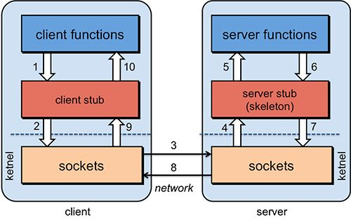

# SOA设计模式

``Service Oriented Ambiguity`` 即面向服务架构， 简称``SOA``。

链接：https://www.zhihu.com/question/42061683/answer/251131634
来源：知乎

对于``SOA``，感觉这个概念性的东西没那么容易理解，看了各位大神的解释感觉很多都说的很抽象，所以想尝试用自己的语言解释下，仅做参考。``SOA``粗暴理解：把系统按照实际业务，拆分成刚刚好大小的、合适的、独立部署的模块，每个模块之间相互独立。比如现我有一个数据库，一个``JavaWeb``（或者``PHP``等）的网站客户端，一个安卓``app``客户端，一个``IOS``客户端。现在我要从这个数据库中获取注册用户列表，如果不用``SOA``的设计思想，那么就会这样：``JavaWeb``里面写一个查询方法从数据库里面查数据然后在网页显示，安卓``app``里面写一个查询方法查询后在``app``上显示，``IOS``同样如此。这里就会出现查询方法重叠了，这样的坏处很明显了，三个地方都有相同的业务代码，要改三个地方都要改，而且要改的一模一样。当然问题不止这一个。于是乎出现了这样的设计思想，比如用``Java``（或者是其他语言皆可）单独创建一个工程部署在一台服务器上，并且写一个方法（或称函数）执行上述查询操作，然后使其他人可以通过某种途径（可以是``http``链接，或者是基于``socket``的``RPC``调用）访问这个方法得到返回数据，返回的数据类型是通用的``json``或者``xml``数据，就是说把这个操作封装到一个工程中去，然后暴露访问的方式，形成“服务”。比如这里就是注册用户服务，而关于注册用户的所有相关增删改查操作这个服务都会提供方法。这样一来，``JavaWeb``这边可以访问这个服务然后得到数据使用，安卓和``IOS``这里也可以通过这个服务得到数据。而且最重要的是，要修改关于注册用户的业务方法只要改这个服务就好了，很好的解耦。同理，其他业务比如商品、广告等业务都可以单独形成服务部署在单独服务器上。还有就是一旦哪天突然有一堆人要注册，假设这堆人仅仅只是注册而不做其他事情，其他业务比如商品、广告服务等都不忙，唯独注册这个功能压力很大，而原有的一台部署了注册服务的服务器已经承受不了这么高的并发，这时候就可以单独集群部署这个注册服务，提供多几台服务器提供注册服务，而其他服务还不忙，那就维持原样。当然，还有很多其他好处。以上我所描述的都还不能完全称为``SOA``，还不够完整，因为它少了服务治理这一环节。什么是服务治理，就是当服务越来越多，调用方也越来越多的时候，它们之间的关系就变得非常混乱，需要对这些关系进行管理。举例，还是上面的例子，假如我有一个用户服务，一开始有调用方1和调用方2来使用这个服务，后来越来越多，将近上百个调用方，这个时候作为服务方，它只知道提供服务，却不知道具体为谁提供了服务。而对于开发者来说，知道这N多调用方和N多服务方之间的关系是非常重要的。所以这个时候就需要能进行服务治理的框架，比如``dubbo+zookeeper``，比如``SpringCloud``，有了服务治理功能，我们就能清晰地看到服务被谁谁谁调用，谁谁谁调用了哪些服务，哪些服务是热点服务需要配置服务器集群，而对这个服务集群的负载均衡也是服务治理可以完成的重要功能之一。这个时候就是更加完善一点的``SOA``了。当然，还可以更进一步，加上服务监控跟踪等等等等之类的。实际上``SOA``只是一种架构设计模式，而``SOAP、REST、RPC``就是根据这种设计模式构建出来的规范，其中``SOAP``通俗理解就是``http+xml``的形式，``REST``就是``http+json``的形式，``RPC``是基于``socket``的形式。上文提到的``CXF``就是典型的``SOAP/REST``框架，``dubbo``就是典型的``RPC``框架，而``SpringCloud``就是遵守``REST``规范的生态系统。

# RPC框架

``Remote procedure Call``  --- 指远程过程调用

也就是说两台服务器``A``，``B``，一个应用部署在``A``服务器上，想要调用``B``服务器上应用提供的函数/方法，由于不在一个内存空间，不能直接调用，需要通过网络来表达调用的语义和传达调用的数据

- 首先，要解决通讯的问题，主要是通过在客户端和服务器之间建立TCP连接，远程过程调用的所有交换的数据都在这个连接里传输。连接可以是按需连接，调用结束后就断掉，也可以是长连接，多个远程过程调用共享同一个连接。
- 第二，要解决寻址的问题，也就是说，A服务器上的应用怎么告诉底层的RPC框架，如何连接到B服务器（如主机或IP地址）以及特定的端口，方法的名称名称是什么，这样才能完成调用。比如基于Web服务协议栈的RPC，就要提供一个endpoint URI，或者是从UDDI服务上查找。如果是RMI调用的话，还需要一个RMI Registry来注册服务的地址。
- 第三，当A服务器上的应用发起远程过程调用时，方法的参数需要通过底层的网络协议如TCP传递到B服务器，由于网络协议是基于二进制的，内存中的参数的值要序列化成二进制的形式，也就是序列化（Serialize）或编组（marshal），通过寻址和传输将序列化的二进制发送给B服务器。
- 第四，B服务器收到请求后，需要对参数进行反序列化（序列化的逆操作），恢复为内存中的表达方式，然后找到对应的方法（寻址的一部分）进行本地调用，然后得到返回值。
- 第五，返回值还要发送回服务器A上的应用，也要经过序列化的方式发送，服务器A接到后，再反序列化，恢复为内存中的表达方式，交给A服务器上的应用

为什么RPC呢？就是无法在一个进程内，甚至一个计算机内通过本地调用的方式完成的需求，比如比如不同的系统间的通讯，甚至不同的组织间的通讯。由于计算能力需要横向扩展，需要在多台机器组成的集群上部署应用

RPC的协议有很多，比如最``CORBA，Java RMI，Web Service``的``RPC``风格，``Hessian，Thrift``，甚至``Rest API``

