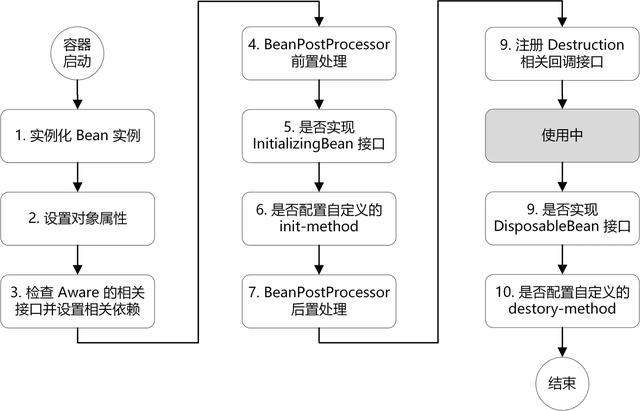
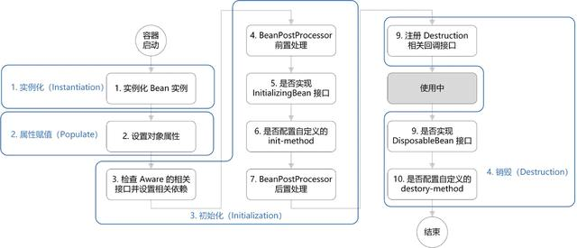

# ``Spring Bean``的生命周期

大致流程：




本文将从以下两方面去帮助理解 ``Bean`` 的生命周期：

- 生命周期的概要流程：对 ``Bean`` 的生命周期进行概括，并且结合代码来理解；
- 扩展点的作用：详细介绍 ``Bean`` 生命周期中所涉及到的扩展点的作用。

## 生命周期的概要流程

``Bean`` 的生命周期概括起来就是 ``4`` 个阶段：

- 实例化（``Instantiation``）
- 属性赋值（``Populate``）
- 初始化（``Initialization``）
- 销毁（``Destruction``）



- 实例化：第 ``1`` 步，实例化一个 ``bean`` 对象；
- 属性赋值：第 ``2`` 步，为 ``bean`` 设置相关属性和依赖；
- 初始化：第 ``3~7`` 步，步骤较多，其中第 ``5、6`` 步为初始化操作，第 ``3、4`` 步为在初始化前执行，第 ``7`` 步在初始化后执行，该阶段结束，才能被用户使用；
- 销毁：第 ``8~10``步，第``8``步不是真正意义上的销毁（还没使用呢），而是先在使用前注册了销毁的相关调用接口，为了后面第``9、10``步真正销毁 ``bean`` 时再执行相应的方法。

下面我们结合代码来直观的看下，在 ``doCreateBean()`` 方法中能看到依次执行了这 ``4`` 个阶段：

```java
// AbstractAutowireCapableBeanFactory.java
protected Object doCreateBean(final String beanName, final RootBeanDefinition mbd, final @Nullable Object[] args)
    throws BeanCreationException {
 
    // 1. 实例化
    BeanWrapper instanceWrapper = null;
    if (instanceWrapper == null) {
        instanceWrapper = createBeanInstance(beanName, mbd, args);
    }
    
    Object exposedObject = bean;
    try {
        // 2. 属性赋值
        populateBean(beanName, mbd, instanceWrapper);
        // 3. 初始化
        exposedObject = initializeBean(beanName, exposedObject, mbd);
    }
 
    // 4. 销毁-注册回调接口
    try {
        registerDisposableBeanIfNecessary(beanName, bean, mbd);
    }
 
    return exposedObject;
}
```

由于初始化包含了第 ``3~7``步，较复杂，所以我们进到 ``initializeBean()`` 方法里具体看下其过程（注释的序号对应图中序号）：

```java
// AbstractAutowireCapableBeanFactory.java
protected Object initializeBean(final String beanName, final Object bean, @Nullable RootBeanDefinition mbd) {
    // 3. 检查 Aware 相关接口并设置相关依赖
    if (System.getSecurityManager() != null) {
        AccessController.doPrivileged((PrivilegedAction<Object>) () -> {
            invokeAwareMethods(beanName, bean);
            return null;
        }, getAccessControlContext());
    }
    else {
        invokeAwareMethods(beanName, bean);
    }
 
    // 4. BeanPostProcessor 前置处理
    Object wrappedBean = bean;
    if (mbd == null || !mbd.isSynthetic()) {
        wrappedBean = applyBeanPostProcessorsBeforeInitialization(wrappedBean, beanName);
    }
 
    // 5. 若实现 InitializingBean 接口，调用 afterPropertiesSet() 方法
    // 6. 若配置自定义的 init-method方法，则执行
    try {
        invokeInitMethods(beanName, wrappedBean, mbd);
    }
    catch (Throwable ex) {
        throw new BeanCreationException(
            (mbd != null ? mbd.getResourceDescription() : null),
            beanName, "Invocation of init method failed", ex);
    }
    // 7. BeanPostProceesor 后置处理
    if (mbd == null || !mbd.isSynthetic()) {
        wrappedBean = applyBeanPostProcessorsAfterInitialization(wrappedBean, beanName);
    }
 
    return wrappedBean;
}
```java
// AbstractAutowireCapableBeanFactory.java
protected Object initializeBean(final String beanName, final Object bean, @Nullable RootBeanDefinition mbd) {
    // 3. 检查 Aware 相关接口并设置相关依赖
    if (System.getSecurityManager() != null) {
        AccessController.doPrivileged((PrivilegedAction<Object>) () -> {
            invokeAwareMethods(beanName, bean);
            return null;
        }, getAccessControlContext());
    }
    else {
        invokeAwareMethods(beanName, bean);
    }
 
    // 4. BeanPostProcessor 前置处理
    Object wrappedBean = bean;
    if (mbd == null || !mbd.isSynthetic()) {
        wrappedBean = applyBeanPostProcessorsBeforeInitialization(wrappedBean, beanName);
    }
 
    // 5. 若实现 InitializingBean 接口，调用 afterPropertiesSet() 方法
    // 6. 若配置自定义的 init-method方法，则执行
    try {
        invokeInitMethods(beanName, wrappedBean, mbd);
    }
    catch (Throwable ex) {
        throw new BeanCreationException(
            (mbd != null ? mbd.getResourceDescription() : null),
            beanName, "Invocation of init method failed", ex);
    }
    // 7. BeanPostProceesor 后置处理
    if (mbd == null || !mbd.isSynthetic()) {
        wrappedBean = applyBeanPostProcessorsAfterInitialization(wrappedBean, beanName);
    }
 
    return wrappedBean;
}
```

在 ``invokInitMethods()`` 方法中会检查 ``InitializingBean`` 接口和 ``init-method`` 方法，销毁的过程也与其类似：

```java
// DisposableBeanAdapter.java
public void destroy() {
    // 9. 若实现 DisposableBean 接口，则执行 destory()方法
    if (this.invokeDisposableBean) {
        try {
            if (System.getSecurityManager() != null) {
                AccessController.doPrivileged((PrivilegedExceptionAction<Object>) () -> {
                    ((DisposableBean) this.bean).destroy();
                    return null;
                }, this.acc);
            }
            else {
                ((DisposableBean) this.bean).destroy();
            }
        }
    }
    
	// 10. 若配置自定义的 detory-method 方法，则执行
    if (this.destroyMethod != null) {
        invokeCustomDestroyMethod(this.destroyMethod);
    }
    else if (this.destroyMethodName != null) {
        Method methodToInvoke = determineDestroyMethod(this.destroyMethodName);
        if (methodToInvoke != null) {
            invokeCustomDestroyMethod(ClassUtils.getInterfaceMethodIfPossible(methodToInvoke));
        }
    }
```
从 ``Spring`` 的源码我们可以直观的看到其执行过程，而我们记忆其过程便可以从这 ``4`` 个阶段出发，实例化、属性赋值、初始化、销毁。其中细节较多的便是初始化，涉及了 ``Aware、BeanPostProcessor、InitializingBean、init-method`` 的概念。


[拓展点讲解](https://blog.csdn.net/zl1zl2zl3/article/details/105044954)


