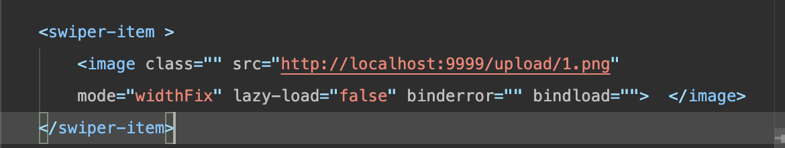

> 文件上传与下载

```java
@PostMapping("/upload")
    public String uploadFile(MultipartFile file){
        try {
            //生成文件在服务器端存放的名字

            //扩展名
            String fileSuffix = file.getOriginalFilename().substring(file.getOriginalFilename().lastIndexOf(".")+1);

            String fileName = System.currentTimeMillis() + "." +fileSuffix;
            //获取项目路径
            System.out.println(System.getProperty("user.dir"));

            File files = new File("/Users/jinmao/Documents/IDEASpace/springboot01/src/" + fileName);
            //上传
            if(!files.exists()) files.mkdirs();
            file.transferTo(files);
        } catch (IOException e) {
            e.printStackTrace();
            return "上传失败";
        }

        return "上传成功";
    }

     //多文件上传
     @PostMapping("/batch")
    public String handleFileUpload(HttpServletRequest request) {
        List<MultipartFile> files = ((MultipartHttpServletRequest) request).getFiles("file");
        MultipartFile file = null;
        BufferedOutputStream stream = null;
        for (int i = 0; i < files.size(); ++i) {
            file = files.get(i);
            String filePath = "/Users/dalaoyang/Downloads/";
            if (!file.isEmpty()) {
                try {
                    byte[] bytes = file.getBytes();
                    stream = new BufferedOutputStream(new FileOutputStream(
                            new File(filePath + file.getOriginalFilename())));//设置文件路径及名字
                    stream.write(bytes);// 写入
                    stream.close();
                } catch (Exception e) {
                    stream = null;
                    return "第 " + i + " 个文件上传失败 ==> "
                            + e.getMessage();
                }
            } else {
                return "第 " + i
                        + " 个文件上传失败因为文件为空";
            }
        }
        return "上传成功";
    }
```

```java
//文件下载
@GetMapping("/download")
    public String downloadFile(HttpServletRequest request, HttpServletResponse response) {
        String fileName = "dalaoyang.jpeg";// 文件名
        if (fileName != null) {
            //设置文件路径
            File file = new File("/Users/dalaoyang/Documents/dalaoyang.jpeg");
            //File file = new File(realPath , fileName);
            if (file.exists()) {
                response.setContentType("application/force-download");// 设置强制下载不打开
                response.addHeader("Content-Disposition", "attachment;fileName=" + fileName);// 设置文件名
                byte[] buffer = new byte[1024];
                FileInputStream fis = null;
                BufferedInputStream bis = null;
                try {
                    fis = new FileInputStream(file);
                    bis = new BufferedInputStream(fis);
                    OutputStream os = response.getOutputStream();
                    int i = bis.read(buffer);
                    while (i != -1) {
                        os.write(buffer, 0, i);
                        i = bis.read(buffer);
                    }
                    return "下载成功";
                } catch (Exception e) {
                    e.printStackTrace();
                } finally {
                    if (bis != null) {
                        try {
                            bis.close();
                        } catch (IOException e) {
                            e.printStackTrace();
                        }
                    }
                    if (fis != null) {
                        try {
                            fis.close();
                        } catch (IOException e) {
                            e.printStackTrace();
                        }
                    }
                }
            }
        }
        return "下载失败";
    }
```


## 关于文件上传的理解

以前是这样认为的，就像代码中所展示的那样

```html
 <swiper-item >
<image class="" src="/Users/jinmao/Documents/Vscode/Space/StudyPlatform/images/swiper/1.png" mode="widthFix" lazy-load="false" binderror="" bindload="">  </image>
</swiper-item>
```

``image``标签只要``src``是静态的文件目录，感觉就是可以的，然后这就犯了一个很严重的错误，他是无法被解析的，必须是后端项目所带有的资源

类似于一个服务端，一个客户端去访问他的资源，这个资源是服务端所带有的，并不是服务器上有的，只要是有他的全限定类名就``ok``的

所以任何资源都要通过后端去获取，后端所带有的，所以这个代码有很严重的错误，也是一个关于文件上传的大误区





就可以显示出来了


**续：**

后来我又发现了新的问题，就是需要重启项目之后才能访问到相应的资源
### 配置访问虚拟路径

文件实际是存在 路径下面，但是当访问``http://ip:port/upload/xxx.jpg`` 时，虚拟路径会映射到 ``file://Users/path/xxx.jpg`` 的路径中访问文件。也是对服务器文件的一种保护措施吧.

```java
@Configuration
public class WebMvcConfig implements WebMvcConfigurer {
    @Override
    public void addResourceHandlers(ResourceHandlerRegistry registry) {
        String path = System.getProperty("user.dir") + "/src/main/resources/upload/";
        //registry.addResourceHandler("/static/**").addResourceLocations("classpath:/static/");
        //linux服务器文件目录
        //配置磁盘映射 , pathPattern  访问路径                                        磁盘映射路径，不然不能够访问
                                        //这是因为对服务器的保护措施导致的，服务器不能对外部暴露真实的资源路径，需要配置虚拟路径映射访问。
        registry.addResourceHandler("/upload/**").addResourceLocations("file:"+path);
    }
}
```
