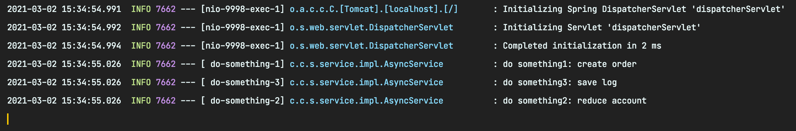
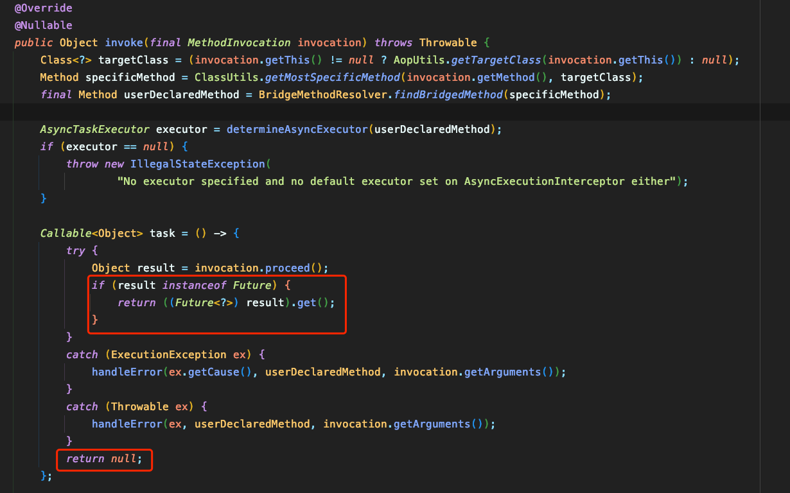

# ``SpringBoot``中如何优雅的使用多线程

在 ``SpringBoot`` 应用中，经常会遇到在一个接口中，同时做事情1，事情2，事情3，如果同步执行的话，则本次接口时间取决于事情1 2 3执行时间之和；如果三件事同时执行，则本次接口时间取决于事情1 2 3执行时间最长的那个，合理使用多线程，可以大大缩短接口时间。那么在 ``SpringBoot`` 应用中如何优雅的使用多线程呢？

``Don't bb, show me code.``

## **快速使用**

``SpringBoot``应用中需要添加``@EnableAsync``注解，来开启异步调用，一般还会配置一个线程池，异步的方法交给特定的线程池完成，如下：
```java
@Configuration
@EnableAsync
public class AsyncConfiguration {

    @Bean("doSomethingExecutor")
    public Executor doSomethingExecutor() {
        ThreadPoolTaskExecutor executor = new ThreadPoolTaskExecutor();
        // 核心线程数：线程池创建时候初始化的线程数
        executor.setCorePoolSize(10);
        // 最大线程数：线程池最大的线程数，只有在缓冲队列满了之后才会申请超过核心线程数的线程
        executor.setMaxPoolSize(20);
        // 缓冲队列：用来缓冲执行任务的队列
        executor.setQueueCapacity(500);
        // 允许线程的空闲时间60秒：当超过了核心线程之外的线程在空闲时间到达之后会被销毁
        executor.setKeepAliveSeconds(60);
        // 线程池名的前缀：设置好了之后可以方便我们定位处理任务所在的线程池
        executor.setThreadNamePrefix("do-something-");
        // 缓冲队列满了之后的拒绝策略：由调用线程处理（一般是主线程）
        executor.setRejectedExecutionHandler(new ThreadPoolExecutor.DiscardPolicy());
        executor.initialize();
        return executor;
    }

}
```
使用的方式非常简单，在需要异步的方法上加``@Async``注解

```java
@RestController
public class AsyncController {

    @Autowired
    private AsyncService asyncService;

    @GetMapping("/open/something")
    public String something() {
        int count = 10;
        for (int i = 0; i < count; i++) {
            asyncService.doSomething("index = " + i);
        }
        lon
        return "success";
    }
}


@Slf4j
@Service
public class AsyncService {

    // 指定使用beanname为doSomethingExecutor的线程池
    @Async("doSomethingExecutor")
    public String doSomething(String message) {
        log.info("do something, message={}", message);
        try {
            Thread.sleep(1000);
        } catch (InterruptedException e) {
            log.error("do something error: ", e);
        }
        return message;
    }
}
```

访问：``127.0.0.1:8080/open/something``，日志如下


由此可见已经达到异步执行的效果了，并且使用到了咱们配置的线程池。


## **获取异步方法返回值**

当异步方法有返回值时，如何获取异步方法执行的返回结果呢？这时需要异步调用的方法带有返回``CompletableFuture``。

``CompletableFuture``是对``Feature``的增强，``Feature``只能处理简单的异步任务，而``CompletableFuture``可以将多个异步任务进行复杂的组合。如下：

```java
@RestController
public class AsyncController {

    @Autowired
    private AsyncService asyncService;

    @SneakyThrows
    @ApiOperation("异步 有返回值")
    @GetMapping("/open/somethings")
    public String somethings() {
        CompletableFuture<String> createOrder = asyncService.doSomething1("create order");
        CompletableFuture<String> reduceAccount = asyncService.doSomething2("reduce account");
        CompletableFuture<String> saveLog = asyncService.doSomething3("save log");
        
        // 等待所有任务都执行完
        CompletableFuture.allOf(createOrder, reduceAccount, saveLog).join();
        // 获取每个任务的返回结果
        String result = createOrder.get() + reduceAccount.get() + saveLog.get();
        return result;
    }
}


@Slf4j
@Service
public class AsyncService {

    @Async("doSomethingExecutor")
    public CompletableFuture<String> doSomething1(String message) throws InterruptedException {
        log.info("do something1: {}", message);
        Thread.sleep(1000);
        return CompletableFuture.completedFuture("do something1: " + message);
    }

    @Async("doSomethingExecutor")
    public CompletableFuture<String> doSomething2(String message) throws InterruptedException {
        log.info("do something2: {}", message);
        Thread.sleep(1000);
        return CompletableFuture.completedFuture("; do something2: " + message);
    }

    @Async("doSomethingExecutor")
    public CompletableFuture<String> doSomething3(String message) throws InterruptedException {
        log.info("do something3: {}", message);
        Thread.sleep(1000);
        return CompletableFuture.completedFuture("; do something3: " + message);
    }
}
```
控制台上日志：



## **注意事项**

``@Async``注解会在以下几个场景失效，也就是说明明使用了``@Async``注解，但就没有走多线程。

- 异步方法使用``static``关键词修饰；
- 异步类不是一个``Spring``容器的``bean``（一般使用注解``@Component``和``@Service``，并且能被``Spring``扫描到）；
- ``SpringBoot``应用中没有添加``@EnableAsync``注解；
- 在同一个类中，一个方法调用另外一个有``@Async``注解的方法，注解不会生效。原因是``@Async``注解的方法，是在代理类中执行的。
  
需要注意的是： 异步方法使用注解``@Async``的返回值只能为``void``或者``Future``及其子类，当返回结果为其他类型时，方法还是会异步执行，但是返回值都是``null``，部分源码如下：

``AsyncExecutionInterceptor``-``#invoke``




通过上边几个示例，``@Async``实际还是通过``Future``或``CompletableFuture``来异步执行的，``Spring``又封装了一下，让我们使用的更方便。


