# 在平时使用``mysql``时，需要有哪些注意点

- 数据库的范式
  
    第一范式要求最低，只要求表中字段不可用在拆分。
    第二范式在第一范式的基础上要求每条记录由主键唯一区分，记录中所有属性都依赖于主键。
    第三范式在第二范式的基础上，要求所有属性必须直接依赖主键，不允许间接依赖。
    一般说来，数据库只需满足第三范式就可以了。

- 数据库事务特性

    数据库的特性是面试时考察频率非常高的题目，共4个特性：

    原子性：是指事务由原子的操作序列组成，所有操作要么全部成功，要么全部失败回滚。

    一致性：是指事务的执行不能破坏数据库数据的完整性和一致性，一个事务在执行之前和执行之后，数据库都必须处以一致性状态。比如在做多表操作时，多个表要么都是事务后新的值，要么都是事务前的旧值。

    隔离性：是指多个用户并发访问数据库时，数据库为每个用户执行的事务，不能被其他事务的操作所干扰，多个并发事务之间要相互隔离。事务的隔离级别我们稍后介绍。
    
    持久性：是指一个事务一旦提交并执行成功，那么对数据库中数据的改变就是永久性的，即便是在数据库系统遇到故障的情况下也不会丢失提交事务的操作。

    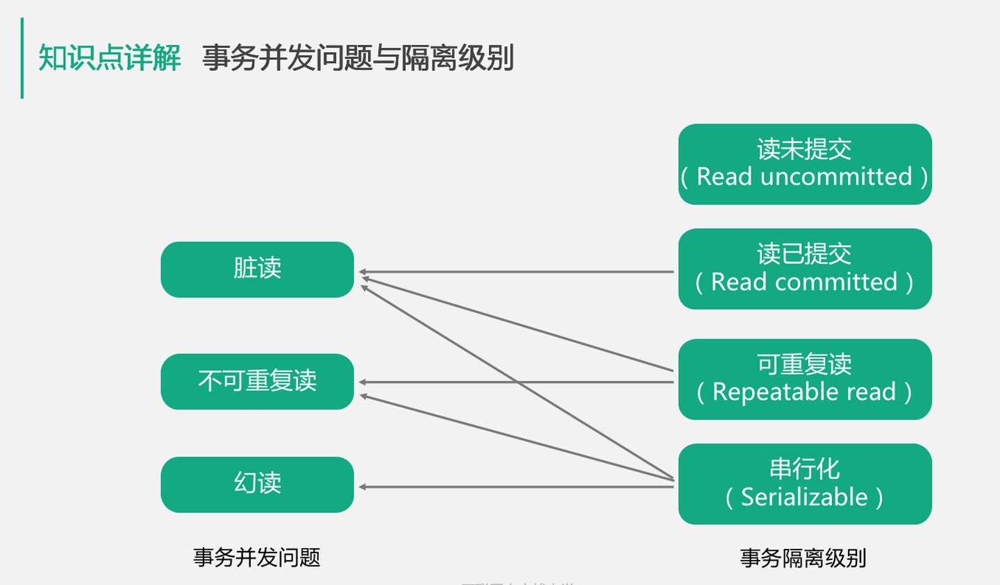


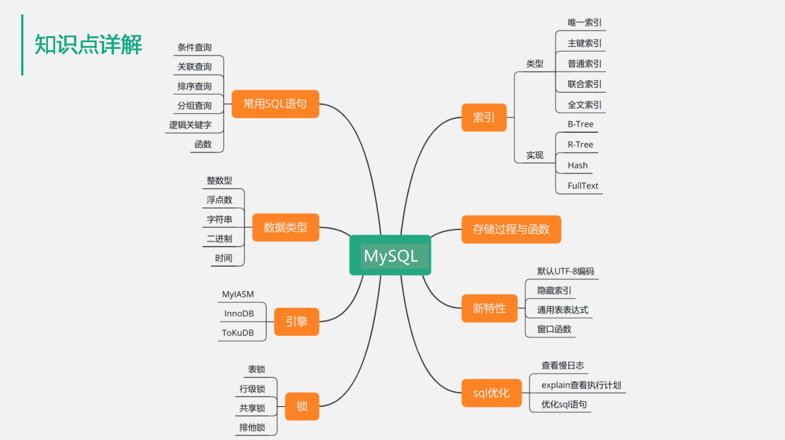


> 3.MySQL中主要的存储引擎

MyISAM是MySQL官方提供的存储引擎，其特点是支持全文索引，查询效率比较高，缺点是不支持事务、使用表级锁。InnoDB在5.5版本后成为了Mysql的默认存储引擎，特点是支持ACID事务、支持外键、支持行级锁提高了并发效率。TokuDB是第三方开发的开源存储引擎，有非常快的写速度，支持数据的压缩存储、可以在线添加索引而不影响读写操作。但是因为压缩的原因，TokuDB非常适合访问频率不高的数据或历史数据归档，不适合大量读取的场景。

> 4.MySQL中的锁

MyIASAM使用表级锁，InnoDB使用行级锁。表锁开销小，加锁快，不会出现死锁；但是锁的粒度大，发生锁冲突的概率高，并发访问效率比较低。行级锁开销大，加锁慢，有可能会出现死锁，不过因为锁定粒度最小，发生锁冲突的概率低，并发访问效率比较高。

注：

共享锁也就是读锁，其他事务可以读，但不能写。MySQL可以通过Lock In Share Mode语句显示使用共享锁。
排他锁就是写锁，其他事务不能读取，也不能写。对于Update、Delete和INSERT语句，InnoDB会自动给涉及的数据集加排他锁，或者使用``select for update显示使用排他锁``。

> 6.MySQL的存储过程与函数

存储过程和函数都可以避免开发人员重复编写相同的SQL语句，并且存储过程和函数都是在MySQL服务器中执行的，可以减少客户端和服务器端的数据传输。

存储过程能够实现更复杂的功能，而函数一般用来实现针对性比较强的功能，例如特殊策略求和等。存储过程可以执行包括修改表等一系列数据库操作，而用户定义函数不能用于执行修改全局数据库状态的操作。

存储过程一般是作为一个独立的部分来执行，而函数可以作为查询语句的一个部分来调用。SQL语句中不能使用存储过程，但可以使用函数。

不过存储过程一般与数据库实现绑定，使用存储过程会降低程序的可移植性，应谨慎使用。


> 7.新特性

可以了解MySQL8.0的一些新特性，例如默认字符集格式改为了UTF8；增加了隐藏索引的功能，隐藏后的索引不会被查询优化器使用，可以使用这个特性用于性能调试；支持了通用表表达式，使复杂查询中的嵌入表语句更加清晰；新增了窗口函数的概念，它可以用来实现新的查询方式。窗口函数与 SUM、COUNT等集合函数类似，但不会将多行查询结果合并，而是将结果放在多行中。即窗口函数不需要GROUP BY。


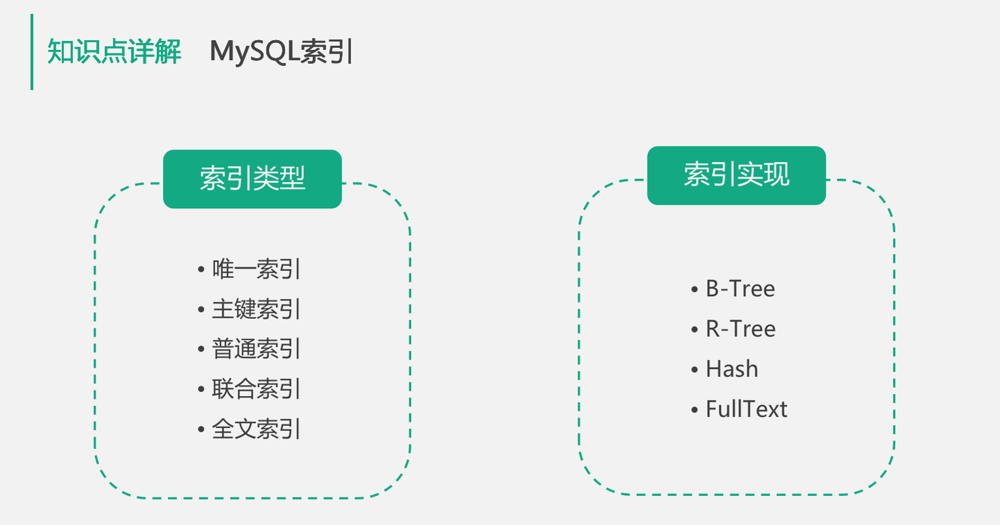

索引可以大幅增加数据库的查询的性能，在实际业务场景中，或多或少都会使用到。

但是索引是有如下2个代价的:

a.需要额外的磁盘空间来保存索引

b.对于插入、更新、删除等操作由于更新索引会增加额外的开销

因此索引比较适合用在读多写少的场景。

## 1.MySQL索引类型

如左面的模块，共分为5类：

唯一索引：就是索引列中的值必须是唯一的，但是允许出现空值。这种索引一般用来保证数据的唯一性，比如保存账户信息的表，每个账户的id必须保证唯一，如果重复插入相同的账户id时会MySQL返回异常。

主键索引：是一种特殊的唯一索引，但是它不允许出现空值。

普通索引：与唯一索引不同，它允许索引列中存在相同的值。例如学生的成绩表，各个学科的分数是允许重复的，就可以使用普通索引。

联合索引：就是由多个列共同组成的索引。一个表中含有多个单列的索引并不是联合索引，联合索引是对多个列字段按顺序共同组成一个索引。应用联合索引时需要注意最左原则，就是Where查询条件中的字段必须与索引字段从左到右进行匹配。比如，一个用户信息表，用姓名和年龄组成了联合索引，如果查询条件是姓名等于张三，那么满足最左原则；如果查询条件是年龄大于20，由于索引中最左的字段是姓名不是年龄，所以不能使用这个索引。

全文索引：前面提到了，MyISAM引擎中实现了这个索引，在5.6版本后InnoDB引擎也支持了全文索引，并且在5.7.6版本后支持了中文索引。全文索引只能在CHAR,VARCHAR,TEXT类型字段上使用，底层使用倒排索引实现。要注意对于大数据量的表，生成全文索引会非常消耗时间也非常消耗磁盘空间。


## 2.索引实现

如右面的模块，索引实现共分4种形式：

B+树实现：b+树比较适合用作'>'或'<'这样的范围查询，是MySQL中最常使用的一种索引实现。
R-tree：是一种用于处理多维数据的数据结构，可以对地理数据进行空间索引。不过实际业务场景中使用的比较少。
Hash：是使用散列表来对数据进行索引，Hash方式不像Btree那样需要多次查询才能定位到记录，因此Hash索引的效率高于B-tree，但是不支持范围查找和排序等功能.实际使用的也比较少。
FullText：就是我们前面提到的全文索引，是一种记录关键字与对应文档关系的倒排索引。


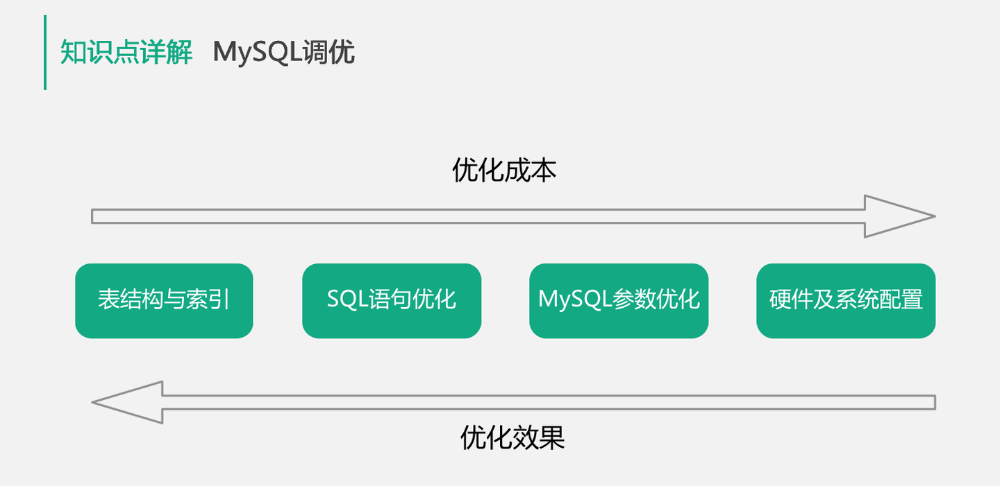

一般MySQL调优有图中的4个纬度：

针对数据库设计、表结构设计以及索引设置纬度进行的优化；

对业务中使用的SQL语句进行优化，例如调整Where查询条件；

对mysql服务的配置进行优化，例如对链接数的管理，对索引缓存、查询缓存、排序缓存等各种缓存大小进行优化;

对硬件设备和操作系统设置进行优化，例如调整操作系统参数、禁用Swap、增加内存、升级固态硬盘等等。

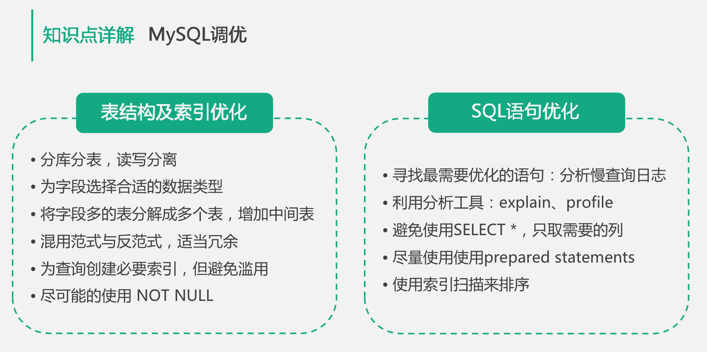

## 1.表结构和索引的优化

如左面的模块，应该掌握如下6个原则：

第1个原则：要在设计表结构时，考虑数据库的水平与垂直扩展能力，提前规划好未来1年的数据量、读写量的增长，规划好分库分表方案。比如设计用户信息表，预计1年后用户数据10亿条，写QPS约5000，读QPS30000，可以设计按UID纬度进行散列，分为4个库每个库32张表，单表数据量控制在KW级别；

第2个原则：要为字段选择合适的数据类型，在保留扩展能力的前提下，优先选用较小的数据结构。例如保存年龄的字段，要使用TINYINT而不要使用INT；

第3个原则：可以将字段多的表分解成多个表，必要时增加中间表进行关联。假如一张表有4、50个字段显然不是一个好的设计；

第4个原则：是设计关系数据库时需要满足第三范式，但为了满足第三范式，我们可能会拆分出多张表。而在进行查询时需要对多张表进行关联查询，有时为了提高查询效率，会降低范式的要求，在表中保存一定的冗余信息，也叫做反范式。但要注意反范式一定要适度；

第5个原则：要擅用索引，比如为经常作为查询条件的字段创建索引、创建联合索引时要根据最左原则考虑索引的复用能力，不要重复创建索引；要为保证数据不能重复的字段创建唯一索引等等。不过要注意索引对插入、更新等写操作是有代价的，不要滥用索引。比如像性别这样唯一很差的字段就不适合建立索引；

第6个原则：列字段尽量设置为Not Null，MySQL难以对使用Null的列进行查询优化，允许Null会使索引、索引统计和值更加复杂。允许Null值的列需要更多的存储空间，还需要MySQL内部进行特殊处理。

## 2.SQL语句进行优化的原则

如右面的模块，共分5个原则：

第1个原则：要找的最需要优化的SQL语句。要么是使用最频繁的语句，要么是优化后提高最明显的语句，可以通过查询MySQL的慢查询日志来发现需要进行优化的SQL语句；

第2个原则：要学会利用MySQL提供的分析工具。例如使用Explain来分析语句的执行计划，看看是否使用了索引，使用了哪个索引，扫描了多少记录，是否使用文件排序等等。或者利用Profile命令来分析某个语句执行过程中各个分步的耗时；

第3个原则：要注意使用查询语句是要避免使用Select *，而是应该指定具体需要获取的字段。原因一是可以避免查询出不需要使用的字段，二是可以避免查询列字段的元信息；

第4个原则：是尽量使用Prepared Statements，一个是性能更好，另一个是可以防止SQL注入；

第5个原则：是尽量使用索引扫描来进行排序，也就是尽量在有索引的字段上进行排序操作。

以上为数据库操作须掌握的内容，可以进行差缺补漏，希望对研发人员有一定的帮助。


面试考察点

1.必须了解数据库的基本原理、使用场景以及常用队列、数据库的特点。MySQL提供了多种引擎可以支持事务型与非事务型的关系对象库服务等等。

2.要深刻理解数据库事务的ACID特性，了解并发事务可能导致的并发问题和不同的数据库隔离级别如何解决这些并发问题。

3.要掌握常用的MySQL语句，比如WHERE条件查询语句、JOIN关联语句、ORDER BY排序语句等等。还要熟悉常用的自带函数，例如SUM、COUNT等等。

4.要了解MySQL数据库不同引擎的特点及不同类型的索引实现。比如最长使用的InnoDB非常擅长事务处理，MyISAM比较适合非事务的简单查询场景。比如知道MySQL的唯一索引、联合索引、全文索引等不同索引类型，以及最长使用等B+树索引实现等等。


面试加分项

1.要了解新特性，例如MySQL8.0中提供了窗口函数来支持新的查询方式；支持通用表表达式，使复杂查询中的嵌入表语句更加清晰等等。

2.要知道数据库表设计原则，如果有过线上业务数据库的设计经验就更好了，你能够知道如何对容量进行评估，也知道适当分库分表来保证未来服务的可扩展性，这会对面试起到积极的影响。

3.最好有过数据库调优经验，例如明明建立了索引的语句，但是查询效率还是很慢，通过Explain分析发现表中有多个索引，MySQL的优化器选用了错误的索引，导致查询效率偏低，然后通过在SQL语句中使用Use Index来指定索引解决。

# 使用过哪些Juc中类

JUC中常用类汇总

JUC的atomic包下运用了CAS的``AtomicBoolean``、``AtomicInteger``、``AtomicReference``等原子变量类

 

``JUC``的``locks``包下的``AbstractQueuedSynchronizer（AQS）``以及使用``AQS``的``ReentantLock（显式锁）``、``ReentrantReadWriteLock``

附：运用了``AQS``的类还有：``Semaphore``、``CountDownLatch``、``ReentantLock（显式锁）``、``ReentrantReadWriteLock``

``JUC``下的一些同步工具类：``CountDownLatch（闭锁）``、``Semaphore（信号量）``、``CyclicBarrier（栅栏）``、``FutureTask``

``JUC``下的一些并发容器类：``ConcurrentHashMap``、``CopyOnWriteArrayList``

``JUC``下的一些``Executor``框架的相关类： 线程池的工厂类->``Executors``  线程池的实现类->``ThreadPoolExecutor/ForkJoinPool``

``JUC``下的一些阻塞队列实现类：``ArrayBlockingQueue、LinkedBlockingQueue、PriorityBlockingQueue``

附：``ForkJoinPool``：使用``work-stealing``的工作方式运行


# ``Juc``相关面试题

> 什么是 CAS 吗？
> 
CAS（Compare And Swap）指比较并交换。CAS算法CAS(V, E, N)包含 3 个参数，V 表示要更新的变量，E 表示预期的值，N 表示新值。在且仅在 V 值等于 E值时，才会将 V 值设为 N，如果 V 值和 E 值不同，则说明已经有其他线程做了更新，当前线程什么都不做。最后，CAS 返回当前 V 的真实值。Concurrent包下所有类底层都是依靠CAS操作来实现，而sun.misc.Unsafe为我们提供了一系列的CAS操作。

> CAS 有什么缺点？

- ABA问题
- 自旋问题
- 范围不能灵活控制

> 对 CAS 中的 ABA 产生有解决方案吗？

什么是 ABA 问题呢？多线程环境下。线程 1 从内存的V位置取出 A ，线程 2 也从内存中取出 A，并将 V 位置的数据首先修改为 B，接着又将 V 位置的数据修改为 A，线程 1 在进行CAS操作时会发现在内存中仍然是 A，线程 1 操作成功。尽管从线程 1 的角度来说，CAS操作是成功的，但在该过程中其实 V 位置的数据发生了变化，线程 1 没有感知到罢了，这在某些应用场景下可能出现过程数据不一致的问题。

可以版本号（version）来解决 ABA 问题的，在 atomic 包中提供了 AtomicStampedReference 这个类，它是专门用来解决 ABA 问题的。

直达链接： AtomicStampedReference ABA 案例链接


> CAS 自旋导致的问题？

由于单次 CAS 不一定能执行成功，所以 CAS 往往是配合着循环来实现的，有的时候甚至是死循环，不停地进行重试，直到线程竞争不激烈的时候，才能修改成功。

CPU 资源也是一直在被消耗的，这会对性能产生很大的影响。所以这就要求我们，要根据实际情况来选择是否使用 CAS，在高并发的场景下，通常 CAS 的效率是不高的。

> CAS 范围不能灵活控制

不能灵活控制线程安全的范围。只能针对某一个，而不是多个共享变量的，不能针对多个共享变量同时进行 CAS 操作，因为这多个变量之间是独立的，简单的把原子操作组合到一起，并不具备原子性。


> 什么是 AQS 吗？

AbstractQueuedSynchronizer抽象同步队列简称AQS，它是实现同步器的基础组件，并发包中锁的底层就是使用AQS实现的。AQS定义了一套多线程访问共享资源的同步框架，许多同步类的实现都依赖于它，例如常用的Synchronized、ReentrantLock、ReentrantReadWriteLock、Semaphore、CountDownLatch等。该框架下的锁会先尝试以CAS乐观锁去获取锁，如果获取不到，则会转为悲观锁（如RetreenLock）。

> 了解 AQS 共享资源的方式吗？

- 独占式：只有一个线程能执行，具体的Java实现有ReentrantLock。
- 共享式：多个线程可同时执行，具体的Java实现有Semaphore和CountDownLatch。


> Atomic 原子更新

Java 从 JDK1.5 开始提供了 java.util.concurrent.atomic 包，方便程序员在多线程环 境下，无锁的进行原子操作。在 Atomic 包里一共有 12 个类，四种原子更新方式，分别是原子更新基本类型，原子更新数组，原子更新引用和原子更新字段。在 JDK 1.8 之后又新增几个原子类。如下如：

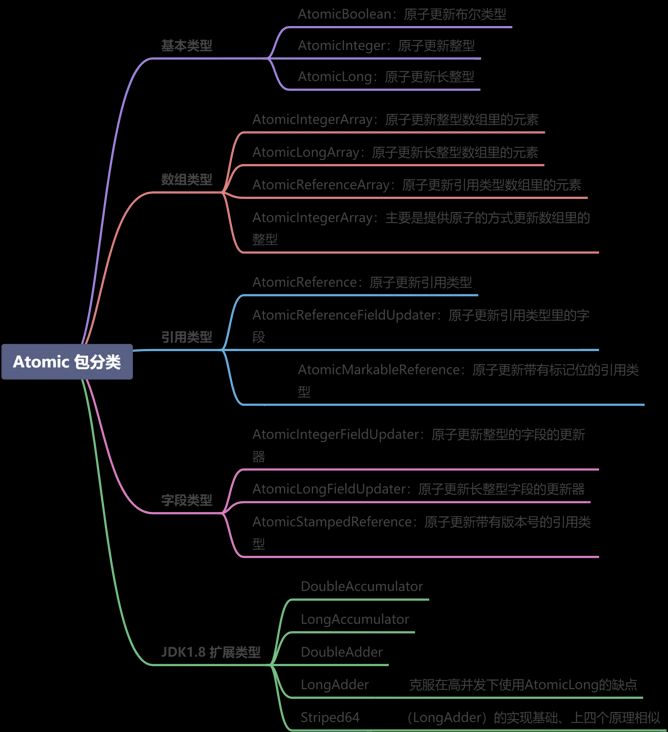  


# 列举几个AtomicLong 的常用方法

- long getAndIncrement() ：以原子方式将当前值加1，注意，返回的是旧值。（i++)
- long incrementAndGet() ：以原子方式将当前值加1，注意，返回的是新值。（++i）
- long getAndDecrement() ：以原子方式将当前值减 1，注意，返回的是旧值 。(i--)
- long decrementAndGet() ：以原子方式将当前值减 1，注意，返回的是新值 。(--i)
- long addAndGet（int delta） ：以原子方式将输入的数值与实例中的值（AtomicLong里的value）相加，并返回结果

# 说说 ``AtomicInteger`` 和 ``synchronized`` 的异同点？


## 相同点
 都是线程安全
## 不同点
- 1、背后原理
    synchronized 背后的 monitor 锁。在执行同步代码之前，需要首先获取到 monitor 锁，执行完毕后，再释放锁。原子类，线程安全的原理是利用了 CAS 操作。
- 2、使用范围

    原子类使用范围是比较局限的,一个原子类仅仅是一个对象，不够灵活。而 synchronized 的使用范围要广泛得多。比如说 synchronized 既可以修饰一个方法，又可以修饰一段代码，相当于可以根据我们的需要，非常灵活地去控制它的应用范围
- 3、粒度
 
    原子变量的粒度是比较小的，它可以把竞争范围缩小到变量级别。通常情况下，synchronized 锁的粒度都要大于原子变量的粒度。
- 4、性能
    ``synchronized`` 是一种典型的悲观锁，而原子类恰恰相反，它利用的是乐观锁。

# 原子类和 volatile 有什么异同？

- ``volatile`` 可见性问题
- 解决原子性问题


# ``AtomicLong`` 可否被 ``LongAdder`` 替代？


有了更高效的 LongAdder，那 AtomicLong 可否不使用了呢？是否凡是用到 AtomicLong 的地方，都可以用 LongAdder 替换掉呢？答案是不是的，这需要区分场景。

LongAdder 只提供了 add、increment 等简单的方法，适合的是统计求和计数的场景，场景比较单一，而 AtomicLong 还具有 compareAndSet 等高级方法，可以应对除了加减之外的更复杂的需要 CAS 的场景。

结论：如果我们的场景仅仅是需要用到加和减操作的话，那么可以直接使用更高效的 LongAdder，但如果我们需要利用 CAS 比如compareAndSet 等操作的话，就需要使用 AtomicLong 来完成。


# locks

## 公平锁与非公平锁

ReentrantLock支持公平锁和非公平锁两种方式。公平锁指锁的分配和竞争机制是公平的，即遵循先到先得原则。非公平锁指JVM遵循随机、就近原则分配锁的机制。ReentrantLock通过在构造函数ReentrantLock(boolean fair)中传递不同的参数来定义不同类型的锁，默认的实现是非公平锁。这是因为，非公平锁虽然放弃了锁的公平性，但是执行效率明显高于公平锁。如果系统没有特殊的要求，一般情况下建议使用非公平锁。

## ``synchronized`` 和 ``lock`` 有什么区别？
- synchronized 可以给类，方法，代码块加锁，而 lock 只能给代码块加锁。
- synchronized 不需要手动获取锁和释放锁，使用简单，发生异常会自动释放锁，不会造成死锁，而 lock 需要手动自己加锁和释放锁，如果使用不当没有 unLock 去释放锁，就会造成死锁。
- 通过 lock 可以知道有没有成功获取锁，而 synchronized 无法办到。
  
## ``synchronized`` 和 ``Lock`` 如何选择？

- ``synchronized`` 和 ``Lock`` 都是用来保护资源线程安全的。
都保证了可见性和互斥性。
- ``synchronized`` 和 ``ReentrantLock`` 都拥有可重入的特点。

不同点：

- 用法（lock 需要配合finally ）
- ReentrantLock可响应中断、可轮回，为处理锁提供了更多的灵活性
- ReentrantLock通过Condition可以绑定多个条件
- 加解锁顺序（）
- synchronized 锁不够灵活
- 是否可以设置公平/非公平
- 二者的底层实现不一样：synchronized是同步阻塞，采用的是悲观并发策略；Lock是同步非阻塞，采用的是乐观并发策略。


使用

- 如果能不用最好既不使用 Lock 也不使用 synchronized。
- 如果 synchronized 关键字适合你的程序，这样可以减少编写代码的数量，减少出错的概率
- 如果特别需要 Lock 的特殊功能，比如尝试获取锁、可中断、超时功能等，才使用 Lock。


## Lock接口的主要方法

- void lock():获取锁，调用该方法当前线程将会获取锁，当锁获得后，从该方法返回
- void lockInterruptibly() throws InterruptedException:可中断地获取锁，和lock方法地不同之处在于该方法会响应中断，即在锁的获取中可以中断当前线程
- boolean tryLock(): 尝试非阻塞地获取锁，调用该方法后立刻返回，如果能够获取则返回 true 否则 返回false
- boolean tryLock(long time, TimeUnit unit):超时地获取锁，当前线程在以下 3 种情况下会返回：
    - 当前线程在超时时间内获得了锁
    - 当前线程在超时时间被中断
    - 超时时间结束后，返回 false
- void unlock(): 释放锁
- Condition newCondition():获取锁等待通知组件，该组件和当前的锁绑定，当前线程只有获得了锁，才能调用该组件的 wait() 方法，而调用后，当前线程将释放锁。


##  tryLock、lock和lockInterruptibly的区别
    tryLock、lock和lockInterruptibly的区别如下。

- tryLock若有可用锁，则获取该锁并返回true，否则返回false，不会有延迟或等待；tryLock(long timeout, TimeUnit unit)可以增加时间限制，如果超过了指定的时间还没获得锁，则返回 false。
- lock若有可用锁，则获取该锁并返回true，否则会一直等待直到获取可用锁。
- 在锁中断时lockInterruptibly会抛出异常，lock不会。
突击并发编程JUC系列-ReentrantLock


## ReentrantReadWriteLock 读写锁的获取规则

要么是一个或多个线程同时有读锁，要么是一个线程有写锁，但是两者不会同时出现。也可以总结为：读读共享、其他都互斥（写写互斥、读写互斥、写读互斥）

ReentrantLock 适用于一般场合，ReadWriteLock 适用于读多写少的情况，合理使用可以进一步提高并发效率。

## 读锁应该插队吗？什么是读写锁的升降级？

ReentrantReadWriteLock 的实现选择了“不允许插队”的策略，这就大大减小了发生“饥饿”的概率。

插队策略

- 公平策略下，只要队列里有线程已经在排队，就不允许插队。
- 非公平策略下：
    - 如果允许读锁插队，那么由于读锁可以同时被多个线程持有，所以可能造成源源不断的后面的线程一直插队成功，导致读锁一直不能完全释放，从而导致写锁一直等待，为了防止“饥饿”，在等待队列的头结点是尝试获取写锁的线程的时候，不允许读锁插队。
    - 写锁可以随时插队，因为写锁并不容易插队成功，写锁只有在当前没有任何其他线程持有读锁和写锁的时候，才能插队成功，同时写锁一旦插队失败就会进入等待队列，所以很难造成“饥饿”的情况，允许写锁插队是为了提高效率。
  
升降级策略：只能从写锁降级为读锁，不能从读锁升级为写锁。

## 怎么防止死锁？

- 尽量使用 tryLock(long timeout,TimeUnit unit) 的方法（ReentrantLock 、ReenttranReadWriteLock）设置超时时间，超时可以退出防止死锁。
- 尽量使用 java.util.concurrent 并发类代替手写锁。
- 尽量降低锁的使用粒度，尽量不要几个功能用同一把锁。
- 尽量减少同步的代码块。

## Condition 类和 Object 类锁方法区别区别

- Condition 类的 awiat 方法和 Object 类的 wait 方法等效
- Condition 类的 signal 方法和 Object 类的 notify 方法等效
- Condition 类的 signalAll 方法和 Object 类的 notifyAll 方法等效
- ReentrantLock 类可以唤醒指定条件的线程，而 object 的唤醒是随机的

# 并发容器

## 为什么 ``ConcurrentHashMap`` 比 ``HashTable`` 效率要高？

- HashTable 使用一把锁（锁住整个链表结构）处理并发问题，多个线程竞争一把锁，容易阻塞；
- ConcurrentHashMap
    - JDK 1.7 中使用分段锁（ReentrantLock + Segment + HashEntry），相当于把一个 HashMap 分成多个段，每段分配一把锁，这样支持多线程访问。锁粒度：基于 Segment，包含多个 HashEntry。
    - JDK 1.8 中使用 CAS + synchronized + Node + 红黑树。锁粒度：Node（首结点）（实现 Map.Entry）。锁粒度降低了。

##  ConcurrentHashMap JDK 1.7/JDK 1.8

> JDK 1.7 结构

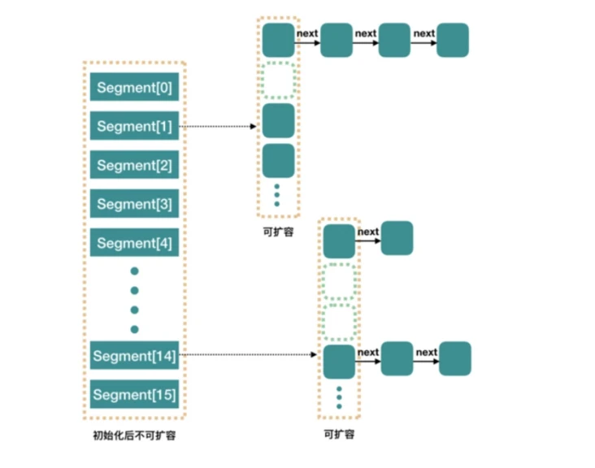  

JDK 1.7 中的ConcurrentHashMap 内部进行了 Segment分段，Segment 继承了 ReentrantLock，可以理解为一把锁，各个 Segment 之间都是相互独立上锁的，互不影响。

相比于之前的 Hashtable 每次操作都需要把整个对象锁住而言，大大提高了并发效率。因为它的锁与锁之间是独立的，而不是整个对象只有一把锁。

每个 Segment 的底层数据结构与 HashMap 类似，仍然是数组和链表组成的拉链法结构。默认有 0~15 共 16 个 Segment，所以最多可以同时支持 16 个线程并发操作（操作分别分布在不同的 Segment 上）。16 这个默认值可以在初始化的时候设置为其他值，但是一旦确认初始化以后，是不可以扩容的。

> JDK 1.8 结构

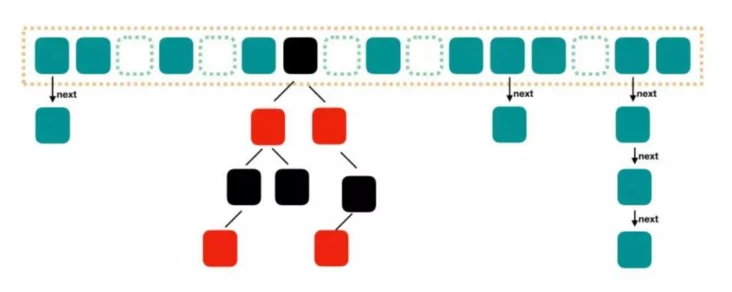  


图中的节点有三种类型： 

- 第一种是最简单的，空着的位置代表当前还没有元素来填充。
- 第二种就是和 HashMap 非常类似的拉链法结构，在每一个槽中会首先填入第一个节点，但是后续如果计算出相同的 Hash 值，就用链表的形式往后进行延伸。
- 第三种结构就是红黑树结构，这是 Java 7 的 ConcurrentHashMap 中所没有的结构，在此之前我们可能也很少接触这样的数据结构

链表长度大于某一个阈值``**（默认为 8）**``，满足容量从链表的形式转化为红黑树的形式。
红黑树是每个节点都带有颜色属性的二叉查找树，颜色为红色或黑色，红黑树的本质是对二叉查找树 BST 的一种平衡策略，我们可以理解为是一种平衡二叉查找树，查找效率高，会自动平衡，防止极端不平衡从而影响查找效率的情况发生，红黑树每个节点要么是红色，要么是黑色，但根节点永远是黑色的。


## ``ConcurrentHashMap`` 中 get 的过程
- 计算 Hash 值，并由此值找到对应的槽点；
- 如果数组是空的或者该位置为 null，那么直接返回 null 就可以了；
- 如果该位置处的节点刚好就是我们需要的，直接返回该节点的值；
- 如果该位置节点是红黑树或者正在扩容，就用 find 方法继续查找；
- 否则那就是链表，就进行遍历链表查找


## ``ConcurrentHashMap`` 中 put 的过程

- 判断 Node[] 数组是否初始化，没有则进行初始化操作
- 通过 hash 定位数组的索引坐标，是否有 Node 节点，如果没有则使用 CAS 进行添加（链表的头节点），添加失败则进入下次循环。
- 检查到内部正在扩容，就帮助它一块扩容。
- 如果 f != null ，则使用 synchronized 锁住 f 元素（链表/红黑二叉树的头元素）
    - 如果是 Node （链表结构）则执行链表的添加操作
    - 如果是 TreeNode （树形结构）则执行树添加操作。
- 判断链表长度已经达到临界值 8 ，当然这个 8 是默认值，大家也可以去做调整，当节点数超过这个值就需要把链表转换为树结构。

## 什么是阻塞队列?
阻塞队列（BlockingQueue）是一个支持两个附加操作的队列。这两个附加的操作支持阻塞的插入和移除方法。

支持阻塞的插入方法：意思是当队列满时，队列会阻塞插入元素的线程，直到队列不满。
支持阻塞的移除方法：意思是在队列为空时，获取元素的线程会等待队列变为非空。
阻塞队列常用于生产者和消费者的场景，生产者是向队列里添加元素的线程，消费者是从队列里取元素的线程。阻塞队列就是生产者用来存放元素、消费者用来获取元素的容器。

## 列举几个常见的阻塞队列
- ArrayBlockingQueue：一个由数组结构组成的有界阻塞队列。
- LinkedBlockingQueue：一个由链表结构组成的有界阻塞队列。
- PriorityBlockingQueue：一个支持优先级排序的无界阻塞队列。
- DelayQueue：一个使用优先级队列实现的无界阻塞队列。
- SynchronousQueue：一个不存储元素的阻塞队列。
- LinkedTransferQueue：一个由链表结构组成的无界阻塞队列。
- LinkedBlockingDeque：一个由链表结构组成的双向阻塞队列。

# 线程池

## 使用线程池的优势
``Java`` 中的线程池是运用场景最多的并发框架，几乎所有需要异步或并发执行任务的程序都可以使用线程池。

- 降低资源消耗。 通过重复利用已创建的线程降低线程创建和销毁造成的消耗。
- 提高响应速度。 当任务到达时，任务可以不需要等到线程创建就能立即执行。
- 提高线程的可管理性。 线程是稀缺资源，如果无限制地创建，不仅会消耗系统资源，还会降低系统的稳定性，使用线程池可以进行统一分配、调优和监控。但是，要做到合理利用线程池，必须对其实现原理了如指掌。

## 线程池的实现原理
当提交一个新任务到线程池时，线程池的处理流程如下：

- 线程池判断核心线程池里的线程是否都在执行任务。如果不是，则创建一个新的工作线程来执行任务。如果核心线程池里的线程都在执行任务，则进入下个流程。
- 线程池判断工作队列是否已经满。如果工作队列没有满，则将新提交的任务存储在这个工作队列里。如果工作队列满了，则进入下个流程。
- 线程池判断线程池的线程是否都处于工作状态。如果没有，则创建一个新的工作线程来执行任务。如果已经满了，则交给饱和策略来处理这个任务。

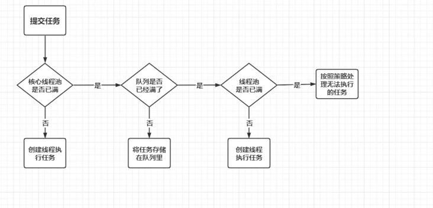  

``ThreadPoolExecutor``执行``execute()``方法的示意图 如下:

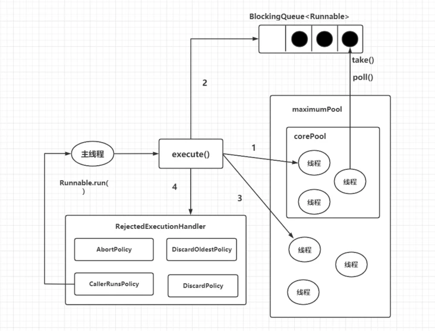  

``ThreadPoolExecutor``执行``execute``方法分下面 4 种情况:

- 1、如果当前运行的线程少于``corePoolSize``，则创建新线程来执行任务（注意，执行这一步骤需要获取全局锁）。
- 2、如果运行的线程等于或多于``corePoolSize``，则将任务加入``BlockingQueue``。
- 3、如果无法将任务加入``BlockingQueue（队列已满）``，则创建新的线程来处理任务（注意，执行这一步骤需要获取全局锁）。
- 4、如果创建新线程将使当前运行的线程超出``maximumPoolSize``，任务将被拒绝，并调用``RejectedExecutionHandler.rejectedExecution()``方法。

``ThreadPoolExecutor``采取上述步骤的总体设计思路，是为了在执行``execute()``方法时，尽可能地避免获取全局锁（那将会是一个严重的可伸缩瓶颈）。在``ThreadPoolExecutor``完成预热之后（当前运行的线程数大于等于``corePoolSize``），几乎所有的``execute()``方法调用都是执行步骤 2，而步骤2不需要获取全局锁。

## 创建线程有三种方式：

1. 继承 ``Thread`` 重写 ``run`` 方法
2. 实现 ``Runnable`` 接口
3. 实现 ``Callable`` 接口 （有返回值）

## 线程有哪些状态？

- ``NEW（初始）``，新建状态，线程被创建出来，但尚未启动时的线程状态；
- ``RUNNABLE（就绪状态）``，表示可以运行的线程状态，它可能正在运行，或者是在排队等待操作系统给它分配 CPU 资源；
- ``BLOCKED（阻塞）``，阻塞等待锁的线程状态，表示处于阻塞状态的线程正在等待监视器锁，比如等待执行 synchronized 代码块或者使用 synchronized 标记的方法；
- ``WAITING（等待）``，等待状态，一个处于等待状态的线程正在等待另一个线程执行某个特定的动作，比如，一个线程调用了 Object.wait() 方法，那它就在等待另一个线程调用 Object.notify() 或 Object.notifyAll() 方法；
- ``TIMED_WAITING（超时等待）``，计时等待状态，和等待状态（WAITING）类似，它只是多了超时时间，比如调用了有超时时间设置的方法 Object.wait(long timeout) 和 Thread.join(long timeout) 等这些方法时，它才会进入此状态；
- ``TERMINATED``，终止状态，表示线程已经执行完成。

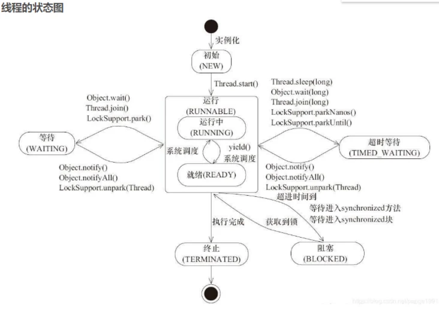  

## 线程池的状态有那些？

- ``running`` ：这是最正常的状态，接受新的任务，处理等待队列中的任务。
- ``shutdown：``不接受新的任务提交，但是会继续处理等待队列中的任务。
- ``stop：``不接受新的任务提交，不再处理等待队列中的任务，中断正在执行任务的线程。
- ``tidying：``所有的任务都销毁了，workcount 为 0，线程池的状态再转换 tidying 状态时，会执行钩子方法 terminated()。
- ``terminated：`` terminated() 方法结束后，线程池的状态就会变成这个。

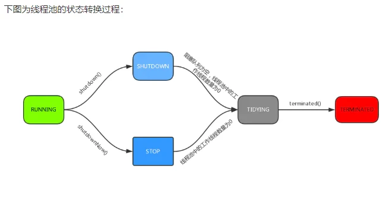  


## 线程池中 ``sumbit()`` 和 ``execute()`` 方法有什么区别？

- ``execute():`` 只能执行 ``Runable`` 类型的任务。
- ``submit()`` 可以执行 ``Runable`` 和 ``Callable`` 类型的任务。

​ ``Callable`` 类型的任务可以获取执行的返回值，而 ``Runnable`` 执行无返回值。

## 线程池创建的方式

- ``newSingleThreadExecutor():`` 他的特点是在于线程数目被限制位1：操作一个无界的工作队列，所以它保证了所有的任务的都是顺序执行，最多会有一个任务处于活动状态，并且不允许使用者改动线程池实例，因此可以避免其改变线程数目。
- ``newCachedThreadPool():``它是一种用来处理大量短时间工作任务的线程，具有几个鲜明的特点，它会试图缓存线程并重用，当无缓存线程可用时，就会创建新的工作线程，如果线程闲置的时间超过 60 秒，则被终止并移除缓存；长时间闲置时，这种线程池不会消耗什么资源，其内部使用 synchronousQueue 作为工作队列。
- ``newFixedThreadPool(int nThreads) ``：重用指定数目 nThreads 的线程，其背后使用的无界的工作队列，任何时候最后有 nThreads 个工作线程活动的，这意味着 如果任务数量超过了活动队列数目，将在工作队列中等待空闲线程出现，如果有工作线程退出，将会有新的工作线程被创建，以补足指定的数目 nThreads。
- ``newSingleThreadScheduledExecutor():`` 创建单线程池，返回ScheduleExecutorService 可以进行定时或周期性的工作强度。
- ``newScheduleThreadPool(int corePoolSize):`` 和 newSingleThreadSceduleExecutor() 类似，创建的ScheduledExecutorService可以进行定时或周期的工作调度，区别在于单一工作线程还是工作线程。
- ``newWorkStrealingPool(int parallelism):``这是一个经常被人忽略的线程池，Java 8 才加入这个创建方法，其内部会构建ForkJoinPool利用 work-strealing 算法 并行的处理任务，不保证处理顺序。
- ``ThreadPollExecutor ：`` 是最原始的线程池创建，上面 1-3 创建方式 都是对ThreadPoolExecutor 的封装。

上面 7 种创建方式中，前 6 种 通过``Executors``工厂方法创建，``ThreadPoolExecutor`` 手动创建。

##  ``ThreadPollExecutor`` 构造方法

下面介绍下 ``ThreadPoolExecutor`` 接收 7 个参数的构造方法

```java
/**
* 用给定的初始参数创建一个新的ThreadPoolExecutor。
*/
public ThreadPoolExecutor(int corePoolSize,//线程池的核心线程数量
        int maximumPoolSize,//线程池的最大线程数
        long keepAliveTime,//当线程数大于核心线程数时，多余的空闲线程存活的最长时间
        TimeUnit unit,//时间单位
        BlockingQueue<Runnable> workQueue,//任务队列
        ThreadFactory threadFactory,//线程工厂
        RejectedExecutionHandler handler//拒绝策略
)
```                            

- ``corePoolSize`` : 核心线程数线程数定义了最小可以同时运行的线程数量。
- ``maximumPoolSize`` : 当队列中存放的任务达到队列容量的时候，当前可以同时运行的线程数量变为最大线程数。
- ``workQueue``: 当新任务来的时候会先判断当前运行的线程数量是否达到核心线程数，如果达到的话，信任就会被存放在队列中。
- ``keepAliveTime``:线程活动保持时间,当线程池中的线程数量大于 ``corePoolSize`` 的时候，如果这时没有新的任务提交，核心线程外的线程不会立即销毁，而是会等待，直到等待的时间超过了 ``keepAliveTime``才会被回收销毁；
- ``unit`` : ``keepAliveTime`` 参数的时间单位。
- ``threadFactory`` : 任务队列，用于保存等待执行的任务的阻塞队列。可以选择以下几个阻塞队列。
    - ``ArrayBlockingQueue：``是一个基于数组结构的有界阻塞队列，此队列按 ``FIFO``（先进先出）原则对元素进行排序。
    - ``LinkedBlockingQueue：``一个基于链表结构的阻塞队列，此队列按FIFO排序元素，吞吐量通常要高于``ArrayBlockingQueue``。静态工厂方法``Executors.newFixedThreadPool()``使用了这个队列。
    - ``SynchronousQueue：``一个不存储元素的阻塞队列。每个插入操作必须等到另一个线程调用移除操作，否则插入操作一直处于阻塞状态，吞吐量通常要高于``Linked-BlockingQueue``，静态工厂方法``Executors.newCachedThreadPool``使用了这个队列。
    - ``PriorityBlockingQueue：``一个具有优先级的无限阻塞队列。
- ``handler`` :饱和策略(又称拒绝策略)。当队列和线程池都满了，说明线程池处于饱和状态，那么必须采取一种策略处理提交的新任务。这个策略默认情况下是``AbortPolicy``，表示无法处理新任务时抛出异常。在``JDK 1.5`` 中 ``Java`` 线程池框架提供了以下4种策略。
    - ``AbortPolicy：``直接抛出异常。
    - ``CallerRunsPolicy``：只用调用者所在线程来运行任务。
    - ``DiscardOldestPolicy``：丢弃队列里最近的一个任务，并执行当前任务。
    - ``DiscardPolicy：``不处理，丢弃掉


# hashmap的底层

HashMap是基于哈希表的Map接口的非同步实现。此实现提供所有可选的映射操作，并允许使用null值和null键。此类不保证映射的顺序，特别是它不保证该顺序恒久不变。

在java编程语言中，最基本的结构就是两种，一个是数组，另外一个是模拟指针（引用），所有的数据结构都可以用这两个基本结构来构造的，HashMap也不例外。HashMap实际上是一个“链表散列”的数据结构，即数组和链表的结合体。

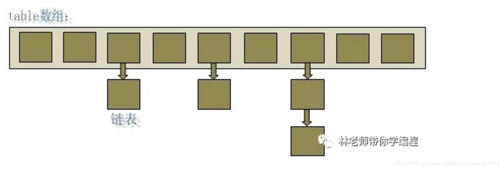


从上图中可以看出，HashMap底层就是一个数组结构，数组中的每一项又是一个链表。当新建一个HashMap的时候，就会初始化一个数组。

可以看出，Entry就是数组中的元素，每个 Map.Entry 其实就是一个key-value对，它持有一个指向下一个元素的引用，这就构成了链表

```java
public V put(K key, V value) { 
    // HashMap允许存放null键和null值。 
    // 当key为null时，调用putForNullKey方法，将value放置在数组第一个位置。 if (key == null) return putForNullKey(value);
     // 根据key的keyCode重新计算hash值。 int hash = hash(key.hashCode()); 
     // 搜索指定hash值在对应table中的索引。 int i = indexFor(hash, table.length); 
     // 如果 i 索引处的 Entry 不为 null，通过循环不断遍历 e 元素的下一个元素。 for (Entry e = table[i]; e != null; e = e.next) { Object k; if (e.hash == hash && ((k = e.key) == key || key.equals(k))) { 
         // 如果发现已有该键值，则存储新的值，并返回原始值 V oldValue = e.value; e.value = value; e.recordAccess(this); return oldValue; } } 
         // 如果i索引处的Entry为null，表明此处还没有Entry。 modCount++; 
     // 将key、value添加到i索引处。 addEntry(hash, key, value, i); return null;
}
```

根据hash值得到这个元素在数组中的位置（即下标），如果数组该位置上已经存放有其他元素了，那么在这个位置上的元素将以链表的形式存放，新加入的放在链头，最先加入的放在链尾。如果数组该位置上没有元素，就直接将该元素放到此数组中的该位置上。

hash(int h)方法根据key的hashCode重新计算一次散列。此算法加入了高位计算，防止低位不变，高位变化时，造成的hash冲突。

**HashMap中的两个重要的参数：``HashMap``中有两个重要的参数：初始容量大小和加载因子，初始容量大小是创建时给数组分配的容量大小，默认值为``16``，用数组容量大小乘以加载因子得到一个值，一旦数组中存储的元素个数超过该值就会调用``rehash``方法将数组容量增加到``原来的两倍``，专业术语叫做扩容。**

## TreeMap的底层实现原理

基于红黑树实现的排序``Map``

``TreeMap``增删改查的时间复杂度
``TreeMap``的增删改查和统计相关的操作的时间复杂度都为 ``O(logn)``

``TreeMap``的``key``和``value``的要求
由于实现了``Map``接口，则``key``的值不允许重复（重复则覆盖），也不允许为``null``，按照``key``的自然顺序排序或者``Comparator``接口指定的排序方法进行排序。
``value``允许重复，也允许为``null``，当``key``重复时，会覆盖此``value``值。
2- TreeMap的使用场景
考虑如下场景：

- 需要基于排序的统计功能：
    - 由于TreeMap是基于红黑树的实现的排序Map，对于增删改查以及统计的时间复杂度都控制在``O(logn)``的级别上，相对于``HashMap``和Liked``HashMap``的统计操作的(最大的key，最小的key，大于某一个key的所有Entry等等)时间复杂度O(n)具有较高时间效率。

- 需要快速增删改查的存储功能：
    - 相对于``HashMap``和``LikedHashMap`` 这些 hash表的时间复杂度O(1)（不考虑冲突情况），TreeMap的增删改查的时间复杂度为``O(logn)``就显得效率较低。

- 需要快速增删改查而且需要保证遍历和插入顺序一致的存储功能：
    - 相对于``HashMap``和``LikedHashMap`` 这些 hash表的时间复杂度O(1)（不考虑冲突情况），TreeMap的增删改查的时间复杂度为``O(logn)``就显得效率较低。但是``HashMap``并不保证任何顺序性。``LikedHashMap``额外保证了Map的遍历顺序与put顺序一致的有序性。

综上：场景1适合使用``TreeMap``，场景2适合使用``HashMap``，场景3适合使用``LikedHashMap``，需要注意它们都是非线程安全的，当在并发场景下可以使用其他并发集合或者调用者在调用层去控制并发使得操作串行执行。

# ``ArrayList``底层原理

**``ArrayList``、``LinkedList`` 和 ``Vector`` 的区别。**
1. ``ArrayList``非线程安全的，``Vector``是线程安全的。
2. ``ArrayList``扩容时按照50%增加，``Vector``按照100%增加。
3. ``ArrayList``的性能要高于``Vector``
4. ``LinkedList``是链表实现的，因此查询慢，增删快。
5. ``LinkedList``提供了List接口没有提供的方法，方便数据的头尾操作。

## ``ArrayList``简介
　　``ArrayList`` 的底层是数组队列，相当于动态数组。与 ``Java`` 中的数组相比，它的容量能动态增长。在添加大量元素前，应用程序可以使用``ensureCapacity``操作来增加 ``ArrayList`` 实例的容量。这可以减少递增式再分配的数量。

它继承于 ``AbstractList``，实现了 ``List, RandomAccess, Cloneable, java.io.Serializable`` 这些接口。

在我们学数据结构的时候就知道了线性表的顺序存储，插入删除元素的时间复杂度为``O（n）``,求表长以及增加元素，取第 ``i`` 元素的时间复杂度为``O（1）``

　 ``ArrayList`` 继承了``AbstractList``，实现了``List``。它是一个数组队列，提供了相关的添加、删除、修改、遍历等功能。

　　``ArrayList`` 实现了``RandomAccess`` 接口， ``RandomAccess`` 是一个标志接口，表明实现这个这个接口的 List 集合是支持快速随机访问的。在 ``ArrayList`` 中，我们即可以通过元素的序号快速获取元素对象，这就是快速随机访问。

　　``ArrayList`` 实现了``Cloneable`` 接口，即覆盖了函数 ``clone()``，能被克隆。

　　``ArrayList`` 实现``java.io.Serializable`` 接口，这意味着``ArrayList``支持序列化，能通过序列化去传输。

　　和 ``Vector`` 不同，``ArrayList`` 中的操作不是线程安全的！所以，建议在单线程中才使用 ``ArrayList``，而在多线程中可以选择 ``Vector`` 或者 ``CopyOnWriteArrayList``。

## ``ArrayList``源码分析
``System.arraycopy()``和``Arrays.copyOf()``方法

通过上面源码我们发现这两个实现数组复制的方法被广泛使用而且很多地方都特别巧妙。比如下面``add(int index, E element)``方法就很巧妙的用到了``arraycopy()``方法让数组自己复制自己实现让``index``开始之后的所有成员后移一个位置:

```java
/**
    * 在此列表中的指定位置插入指定的元素。 
    *先调用 rangeCheckForAdd 对index进行界限检查；然后调用 ensureCapacityInternal 方法保证capacity足够大；
    *再将从index开始之后的所有成员后移一个位置；将element插入index位置；最后size加1。
    */
public void add(int index, E element) {
    rangeCheckForAdd(index);

    ensureCapacityInternal(size + 1);  // Increments modCount!!
    //arraycopy()方法实现数组自己复制自己
    //elementData:源数组;index:源数组中的起始位置;elementData：目标数组；index + 1：目标数组中的起始位置； size - index：要复制的数组元素的数量；
    System.arraycopy(elementData, index, elementData, index + 1, size - index);
    elementData[index] = element;
    size++;
}
```

又如``toArray()``方法中用到了``copyOf()``方法

```java
/**
    *以正确的顺序（从第一个到最后一个元素）返回一个包含此列表中所有元素的数组。 
    *返回的数组将是“安全的”，因为该列表不保留对它的引用。 （换句话说，这个方法必须分配一个新的数组）。
    *因此，调用者可以自由地修改返回的数组。 此方法充当基于阵列和基于集合的API之间的桥梁。
    */
public Object[] toArray() {
//elementData：要复制的数组；size：要复制的长度
    return Arrays.copyOf(elementData, size);
}
```
> 两者联系与区别

联系： 看两者源代码可以发现``copyOf()``内部调用了``System.arraycopy()``方法 区别：

1. ``arraycopy()``需要目标数组，将原数组拷贝到你自己定义的数组里，而且可以选择拷贝的起点和长度以及放入新数组中的位置
2. ``copyOf()``是系统自动在内部新建一个数组，并返回该数组。

> ``ArrayList`` 核心扩容技术

```java
//下面是ArrayList的扩容机制
//ArrayList的扩容机制提高了性能，如果每次只扩充一个，
//那么频繁的插入会导致频繁的拷贝，降低性能，而ArrayList的扩容机制避免了这种情况。
/**
    * 如有必要，增加此ArrayList实例的容量，以确保它至少能容纳元素的数量
    * @param   minCapacity   所需的最小容量
    */
public void ensureCapacity(int minCapacity) {
    int minExpand = (elementData != DEFAULTCAPACITY_EMPTY_ELEMENTDATA)
        // any size if not default element table
        ? 0
        // larger than default for default empty table. It's already
        // supposed to be at default size.
        : DEFAULT_CAPACITY;

    if (minCapacity > minExpand) {
        ensureExplicitCapacity(minCapacity);
    }
}
//得到最小扩容量
private void ensureCapacityInternal(int minCapacity) {
    if (elementData == DEFAULTCAPACITY_EMPTY_ELEMENTDATA) {
            // 获取默认的容量和传入参数的较大值
        minCapacity = Math.max(DEFAULT_CAPACITY, minCapacity);
    }

    ensureExplicitCapacity(minCapacity);
}
//判断是否需要扩容,上面两个方法都要调用
private void ensureExplicitCapacity(int minCapacity) {
    modCount++;

    // 如果说minCapacity也就是所需的最小容量大于保存ArrayList数据的数组的长度的话，就需要调用grow(minCapacity)方法扩容。
    //这个minCapacity到底为多少呢？举个例子在添加元素(add)方法中这个minCapacity的大小就为现在数组的长度加1
    if (minCapacity - elementData.length > 0)
        //调用grow方法进行扩容，调用此方法代表已经开始扩容了
        grow(minCapacity);
}
/**
    * ArrayList扩容的核心方法。
    */
private void grow(int minCapacity) {
    //elementData为保存ArrayList数据的数组
    ///elementData.length求数组长度elementData.size是求数组中的元素个数
    // oldCapacity为旧容量，newCapacity为新容量
    int oldCapacity = elementData.length;
    //将oldCapacity 右移一位，其效果相当于oldCapacity /2，
    //我们知道位运算的速度远远快于整除运算，整句运算式的结果就是将新容量更新为旧容量的1.5倍，
    int newCapacity = oldCapacity + (oldCapacity >> 1);
    //然后检查新容量是否大于最小需要容量，若还是小于最小需要容量，那么就把最小需要容量当作数组的新容量，
    if (newCapacity - minCapacity < 0)
        newCapacity = minCapacity;
    //再检查新容量是否超出了ArrayList所定义的最大容量，
    //若超出了，则调用hugeCapacity()来比较minCapacity和 MAX_ARRAY_SIZE，
    //如果minCapacity大于MAX_ARRAY_SIZE，则新容量则为Interger.MAX_VALUE，否则，新容量大小则为 MAX_ARRAY_SIZE。
    if (newCapacity - MAX_ARRAY_SIZE > 0)
        newCapacity = hugeCapacity(minCapacity);
    // minCapacity is usually close to size, so this is a win:
    elementData = Arrays.copyOf(elementData, newCapacity);  // 扩容方法copyOf
}
```
　扩容机制代码已经做了详细的解释。另外值得注意的是大家很容易忽略的一个运算符：**移位运算符** 　简介：移位运算符就是在二进制的基础上对数字进行平移。按照平移的方向和填充数字的规则分为三种:<<(左移)、>>(带符号右移)和>>>(无符号右移)。 　　**作用：对于大数据的2进制运算,位移运算符比那些普通运算符的运算要快很多,因为程序仅仅移动一下而已,不去计算,这样提高了效率,节省了资源** 　比如这里：int newCapacity = oldCapacity + (oldCapacity >> 1); 右移一位相当于除2，右移n位相当于除以 2 的 n 次方。这里 oldCapacity 明显右移了1位所以相当于oldCapacity /2。

> 另外需要注意的是：

1. java 中的length 属性是针对数组说的,比如说你声明了一个数组,想知道这个数组的长度则用到了 length 这个属性.
2. java 中的length()方法是针对字 符串String说的,如果想看这个字符串的长度则用到 length()这个方法.
3. .java 中的size()方法是针对泛型集合说的,如果想看这个泛型有多少个元素,就调用此方法来查看!

## ``CopyOnWriteArrayList``

原理是读写分离，写时复制的思想，即先拷贝一份副本然后加锁，在副本写数据完成后，将集合的应用指向刚写完的副本，代替原来的集合，这种集合适合多写少读的情况

- ``add``
  ```java
    public boolean add(E e) {
     final ReentrantLock lock = this.lock;
     lock.lock();
        try {
            Object[] elements = getArray();
            int len = elements.length;
            Object[] newElements = Arrays.copyOf(elements, len + 1); // 数组扩容
            newElements[len] = e;
            setArray(newElements);
            return true;
        } finally {
            lock.unlock();
        }
    }
  ```

# Spring

## Spring框架的设计目标，设计理念，和核心是什么?

- ``Spring``设计目标：``Spring``为开发者提供一个一站式轻量级应用开发平台；

- ``Spring``设计理念：在``JavaEE``开发中，支持``POJO``和``JavaBean``开发方式，使应用面向接口开发，充分支持``OO（面向对象）``设计方法；``Spring``通过``IoC``容器实现对象耦合关系的管理，并实现依赖反转，将对象之间的依赖关系交给``IoC``容器，实现解耦；

- ``Spring``框架的核心：``IoC``容器和AOP模块。通过``IoC``容器管理``POJO``对象以及他们之间的耦合关系；通过AOP以动态非侵入的方式增强服务。

``IoC``让相互协作的组件保持松散的耦合，而``AOP``编程允许你把遍布于应用各层的功能分离出来形成可重用的功能组件。

## Spring的优缺点是什么？

优点

- 方便解耦，简化开发

- Spring就是一个大工厂，可以将所有对象的创建和依赖关系的维护，交给Spring管理。

- AOP编程的支持

    Spring提供面向切面编程，可以方便的实现对程序进行权限拦截、运行监控等功能。

- 声明式事务的支持

    只需要通过配置就可以完成对事务的管理，而无需手动编程。

- 方便程序的测试

    Spring对Junit4支持，可以通过注解方便的测试Spring程序。

- 方便集成各种优秀框架

    Spring不排斥各种优秀的开源框架，其内部提供了对各种优秀框架的直接支持（如：Struts、Hibernate、MyBatis等）。

- 降低JavaEE API的使用难度

    Spring对JavaEE开发中非常难用的一些API（JDBC、JavaMail、远程调用等），都提供了封装，使这些API应用难度大大降低。

缺点

- Spring明明一个很轻量级的框架，却给人感觉大而全
- Spring依赖反射，反射影响性能
- 使用门槛升高，入门Spring需要较长时间

## Spring由哪些模块组成？
``Spring`` 总共大约有 20 个模块， 由 1300 多个不同的文件构成。 而这些组件被分别整合在核心容器``（Core Container）`` 、`` AOP（Aspect Oriented Programming）``和设备支持``（Instrmentation）`` 、数据访问与集成``（Data Access/Integeration）`` 、 ``Web``、`` 消息（Messaging）`` 、 ``Test``等 6 个模块中。 以下是 ``Spring`` 5 的模块结构图：

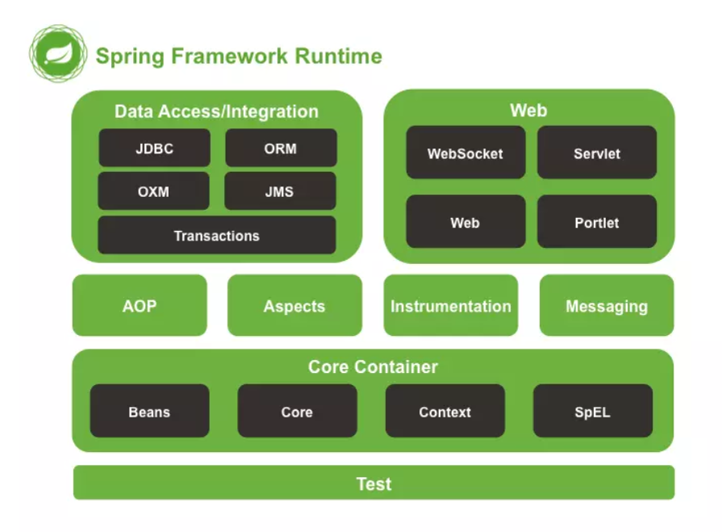  

- ``spring core``：提供了框架的基本组成部分，包括控制反转（``Inversion of Control，IOC``）和依赖注入（``Dependency Injection，DI``）功能。
- ``spring beans``：提供了``BeanFactory``，是工厂模式的一个经典实现，``Spring``将管理对象称为Bean。
- ``spring context``：构建于 core 封装包基础上的 context 封装包，提供了一种框架式的对象访问方法。
- ``spring jdbc``：提供了一个JDBC的抽象层，消除了烦琐的JDBC编码和数据库厂商特有的错误代码解析， 用于简化JDBC。
- ``spring aop``：提供了面向切面的编程实现，让你可以自定义拦截器、切点等。
- ``spring Web``：提供了针对 ``Web`` 开发的集成特性，例如文件上传，利用 servlet listeners 进行 ioc 容器初始化和针对 ``Web`` 的 ``ApplicationContext``。
- ``spring test``：主要为测试提供支持的，支持使用JUnit或TestNG对Spring组件进行单元测试和集成测试。

## ``Spring`` 框架中都用到了哪些设计模式？

- 工厂模式：``BeanFactory``就是简单工厂模式的体现，用来创建对象的实例；
- 单例模式：``Bean``默认为单例模式。
- 代理模式：``Spring``的AOP功能用到了``JDK``的动态代理和CGLIB字节码生成技术；
- 模板方法：用来解决代码重复的问题。比如. ``RestTemplate``, ``JmsTemplate``, ``JpaTemplate``。
- 观察者模式：定义对象键一种一对多的依赖关系，当一个对象的状态发生改变时，所有依赖于它的对象都会得到通知被制动更新，如``Spring``中``listener``的实现–``ApplicationListener``。

## ``Spring``控制反转``(IOC)``

### 什么是Spring IOC 容器？
控制反转即``IoC (Inversion of Control)``，它把传统上由程序代码直接操控的对象的调用权交给容器，通过容器来实现对象组件的装配和管理。所谓的“控制反转”概念就是对组件对象控制权的转移，从程序代码本身转移到了外部容器。

``Spring IOC`` 负责创建对象，管理对象``（通过依赖注入（DI）``，装配对象，配置对象，并且管理这些对象的整个生命周期。

### 控制反转``(IoC)``有什么作用
- 管理对象的创建和依赖关系的维护。对象的创建并不是一件简单的事，在对象关系比较复杂时，如果依赖关系需要程序猿来维护的话，那是相当头疼的

- 解耦，由容器去维护具体的对象

- 托管了类的产生过程，比如我们需要在类的产生过程中做一些处理，最直接的例子就是代理，如果有容器程序可以把这部分处理交给容器，应用程序则无需去关心类是如何完成代理的

### IOC的优点是什么？
- ``IOC`` 或 依赖注入把应用的代码量降到最低。
- 它使应用容易测试，单元测试不再需要单例和``JNDI``查找机制。
- 最小的代价和最小的侵入性使松散耦合得以实现。
- ``IOC``容器支持加载服务时的饿汉式初始化和懒加载。

## ``Spring`` 的 ``IoC``支持哪些功能
``Spring`` 的 ``IoC`` 设计支持以下功能：

- 依赖注入
- 依赖检查
- 自动装配
- 支持集合
- 指定初始化方法和销毁方法
- 支持回调某些方法（但是需要实现 ``Spring`` 接口，略有侵入）

其中，最重要的就是依赖注入，从 ``XML`` 的配置上说，即 ``ref`` 标签。对应 ``Spring`` ``RuntimeBeanReference`` 对象。

对于 ``IoC`` 来说，最重要的就是容器。容器管理着 ``Bean`` 的生命周期，控制着 ``Bean`` 的依赖注入。

### ``BeanFactory`` 和 ``ApplicationContext``有什么区别？

``BeanFactory``和``ApplicationContext``是``Spring``的两大核心接口，都可以当做``Spring``的容器。其中``ApplicationContext``是``BeanFactory``的子接口。

> 依赖关系

``BeanFactory``：是``Spring``里面最底层的接口，包含了各种Bean的定义，读取bean配置文档，管理bean的加载、实例化，控制bean的生命周期，维护bean之间的依赖关系。

``ApplicationContext``接口作为``BeanFactory``的派生，除了提供``BeanFactory``所具有的功能外，还提供了更完整的框架功能：

- 继承``MessageSource``，因此支持国际化。

- 统一的资源文件访问方式。

- 提供在监听器中注册bean的事件。

- 同时加载多个配置文件。

- 载入多个（有继承关系）上下文 ，使得每一个上下文都专注于一个特定的层次，比如应用的web层。

> 加载方式

``BeanFactroy``采用的是延迟加载形式来注入``Bean``的，即只有在使用到某个``Bean``时(调用``getBean()``)，才对该``Bean``进行加载实例化。这样，我们就不能发现一些存在的``Spring``的配置问题。如果``Bean``的某一个属性没有注入，``BeanFacotry``加载后，直至第一次使用调用``getBean``方法才会抛出异常。

``ApplicationContext``，它是在容器启动时，一次性创建了所有的Bean。这样，在容器启动时，我们就可以发现``Spring``中存在的配置错误，这样有利于检查所依赖属性是否注入。 ``ApplicationContext``启动后预载入所有的单实例``Bean``，通过预载入单实例``bean`` ,确保当你需要的时候，你就不用等待，因为它们已经创建好了。

相对于基本的``BeanFactory``，``ApplicationContext`` 唯一的不足是占用内存空间。当应用程序配置``Bean``较多时，程序启动较慢。

> 创建方式

``BeanFactory``通常以编程的方式被创建，``ApplicationContext``还能以声明的方式创建，如使用``ContextLoader``。

> 注册方式

``BeanFactory``和``ApplicationContext``都支持``BeanPostProcessor``、``BeanFactoryPostProcessor``的使用，但两者之间的区别是：``BeanFactory``需要手动注册，而``ApplicationContext``则是自动注册。

## 有哪些不同类型的依赖注入实现方式？

依赖注入是时下最流行的IoC实现方式，依赖注入分为接口注入（``Interface Injection``），``Setter``方法注入``（Setter Injection）``和构造器注入``（Constructor Injection）``三种方式。其中接口注入由于在灵活性和易用性比较差，现在从``Spring4``开始已被废弃。

- **构造器依赖注入**: 构造器依赖注入通过容器触发一个类的构造器来实现的，该类有一系列参数，每个参数代表一个对其他类的依赖。

- **Setter方法注入**：``Setter``方法注入是容器通过调用无参构造器或无参``static``工厂 方法实例化``bean``之后，调用该``bean``的``setter``方法，即实现了基于``setter``的依赖注入。

构造器依赖注入和 ``Setter``方法注入的区别

| 构造函数注入 |	``setter`` 注入 |
----|---
没有部分注入 |	有部分注入
不会覆盖 ``setter`` 属性 |	会覆盖 ``setter`` 属性
任意修改都会创建一个新实例 |	任意修改不会创建一个新实例
适用于设置很多属性 |	适用于设置少量属性

两种依赖方式都可以使用，构造器注入和``Setter``方法注入。最好的解决方案是用构造器参数实现强制依赖，``setter``方法实现可选依赖。

## ``Spring Beans``（19）
## 什么是``Spring beans？``
``Spring beans`` 是那些形成``Spring``应用的主干的``java``对象。它们被``Spring IOC``容器初始化，装配，和管理。这些``beans``通过容器中配置的元数据创建。比如，以XML文件中 的形式定义。

## 一个 ``Spring Bean`` 定义 包含什么？ 

一个``Spring Bean`` 的定义包含容器必知的所有配置元数据，包括如何创建一个``bean``，它的生命周期详情及它的依赖。

## 如何给``Spring`` 容器提供配置元数据？``Spring``有几种配置方式
这里有三种重要的方法给``Spring`` 容器提供配置元数据。
- ``XML``配置文件。
- 基于注解的配置。
- 基于``java``的配置。
## ``Spring``配置文件包含了哪些信息
``Spring``配置文件是个XML 文件，这个文件包含了类信息，描述了如何配置它们，以及如何相互调用。

## ``Spring``基于xml注入bean的几种方式
- ``Set``方法注入；
- 构造器注入：①通过``index``设置参数的位置；②通过``type``设置参数类型；
- 静态工厂注入；
- 实例工厂；

## 你怎样定义类的作用域？
当定义一个 在``Spring``里，我们还能给这个``bean``声明一个作用域。它可以通过``bean`` 定义中的scope属性来定义。如，当``Spring``要在需要的时候每次生产一个新的``bean``实例，``bean``的scope属性被指定为prototype。另一方面，一个``bean``每次使用的时候必须返回同一个实例，这个``bean``的scope 属性 必须设为 singleton。

## 解释``Spring``支持的几种``bean``的作用域
``Spring``框架支持以下五种``bean``的作用域：

- ``singleton`` : ``bean``在每个``Spring ioc`` 容器中只有一个实例。
- ``prototype``：一个``bean``的定义可以有多个实例。
- ``request：``每次``http``请求都会创建一个``bean``，该作用域仅在基于``web``的``Spring ApplicationContext``情形下有效。
- ``session``：在一个``HTTP Session``中，一个``bean``定义对应一个实例。该作用域仅在基于``web``的``Spring ApplicationContext``情形下有效。
- ``global-session``：在一个全局的``HTTP Session``中，一个``bean``定义对应一个实例。该作用域仅在基于``web``的``Spring ApplicationContext``情形下有效。

**注意：** 缺省的``Spring bean ``的作用域是``Singleton``。使用 ``prototype`` 作用域需要慎重的思考，因为频繁创建和销毁 ``bean`` 会带来很大的性能开销。

## 解释``Spring``框架中``bean``的生命周期

在传统的``Java``应用中，``bean``的生命周期很简单。使用``Java``关键字``new``进行``bean``实例化，然后该``bean``就可以使用了。一旦该``bean``不再被使用，则由``Java``自动进行垃圾回收。相比之下，``Spring``容器中的``bean``的生命周期就显得相对复杂多了。正确理解``Spring`` ``bean``的生命周期非常重要，因为你或许要利用``Spring``提供的扩展点来自定义``bean``的创建过程。下图展示了``bean``装载到``Spring``应用上下文中的一个典型的生命周期过程。

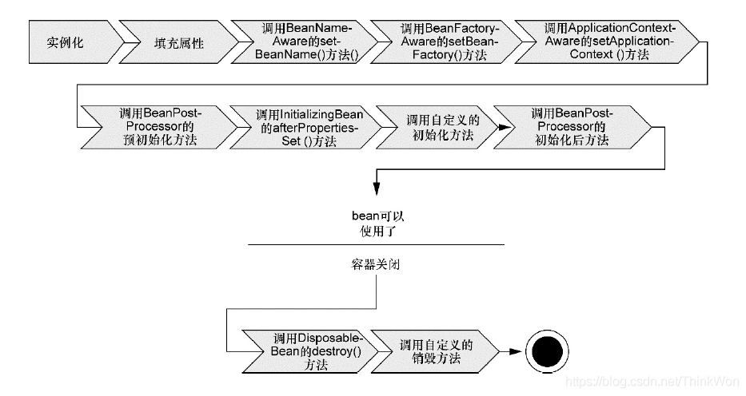  

bean在Spring容器中从创建到销毁经历了若干阶段，每一阶段都可以针对Spring如何管理bean进行个性化定制。

正如你所见，在bean准备就绪之前，bean工厂执行了若干启动步骤。

我们对上图进行详细描述：

Spring对bean进行实例化；

Spring将值和bean的引用注入到bean对应的属性中；

如果bean实现了BeanNameAware接口，Spring将bean的ID传递给setBean-Name()方法；

如果bean实现了BeanFactoryAware接口，Spring将调用setBeanFactory()方法，将BeanFactory容器实例传入；

如果bean实现了ApplicationContextAware接口，Spring将调用setApplicationContext()方法，将bean所在的应用上下文的引用传入进来；

如果bean实现了BeanPostProcessor接口，Spring将调用它们的post-ProcessBeforeInitialization()方法；

如果bean实现了InitializingBean接口，Spring将调用它们的after-PropertiesSet()方法。类似地，如果bean使用initmethod声明了初始化方法，该方法也会被调用；

如果bean实现了BeanPostProcessor接口，Spring将调用它们的post-ProcessAfterInitialization()方法；

此时，bean已经准备就绪，可以被应用程序使用了，它们将一直驻留在应用上下文中，直到该应用上下文被销毁；

如果bean实现了DisposableBean接口，Spring将调用它的destroy()接口方法。同样，如果bean使用destroy-method声明了销毁方法，该方法也会被调用。

现在你已经了解了如何创建和加载一个Spring容器。但是一个空的容器并没有太大的价值，在你把东西放进去之前，它里面什么都没有。为了从Spring的DI(依赖注入)中受益，我们必须将应用对象装配进Spring容器中。

## 什么是``bean``装配？

装配，或``bean`` 装配是指在``Spring`` 容器中把``bean``组装到一起，前提是容器需要知道``bean``的依赖关系，如何通过依赖注入来把它们装配到一起。

## 什么是``bean``的自动装配？

在Spring框架中，在配置文件中设定bean的依赖关系是一个很好的机制，Spring 容器能够自动装配相互合作的bean，这意味着容器不需要和配置，能通过Bean工厂自动处理bean之间的协作。这意味着 Spring可以通过向Bean Factory中注入的方式自动搞定bean之间的依赖关系。自动装配可以设置在每个bean上，也可以设定在特定的bean上。

## 解释不同方式的自动装配，``spring`` 自动装配 ``bean`` 有哪些方式？

在spring中，对象无需自己查找或创建与其关联的其他对象，由容器负责把需要相互协作的对象引用赋予各个对象，使用autowire来配置自动装载模式。

在Spring框架xml配置中共有5种自动装配：

- no：默认的方式是不进行自动装配的，通过手工设置ref属性来进行装配bean。

- byName：通过bean的名称进行自动装配，如果一个bean的 property 与另一bean 的name 相同，就进行自动装配。

- byType：通过参数的数据类型进行自动装配。

- constructor：利用构造函数进行装配，并且构造函数的参数通过byType进行装配。

- autodetect：自动探测，如果有构造方法，通过 construct的方式自动装配，否则使用 byType的方式自动装配。

## 使用``@Autowired``注解自动装配的过程是怎样的？

使用``@Autowired``注解来自动装配指定的``bean``。在使用``@Autowired``注解之前需要在``Spring``配置文件进行配置，``<context:annotation-config />``。

在启动``spring IoC``时，容器自动装载了一个``AutowiredAnnotationBeanPostProcessor``后置处理器，当容器扫描到``@Autowied``、``@Resource``或``@Inject``时，就会在``IoC``容器自动查找需要的``bean``，并装配给该对象的属性。在使用``@Autowired``时，首先在容器中查询对应类型的``bean``：

如果查询结果刚好为一个，就将该``bean``装配给``@Autowired``指定的数据；

如果查询的结果不止一个，那么``@Autowired``会根据名称来查找；

如果上述查找的结果为空，那么会抛出异常。解决方法时，使用``required=false。``


## 自动装配有哪些局限性？
自动装配的局限性是：

- 重写：你仍需用 和 配置来定义依赖，意味着总要重写自动装配。

- 基本数据类型：你不能自动装配简单的属性，如基本数据类型，``String``字符串，和类。

- 模糊特性：自动装配不如显式装配精确，如果有可能，建议使用显式装配。

## 你可以在``Spring``中注入一个``null`` 和一个空字符串吗？
可以。

## Spring支持的事务管理类型， spring 事务实现方式有哪些？
``Spring``支持两种类型的事务管理：

- 编程式事务管理：这意味你通过编程的方式管理事务，给你带来极大的灵活性，但是难维护。

- 声明式事务管理：这意味着你可以将业务代码和事务管理分离，你只需用注解和XML配置来管理事务。


# 说一下``Spring``的事务传播行为(问过)

``spring``事务的传播行为说的是，当多个事务同时存在的时候，``spring``如何处理这些事务的行为。

```java
① PROPAGATION_REQUIRED：如果当前没有事务，就创建一个新事务，如果当前存在事务，就加入该事务，该设置是最常用的设置。

② PROPAGATION_SUPPORTS：支持当前事务，如果当前存在事务，就加入该事务，如果当前不存在事务，就以非事务执行。

③ PROPAGATION_MANDATORY：支持当前事务，如果当前存在事务，就加入该事务，如果当前不存在事务，就抛出异常。

④ PROPAGATION_REQUIRES_NEW：创建新事务，无论当前存不存在事务，都创建新事务。

⑤ PROPAGATION_NOT_SUPPORTED：以非事务方式执行操作，如果当前存在事务，就把当前事务挂起。

⑥ PROPAGATION_NEVER：以非事务方式执行，如果当前存在事务，则抛出异常。

⑦ PROPAGATION_NESTED：如果当前存在事务，则在嵌套事务内执行。如果当前没有事务，则按REQUIRED属性执行。

```
# 说一下 ``spring`` 的事务隔离？(问过)

spring 有五大隔离级别，默认值为 ``ISOLATION_DEFAULT``（使用数据库的设置），其他四个隔离级别和数据库的隔离级别一致：

1. ``ISOLATION_DEFAULT``：用底层数据库的设置隔离级别，数据库设置的是什么我就用什么；

2. ``ISOLATION_READ_UNCOMMITTED``：未提交读，最低隔离级别、事务未提交前，就可被其他事务读取（会出现幻读、脏读、不可重复读）；

3. ``ISOLATION_READ_COMMITTED``：提交读，一个事务提交后才能被其他事务读取到（会造成幻读、不可重复读），``SQL server`` 的默认级别；

4. ``ISOLATION_REPEATABLE_READ``：可重复读，保证多次读取同一个数据时，其值都和事务开始时候的内容是一致，禁止读取到别的事务未提交的数据（会造成幻读），MySQL 的默认级别；

5. ``ISOLATION_SERIALIZABLE``：序列化，代价最高最可靠的隔离级别，该隔离级别能防止脏读、不可重复读、幻读。

脏读 ：表示一个事务能够读取另一个事务中还未提交的数据。比如，某个事务尝试插入记录 A，此时该事务还未提交，然后另一个事务尝试读取到了记录 A。

不可重复读 ：是指在一个事务内，多次读同一数据。

幻读 ：指同一个事务内多次查询返回的结果集不一样。比如同一个事务 A 第一次查询时候有 n 条记录，但是第二次同等条件下查询却有 n+1 条记录，这就好像产生了幻觉。发生幻读的原因也是另外一个事务新增或者删除或者修改了第一个事务结果集里面的数据，同一个记录的数据内容被修改了，所有数据行的记录就变多或者变少了。

## Spring框架的事务管理有哪些优点？
- 为不同的事务API 如 JTA，JDBC，Hibernate，JPA 和JDO，提供一个不变的编程模式。
- 为编程式事务管理提供了一套简单的API而不是一些复杂的事务API
- 支持声明式事务管理。
- 和Spring各种数据访问抽象层很好得集成。

# SpringMVC 部分

## 什么是``Spring MVC``？简单介绍下你对``Spring MVC``的理解？

Spring MVC是一个基于Java的实现了MVC设计模式的请求驱动类型的轻量级Web框架，通过把模型-视图-控制器分离，将web层进行职责解耦，把复杂的web应用分成逻辑清晰的几部分，简化开发，减少出错，方便组内开发人员之间的配合。

## Spring MVC的优点
（1）可以支持各种视图技术,而不仅仅局限于``JSP``；

（2）与``Spring``框架集成（如``IoC``容器、``AOP``等）；

（3）清晰的角色分配：前端控制器(``dispatcherServlet``) , ``请求到处理器映射（handlerMapping``), ``处理器适配器（HandlerAdapter``), ``视图解析器（ViewResolver）。``

（4） 支持各种请求资源的映射策略。

## Spring MVC的主要组件？
（1）前端控制器 ``DispatcherServlet``（不需要程序员开发）

作用：接收请求、响应结果，相当于转发器，有了``DispatcherServlet`` 就减少了其它组件之间的耦合度。

（2）处理器映射器``HandlerMapping`（不需要程序员开发）

作用：根据请求的``URL``来查找``Handler``

（3）处理器适配器``HandlerAdapter``

注意：在编写``Handler``的时候要按照``HandlerAdapter``要求的规则去编写，这样适配器``HandlerAdapter``才可以正确的去执行``Handler``。

（4）处理器``Handler``（需要程序员开发）

（5）视图解析器 ``ViewResolver``（不需要程序员开发）

作用：进行视图的解析，根据视图逻辑名解析成真正的视图（``view``）

（6）视图``View``（需要程序员开发jsp）

``View``是一个接口， 它的实现类支持不同的视图类型（``jsp，freemarker，pdf``等等）

## 什么是DispatcherServlet
Spring的MVC框架是围绕DispatcherServlet来设计的，它用来处理所有的HTTP请求和响应。

## 什么是Spring MVC框架的控制器？
控制器提供一个访问应用程序的行为，此行为通常通过服务接口实现。控制器解析用户输入并将其转换为一个由视图呈现给用户的模型。Spring用一个非常抽象的方式实现了一个控制层，允许用户创建多种用途的控制器。

## Spring MVC的控制器是不是单例模式,如果是,有什么问题,怎么解决？
答：是单例模式,所以在多线程访问的时候有线程安全问题,不要用同步,会影响性能的,解决方案是在控制器里面不能写字段。

## 请描述Spring MVC的工作流程？描述一下 DispatcherServlet 的工作流程？
（1）用户发送请求至前端控制器DispatcherServlet；
（2） DispatcherServlet收到请求后，调用HandlerMapping处理器映射器，请求获取Handle；
（3）处理器映射器根据请求url找到具体的处理器，生成处理器对象及处理器拦截器(如果有则生成)一并返回给DispatcherServlet；
（4）DispatcherServlet 调用 HandlerAdapter处理器适配器；
（5）HandlerAdapter 经过适配调用 具体处理器(Handler，也叫后端控制器)；
（6）Handler执行完成返回ModelAndView；
（7）HandlerAdapter将Handler执行结果ModelAndView返回给DispatcherServlet；
（8）DispatcherServlet将ModelAndView传给ViewResolver视图解析器进行解析；
（9）ViewResolver解析后返回具体View；
（10）DispatcherServlet对View进行渲染视图（即将模型数据填充至视图中）
（11）DispatcherServlet响应用户。

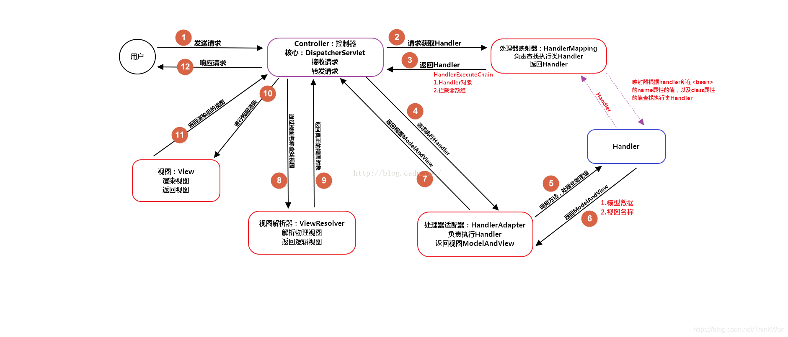  


## Spring MVC常用的注解有哪些？
- ``@RequestMapping：``用于处理请求 ``url`` 映射的注解，可用于类或方法上。用于类上，则表示类中的所有响应请求的方法都是以该地址作为父路径。

- ``@RequestBody：``注解实现接收``http``请求的``json``数据，将``json``转换为``java``对象。

- ``@ResponseBody：``注解实现将``conreoller``方法返回对象转化为``json``对象响应给客户。

### ``SpingMvc``中的控制器的注解一般用哪个,有没有别的注解可以替代？
答：一般用@Controller注解,也可以使用@RestController,@RestController注解相当于@ResponseBody ＋ @Controller,表示是表现层,除此之外，一般不用别的注解代替。

#### ``@Controller``注解的作用
在Spring MVC 中，控制器Controller 负责处理由DispatcherServlet 分发的请求，它把用户请求的数据经过业务处理层处理之后封装成一个Model ，然后再把该Model 返回给对应的View 进行展示。在Spring MVC 中提供了一个非常简便的定义Controller 的方法，你无需继承特定的类或实现特定的接口，只需使用@Controller 标记一个类是Controller ，然后使用@RequestMapping 和@RequestParam 等一些注解用以定义URL 请求和Controller 方法之间的映射，这样的Controller 就能被外界访问到。此外Controller 不会直接依赖于HttpServletRequest 和HttpServletResponse 等HttpServlet 对象，它们可以通过Controller 的方法参数灵活的获取到。

@Controller 用于标记在一个类上，使用它标记的类就是一个Spring MVC Controller 对象。分发处理器将会扫描使用了该注解的类的方法，并检测该方法是否使用了@RequestMapping 注解。@Controller 只是定义了一个控制器类，而使用@RequestMapping 注解的方法才是真正处理请求的处理器。单单使用@Controller 标记在一个类上还不能真正意义上的说它就是Spring MVC 的一个控制器类，因为这个时候Spring 还不认识它。那么要如何做Spring 才能认识它呢？这个时候就需要我们把这个控制器类交给Spring 来管理。有两种方式：

- 在Spring MVC 的配置文件中定义MyController 的bean 对象。
- 在Spring MVC 的配置文件中告诉Spring 该到哪里去找标记为@Controller 的Controller 控制器。
#### ``@RequestMapping``注解的作用
RequestMapping是一个用来处理请求地址映射的注解，可用于类或方法上。用于类上，表示类中的所有响应请求的方法都是以该地址作为父路径。

RequestMapping注解有六个属性，下面我们把她分成三类进行说明（下面有相应示例）。

``value， method``

- value： 指定请求的实际地址，指定的地址可以是URI Template 模式（后面将会说明）；

- method： 指定请求的method类型， GET、POST、PUT、DELETE等；

``consumes，produces``

- consumes： 指定处理请求的提交内容类型（Content-Type），例如application/json, text/html;

- produces: 指定返回的内容类型，仅当request请求头中的(Accept)类型中包含该指定类型才返回；

``params，headers``

- params： 指定request中必须包含某些参数值是，才让该方法处理。

- headers： 指定request中必须包含某些指定的header值，才能让该方法处理请求。

#### ``@ResponseBody``注解的作用
作用： 该注解用于将Controller的方法返回的对象，通过适当的HttpMessageConverter转换为指定格式后，写入到Response对象的body数据区。

使用时机：返回的数据不是html标签的页面，而是其他某种格式的数据时（如json、xml等）使用；

#### ``@PathVariable``和``@RequestParam``的区别
请求路径上有个``id``的变量值，可以通过``@PathVariable``来获取 ``@RequestMapping(value = “/page/{id}”, method = RequestMethod.GET)``

``@RequestParam``用来获得静态的URL请求入参 ``spring``注解时``action``里用到。


## 关于一些算法题

问了我一些比较基础的题目

> 数组和链表的应用场景,也就是问数组和链表的区别和各自的优势?

- 数组是将元素在内存中连续存储的；

  - 优点：因为数据是连续存储的，内存地址连续，所以在查找数据的时候效 率比较高；

  - 缺点：在存储之前，我们需要申请一块连续的内存空间，并且在编译的时候就必须确定好它的空间的大小。在运行的时候空间的大小是无法随着你的需要进行增加和减少而改变的，当数据两比较大的时候，有可能会出现越界的情况，数据比较小的时候，又有可能会浪费掉内存空间。在改变数据个数时，增加、插入、删除数据效率比较低链表是动态申请内存空间，不需要像数组需要提前申请好内存的大小，

- 链表只需在用的时候申请就可以，根据需要来动态申请或者删除内存空间，对于数据增加和删除以及插入比数组灵活。还有就是链表中数据在内存中可以在任意的位置，通过应用来关联数据（就是通过存在元素的指针来联系）。


- 数组应用场景：数据比较少；经常做的运算是按序号访问数据元素；数组更容易实现，任何高级语言都支持；构建的线性表较稳定。

- 链表应用场景：对线性表的长度或者规模难以估计；频繁做插入删除操作；构建动态性比较强的线性表。

> 现在要实现一个栈结构,要频繁的进行``push``和``pop``操作,如果用数组或者链表这两个基本数据结构,哪个比较合适?

个人感觉这个题目就是看对这两个基本数据结构的理解了,一方面要求频繁插入删除,优先级的肯定是链表好一点,因为制定了频繁插入删除...但是吧,又考虑到,数组的...反正吧,我不是很拿捏的定,但是你可以根据数组以及链表各自的优势然后进行阐述就可以了吧,估计就是看你一个思想.

[文章链接](https://iamjohnnyzhuang.github.io/java/2016/07/12/Java%E5%A0%86%E5%92%8C%E6%A0%88%E7%9C%8B%E8%BF%99%E7%AF%87%E5%B0%B1%E5%A4%9F.html)

> 常见的排序算法?

这边你就扯一下就好了,什么冒泡啊,插入啊,选择啊,快排,归并啥的....

[文章链接](https://itimetraveler.github.io/2017/07/18/%E5%85%AB%E5%A4%A7%E6%8E%92%E5%BA%8F%E7%AE%97%E6%B3%95%E6%80%BB%E7%BB%93%E4%B8%8Ejava%E5%AE%9E%E7%8E%B0/)

但是一定要搞清楚你所了解的排序算法的实现已经各自的区别,然后扯一扯就可以了,我这边是详细给讲了冒泡排序,然后他的优劣势.


> 一般这个算法问的也挺多的,计算根号8,并保留到小数点后面四位,请写出你的实现算法?

核心思想是采用二分法:

设置开始的区间为[0.8],

迭代方法为:

```math

 (8+0)/2 = 4
         => 4*4 = 16 > 8 , 所以4 为值的右边界,
 (4+0)/2 = 2
         => 2*2 = 4  < 8 , 所以 2 为值的左边界,
 (4+2)/2 = 3 
         => 3*3 = 9  > 8 , 所以 3 为值的右边界,
 (3+2)/2 = 2.5
         => 2.5*2.5 = 6.25 < 8 ,所以 2.5 为 值的左边界,
 (3+2.5)/2 = 2.75
         => 7.5625 < 8 , 所以 2.75 为 值的左边界
 (2.75+3)/2 = 2.875 
         => 8.19375 > 8 , 所以 2.875 为右边界 
         ...


         以此类推即可


时间复杂度为 log N ,因为是二分法 !

```

> 现有一个``hashmap``,里面存了类似于 (a,2),(b,10),(c,8)....  等等 , 如何根据``value``值大小从小到大排列输出

HashMap的value值没有排序功能，若要进行较轻松的排序，可改写Comparator接口方法compare进行排序，代码如下：

```java
Map<String, Integer> map = new HashMap<String, Integer>();
map.put("d", 2);
map.put("c", 1);
map.put("b", 1);
map.put("a", 3);
List<Map.Entry<String, Integer>> infoIds = new ArrayList<Map.Entry<String, Integer>>(map.entrySet());
//排序前
for (int i = 0; i < infoIds.size(); i++) {
    String id = infoIds.get(i).toString();
    System.out.println(id);
}
//根据value排序
Collections.sort(infoIds, new Comparator<Map.Entry<String, Integer>>() {   
    public int compare(Map.Entry<String, Integer> o1, Map.Entry<String, Integer> o2) {      
        return (o2.getValue() - o1.getValue()); 
        //return (o1.getKey()).toString().compareTo(o2.getKey());
    }
}); 
//排序后
for (int i = 0; i < infoIds.size(); i++) {
    String id = infoIds.get(i).toString();
    System.out.println(id);
}
```
打印结果:

```java
//根据key排序
//a 3
//b 1
//c 1
//d 2
//根据value排序
//a 3
//d 2
//b 1
//c 1
```

<HR style="border:3 double #987cb9" width="100%" color=#987cb9 SIZE=3>

**写在前面:**

这是公司内部的题库,仅供参考

# ``java``面试问题-低阶版

## 1.  ``java ConcurrentHashMap get`` 方法会加锁吗
```
答： 不会加锁；1 分 

通过volatile刷新get后的值；2 分

假设有 ConcurrentHashMap<String,Long> A

线程1 ：A.put("K",1);

线程1 ：Long num1 = A.get("K")

long n1 = num1;

线程2 ：A.put("K",2);

线程1 ：打印 num1  = ？ n1 = ?

答：num1 = 2； 1分 n1 = 1 ；1分
```

##  2. jvm内存区域分为哪几个？
```
答：heap区和非heap区 1 分

heap区又分为 Eden Space（伊甸园）、Survivor Space(幸存者区)、Old Gen（老年代）。 3分

Code Cache(代码缓存区)，Perm Gen（永久代），Jvm Stack(java虚拟机栈)，Local Method Statck(本地方法栈)； 1分
```

## 3. 现有``Comparator``：
```java
public static int myCompare(int n) {
      return this.value < n ? -1 : (this.value == n ? 0 : 1);
}

代码：

List<Integer> lst = new ArrayList<>();

lst.add(3);

lst.add(2);

lst.add(1);

lst.sort(MyComparator::myCompare);

System.out.println(lst);
```
输出结果为？

5分  答案：1，2，3 
(该方法实现，实际为Integer.compareTo方法)

## 4. 线程的三种基本状态？``Java Thread.sleep 1000，1005``毫秒后可能的线程状态？``Thread.sleep 0`` 有什么作用？

基本状态：就绪、执行、阻塞  2分
 
可能的状态：就绪，执行  2分

``Thread.Sleep(0)``的作用 ：“触发操作系统立刻重新进行一次``CPU``竞争，重新计算优先级”。 1分

在未来的``1000``毫秒内，线程不想再参与到``CPU``竞争。那么``1000``毫秒过去之后，这时候也许另外一个线程正在使用``CPU``，那么这时候操作系统是不会重新分配``CPU``的，直到那个线程挂起或结束；

况且，即使这个时候恰巧轮到操作系统进行``CPU ``分配，那么当前线程也不一定就是总优先级最高的那个，``CPU``还是可能被其他线程抢占去。


# ``java`` 面试问题

## 1) ``ArrayList``和``LinkedList``有什么区别，各适合什么场景? 支持并发的``List``是什么类

答题标准：

``ArrayList`` 底层是数组，适合随机读写数据，只适合尾部插入和删除 得2分
``LinkedList``底层是链表，不适合随机读写数据，插入删除数据成本低 得2分
``CopyOnWriteList`` 得1分

## 2) 用过哪些``Map``类，都有什么区别?


答题标准：
```
HashMap  得2分
ConcurrentHashMap(支持并发) +1
LinkedHashMap(保持插入顺序) + 1
TreeMap(按key排序) +1
```

## 3) ``juc`` 下有哪些并发类?


答题标准：
```
Lock,CountDownLatch等 1分
原子类 1分
并发集合类(map,list,set) 1分
阻塞式队列 1分
线程池 1分
```
## 4) ``ThreadLocal`` 可以用来做什么, 和``@Transactional``注解有什么关系


答题标准：
```
1）线程安全的变量 1分
2）隐式传递数据 1分
事务开始获取连接放在ThreadLocal里并开启事务，结束时提交或回滚并清除ThreadLocal里存的连接 3分
```
## 5) ``java``虚拟机：解释虚拟机参数的含义``-Xms -Xmx -Xss, jdk 8``下 老年代 常用的垃圾回收器是什么? 查看线程的栈信息有哪些方法


答题标准：
```
答对ms mx得1分, 答对ss得1分
cms/g1 答对各得1分
jstack  答对 得1分
```

## 6) ``spring @Autowired``是做什么用的? ``@PostConstruct``是做什么用的?  ``@Configuration``是做什么用的？``@Bean``注解是做什么用的?  ``BeanFactoryAware/ApplicationContextAware`` 接口是做什么用的?


答题标准：
```
@Autowired 注入对象 得1分
@PostConstruct 指定init方法 得1分
@Configuration java config的配置类注解 得1分
@Bean java config通过代码创建bean 得1分
BeanFactoryAware/ApplicationContextAware 获取容器本身的引用 得1分
```

## 7) ``http``请求报文格式 ；有哪些常见``header； host``头存的是什么，服务端用``host``做什么；有哪些常见的``http``状态码?


答题标准：
```
method + url + version +  headers + body 正确回答得1分
content-type content-length 回答中提到这2个得1分
host 存请求域名，服务端用来区分站点 正确回答得1分
状态码：200 201 301 302 404 500 共2分, 仅回答出200不得分
```

## 8) 数据库事务隔离级别有哪些，``mysql``默认隔离级别是什么? ``spring`` 的事务传播机制是什么，列举几种


答题标准：
```
读未提交 读已提交 可重复读 串行化 得2分
mysql默认可重复读 得 1分

传播机制： 答对任意2个得2分
```
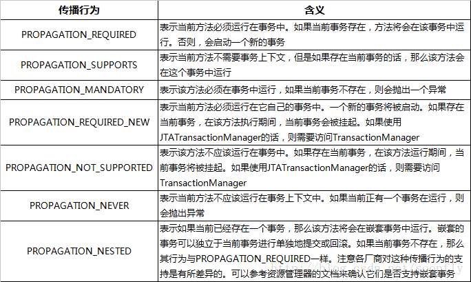  


## 9) ``linux`` 命令行: 如何查本机某个端口是否已监听 探测对方端口是否可连接  访问一个``url``   查找一个日志文件（不变化的）的最后``10``行``ERROR ``


答题标准：
```
netstat 或 telnet localhost1分
telnet 1分
curl 2分

grep ERROR xxx |tail 1分
```

## 10) ``redis`` 支持哪些数据结构? ``redis cluster key``是如何分布到各个节点的？可以只取``key``的部分来计算``slot``吗？


答题标准：
```
string,hash,list,set,zset 得2分
分成 16384  slot，  CRC16(key) mod 16384 共2分
key中的{xxx}有特殊含义 得1分
```
## 11) 消息队列主要用在什么场景？知道哪些消息队列? 消费时若发生重复消费如何保证幂等？


答题标准：
```
生产端和消费端解耦 得2分
rabbitmq activemq rocketmq kafka 任意2个得2分
根据某个唯一标识检查数据是否已处理过，如已处理过则忽略 得1分
```

12) ``java happen-before`` 是描述什么问题？  有哪些规则，请列出3条


答题标准：

    描述的是  线程可见性 问题 得2分

```
8个基本规则，每答对1个得1分，任意答对3个即可

单线程happen-before原则：在同一个线程中，书写在前面的操作happen-before后面的操作。
锁的happen-before原则：同一个锁的unlock操作happen-before此锁的lock操作。
volatile的happen-before原则：对一个volatile变量的写操作happen-before对此变量的任意操作(当然也包括写操作了)。
happen-before的传递性原则：如果A操作 happen-before B操作，B操作happen-before C操作，那么A操作happen-before C操作。
线程启动的happen-before原则：同一个线程的start方法happen-before此线程的其它方法。
线程中断的happen-before原则：对线程interrupt方法的调用happen-before被中断线程的检测到中断发送的代码。
线程终结的happen-before原则：线程中的所有操作都happen-before线程的终止检测。
对象创建的happen-before原则：一个对象的初始化完成先于他的finalize方法调用。
```

===========  以下为可选问题 ===========================================================


## 13) ``spring boot`` 下如何做优雅关闭；  优雅关闭的关闭顺序是怎样的？ ``linux`` 下 ``kill`` 会导致异常关闭吗？


答题标准：
```
监听spring 容器关闭事件， 使用@PreDestroy注解 申明清理方法  2分

关闭顺序： 关闭对外listen端口，继续完成内部处理，关闭内部线程池，关闭资源等等 2分

kill 不会, spring boot监听了kill 信号，是正常关闭；  kill -9 才会异常关闭  1分

```

## 14) ``java nio`` 底层是基于什么原理？``linux`` 下的多路复用机制是什么？``java`` 最常用的``nio``框架是什么？``netty`` 4的线程模型是怎样的？


答题标准：
```
多路复用， 得1分

epoll 得1分

netty 得1分

boss 线程池监听  worker线程池处理；  socket 和某个固定的worker线程绑定，handler在单线程中执行，无需考虑并发问题   得2分
```
       

15)  某个查询接口慢，可以从哪些可能角度分析问题?


答题标准：
```
先定位到进程： 是client  是 nginx 是 网关 是 服务 ?   得2分

服务内： 业务线程数；业务同步还是异步执行, 有无队列等待； 是否数据层慢？ 数据库连接数；  有没有慢sql ； full gc；   共3分，酌情给分

```
## ``mysql in`` 最多支持多少条？

答：
```
受max_allowed_packet 这个参数的限制

mysql --help | grep max-allowed-packet 

另：

mysql在in大量数据时会出现不走索引，大量数据的概念为 in后面的数据在数据表中超过30%

in 查询的列是char类型，必须加""号才可走索引，否则导致全表扫描，会随着表的增大而变得更慢
```


