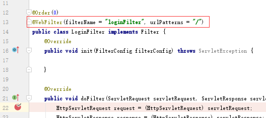
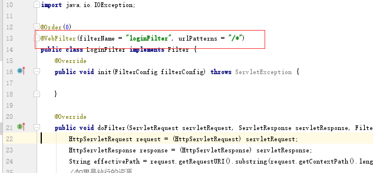

# spring中``/``和``/*``和``/**``的区别，简介明了搞清楚怎么用

## 区别是什么？
请一句话搞明白下面的文字意思，理解可就可以走人。

## ``/`` 和 ``/*``区别
```
/ 拦截所有请求 包括静态资源和动态请求 但是不拦截jsp
/* 拦截所有请求 包括静态资源和动态请求 也拦截jsp
区别就在于/ 不拦截jsp /*拦截jsp
```
## ``/*`` 和 ``/**`` 区别
```
/** 的意思是所有文件夹及里面的子文件夹
/* 是所有文件夹，不含子文件夹
```
## 注意点案例
理解下面的案例有助于理解如何使用

场景：当我在客户端调用``URL``：``/user/list``然后返回``user.jsp``视图，

- 当配置的是``/``：``DispathcherServlet``拿到这个请求然后返回对应的``controller``，然后依据``Dispather Type``为``Forward``类型转发到``user.jsp``视图，即就是请求``user.jsp``视图(``/user/user.jsp``)，此时``Dispather``没有拦截``/user/user.jsp``,因为此时你配置的是默认的``/``，就顺利的交给``ModleAndView``去处理显示了。
- 当配置的是``/*``：``DispathcherServlet``拿到这个请求然后返回对应的``controller``，然后通过``Dispather Type``通过``Forward``转发到``user.jsp``视图，即就是请求``user.jsp``视图(``/user/user.jsp``)，此时``Dispather``已经拦截``/user/user.jsp``，``Dispatcher``会把他当作``Controller``去匹配，没有匹配到就会报``404``错误。


在springboot中建了一个过滤器，测试





当请求为``/user/login``的时候可以被拦截，当为``/page/login.html``页面的时候不拦截





 当请求为``/user/login``的时候可以被拦截，当为``/page/login.html``页面的时候也会被拦截


- ``/``不会拦截页面，只会拦截路径。

- ``/*`` 会路径和页面


**结论：在配置视图的时候尽量用``/``这种方式。**


