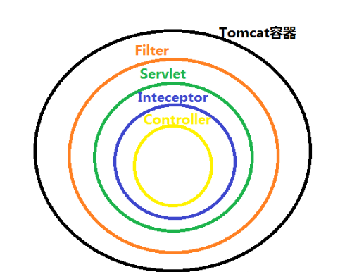
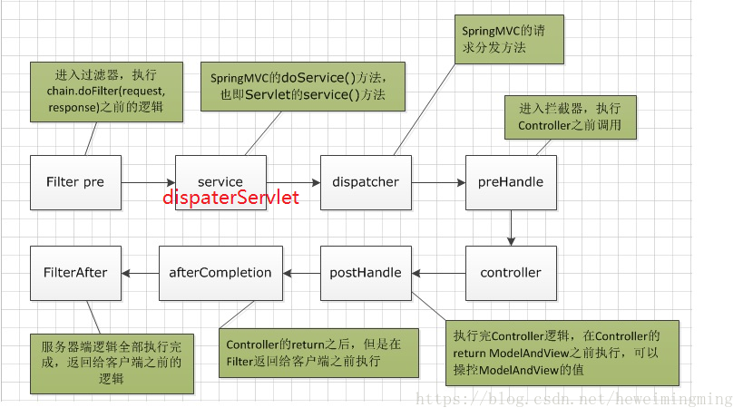

# 过滤器和拦截器的区别




1. 过滤器和拦截器触发时机不一样，过滤器是在请求进入容器后，但请求进入``servlet``之前进行预处理的。请求结束返回也是，是在``servlet``处理完后，返回给前端之前。

2. 拦截器可以获取``IOC``容器中的各个``bean``，而过滤器就不行，因为拦截器是``spring``提供并管理的，``spring``的功能可以被拦截器使用，在拦截器里注入一个``service``，可以调用业务逻辑。而过滤器是``JavaEE``标准，只需依赖``servlet api`` ，不需要依赖``spring``。  


3. 过滤器的实现基于``回调函数``。而``拦截器（代理模式）``的实现基于反射

4. ``Filter``是依赖于``Servlet``容器，属于``Servlet``规范的一部分，而拦截器则是独立存在的，可以在任何情况下使用。

5. ``Filter``的执行由``Servlet``容器回调完成，而拦截器通常通过动态代理（反射）的方式来执行。

6. ``Filter``的生命周期由``Servlet``容器管理，而拦截器则可以通过``IoC``容器来管理，因此可以通过注入等方式来获取其他``Bean``的实例，因此使用会更方便。

## ``SpringBoot``使用过滤器

两种方式： 
1. 使用``spring boot``提供的``FilterRegistrationBean``注册``Filter ``
2. 使用原生``servlet``注解定义``Filter ``
两种方式的本质都是一样的，都是去``FilterRegistrationBean``注册自定义``Filter``

> 方式一: （使用``spring boot``提供的``FilterRegistrationBean``注册``Filter`` ）

①. 先定义``Filter``：

```java
package com.cy.springboot01.filter;

import javax.servlet.*;
import java.io.IOException;

/**
 * @author cy
 * @create 2021-03-12-9:04 上午
 * @Description
 */
public class MyFilter implements Filter {

    @Override
    public void init(FilterConfig filterConfig) throws ServletException {

    }

    @Override
    public void doFilter(ServletRequest servletRequest, ServletResponse servletResponse, FilterChain filterChain) throws IOException, ServletException {
        // do something 处理request 或response
        System.out.println("filter1");
        // 调用filter链中的下一个filter
        filterChain.doFilter(servletRequest,servletResponse);
    }

    @Override
    public void destroy() {

    }
}
```
②、注册自定义``Filter``
```java
@Configuration
public class FilterConfig {

    @Bean
    public FilterRegistrationBean registrationBean() {
        FilterRegistrationBean filterRegistrationBean = new FilterRegistrationBean(new MyFilter());
        filterRegistrationBean.addUrlPatterns("/*");
        return filterRegistrationBean;
    }
}
```

**方式一的``①②步骤``可以用下面这段代码代替：**
```java
@Configuration
public class FilterConfig {
 
    @Bean
    public FilterRegistrationBean registFilter() {
        FilterRegistrationBean registration = new FilterRegistrationBean();
        registration.setFilter(new LogCostFilter());
        registration.addUrlPatterns("/*");
        registration.setName("LogCostFilter");
        registration.setOrder(1);
        return registration;
    }
 
}
```

```java
public class LogCostFilter implements Filter {
    @Override
    public void init(FilterConfig filterConfig) throws ServletException {
 
    }
 
    @Override
    public void doFilter(ServletRequest servletRequest, ServletResponse servletResponse, FilterChain filterChain) throws IOException, ServletException {
        long start = System.currentTimeMillis();
        filterChain.doFilter(servletRequest,servletResponse);
        System.out.println("Execute cost="+(System.currentTimeMillis()-start));
    }
 
    @Override
    public void destroy() {
 
    }
}
```
> 方式二：（使用原生``servlet``注解定义``Filter`` ）
```java
// 注入spring容器
@Component
// 定义filterName 和过滤的url
@WebFilter(filterName = "my2Filter" ,urlPatterns = "/*")
public class My2Filter implements Filter {
    @Override
    public void init(FilterConfig filterConfig) throws ServletException {

    }
    @Override
    public void doFilter(ServletRequest servletRequest, ServletResponse servletResponse, FilterChain filterChain) throws IOException, ServletException {
        System.out.println("filter2");
    }
    @Override
    public void destroy() {

    }
}
```
这里直接用``@WebFilter``就可以进行配置，同样，可以设置``url``匹配模式，过滤器名称等。这里需要注意一点的是``@WebFilter``这个注解是``Servlet3.0``的规范，并不是``Spring boot``提供的。**除了这个注解以外，我们还需在启动类中加另外一个注解：``@ServletComponetScan``，指定扫描的包。**

## ``SpringBoot``配置拦截器

首先我们实现拦截器类：
```java
public class LogCostInterceptor implements HandlerInterceptor {
    long start = System.currentTimeMillis();
    @Override
    public boolean preHandle(HttpServletRequest httpServletRequest, HttpServletResponse httpServletResponse, Object o) throws Exception {
        start = System.currentTimeMillis();
        return true;
    }
 
    @Override
    public void postHandle(HttpServletRequest httpServletRequest, HttpServletResponse httpServletResponse, Object o, ModelAndView modelAndView) throws Exception {
        System.out.println("Interceptor cost="+(System.currentTimeMillis()-start));
    }
 
    @Override
    public void afterCompletion(HttpServletRequest httpServletRequest, HttpServletResponse httpServletResponse, Object o, Exception e) throws Exception {
    }
}
```
　　**我们还需要实现``HandlerInterceptor``这个接口**，这个接口包括三个方法，``preHandle``是请求执行前执行的，``postHandler``是请求结束执行的，但只有``preHandle``方法返回``true``的时候才会执行，``afterCompletion``是视图渲染完成后才执行，同样需要``preHandle``返回``true``，                 

 该方法通常用于清理资源等工作。除了实现上面的接口外，我们还需对其进行配置：

```java
@Configuration
public class InterceptorConfig implements WebMvcConfigurer {
 
    @Override
    public void addInterceptors(InterceptorRegistry registry) {
        registry.addInterceptor(new LogCostInterceptor()).addPathPatterns("/**");
        super.addInterceptors(registry);
    }
}
```
　　**这里我们实现了``WebMvcConfigurer``**，这里我们重写了``addInterceptors``这个方法，进行拦截器的配置，主要配置项就两个，一个是指定拦截器，第二个是指定拦截的``URL``。


