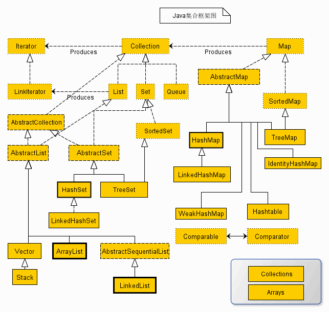

# 汉得面经

## ``SpringSecurity``做登陆拦截，底层是怎样的？

## ``如何避免短时间内重复调用接口的问题？(POSTMAN 不断去重复调用该接口)``

## 抽象类和接口的区别以及各自的应用场景（什么情况下用），可以看看设计模式（模版模式）。

## 接口中可以定义变量吗？

## 你认为产生线程不安全的原因是什么？如何解决线程不安全问题的？

## ``synchronized``如何使用，可以用来同步什么？

## 可以讲讲单例模式吗？如何实现单例模式？

## ``Java``的特征，封装继承多态，什么是多态？

## ``Java8``中的流，如何使用？

## ``SpringCloud``五大组件？

## 如何尝试搭建一个分布式框架？

## ``HsahMap``和``HashTable``的区别以及底层是什么？

## 说出常见的集合类

## ``ArrayList``的底层，你是否自定义过容量？默认多大，如果超了，他是如何扩容的，扩容扩多大？

## 常见集合中 ``Set``,``List``,``Map`` 实现类中各自的应用场景是怎样的

## 🌟如何保证接口的幂等性

## ``Redis``的数据类型，如何实现缓存，如何实现分布式锁

## 如何实现后端推送功能，在面对别人的推送，如果宕机了，是否还会收到该推送，如何避免这种接受不到的情况？

## ``JDK``的源码了解多少

## ``JVM``相关知识点

> 汉得的面试前前后后持续了一个多小时，问的很多，也很细，博主的工作年限一年不到，也没达到那样的深度，所以整理下这些供以后慢慢学习吧。害，道阻且长。

