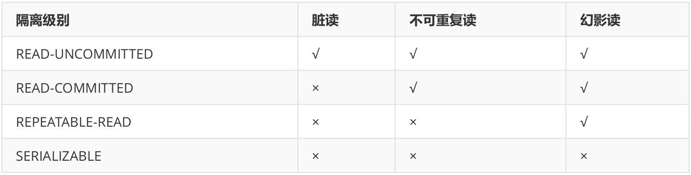

# ``Spring``事务处理

## ``Spring``和事务的关系

关系型数据库、某些消息队列等产品或中间件称为事务性资源，因为它们本身支持事务，也能够处理事务。

``Spring``很显然不是事务性资源，但是它可以管理事务性资源，所以``Spring``和事务之间是管理关系。

就像``Jack Ma``虽然不会写代码，但是他却管理者一大批会写代码的码农。

## ``Spring``事务三要素

- 数据源：表示具体的事务性资源，是事务的真正处理者，如``MySQL``等。

- 事务管理器：像一个大管家，从整体上管理事务的处理过程，如打开、提交、回滚等。

- 事务应用和属性配置：像一个标识符，表明哪些方法要参与事务，如何参与事务，以及一些相关属性如隔离级别、超时时间等。

## ``Spring``事务的注解配置

- 把一个``DataSource（如DruidDataSource）``作为一个``@Bean``注册到``Spring``容器中，配置好事务性资源。

- 把一个``@EnableTransactionManagement``注解放到一个``@Configuration``类上，配置好事务管理器，并启用事务管理。

- 把一个``@Transactional``注解放到类上或方法上，可以设置注解的属性，表明该方法按配置好的属性参与到事务中。

## 事务注解的本质

- ``@Transactional``这个注解仅仅是一些（和事务相关的）元数据，在运行时被事务基础设施读取消费，并使用这些元数据来配置``bean``的事务行为。

- 大致来说具有两方面功能，一是表明该方法要参与事务，二是配置相关属性来定制事务的参与方式和运行行为。

## ``Spring``声明式事务实现原理

声明式事务成为可能，主要得益于``Spring AOP``。使用一个事务拦截器，在方法调用的前后/周围进行事务性增强（``advice``），来驱动事务完成。

## 如何回滚一个事务

就是在一个事务上下文中当前正在执行的代码里抛出一个异常，事务基础设施代码会捕获任何未处理的异常，并且做出决定是否标记这个事务为回滚。

## 默认回滚规则

默认只把``runtime``, ``unchecked exceptions``标记为回滚，即``RuntimeException``及其子类，``Error``默认也导致回滚。``Checked exceptions``默认不导致回滚。这些规则和``EJB``是一样的。

## 如何配置回滚异常

使用``@Transactional``注解的``rollbackFor/rollbackForClassName``属性，可以精确配置导致回滚的异常类型，包括``checked exceptions``。

``noRollbackFor/noRollbackForClassName``属性，可以配置不导致回滚的异常类型，当遇到这样的未处理异常时，照样提交相关事务。

## 事务注解在类/方法上

``@Transactional``注解既可以标注在类上，也可以标注在方法上。当在类上时，默认应用到类里的所有方法。如果此时方法上也标注了，则方法上的优先级高。

## 事务注解在类上的继承性

``@Transactional``注解的作用可以传播到子类，即如果父类标了子类就不用标了。但倒过来就不行了。

子类标了，并不会传到父类，所以父类方法不会有事务。父类方法需要在子类中重新声明而参与到子类上的注解，这样才会有事务。

## 事务注解在接口/类上

``@Transactional``注解可以用在接口上，也可以在类上。在接口上时，必须使用基于接口的代理才行，即``JDK``动态代理。

事实是``Java``的注解不能从接口继承，如果你使用基于类的代理，即``CGLIB``，或基于织入方面，即``AspectJ``，事务设置不会被代理和织入基础设施认出来，目标对象不会被包装到一个事务代理中。

``Spring``团队建议注解标注在类上而非接口上。

## 只在``public``方法上生效？

当采用代理来实现事务时，（注意是代理），``@Transactional``注解只能应用在``public``方法上。当标记在``protected、private、package-visible``方法上时，不会产生错误，但也不会表现出为它指定的事务配置。可以认为它作为一个普通的方法参与到一个``public``方法的事务中。

如果想在非``public``方法上生效，考虑使用``AspectJ（织入方式）``。

## 目标类里的自我调用没有事务？

在代理模式中（这是默认的），只有从外部的方法调用进入通过代理会被拦截，这意味着自我调用（实际就是，目标对象中的一个方法调用目标对象的另一个方法）在运行时不会导致一个实际的事务，即使被调用的方法标有注解。

如果你希望自我调用也使用事务来包装，考虑使用``AspectJ``的方式。在这种情况下，首先是没有代理。相反，目标类被织入（即它的字节码被修改）来把``@Transactional``加入到运行时行为，在任何种类的方法上都可以。

## 事务与线程

和``JavaEE``事务上下文一样，``Spring``事务和一个线程的执行相关联，底层是一个``ThreadLocal<Map<Object, Object>>``，就是每个线程一个``map``，``key``是``DataSource``，``value``是``Connection``。

## 逻辑事务与物理事务

事务性资源实际打开的事务就是物理事务，如数据库的``Connection``打开的事务。``Spring``会为每个``@Transactional``方法创建一个事务范围，可以理解为是逻辑事务。

在逻辑事务中，大范围的事务称为外围事务，小范围的事务称为内部事务，外围事务可以包含内部事务，但在逻辑上是互相独立的。每一个这样的逻辑事务范围，都能够单独地决定``rollback-only``状态。

那么如何处理逻辑事务和物理事务之间的关联关系呢，这就是传播特性解决的问题。

## 事务传播行为

事务传播行为(为了解决业务层方法之间互相调用的事务问题): 当事务方法被另一个事务方法调用时,必须指定事务应该如何传播。

例如:方法可能继续在现有事务中运行,也可能开启一个新事务,并在自己的事务中运行。在``TransactionDefinition``定义中包括了如下几个表示传播行为的常量:

``REQUIRED，SUPPORTS，MANDATORY，REQUIRES_NEW，NOT_SUPPORTED，NEVER，NESTED``

> 支持当前事务的情况:

- ``TransactionDefinition.PROPAGATION_REQUIRED:`` 如果当前存在事务,则加入该事务;如果当前没有事务,则创建一个新的事务。
- ``TransactionDefinition.PROPAGATION_SUPPORTS:`` 如果当前存在事务,则加入该事务;如果当前没有事务,则以非事务的方式继续运行。
- ``TransactionDefinition.PROPAGATION_MANDATORY:`` 如果当前存在事务,则加入该事务;如果当前没有事务,则抛出异常。(``mandatory:强制性``)

> 不支持当前事务的情况:
- ``TransactionDefinition.PROPAGATION_REQUIRES_NEW:`` 创建一个新的事务,如果当前存在事务,则把当前事务挂起。
- ``TransactionDefinition.PROPAGATION_NOT_SUPPORTED:`` 以非事务方式运行,如果当前存在事务,则把当前事务挂起。
- ``TransactionDefinition.PROPAGATION_NEVER:`` 以非事务方式运行,如果当前存在事务,则抛出异常。

> 其他情况:
- ``TransactionDefinition.PROPAGATION_NESTED: ``如果当前存在事务,则创建一个事务作为当前事务的嵌套事务来运行;如果当前没有事务,则该取值等价于``TransactionDefinition.PROPAGATION_REQUIRED。``

## 隔离级别
``TransactionDefinition`` 接口中定义了``五个``表示隔离级别的常量:

``DEFAULT，READ_UNCOMMITTED，READ_COMMITTED，REPEATABLE_READ，SERIALIZABLE``

- ``TransactionDefinition.ISOLATION_DEFAULT:`` 使用后端数据库默认的隔离级别,``Mysql`` 默认采用的``REPEATABLE_READ``隔离级别 ``Oracle`` 默认采用的 ``READ_COMMITTED``隔离级别。
- ``TransactionDefinition.ISOLATION_READ_UNCOMMITTED: ``最低的隔离级别,允许读取尚未提交的数据变更,可能会导致脏读、幻读或不可重复读。
- ``TransactionDefinition.ISOLATION_READ_COMMITTED:`` 允许读取并发事务已经提交的数据,可以阻止脏读,但是幻读或不可重复读仍有可能发生。
- ``TransactionDefinition.ISOLATION_REPEATABLE_READ:`` 对同一字段的多次读取结果都是一致的,除非数据是被本身事务自己所修改,可以阻止脏读和不可重复读,但幻读仍有可能发生。
- ``TransactionDefinition.ISOLATION_SERIALIZABLE:`` 最高的隔离级别,完全服从``ACID``的隔离级别。所有的事务依次逐个执行,这样事务之间就完全不可能产生干扰,也就是说,该级别可以防止脏读、不可重复读以及幻读。但是这将严重影响程序的性能。通常情况下也不会用到该级别。

> 脏读

一个事务修改了一行数据但没有提交，第二个事务可以读取到这行被修改的数据，如果第一个事务回滚，第二个事务获取到的数据将是无效的。

> 不可重复读

一个事务读取了一行数据，第二个事务修改了这行数据，第一个事务重新读取这行数据，将获得到不同的值。

> 幻读

一个事务按照一个``where``条件读取所有符合的数据行，第二个事务插入了一行数据且恰好也满足这个``where``条件，第一个事务再以这个``where``条件重新读取，将会获取额外多出来的这一行。

**帮助记忆：**
写读是脏读，读写读是不可重复读，``where insert where``是幻读。

