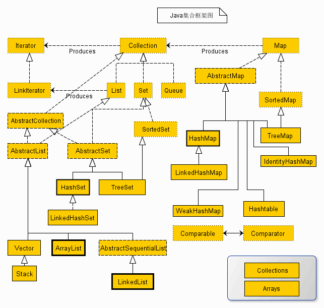

# ``Java``知识点

## ``Collection``类




> ``Collection``
```java
子接口

	Set,List
集合中只能放置对象的引用,不能放置原生数据类型,

我们需要使用原生数据类型的封装类才能加入到集合中
```

> ``Ordered``与``Sorted``接口
```java
Ordered排序,按照某种由具体情况决定的顺序排序,是后天指定的

Sorted排序,按照天然顺序进行排序,是先天指定的
```

> ``List``
```java
实现类包括
	LinkedList,Vector,ArrayList
列表接口,继承与Collection,可以按索引的顺序访问,有索引的Collection
	具有列表的功能,元素顺序均是按添加的先后进行排列的,
	允许重复的元素,允许多个null元素
```


