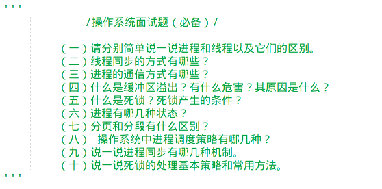

# 常见面试题整理--操作系统篇（每位开发者必备）

## 1. 请分别简单说一说进程和线程以及它们的区别。

> 进程是具有一定功能的程序关于某个数据集合上的一次运行活动，进程是系统进行资源调度和分配的一个独立单位。线程是进程的实体，是``CPU``调度和分派的基本单位，它是比进程更小的能独立运行的基本单位。一个进程可以有多个线程，多个线程也可以并发执行

## 2. 线程同步的方式有哪些？

- 互斥量：采用互斥对象机制，只有拥有互斥对象的线程才有访问公共资源的权限。因为互斥对象只有一个，所以可以保证公共资源不会被多个线程同时访问。
- 信号量：它允许同一时刻多个线程访问同一资源，但是需要控制同一时刻访问此资源的最大线程数量。
- 事件（信号): 通过通知操作的方式来保持多线程同步，还可以方便的实现多线程优先级的比较操作。

## 3. 进程的通信方式有哪些？

主要分为：管道、系统``IPC``（包括消息队列、信号量、共享存储）、``SOCKET``

管道主要分为：普通管道``PIPE`` 、流管道（``s_pipe``）、命名管道（``name_pipe``）

- 管道是一种半双工的通信方式，数据只能单项流动，并且只能在具有亲缘关系的进程间流动，进程的亲缘关系通常是父子进程
- 命名管道也是半双工的通信方式，它允许无亲缘关系的进程间进行通信
- 信号量是一个计数器，用来控制多个进程对资源的访问，它通常作为一种锁机制。
- 消息队列是消息的链表，存放在内核中并由消息队列标识符标识。
- 信号是一种比较复杂的通信方式，用于通知接收进程某个事件已经发生。
- 共享内存就是映射一段能被其它进程访问的内存，这段共享内存由一个进程创建，但是多个进程可以访问。

## 4. 什么是缓冲区溢出？有什么危害？其原因是什么？

缓冲区溢出是指当计算机向缓冲区填充数据时超出了缓冲区本身的容量，溢出的数据覆盖在合法数据上。

危害有以下两点：

- 程序崩溃，导致拒绝额服务
- 跳转并且执行一段恶意代码

造成缓冲区溢出的主要原因是程序中没有仔细检查用户输入。

## 5. 什么是死锁？死锁产生的条件

在两个或者多个并发进程中，如果每个进程持有某种资源而又等待其它进程释放它或它们现在保持着的资源，在未改变这种状态之前都不能向前推进，称这一组进程产生了死锁。通俗的讲就是两个或多个进程无限期的阻塞、相互等待的一种状态。

死锁产生的四个条件（有一个条件不成立，则不会产生死锁）

1. 互斥条件：一个资源一次只能被一个进程使用
2. 请求与保持条件：一个进程因请求资源而阻塞时，对已获得资源保持不放
3. 不剥夺条件：进程获得的资源，在未完全使用完之前，不能强行剥夺
4. 循环等待条件：若干进程之间形成一种头尾相接的环形等待资源关系

## 6. 进程有哪几种状态？

- 就绪状态：进程已获得除处理机以外的所需资源，等待分配处理机资源
- 运行状态：占用处理机资源运行，处于此状态的进程数小于等于``CPU``数
- 阻塞状态： 进程等待某种条件，在条件满足之前无法执行

## 7. 分页和分段有什么区别？

- 段是信息的逻辑单位，它是根据用户的需要划分的，因此段对用户是可见的 ；页是信息的物理单位，是为了管理主存的方便而划分的，对用户是透明的。
- 段的大小不固定，有它所完成的功能决定；页大大小固定，由系统决定
- 段向用户提供二维地址空间；页向用户提供的是一维地址空间
- 段是信息的逻辑单位，便于存储保护和信息的共享，页的保护和共享受到限制。

## 8. 操作系统中进程调度策略有哪几种？

``FCFS``(先来先服务)，优先级，时间片轮转，多级反馈

## 9. 说一说进程同步有哪几种机制?

原子操作、信号量机制、自旋锁管程、会合、分布式系统

## 10. 说一说死锁的处理基本策略和常用方法

- 解决死锁的基本方法如下：
预防死锁、避免死锁、检测死锁、解除死锁

- 解决四多的常用策略如下：
鸵鸟策略、预防策略、避免策略、检测与解除死锁

