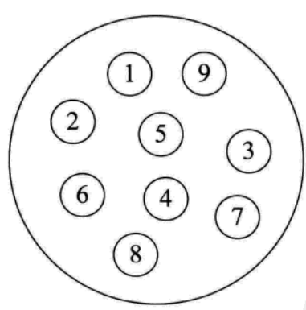
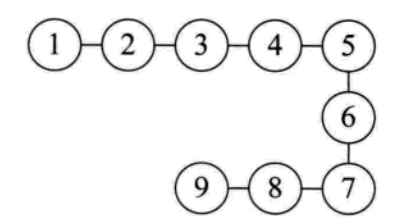
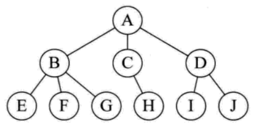
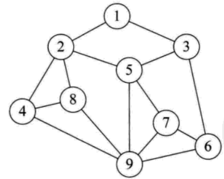
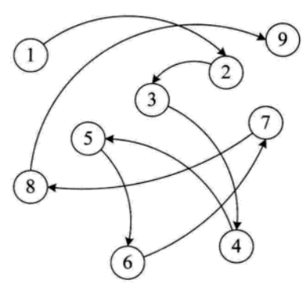
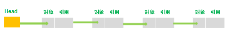
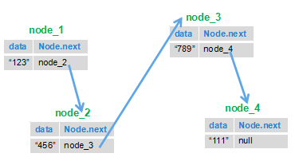
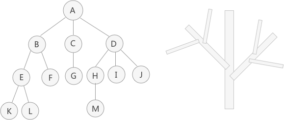

# 面试之旅关于数据结构

**[数据结构详细讲解](http://data.biancheng.net/intro/)**

数据结构是计算机存储、组织数据的方式。数据结构是指相互之间存在一种或多种特定关系的数据元素的集合。通常情况下，精心选择的数据结构可以带来更高的运行或者存储效率。数据结构往往同高效的检索算法和索引技术有关。


## 数据结构中的逻辑结构

> 集合结构
  
集合结构的里面的元素关系是孤立的





> 线性结构

线性结构里面的元素关系：一对一




> 树形结构

树形结构里面的元素关系：一对多




> 图结构

图结构里面的元素关系：多对多




## 数据结构的物理结构

物理结构:是指数据的逻辑结构在计算机中的存储形式。存储结构有两种：

> 顺序存储结构：

顺序存储结构：是把数据元素存放在地址连续的存储单元里，其数据间的逻辑关系和物理关系是一致的。


> 链式存储结构

链式存储结构：是把数据元素存放在任意的存储单元里，这组存储单元可以是连续的，也可以是不连续的。





## 常见的数据结构

- 数组（``Array``）

- 堆栈（``Stack``）

- 队列（``Queue``）

- 链表（``Linked List``）

- 树（``Tree``）

- 图（``Graph``）

- 堆（``Heap``）

- 散列表（``Hash``）

## 链表

链表是一种数据结构，和数组同级。比如，``Java``中我们使用的``ArrayList``，其实现原理是数组。而``LinkedList``的实现原理就是链表了。链表在进行循环遍历时效率不高，但是插入和删除时优势明显。下面对单向链表做一个介绍。

单向链表是一种线性表，实际上是由节点（``Node``）组成的，一个链表拥有不定数量的节点。其数据在内存中存储是不连续的，它存储的数据分散在内存中，每个结点只能也只有它能知道下一个结点的存储位置。由N各节点（``Node``）组成单向链表，每一个``Node``记录本``Node``的数据及下一个``Node``。向外暴露的只有一个头节点（``Head``），我们对链表的所有操作，都是直接或者间接地通过其头节点来进行的。





上图中最左边的节点即为头结点（``Head``），但是添加节点的顺序是从右向左的，添加的新节点会被作为新节点。最先添加的节点对下一节点的引用可以为空。引用是引用下一个节点而非下一个节点的对象。因为有着不断的引用，所以头节点就可以操作所有节点了。

下图描述了单向链表存储情况。存储是分散的，每一个节点只要记录下一节点，就把所有数据串了起来，形成了一个单向链表。


节点（``Node``）是由一个需要储存的对象及对下一个节点的引用组成的。也就是说，节点拥有两个成员：储存的对象、对下一个节点的引用。下面图是具体的说明：




> 单链表实现

```java
package com.zjn.LinkAndQueue;

/**
 * 自定义链表设计
 * 
 * @author zjn
 *
 */
public class MyLink {
    Node head = null; // 头节点

    /**
     * 链表中的节点，data代表节点的值，next是指向下一个节点的引用
     * 
     * @author zjn
     *
     */
    class Node {
        Node next = null;// 节点的引用，指向下一个节点
        int data;// 节点的对象，即内容

        public Node(int data) {
            this.data = data;
        }
    }

    /**
     * 向链表中插入数据
     * 
     * @param d
     */
    public void addNode(int d) {
        Node newNode = new Node(d);// 实例化一个节点
        if (head == null) {
            head = newNode;
            return;
        }
        Node tmp = head;
        while (tmp.next != null) {
            tmp = tmp.next;
        }
        tmp.next = newNode;
    }

    /**
     * 
     * @param index:删除第index个节点
     * @return
     */
    public boolean deleteNode(int index) {
        if (index < 1 || index > length()) {
            return false;
        }
        if (index == 1) {
            head = head.next;
            return true;
        }
        int i = 1;
        Node preNode = head;
        Node curNode = preNode.next;
        while (curNode != null) {
            if (i == index) {
                preNode.next = curNode.next;
                return true;
            }
            preNode = curNode;
            curNode = curNode.next;
            i++;
        }
        return false;
    }

    /**
     * 
     * @return 返回节点长度
     */
    public int length() {
        int length = 0;
        Node tmp = head;
        while (tmp != null) {
            length++;
            tmp = tmp.next;
        }
        return length;
    }

    /**
     * 在不知道头指针的情况下删除指定节点
     * 
     * @param n
     * @return
     */
    public boolean deleteNode11(Node n) {
        if (n == null || n.next == null)
            return false;
        int tmp = n.data;
        n.data = n.next.data;
        n.next.data = tmp;
        n.next = n.next.next;
        System.out.println("删除成功！");
        return true;
    }

    public void printList() {
        Node tmp = head;
        while (tmp != null) {
            System.out.println(tmp.data);
            tmp = tmp.next;
        }
    }

    public static void main(String[] args) {
        MyLink list = new MyLink();
        list.addNode(5);
        list.addNode(3);
        list.addNode(1);
        list.addNode(2);
        list.addNode(55);
        list.addNode(36);
        System.out.println("linkLength:" + list.length());
        System.out.println("head.data:" + list.head.data);
        list.printList();
        list.deleteNode(4);
        System.out.println("After deleteNode(4):");
        list.printList();
    }
}
```

## 树

非线性存储结构



[树的详细讲解](http://data.biancheng.net/view/23.html)


