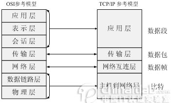

# 常见面试题整理--计算机网络篇（每位开发者必备）

## 1. 请简述``TCP\UDP``的区别

``TCP``和``UDP``是``OSI``模型中的运输层中的协议。``TCP``提供可靠的通信传输，而``UDP``则常被用于让广播和细节控制交给应用的通信传输。

两者的区别大致如下：

- ``TCP``面向连接，``UDP``面向非连接即发送数据前不需要建立链接
- ``TCP``提供可靠的服务（数据传输），``UDP``无法保证
- ``TCP``面向字节流，``UDP``面向报文
- ``TCP``数据传输慢，``UDP``数据传输快

## 2. 请简单说一下你了解的端口及对应的服务？

**端口简介：本文介绍端口的概念，分类，以及如何关闭/开启一个端口**

- ``21端口``：21端口主要用于``FTP（File Transfer Protocol，文件传输协议）``服务。

- ``23``端口：23端口主要用于``Telnet（远程登录）``服务，是``Internet``上普遍采用的登录和仿真程序。

- ``25端口``：25端口为``SMTP（Simple Mail Transfer Protocol，简单邮件传输协议）``服务器所开放，主要用于发送邮件，如今绝大多数邮件服务器都使用该协议。

- ``53端口``：53端口为``DNS（Domain Name Server，域名服务器）``服务器所开放，主要用于域名解析，``DNS``服务在``NT``系统中使用的最为广泛。

- ``67、68端口``：67、68端口分别是为``Bootstrap``服务的``Bootstrap Protocol Server（引导程序协议服务端）``和``Bootstrap Protocol Client（引导程序协议客户端）``开放的端口。

- ``69端口``：``TFTP``是Cisco公司开发的一个``简单文件传输协议``，类似于``FTP``。

- ``79端口``：79端口是为``Finger``服务开放的，主要用于查询远程主机在线用户、操作系统类型以及是否缓冲区溢出等用户的详细信息。

- ``80端口``：80端口是为``HTTP（HyperText Transport Protocol，超文本传输协议）``开放的，这是上网冲浪使用最多的协议，主要用于在``WWW（World Wide Web，万维网）``服务上传输信息的协议。

- ``99端口``：99端口是用于一个名为``“Metagram Relay”（亚对策延时）``的服务，该服务比较少见，一般是用不到的。
- ``109、110端口``：109端口是为``POP2（Post Office Protocol Version 2，邮局协议2）``服务开放的，``110端口是为POP3（邮件协议3）``服务开放的，``POP2、POP3``都是主要用于接收邮件的。

- ``111端口``：111端口是``SUN``公司的``RPC（Remote Procedure Call，远程过程调用）``服务所开放的端口，主要用于分布式系统中不同计算机的内部进程通信，RPC在多种网络服务中都是很重要的组件。

- ``113端口``：113端口主要用于``Windows``的``“Authentication Service”（验证服务）``。

- ``119端口``：119端口是为``“Network News Transfer Protocol”（网络新闻组传输协议，简称NNTP）``开放的。

- ``135端口``：135端口主要用于使用``RPC（Remote Procedure Call，远程过程调用）``协议并提供``DCOM（分布式组件对象模型）``服务。

- ``137端口``：137端口主要用于``“NetBIOS Name Service”（NetBIOS名称服务）``。

- ``139端口``：139端口是为``“NetBIOS Session Service”``提供的，主要用于提供``Windows``文件和打印机共享以及``Unix``中的``Samba``服务。

- ``143端口``：143端口主要是用于``“Internet Message Access Protocol”v2（Internet消息访问协议，简称IMAP）``。

- ``161端口``：161端口是用于``“Simple Network Management Protocol”（简单网络管理协议，简称SNMP）``。

- ``443端口``：43端口即网页浏览端口，主要是用于``HTTPS``服务，是提供加密和通过安全端口传输的另一种``HTTP``。

- ``554端口``：554端口默认情况下用于``“Real Time Streaming Protocol”（实时流协议，简称RTSP）``。

- ``1024端口``：1024端口一般不固定分配给某个服务，在英文中的解释是``“Reserved”（保留）``。

- ``1080端口``：1080端口是Socks代理服务使用的端口，大家平时上网使用的WWW服务使用的是HTTP协议的代理服务。

- ``1755端口``：1755端口默认情况下用于``“Microsoft Media Server”（微软媒体服务器，简称MMS）``。

- ``4000端口``：4000端口是用于大家经常使用的``QQ``聊天工具的，再细说就是为``QQ``客户端开放的端口，``QQ``服务端使用的端口是``8000``。

- ``5554端口``：在今年4月30日就报道出现了一种针对微软``lsass服务``的新蠕虫病毒——震荡波（Worm.Sasser），该病毒可以利用``TCP 5554端口``开启一个``FTP``服务，主要被用于病毒的传播。

- ``5632端口``：5632端口是被大家所熟悉的远程控制软件``pcAnywhere``所开启的端口。

- ``8080端口``：8080端口同80端口，是被用于``WWW``代理服务的，可以实现网页

## 3. 说一说``TCP``的三次握手

在``TCP/IP``协议中，``TCP协议``提供可靠的连接服务，连接是通过三次握手进行初始化的。三次握手的目的是同步连接双方的序列号和确认号并交换``TCP``窗口大小信息。

下面详细说一下三次握手（来自简析``TCP``的三次握手与四次分手）

## 4. 有哪些私有（保留）地址？

- ``A``类：``10.0.0.0 - 10.255.255.255``
- ``B``类：``172.16.0.0 - 172.31.255.255``
- ``C``类：``192.168.0.0 - 192.168.255.255``

## 5. ``IP``地址分为哪几类？简单说一下各个分类

``IPv6 ``-- 采用``128bit``，首部固定部分为``40``字节。

## 6. 在浏览器中输入网址之后执行会发生什么？

- 查找域名对应的``IP``地址。这一步会依次查找浏览器缓存，系统缓存，路由器缓存，``ISPNDS``缓存，根域名服务器
- 浏览器向``IP``对应的``web``服务器发送一个``HTTP``请求
- 服务器响应请求，发回网页内容
- 浏览器解析网页内容

更加详细的一种说法（以百度为例）（来自计算机网络之面试常考 - 牛客网）

## 7. 简单解释一些``ARP``协议的工作过程

## 8. 说一说``OSI``七层模型

## 9. 说一说``TCP/IP``四层模型

``ISO``制定的``OSI``参考模型的过于庞大、复杂招致了许多批评。与此对照，由技术人员自己开发的``TCP/IP``协议栈获得了更为广泛的应用。如图所示，是``TCP/IP``参考模型和``OSI``参考模型的对比示意图。

具体讲解：[链接](https://www.cnblogs.com/BlueTzar/articles/811160.html)

## 10. ``HTTP`` 协议包括哪些请求？

- ``GET``：对服务器资源的简单请求
- ``POST``：用于发送包含用户提交数据的请求
------------以及------------

- ``HEAD``：类似于GET请求，不过返回的响应中没有具体内容，用于获取报头
- ``PUT``：传说中请求文档的一个版本
- ``DELETE``：发出一个删除指定文档的请求
- ``TRACE``：发送一个请求副本，以跟踪其处理进程
- ``OPTIONS``：返回所有可用的方法，检查服务器支持哪些方法
- ``CONNECT``：用于``ssl``隧道的基于代理的请求

## 11. 简述``HTTP``中``GET``和``POST``的区别

从原理性看：

- 根据``HTTP``规范，``GET``用于信息获取，而且应该是安全和幂等的
- 根据``HTTP``规范，``POST``请求表示可能修改服务器上资源的请求

从表面上看：

- ``GET``请求的数据会附在``URL``后面，``POST``的数据放在``HTTP``包体
- ``POST``安全性比``GET``安全性高

