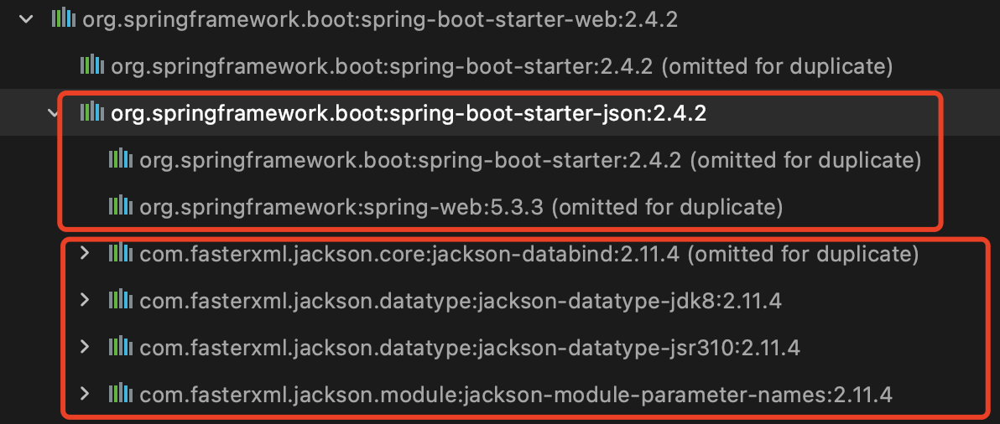

# ``Jackson`` 使用方法总结

## 1. 工具简介

[``Jackson``项目``GitHub``主页](https://links.jianshu.com/go?to=https%3A%2F%2Fgithub.com%2FFasterXML%2Fjackson)

[``Baeldung``上关于``JSON``的使用]()

涉及到一些不常见的用法或功能，可以到以上两个地址查看，网上相关博客类的资料相对较少。

- ``Jackson``核心模块是所有扩展的基础。目前有3个核心模块（从``Jackson 2.x``开始）：

- ``Streaming：（jackson-core）``定义了低级流``API``，包括``JSON``特性的实现。
- ``Annotations：（jackson-annotation）``包含标准的``Jackson``注解。
- ``Databind：（jackson-databind）``实现了数据绑定（和对象序列化）支持，它依赖于``Streaming``和``Annotations``包。


```xml
<dependency>
    <groupId>com.fasterxml.jackson.core</groupId>
    <artifactId>jackson-core</artifactId>
    <version>${jackson.version.core}</version>
</dependency>
```

```xml
<dependency>
  <groupId>com.fasterxml.jackson.core</groupId>
  <artifactId>jackson-annotations</artifactId>
  <version>${jackson-annotations-version}</version>
</dependency>
```

```xml
<dependency>
    <groupId>com.fasterxml.jackson.core</groupId>
    <artifactId>jackson-databind</artifactId>
    <version>${jackson.version}</version>
</dependency>
```

``SpringBoot``中使用的话引入``web``依赖，就直接引入了``Jackson``：

```xml
<dependency>
    <groupId>org.springframework.boot</groupId>
    <artifactId>spring-boot-starter-web</artifactId>
</dependency>
```

依赖如下：



## 2.简单实用

``Jackson``提供了三种``JSON``的处理方式。分别是数据绑定，``JSON``树模型，流式``API``。下面分别介绍这三种方式。

### 2.1 **数据绑定**

```java
import lombok.Data;
@Data
public class Student {
    private Long id;
    private String name;
    private Integer age;
    private String sex;
    private String[] interest;
}
```
```java
public class Test {
    public static void main(String[] args) throws IOException {
        Student student = new Student();
        student.setId(1L);
        student.setName("zhangsan");
        student.setAge(20);
        student.setInterest(new String[]{"music", "coding"});

        ObjectMapper mapper = new ObjectMapper();
        //测试代码......
    }
}
```

### 2.1.1 ``JavaBean``转``JSON``字符串
```java
String studentStr = mapper.writeValueAsString(student);
System.out.println(studentStr);
//{"id":1,"name":"zhangsan","age":20,"sex":null,"interest":["music","coding"]}
```
### 2.1.2 **``JSON``字符串转``JavaBean``**

```java
Student stu = mapper.readValue(studentStr, Student.class);
System.out.println(stu);
//Student(id=1, name=zhangsan, age=20, sex=null, interest=[music, coding])
```
### 2.1.3 **``JSON``字符串转``Map``集合**

```java
//对泛型的反序列化，使用TypeReference可以明确的指定反序列化的类型。
//import com.fasterxml.jackson.core.type.TypeReference;
Map<String, Object> map = mapper.readValue(studentStr, new TypeReference<Map<String, Object>>(){});
System.out.println(map);
//{id=1, name=zhangsan, age=20, sex=null, interest=[music, coding]}
```
### 2.1.4 **``JavaBean``转文件**
```java
//写到文件
mapper.writeValue(new File("/json.txt"), student);
//从文件中读取
Student student1 = mapper.readValue(new File("/json.txt"), Student.class);
System.out.println(student1);
//Student(id=1, name=zhangsan, age=20, sex=null, interest=[music, coding])
```
### 2.1.5 **``JavaBean``转字节流**

```java
//写为字节流
byte[] bytes = mapper.writeValueAsBytes(student);
//从字节流读取
Student student2 = mapper.readValue(bytes, Student.class);
System.out.println(student2);
//Student(id=1, name=zhangsan, age=20, sex=null, interest=[music, coding])
```
### 2.2 ``JSON``树模型

``Jackson``树模型结构，可以通过``path，get，JsonPointer``等进行操作，适合用来获取大``JSON``中的字段，比较灵活。缺点是如果需要获取的内容较多，会显得比较繁琐。

### 2.2.1. 构建``JSON``树模型

```java
import com.fasterxml.jackson.core.JsonPointer;
import com.fasterxml.jackson.databind.JsonNode;
import com.fasterxml.jackson.databind.ObjectMapper;
import com.fasterxml.jackson.databind.node.ArrayNode;
import com.fasterxml.jackson.databind.node.NullNode;
import com.fasterxml.jackson.databind.node.ObjectNode;
import java.io.IOException;
public class Test {
    public static void main(String[] args) throws IOException {
        //构建JSON树
        ObjectMapper mapper = new ObjectMapper();
        ObjectNode root = mapper.createObjectNode();
        root.put("id", 1L);
        root.put("name", "zhangsan");
        root.put("age", 20);
        ArrayNode interest = root.putArray("interest");
        interest.add("music");
        interest.add("coding");
        //测试代码......
    }
}
```
### 2.2.2. **``JSON``树转``JSON``字符串**

```java
String json = mapper.writeValueAsString(root);
System.out.println(json);
//{"id":1,"name":"zhangsan","age":20,"interest":["music","coding"]}
```
### 2.2.3. **解析``JSON``树模型**

```java
//将JSON字符串转为JSON树
JsonNode rootNode = mapper.readTree(json);
//解析值，使用path或者get
Long id = rootNode.path("id").asLong();
System.out.println(id);//1
String name = rootNode.path("name").asText();
System.out.println(name);//zhangsan
Integer age = rootNode.get("age").asInt();
System.out.println(age);//20
//解析数组
JsonNode arrayNode = rootNode.get("interest");
if (arrayNode.isArray()){
    for (JsonNode jsonNode : arrayNode){
        System.out.println(jsonNode.asText());
        //music
        //coding
    }
}
```
``path``和``get``方法看起来很相似，其实它们的细节不同。

``path``方法会返回一个``"missing node"``，该``"missing node"``的``isMissingNode``方法返回值为``true``，如果调用该``node``的``asText``方法的话，结果是一个空字符串。

```java
System.out.println(rootNode.path("notExist").isMissingNode());//true
System.out.println(rootNode.path("notExist").asText());//空串
```
``get``方法取不存在的值的时候，直接会返回``null``。

```java
System.out.println(rootNode.get("notExist") == null);//true
System.out.println(rootNode.get("notExist"));//null
```
当``key``存在，而``value``为``null``的时候，``get``和``path``都会返回一个``NullNode``节点。该节点的``asText``方法返回``null``字符串。

```java
String s = "{\"nullNode\":null}";
JsonNode jsonNode = mapper.readTree(s);
System.out.println(jsonNode.get("nullNode") instanceof NullNode);//true
System.out.println(jsonNode.get("nullNode"));//null
System.out.println(jsonNode.path("nullNode") instanceof NullNode);//true
System.out.println(jsonNode.path("nullNode"));//null
```

使用``JsonPointer``解析``JSON``树。

```java
String s1 = "{\"obj\": {\"name\": \"wang\",\"class\": \"3\"}}";
JsonNode jsonNode1 = mapper.readTree(s1);
JsonPointer jsonPointer = JsonPointer.valueOf("/obj/name");
JsonNode node = jsonNode1.at(jsonPointer);
System.out.println(node.asText());//wang
```
### **简单数据绑定**

简单数据绑定就是将``json``字符串映射为``java``核心的数据类型。

json类型 |	Java类型
---- | ---
object |	LinkedHashMap
array |	ArrayList
string |	String
number |	Integer,Long,Double
true|false |	Boolean
null |	null


### 2.3流式``API``

[JackSon的几种用法](https://links.jianshu.com/go?to=https%3A%2F%2Fblog.csdn.net%2Fm0_37076574%2Farticle%2Fdetails%2F81317403)

流式``API``是一套比较底层的``API``，速度快，但是使用起来特别麻烦。它主要是有两个核心类，一个是``JsonGenerator``，用来生成``JSON``，另一个是``JsonParser``，用来读取``JSON``内容。

```java
import com.fasterxml.jackson.core.*;
import java.io.File;
import java.io.FileInputStream;
import java.io.IOException;
public class Test {
    public static void main(String[] args) throws IOException {
        JsonFactory factory = new JsonFactory();
        String s = "{\"id\": 1,\"name\": \"小明\",\"array\": [\"1\", \"2\"]," +
                "\"test\":\"I'm test\",\"nullNode\":null,\"base\": {\"major\": \"物联网\",\"class\": \"3\"}}";

        //这里就举一个比较简单的例子，Generator的用法就是一个一个write即可。
        File file = new File("/json.txt");
        JsonGenerator jsonGenerator = factory.createGenerator(file, JsonEncoding.UTF8);
        //对象开始
        jsonGenerator.writeStartObject();
        //写入一个键值对
        jsonGenerator.writeStringField("name", "小光");
        //对象结束
        jsonGenerator.writeEndObject();
        //关闭jsonGenerator
        jsonGenerator.close();
        //读取刚刚写入的json
        FileInputStream inputStream = new FileInputStream(file);
        int i = 0;
        final int SIZE = 1024;
        byte[] buf = new byte[SIZE];
        StringBuilder sb = new StringBuilder();
        while ((i = inputStream.read(buf)) != -1) {
            System.out.println(new String(buf,0,i));
        }
        inputStream.close();

        //JsonParser解析的时候，思路是把json字符串根据边界符分割为若干个JsonToken，这个JsonToken是一个枚举类型。
        //下面这个小例子，可以看出JsonToken是如何划分类型的。
        JsonParser parser = factory.createParser(s);
        while (!parser.isClosed()){
            JsonToken token = parser.currentToken();
            System.out.println(token);
            parser.nextToken();
        }
        JsonParser jsonParser = factory.createParser(s);
        //下面是一个解析的实例
        while (!jsonParser.isClosed()) {
            JsonToken token  = jsonParser.nextToken();
            if (JsonToken.FIELD_NAME.equals(token)) {
                String currentName = jsonParser.currentName();
                token = jsonParser.nextToken();
                if ("id".equals(currentName)) {
                    System.out.println("id:" + jsonParser.getValueAsInt());
                } else if ("name".equals(currentName)) {
                    System.out.println("name:" + jsonParser.getValueAsString());
                } else if ("array".equals(currentName)) {
                    token = jsonParser.nextToken();
                    while (!JsonToken.END_ARRAY.equals(token)) {
                        System.out.println("array:" + jsonParser.getValueAsString());
                        token = jsonParser.nextToken();
                    }
                }
            }
        }
    }
}
```
## 3.注解使用

[注解地址](https://links.jianshu.com/go?to=https%3A%2F%2Fgithub.com%2FFasterXML%2Fjackson-annotations%2Fwiki%2FJackson-Annotations)

### 3.1 ``@JsonProperty``

使用在``JavaBean``的字段上，指定一个字段用于``JSON``映射，默认情况下映射的``JSON``字段与注解的字段名称相同。该注解有三个属性：
- （1）``value``：用于指定映射的``JSON``的字段名称。常用。
- （2）``index``：用于指定映射的``JSON``的字段顺序。
- （3）``defaultValue``：定义为元数据的文本默认值。注意：``core`` ``databind``不使用该属性，它目前只公开给扩展模块使用。

```java
@JsonProperty(value = “user_name”)
```
### 3.2 ``@JsonIgnore``

可用于字段、``getter/setter``、构造函数参数上，作用相同，都会对相应的字段产生影响。使相应字段不参与序列化和反序列化。也就是说，向“``getter``”添加注释会禁用“``setter``”。除非``setter``有``@JsonProperty``注解，在这种情况下，这被认为是一个“分割属性”，启用了``“setter”``，但没有“``getter``”(“只读”，因此属性可以从输入读取，但不是写输出)。

### 3.3 ``@JsonIgnoreProperties``

该注解是类注解。该注解在``Java``类和``JSON``不完全匹配的时候使用。
- （1）在序列化为``JSON``的时候，``@JsonIgnoreProperties({"prop1", "prop2"})``会忽略``pro1``和``pro2``两个属性。
- （2）在从``JSON``反序列化为``Java``类的时候，``@JsonIgnoreProperties(ignoreUnknown=true)``会忽略所有没有``Getter``和``Setter``的属性，也就是忽略类中不存在的字段。

### 3.4. ``@JsonIgnoreType``

该注解是类注解，序列化为``JSON``的时候会排除所有指定类型的字段。

### 3.5. ``@JsonInclude``

用于定义在序列化时是否不应包含某些“非值”（``null``值或空值）的注解。可以用于每个字段上，也可以用于类上（表示用于类的所有属性）。

```java
//忽略类中值为null的字段
@JsonInclude(value = JsonInclude.Include.NON_NULL)
//忽略类中值为空的字段。对于字符串，即忽略null或空字符串
@JsonInclude(Include.NON_EMPTY)
```

### 3.6. ``@JsonFormat``

用于字段上，预期类型行为的通用注释；例如，可以用来指定序列化日期/时间值时使用的格式。
``java.util.Date``使用如下，``java.sql.Date``类似。（注意时区问题，这里添加了``timezone`` = ``"GMT+8"``）

```java
import com.fasterxml.jackson.annotation.JsonFormat;
import java.util.Date;
public class DateModel {
    @JsonFormat(pattern = "yyyy-MM-dd HH:mm:ss", timezone = "GMT+8")
    private Date date;

    public Date getDate() {return date;}
    public void setDate(Date date) {this.date = date;}
}
```
```java
import com.fasterxml.jackson.core.JsonProcessingException;
import com.fasterxml.jackson.databind.ObjectMapper;
import java.util.Date;
public class Test {
    public static void main(String[] args) throws JsonProcessingException {
        DateModel dateModel = new DateModel();
        dateModel.setDate(new Date());
        ObjectMapper mapper = new ObjectMapper();
        System.out.println(mapper.writeValueAsString(dateModel));
        //{"date":"2020-01-01 12:16:54"}
    }
}
```

但是注意如果``JavaBean``中的时间字段使用的是``JDK8``新增的时间日期（``LocalDate / LocalTime / LocalDateTime``）字段的话，直接这样使用是不起作用的。我们需要添加其他匹配，具体可参考``GitHub``上的说明：``Jackson``格式化``JDK8``日期
- （1）添加``jackson-datatype-jsr310``的``maven``配置，``SpringBoot``的``web``模块会自动引入。
- （2）需要进行模块注册。具体看下面的示例代码。

```java
import com.fasterxml.jackson.annotation.JsonFormat;
import java.time.LocalDateTime;
public class DateModel {
    @JsonFormat(pattern = "yyyy-MM-dd HH:mm:ss")
    private LocalDateTime date;

    public LocalDateTime getDate() {return date;}
    public void setDate(LocalDateTime date) {this.date = date;}
}
```
```java
import com.fasterxml.jackson.core.JsonProcessingException;
import com.fasterxml.jackson.databind.ObjectMapper;
import java.time.LocalDateTime;
public class Test {
    public static void main(String[] args) throws JsonProcessingException {
        DateModel dateModel = new DateModel();
        dateModel.setDate(LocalDateTime.now());
        ObjectMapper mapper = new ObjectMapper();
        //自动发现并注册模块
        mapper.findAndRegisterModules();
        System.out.println(mapper.writeValueAsString(dateModel));
        //{"date":"2020-01-01 12:40:08"}
    }
}
```

### 3.7. ``@JsonPropertyOrder``

和``@JsonProperty``的``index``属性类似，指定属性序列化时的顺序。

### 3.8. ``@JsonRootName``

类注解。用于指定``JSON``根属性的名称。生成的``JSON``如下所示：
```java
{"Teacher":{"id":2,"name":"wangwu","age":35}}
```

示例代码：
```java
@JsonRootName("Teacher")
public class Teacher {
    private Long id;
    private String name;
    private Integer age;
    @JsonIgnore//转换为JSON时不需要的字段，用在属性上。
    private String sex;

    //省略Setter/Getter方法

    @Override
    public String toString() {
        return "Teacher{" +
                "id=" + id +
                ", name='" + name + '\'' +
                ", age=" + age +
                ", sex='" + sex + '\'' +
                '}';
    }
}
```
```java
Teacher teacher = new Teacher();
teacher.setId(2L);
teacher.setName("wangwu");
teacher.setAge(35);
teacher.setSex("男");

ObjectMapper mapper = new ObjectMapper();
//开启包装根植的配置
mapper.enable(SerializationFeature.WRAP_ROOT_VALUE);

//将Java对象转换为JSON字符串
String teacherStr = mapper.writeValueAsString(teacher);
System.out.println(teacherStr);
//{"Teacher":{"id":2,"name":"wangwu","age":35}}

//开启了根包装之后，生成的json字符串和java类不对应了，
//所以在反序列化为java类的时候会报错，关闭该属性不会报错，但是值会为空
mapper.disable(DeserializationFeature.FAIL_ON_UNKNOWN_PROPERTIES);

//将JSON字符串转换为Java对象
Teacher tea = mapper.readValue(teacherStr, Teacher.class);
System.out.println(tea);
//Teacher{id=null, name='null', age=null, sex='null'}
```
### 3.9. ``@JsonAnySetter``和``@JsonAnyGetter``

这两个属性是用来在序列化和反序列化的时候多余字段可以通过``Map``来回转换。也就是``JSON``中的字段比对应的``JavaBean``中的字段多，可以在``JavaBean``中使用一个``Map``字段来接收多余的``JSON``字段。


### 3.9.1. ``@JsonAnyGetter``

- （1）用在非静态方法上，没有参数，方法名随意（可以直接写在``Getter``方法上）。
- （2）方法返回值必须是``Map``类型。
- （3）在一个实体类中仅仅用在一个方法上。
- （4）序列化的时候``JSON``字段的``key``就是返回``Map``的``key``，``value``就是``Map``的``value``。


### 3.9.2. ``@JsonAnySetter``

- （1）用在非静态方法上，注解的方法必须有两个参数，第一个是``JSON``字段中的``key``，第二个是``value``，方法名随意（注意这个方法不是``Setter``方法）。
- （2）也可以用在``Map``对象属性上面，建议用在``Map``对象属性上面。
- （3）反序列化的时候将对应不上的字段全部放到``Map``里面

### 3.9.3. 示例代码

```java
import com.fasterxml.jackson.annotation.*;
import lombok.Data;
import java.util.Arrays;
import java.util.HashMap;
import java.util.Map;
/**
 * @author wangbo
 * @date 2019/11/16 10:47
 */
@Data
public class Student {
    private Long id;
    private String name;
    private Integer age;
    //自定义字段
    private Map<String, Object> other = new HashMap();

    @JsonAnyGetter
    public Map<String, Object> getOther() {
        return other;
    }

    @JsonAnySetter
    public void setOther(String key, Object value) {
        this.other.put(key, value);
    }
}
```
```java
import com.fasterxml.jackson.databind.ObjectMapper;

import java.io.IOException;
import java.util.HashMap;
import java.util.Map;

/**
 * @author wangbo
 * @date 2019/11/16 16:54
 */
public class Test {
    public static void main(String[] args) throws IOException {
        Map<String,Object> map = new HashMap<>();
        map.put("id", 1L);
        map.put("name", "菲菲");
        map.put("age", 20);
        map.put("score", 90);
        map.put("sex", "女");

        ObjectMapper mapper = new ObjectMapper();
        String s = mapper.writeValueAsString(map);//序列化
        System.out.println(s);
        //{"score":90,"sex":"女","name":"菲菲","id":1,"age":20}

        Student student = mapper.readValue(s, Student.class);//反序列化
        System.out.println(student);
        //Student(id=1, name=菲菲, age=20, other={score=90, sex=女})
        String s1 = mapper.writeValueAsString(student);//序列化
        System.out.println(s1);
        //{"id":1,"name":"菲菲","age":20,"score":90,"sex":"女"}
    }
}
```

### 3.10 ``@JsonNaming``

该注解放在类上。序列化的时候该注解可将驼峰命名的字段名转换为下划线分隔的小写字母命名方式的``key``。反序列化的时候可以将下划线分隔的小写字母``key``转换为驼峰命名的字段名。

```java
@JsonNaming(PropertyNamingStrategy.SnakeCaseStrategy.class)
```
代码示例：

```java
import com.fasterxml.jackson.databind.PropertyNamingStrategy;
import com.fasterxml.jackson.databind.annotation.JsonNaming;
import lombok.Data;
/**
 * @author wangbo
 * @date 2019/11/16 10:47
 */
@Data
@JsonNaming(PropertyNamingStrategy.SnakeCaseStrategy.class)
public class Student {
    private Long appId;
    private String nickName;
    private Integer nowAge;
}
```
```java
import com.fasterxml.jackson.databind.ObjectMapper;
import java.io.IOException;
/**
 * @author wangbo
 * @date 2019/11/16 16:54
 */
public class Test {
    public static void main(String[] args) throws IOException {
        Student student = new Student();
        student.setAppId(1L);
        student.setNickName("zhangsan");
        student.setNowAge(20);

        ObjectMapper mapper = new ObjectMapper();
        String s = mapper.writeValueAsString(student);//序列化
        System.out.println(s);
        //{"app_id":1,"nick_name":"zhangsan","now_age":20}
        Student student1 = mapper.readValue(s, Student.class);//反序列化
        System.out.println(student1);
        //Student(appId=1, nickName=zhangsan, nowAge=20)
    }
}
```
## 4. ``Jackson``配置

这里有三个方法，``configure``方法接受配置名和要设置的值，``Jackson 2.5``版本新加的``enable``和``disable``方法则直接启用和禁用相应属性，推荐使用后面两个方法。

```java
// 美化输出
mapper.enable(SerializationFeature.INDENT_OUTPUT);
// 强制JSON空字符串("")转换为null对象值
mapper.enable(DeserializationFeature.ACCEPT_EMPTY_STRING_AS_NULL_OBJECT);

// 允许序列化空的POJO类（否则会抛出异常）
mapper.disable(SerializationFeature.FAIL_ON_EMPTY_BEANS);
// 把java.util.Date, Calendar输出为数字（时间戳）
mapper.disable(SerializationFeature.WRITE_DATES_AS_TIMESTAMPS);
// 在遇到未知属性的时候不抛出异常
mapper.disable(DeserializationFeature.FAIL_ON_UNKNOWN_PROPERTIES);

// 在JSON中允许C/C++ 样式的注释(非标准，默认禁用)
mapper.configure(JsonParser.Feature.ALLOW_COMMENTS, true);
// 允许没有引号的字段名（非标准）
mapper.configure(JsonParser.Feature.ALLOW_UNQUOTED_FIELD_NAMES, true);
// 允许单引号（非标准）
mapper.configure(JsonParser.Feature.ALLOW_SINGLE_QUOTES, true);
// 强制转义非ASCII字符
mapper.configure(JsonGenerator.Feature.ESCAPE_NON_ASCII, true);
// 将内容包裹为一个JSON属性，属性名由@JsonRootName注解指定
mapper.configure(SerializationFeature.WRAP_ROOT_VALUE, true);
```


