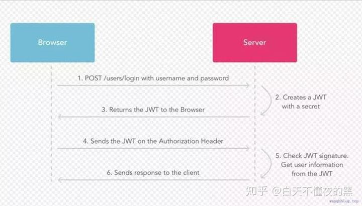
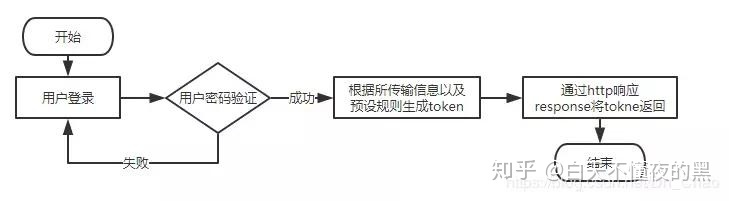
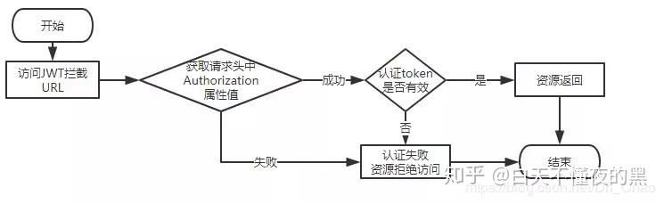
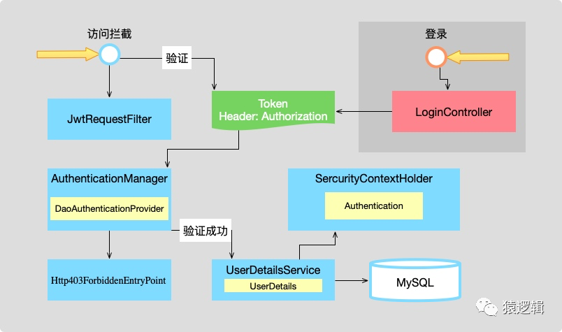
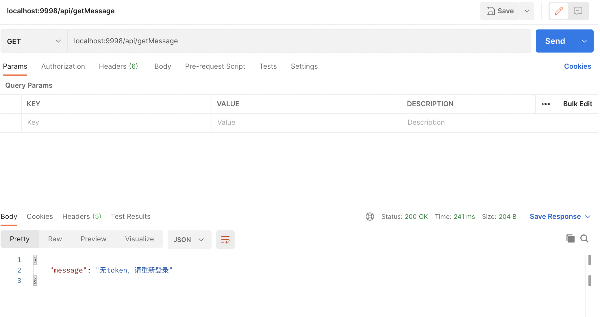
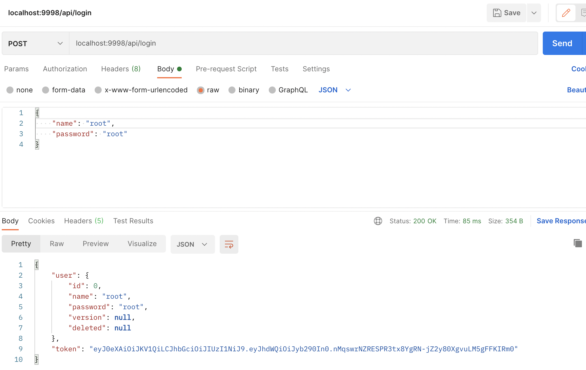

# ``SpringBoot``使用``JWT``完成``Token``验证

## 什么是``JWT``

> ``Json Web Token（JWT）``：``JSON``网络令牌，是为了在网络应用环境间传递声明而制定的一种基于``JSON``的开放标准``（(RFC 7519)``。``JWT``是一个轻便的安全跨平台传输格式，定义了一个紧凑的自包含的方式用于通信双方之间以 ``JSON ``对象行使安全的传递信息。因为数字签名的存在，这些信息是可信的。

广义上讲``JWT``是一个标准的名称；狭义上讲``JWT``指的就是用来传递的那个``token``字符串。


## ``JWT``的组成

> ``JWT``含有三个部分：

- 头部``（header）``(标题包含了令牌的元数据，并且包含签名和/或加密算法的类型)
- 载荷``（payload）``类似于飞机上承载的物品
- 签证``（signature）``

### 头部（``header``）

- 声明加密的算法:通常直接使用 ``HMAC SHA256``

- 加密算法是单向函数散列算法，常见的有``MD5、SHA、HAMC``。

- ``MD5(message-digest algorithm 5)`` （信息-摘要算法）缩写，广泛用于加密和解密技术，常用于文件校验。校验？不管文件多大，经过``MD5``后都能生成唯一的``MD5``值

- ``SHA (Secure Hash Algorithm，安全散列算法）``，数字签名等密码学应用中重要的工具，安全性高于``MD5``

- ``HMAC (Hash Message Authentication Code)``，散列消息鉴别码，基于密钥的``Hash``算法的认证协议。用公开函数和密钥产生一个固定长度的值作为认证标识，用这个标识鉴别消息的完整性。常用于接口签名验证

- 头部一般有两部分信息：类型、加密的算法（通常使用``HMAC SHA256``）

- 头部一般使用``base64``加密：``eyJ0eXAiOiJKV1QiLCJhbGciOiJIUzI1NiJ9``

解密后：
```json
{
    "typ":"JWT",
    "alg":"HS256"
}
```
### 载荷（``payload``）

该部分一般存放一些有效的信息。``JWT``的标准定义包含五个字段：

- ``iss``：该``JWT``的签发者
- ``sub``：该``JWT``所面向的用户
- ``aud``：接收该``JWT``的一方
- ``exp（expires）``：什么时候过期，这里是一个``Unit``的时间戳
- ``iat（issued at）``：在什么时候签发的

### 签证（``signature``）

``JWT``最后一个部分。该部分是使用了``HS256``加密后的数据；包含三个部分：

- ``header``(``base64``后的）
- ``payload``（``base64``后的）
- ``secret`` 私钥

``secret``是保存在服务器端的，``JWT``的签发生成也是在服务器端的，``secret``就是用来进行``JWT``的签发和``JWT``的验证，所以，它就是你服务端的秘钥，在任何场景都不应该流露出去。一旦客户端得知这个``secret``，那就意味着客户端可以自我签发``JWT``了。

## ``JWT``特点

- **紧凑**：意味着这个字符串很小，甚至可以放在``URL``参数，``POST Parameter``中以``Http Header``的方式传输。

- **自包含**：传输的字符串包含很多信息，别人拿到以后就不需要多次访问数据库获取信息，而且通过其中的信息就可以知道加密类型和方式（当然解密需要公钥和密钥）。

- **简洁(``Compact``)**: 可以通过``URL``，``POST``参数或者在``HTTP header``发送，因为数据量小，传输速度也很快
- 自包含(Self-contained)：负载中包含了所有用户所需要的信息，避免了多次查询数据库
- 因为Token是以JSON加密的形式保存在客户端的，所以JWT是跨语言的，原则上任何web形式都支持。
- 不需要在服务端保存会话信息，特别适用于分布式微服务。


## 如何使用``JWT``？

在身份鉴定的实现中，传统的方法是在服务端存储一个 ``session``，给客户端返回一个 ``cookie``，而使用``JWT``之后，当用户使用它的认证信息登录系统之后，会返回给用户一个``JWT``， 用户只需要本地保存该 ``token``（通常使用``localStorage``，也可以使用``cookie``）即可。

当用户希望访问一个受保护的路由或者资源的时候，通常应该在 ``Authorization`` 头部使用 ``Bearer ``模式添加``JWT``，其内容格式：

```json
Authorization: Bearer <token>
```

因为用户的状态在服务端内容中是不存储的，所以这是一种无状态的认证机制。服务端的保护路由将会检查请求头`` Authorization`` 中的``JWT``信息，如果合法，则允许用户的行为。由于``JWT``是 自包含的，因此，减少了需要查询数据库的需要。

``JWT``的这些特征使得我们可以完全依赖无状态的特性提供数据``API``服务。因为``JWT``并不使用``Cookie``的，所以你可以在任何域名提供你的``API``服务而不需要担心跨域资源共享问题``（CORS）``

下面的序列图展示了该过程：




中文流程介绍：

1. 用户使用账号和密码发出``POST``登录请求；
2. 服务器使用私钥创建一个``JWT``；
3. 服务器返回这个``JWT``给浏览器；
4. 浏览器将该``JWT``串放在请求头中向服务器发送请求；
5. 服务器验证该``JWT``；
6. 返回响应的资源给浏览器。
   
说了这么多``JWT``到底如何应用到我们的项目中，下面我们就使用``SpringBoot`` 结合 ``JWT``完成用户的登录验证。


应用流程

- 初次登录生成``JWT``流程图


- 用户访问资源流程图






## 搭建``SpringBoot + JWT``工程

下面通过代码来实现用户认证的功能，博主这里主要采用``Spring Boot``与``JWT``整合的方式实现。关于``Spring Boot``项目如何搭建与使用本章不做详细介绍。

### 1.``Maven``依赖

```xml
<!--jwt依赖-->
<!-- https://mvnrepository.com/artifact/com.auth0/java-jwt -->
<dependency>
    <groupId>com.auth0</groupId>
    <artifactId>java-jwt</artifactId>
    <version>3.10.3</version>
</dependency>

<!-- https://mvnrepository.com/artifact/com.alibaba/fastjson -->
<!-- fastJson 工具类-->
<dependency>
    <groupId>com.alibaba</groupId>
    <artifactId>fastjson</artifactId>
    <version>1.2.75</version>
</dependency>

<dependency>
    <groupId>org.springframework.boot</groupId>
    <artifactId>spring-boot-starter-web</artifactId>
</dependency>
```
### 2. 定义两个注解

> 用来跳过验证的``PassToken``
```java
@Target({ElementType.METHOD, ElementType.TYPE})
@Retention(RetentionPolicy.RUNTIME)
public @interface PassToken {
    boolean required() default true;
}
```
> 需要登录才能进行操作的注解``UserLoginToken``

```java
@Target({ElementType.METHOD, ElementType.TYPE})
@Retention(RetentionPolicy.RUNTIME)
public @interface UserLoginToken {
    boolean required() default true;
}
```

> ``@Target``注解的作用目标

```java
@Target(ElementType.TYPE)——接口、类、枚举、注解
@Target(ElementType.FIELD)——字段、枚举的常量
@Target(ElementType.METHOD)——方法
@Target(ElementType.PARAMETER)——方法参数
@Target(ElementType.CONSTRUCTOR) ——构造函数
@Target(ElementType.LOCAL_VARIABLE)——局部变量
@Target(ElementType.ANNOTATION_TYPE)——注解
@Target(ElementType.PACKAGE)——包
```

``@Retention``注解的保留位置

- ``RetentionPolicy.SOURCE``:这种类型的``Annotations``只在源代码级别保留,编译时就会被忽略,在``class``字节码文件中不包含。
- ``RetentionPolicy.CLASS``:这种类型的``Annotations``编译时被保留,默认的保留策略,在``class``文件中存在,但``JVM``将会忽略,运行时无法获得。
- ``RetentionPolicy.RUNTIME``:这种类型的``Annotations``将被``JVM``保留,所以他们能在运行时被JVM或其他使用反射机制的代码所读取和使用。
- ``@Document``：说明该注解将被包含在``javadoc``中
- ``@Inherited``：说明子类可以继承父类中的该注解


> 简单自定义一个实体类``User``,使用``lombok``简化实体类的编写

```java
@Data
@AllArgsConstructor
@NoArgsConstructor
public class User {
    String Id;
    String userName;
    String password;
}
```

需要写``token``的生成方法工具类

```java
public class GetToken {
    public static String getToken(User user){
        String token = "";
        token =  JWT.create().withAudience(user.getName())
                .sign(Algorithm.HMAC256(user.getPassword()));

        return token;
    }
}
```

``Algorithm.HMAC256():``使用``HS256``生成``token``,密钥则是用户的密码，唯一密钥的话可以保存在服务端。

``withAudience()``存入需要保存在token的信息，这里我把用户``userName``存入``token``中

接下来需要写一个拦截器去获取``token``并验证``token``

**写拦截器需要 实现 ``HandlerInterceptor``接口**

```java
public class AuthenticationInterceptor implements HandlerInterceptor {

    @Autowired
    private UserServiceImpl userService;

    @Override
    public boolean preHandle(HttpServletRequest request, HttpServletResponse response, Object handler) throws Exception {
        // 从 http 请求头中取出 token
        String token = request.getHeader("token");
        // 如果不是映射到方法直接通过
        if(!(handler instanceof HandlerMethod)){
            return true;
        }
        //如果是映射到方法，强转为 ``HandlerMethod`` 类型
        HandlerMethod handlerMethod = (HandlerMethod) handler;
        Method method = handlerMethod.getMethod();

        //检查是否有passtoken注释，有则跳过认证 
        if(method.isAnnotationPresent(passToken.class)){
            passToken passToken = method.getAnnotation(passToken.class);
            if(passToken.required()){
                //直接放
                return true;
            }
        }

        //检查有没有需要用户权限的注解
        if(method.isAnnotationPresent(UserLoginToken.class)){
            UserLoginToken userLoginToken = method.getAnnotation(UserLoginToken.class);
            if(userLoginToken.required()){
                // 执行认证
                if(token == null){
                    throw new RuntimeException("无token，请重新登录");
                }

                // 获取 token 中的 user Name
                String userName;
                try {
                    //进行解码 提取用户名
                    userName = JWT.decode(token).getAudience().get(0);
                } catch (JWTDecodeException e) {
                    throw new RuntimeException("401,未授权");
                }
                User user = userService.findUserByName(userName);
                if(user == null){
                    throw new RuntimeException("用户不存在，请重新登录");
                }
                // 验证 token 
                JWTVerifier jwtVerifier = JWT.require(Algorithm.HMAC256(user.getPassword())).build();

                try {
                    //验证 password部分
                    jwtVerifier.verify(token);
                } catch (JWTVerificationException e) {
                    throw new RuntimeException("401");
                }
                return true;

            }
        }
        return true;
    }
    @Override
    public void postHandle(HttpServletRequest request, HttpServletResponse response, Object handler, ModelAndView modelAndView) throws Exception {

    }

    @Override
    public void afterCompletion(HttpServletRequest request, HttpServletResponse response, Object handler, Exception ex) throws Exception {
    }
}
```
实现一个拦截器就需要实现``HandlerInterceptor``接口
``HandlerInterceptor``接口主要定义了三个方法

- 1. ``boolean preHandle ()``：

    预处理回调方法,实现处理器的预处理，第三个参数为响应的处理器,自定义``Controller``,返回值为``true``表示继续流程（如调用下一个拦截器或处理器）或者接着执行``postHandle()``和``afterCompletion()``；``false``表示流程中断，不会继续调用其他的拦截器或处理器，中断执行。

2. ``void postHandle()：``

    后处理回调方法，实现处理器的后处理（DispatcherServlet进行视图返回渲染之前进行调用），此时我们可以通过modelAndView（模型和视图对象）对模型数据进行处理或对视图进行处理，modelAndView也可能为null。

3. ``void afterCompletion():``

    整个请求处理完毕回调方法,该方法也是需要当前对应的``Interceptor``的``preHandle()``的返回值为``true``时才会执行，也就是在``DispatcherServlet``渲染了对应的视图之后执行。用于进行资源清理。

    整个请求处理完毕回调方法。如性能监控中我们可以在此记录结束时间并输出消耗时间，还可以进行一些资源清理，类似于``try-catch-finally``中的``finally``，但仅调用处理器执行链中

主要流程:

- 从 ``http`` 请求头中取出 ``token``，
- 判断是否映射到方法
- 检查是否有``passtoken``注释，有则跳过认证
- 检查有没有需要用户登录的注解，有则需要取出并验证
- 认证通过则可以访问，不通过会报相关错误信息

## 配置拦截器
在配置类上添加了注解``@Configuration``，标明了该类是一个配置类并且会将该类作为一个``SpringBean``添加到``IOC``容器内。

```java
@Configuration
public class InterceptorConfig implements WebMvcConfigurer {

    @Override
    public void addInterceptors(InterceptorRegistry registry) {
        registry.addInterceptor(authenticationInterceptor())
                .addPathPatterns("/**");    // 拦截所有请求，通过判断是否有 @LoginRequired 注解 决定是否需要登录
    }

    @Bean
    public AuthenticationInterceptor authenticationInterceptor(){
        return new AuthenticationInterceptor();
    }
}
```
``InterceptorRegistry``内的``addInterceptor``需要一个实现``HandlerInterceptor``接口的拦截器实例，``addPathPatterns``方法用于设置拦截器的过滤路径规则。


``service``中的 简单验证方法

```java
@Override
public User findUserByName(String name) {
    User user = new User();
    user.setName("root");
    user.setPassword("root");
    if (name.equals(user.getName())){
        return user;
    }
    return null;
}
```

``controller``示例方法

```java
@Slf4j
@RestController
@RequestMapping("/api")
public class JWTController {

    @Autowired
    private UserServiceImpl userService;//登录

    @PostMapping("/login")
    public Object login(@RequestBody User user) {

        log.info(String.valueOf(user));
        // JSON 对象
        JSONObject jsonObject = new JSONObject();
        User userByName = userService.findUserByName(user.getName());
        if (userByName == null) {
            jsonObject.put("message", "登录失败,用户不存在");
            return jsonObject;
        } else {
            if (!userByName.getPassword().equals(user.getPassword())) {
                jsonObject.put("message", "登录失败,密码错误");
                return jsonObject;
            } else {
                //验证Token
                String token = GetToken.getToken(user);
                jsonObject.put("token", token);
                jsonObject.put("user", userByName);
                return jsonObject;
            }
        }
    }
    @UserLoginToken
    @GetMapping("/getMessage")
    public String getMessage(){
        return "你已通过验证";
    }
}
```

不加注解的话默认不验证，登录接口一般是不验证的。在``getMessage()``中我加上了登录注解，说明该接口必须登录获取``token``后，在请求头中加上``token``并通过验证才可以访问

<hr/>

🌟 这边还需要使用一个异常处理排除配置，主要就是将后端爆出的异常返回给前端

一下是一个简单的示例

```java
@ControllerAdvice
public class GloablExceptionHandler {

    @ResponseBody
    @ExceptionHandler(Exception.class)
    public Object handleException(Exception e) {
        String msg = e.getMessage();
        if (msg == null || msg.equals("")) {
            msg = "服务器出错";
        }
        JSONObject jsonObject = new JSONObject();
        jsonObject.put("message", msg);
        return jsonObject;
    }
}
```


## 程序验证(使用``PostMan``)

``params`` 是会拼接在 ``url``中

``body`` 是直接带的参数，不会``url``中

有些接口请求之前需要有前置条件，比如购买接口请求时就要先验证是否账户处于登录状态，是否安全之类的，这时我们就需要登录``Cookie``来登录，方法是在其他端登录之后，抓包获得登录``Cookie``，在``header``里新建一个参数``Cookies``，值为抓包获得的``Cookie``值

例如本示例中的``token``验证需要将``token``带在``header``中

1. 首先没有``token``,走需要验证的 ``getMessage()``方法


    


2. 走 ``login`` 方法 ，获取相应的 ``token``

    

    采用 ``POST``中的``raw``传送 ``JSON``的形式

3. 然后我们将这个``token``中带入``header``调用``getMessage()``

    


    **注意:这里的``key``一定不能错，因为在拦截器中是取关键字``token``的值``String token = httpServletRequest.getHeader("token");``**

    加上``token``之后就可以顺利通过验证和进行接口访问了


