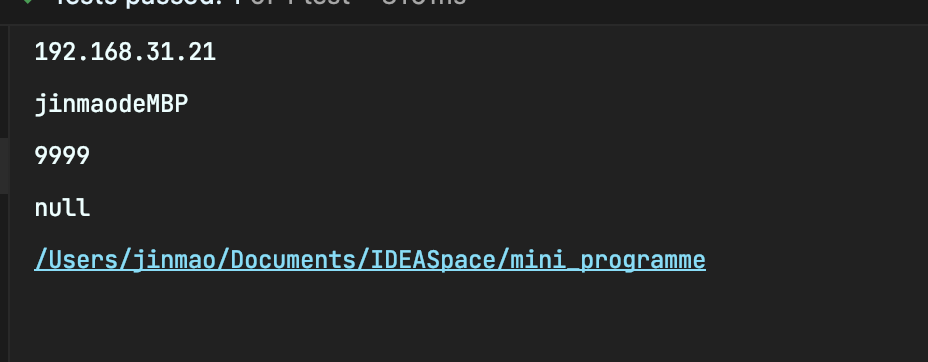

# 关于获取``IP``，端口号，项目更路径等等

上代码

```java
@Autowired
private Environment environment;

@Test
void getPro() throws UnknownHostException {

    //获取IP
    System.out.println(InetAddress.getLocalHost().getHostAddress());


    //获取服务器名字
    System.out.println(InetAddress.getLocalHost().getHostName());


    //获取端口
    System.out.println(environment.getProperty("server.port"));


    //应用的上下文路径，也可以称为项目路径，是构成``url``地址的一部分
    System.out.println(environment.getProperty("server.servlet.context-path"));


    //获取项目的全路径
    System.out.println(System.getProperty("user.dir"));
}
```



