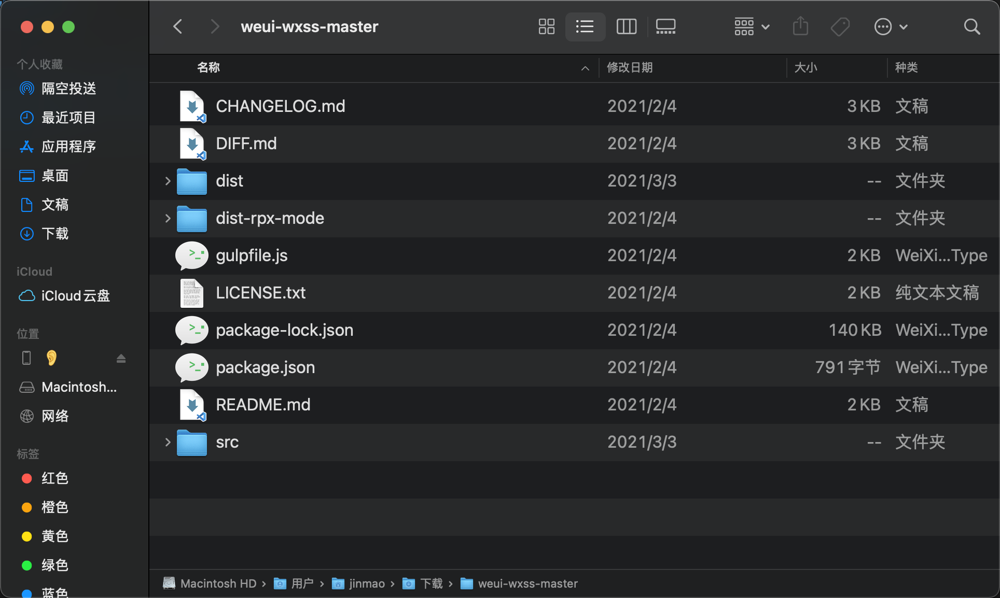
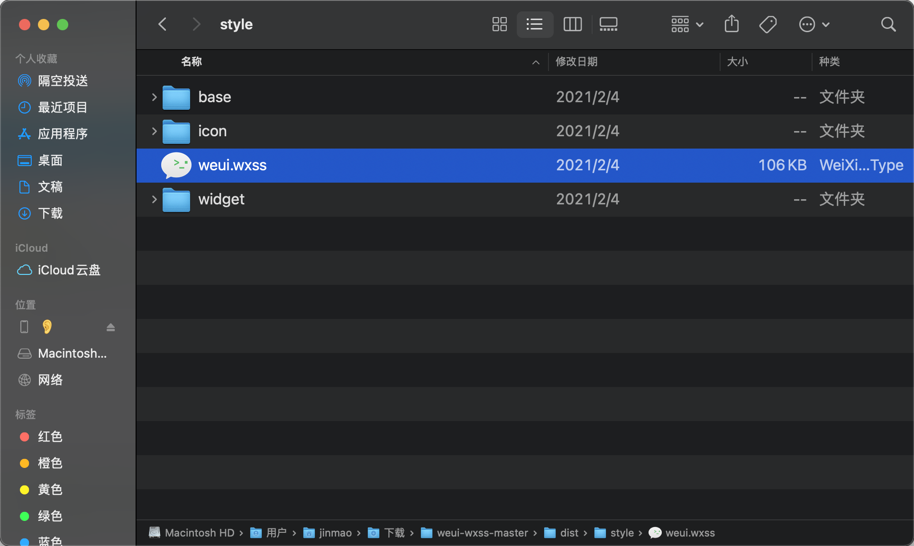
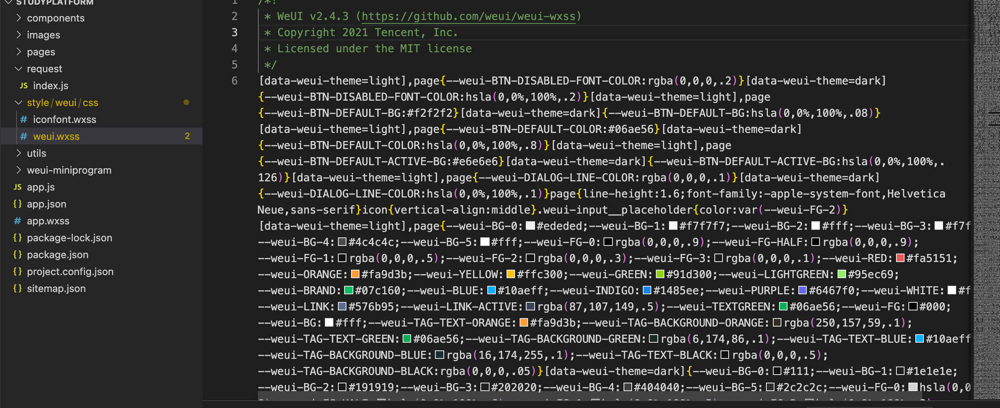
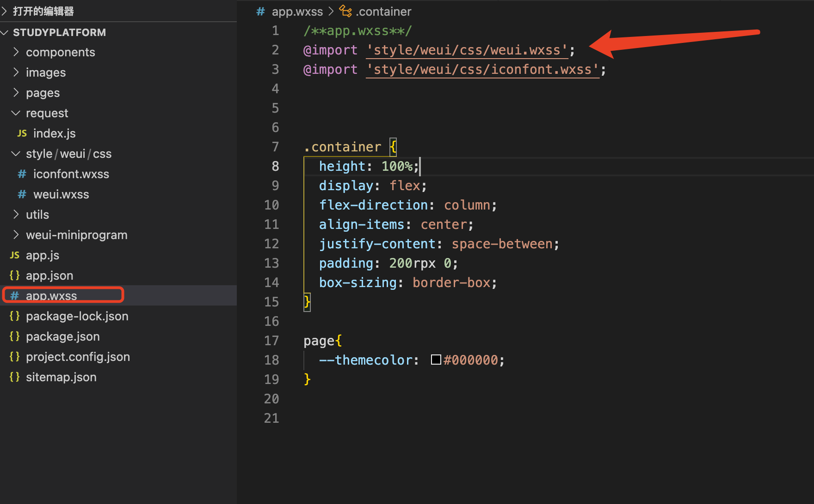
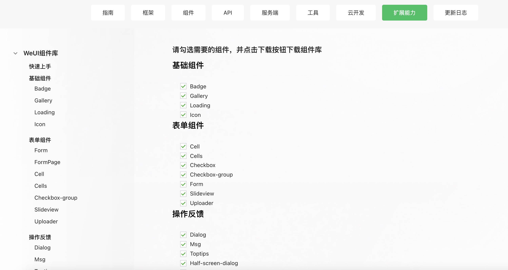

# 微信小程序引入框架``WeUI``

## 使用步骤

>1. 在``GitHub``上 https://github.com/weui/weui-wxss/ 下载程序代码，解压后可以看到如下目录：




> 2. 我们只需要将``weui-wxss-master\dist\style\weui.wxss``文件导入到小程序项目的根目录下：







一般都是会建一个``style/weui/css/`` 然后导``weui.wxss``文件

> 4. 在项目中引用：在全局``app.wxss``中加入``weui.wxss``的引用- ``@import "weui.wxss"``;




> 5. 如果要使用相应的组件，则参考[相应文档](https://developers.weixin.qq.com/miniprogram/dev/extended/weui/quickstart.html)

首先需要将 https://developers.weixin.qq.com/miniprogram/dev/extended/weui/download.html 中的组件都下载导入




然后在使用该组件的页面注册即可

- 在页面中引入 ``dialog ``弹窗组件

- 首先在页面的 ``json`` 文件加入 ``usingComponents`` 配置字段
  ```json
    {
    "usingComponents": {
        "mp-dialog": "weui-miniprogram/dialog/dialog"
      }
    }
  ```
- 然后可以在对应页面的 ``wxml`` 中直接使用该组件
    ```html
    <mp-dialog title="test" show="{{true}}" bindbuttontap="tapDialogButton" buttons="{{[{text: '取消'}, {text: '确认'}]}}">
        <view>test content</view>
    </mp-dialog>
    ```

## 粗略讲解

### 1. 根组件使用``class=”page”``

```html
<view class="page"></view>
```
### 2. 页面骨架
```html
<view class="page">
<view class="page__hd"></view><!--页头-->
<view class="page__bd"></view><!--主体-->
<view></view><!--未设置页脚-->
</view>
```

### 3. 除此之外都是按照``weui``-开头后接组件名称，例如``class=”weui-footer”``

```html
<view class="weui-footer">我是页脚</view>
```


