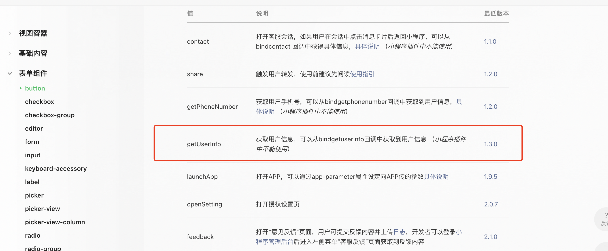
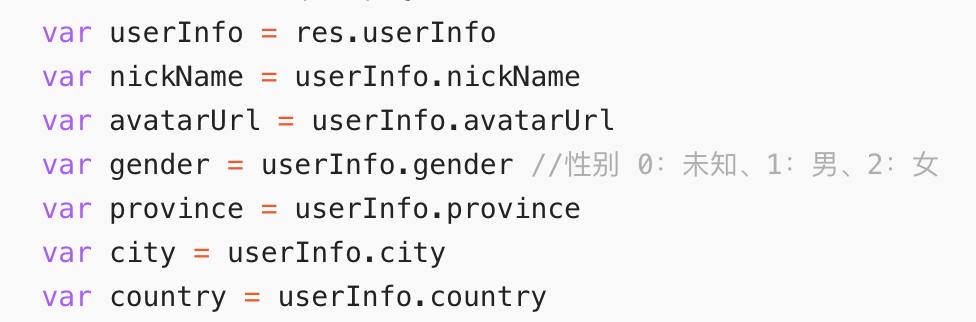
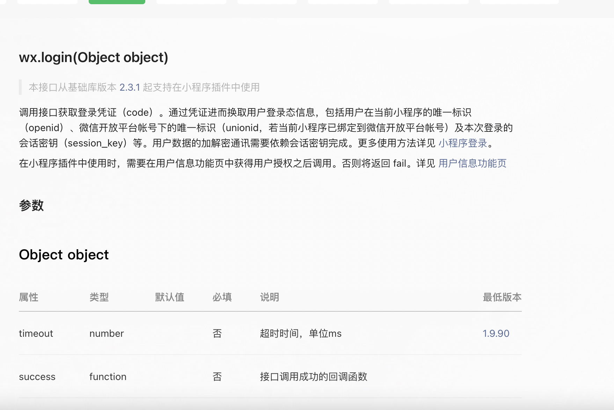
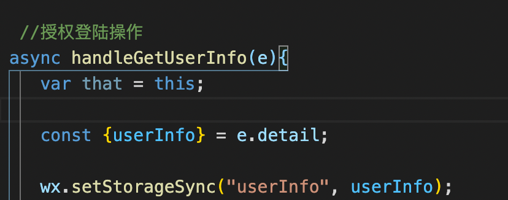
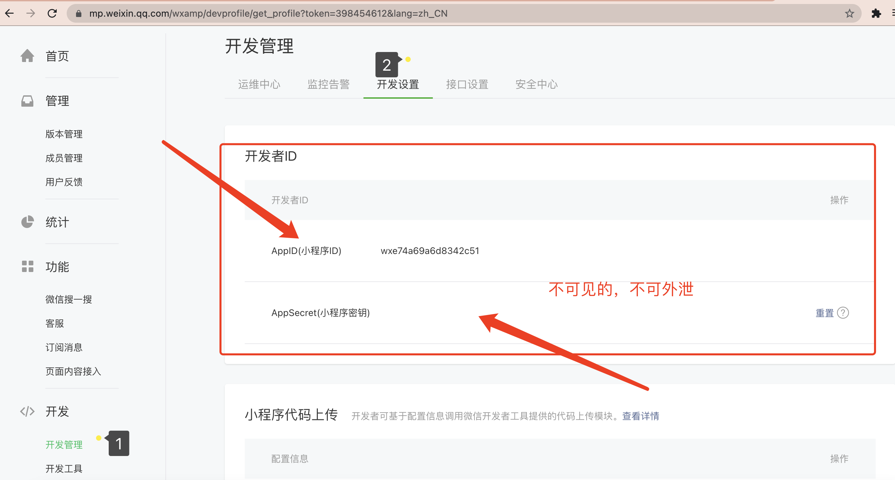

# 小程序通过按钮获取用户信息




一般微信小程序都是通过一个按钮来授权获得基本信息，``button`` 按钮中属性 ``open-type`` 有一个``getUserInfo``然后授权之后，通过 回调函数 ``bindgetuserinfo`` 中获得基本信息








```html
<button open-type="getUserInfo" bindgetuserinfo="handleGetUserInfo" class="weui-btn weui-btn_primary">授权微信登陆</button>
```



``e.detail``就是获取到的基本信息


# 微信小程序获取``openId``

微信中的获取用户唯一标识有 ``openId`` 和 ``sessionId`` 两个，一般都是采用 ``openId`` 作为唯一标识

通过 ``api`` ``wx.login``  获取``jscode`` 传送至后端 ，后端调用相应的接口即可获得用户唯一标识。

小程序前端
```js
getOpenID: function(e){
    var that = this;
    wx.login({
      success: (result)=>{
        if(result.code){
          var reqTask = wx.request({
              //url 为自己后端的接口地址
            url: 'http://localhost:9999/userInfo/getOpenId',
            data: {
                //传送的jscode
              code: result.code
            },
            header: {'content-type':'application/json'},
            method: 'GET',
            dataType: 'json',
            responseType: 'text',
            success: (result)=>{
              //将openId存入缓存,提前做好判空处理
              if(result.data.length == 0){
                result;
              }else{
                wx.setStorageSync("openId", result.data);
              }
             //console.log(result);
            },
            fail: ()=>{},
            complete: ()=>{}
          });
        }else{
          console.log("获取openId失败！！！");
        }
      }
    });
  }
```
后端：

这边采用的``Java``

后端是``SpringBoot``工程

## 获取 ``appid`` 以及相应的 ``secretId``

打开微信小程序平台





``Maven``依赖

其中``http`` 相关的依赖为了工具类中使用``CloseableHttpClient``创建相应的``http``请求


```xml
<dependency>
    <groupId>org.springframework.boot</groupId>
    <artifactId>spring-boot-starter-web</artifactId>
</dependency>

<!-- https://mvnrepository.com/artifact/org.apache.httpcomponents/httpcore -->
<dependency>
    <groupId>org.apache.httpcomponents</groupId>
    <artifactId>httpcore</artifactId>
    <version>4.4.14</version>
</dependency>

<!-- https://mvnrepository.com/artifact/org.apache.httpcomponents/httpclient -->
<dependency>
    <groupId>org.apache.httpcomponents</groupId>
    <artifactId>httpclient</artifactId>
    <version>4.5.13</version>
</dependency>
```

```java
@Component
@Slf4j
public class GetOpenIdUtils {

    //需要调用的小程序官方api
    private String url = "https://api.weixin.qq.com/sns/jscode2session";
    String res = "";

    public String getUserInfo(String jsCode) throws IOException {

        //log.info("jsCode为" + jsCode);

        //开始拼接参数
        url += "?appid=wxe74a69a6d8342c51";//获取到的appid
        url += "&secret=dc25a12fed16dc7fa296dae381f74f48";//获取到的secretId
        url += "&js_code=" + jsCode;//前端传送过来的 jscode
        url += "&grant_type=authorization_code"; //固定的

        log.info("解析code请求参数: " + url);
        // DefaultHttpClient();
        CloseableHttpClient httpClient = HttpClientBuilder.create().build();
        //Get请求方式
        HttpGet httpGet = new HttpGet(url);

        CloseableHttpResponse response = null;

        // 配置信息
        RequestConfig requestConfig = RequestConfig.custom()          // 设置连接超时时间(单位毫秒)
                .setConnectTimeout(5000)                    // 设置请求超时时间(单位毫秒)
                .setConnectionRequestTimeout(5000)             // socket读写超时时间(单位毫秒)
                .setSocketTimeout(5000)                    // 设置是否允许重定向(默认为true)
                .setRedirectsEnabled(false).build();           // 将上面的配置信息 运用到这个Get请求里
        httpGet.setConfig(requestConfig);                         // 由客户端执行(发送)Get请求
        response = httpClient.execute(httpGet);                   // 从响应模型中获取响应实体

        HttpEntity responseEntity = response.getEntity();
        //System.out.println("响应状态为:" + response.getStatusLine());
        if (responseEntity != null) {
            res = EntityUtils.toString(responseEntity);
            //System.out.println("响应内容长度为:" + responseEntity.getContentLength());
            System.out.println("响应内容为:" + res);
        }
        // 释放资源
        if (httpClient != null) {
            httpClient.close();
        }
        if (response != null) {
            response.close();
        }
        JSONObject jsonObject = JSON.parseObject(res);
       // System.out.println("返回的json为 : "+jsonObject);
        String openid = jsonObject.getString("openid");
        //System.out.println("openid" + openid);
        return openid;
    }
}
```

就可以成功获取``openId``啦


