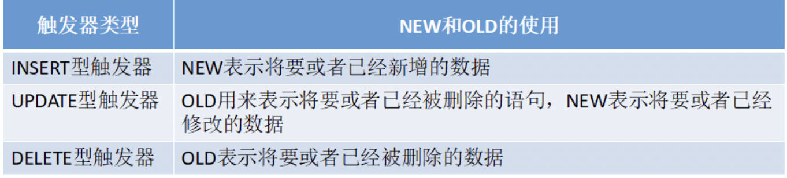

# 数据库相关的学习踩坑集锦

## Navicat操作Mysql


### 对系统的时间的相关操作

``MYSQL`` 获取当前日期及日期格式

获取系统日期： ``NOW()``

格式化日期： ``DATE_FORMAT(date, format)``

注： ``date``：时间字段

``format``：日期格式
```sql
# 返回系统日期,输出 ``2009-12-25 14:38:59``
select now();
# 输出 09-12-25
select date_format(now(),'%y-%m-%d');
```

```sql
根据format字符串格式化date值:

%S, %s 两位数字形式的秒（ 00,01, ..., 59）
%I, %i 两位数字形式的分（ 00,01, ..., 59）
%H 两位数字形式的小时，24 小时（00,01, ..., 23）
%h 两位数字形式的小时，12 小时（01,02, ..., 12）
%k 数字形式的小时，24 小时（0,1, ..., 23）
%l 数字形式的小时，12 小时（1, 2, ..., 12）
%T 24 小时的时间形式（hh:mm:ss）
%r 12 小时的时间形式（hh:mm:ss AM 或hh:mm:ss PM）
%p AM或PM
%W 一周中每一天的名称（Sunday, Monday, ..., Saturday）
%a 一周中每一天名称的缩写（Sun, Mon, ..., Sat）
%d 两位数字表示月中的天数（00, 01,..., 31）
%e 数字形式表示月中的天数（1, 2， ..., 31）
%D 英文后缀表示月中的天数（1st, 2nd, 3rd,...）
%w 以数字形式表示周中的天数（ 0 = Sunday, 1=Monday, ..., 6=Saturday）
%j 以三位数字表示年中的天数（ 001, 002, ..., 366）
%U 周（0, 1, 52），其中Sunday 为周中的第一天
%u 周（0, 1, 52），其中Monday 为周中的第一天
%M 月名（January, February, ..., December）
%b 缩写的月名（ January, February,...., December）
%m 两位数字表示的月份（01, 02, ..., 12）
%c 数字表示的月份（1, 2, ...., 12）
%Y 四位数字表示的年份
%y 两位数字表示的年份
%% 直接值“%”
```

> 获取当前日期

```sql
#MySQL 获得当前日期时间 函数
#1.1 获得当前日期+时间（date + time）函数：now()

mysql> select now();

+---------------------+
| now() |
+---------------------+
| 2008-08-08 22:20:46 |
+---------------------+
#除了 now() 函数能获得当前的日期时间外，MySQL 中还有下面的函数：

current_timestamp()
,current_timestamp
,localtime()
,localtime
,localtimestamp -- (v4.0.6)
,localtimestamp() -- (v4.0.6)
#这些日期时间函数，都等同于 now()。鉴于 now() 函数简短易记，建议总是使用 now() 来替代上面列出的函数。
```

> MySQL 日期时间 Extract（选取） 函数

```sql
#选取日期时间的各个部分：日期、时间、年、季度、月、日、小时、分钟、秒、微秒

set @dt = '2008-09-10 07:15:30.123456';

select date(@dt); -- 2008-09-10
select time(@dt); -- 07:15:30.123456
select year(@dt); -- 2008
select quarter(@dt); -- 3
select month(@dt); -- 9
select week(@dt); -- 36
select day(@dt); -- 10
select hour(@dt); -- 7
select minute(@dt); -- 15
select second(@dt); -- 30
select microsecond(@dt); -- 123456
#2. MySQL Extract() 函数，可以上面实现类似的功能：

set @dt = '2008-09-10 07:15:30.123456';

select extract(year from @dt); -- 2008
select extract(quarter from @dt); -- 3
select extract(month from @dt); -- 9
select extract(week from @dt); -- 36
select extract(day from @dt); -- 10
select extract(hour from @dt); -- 7
select extract(minute from @dt); -- 15
select extract(second from @dt); -- 30
select extract(microsecond from @dt); -- 123456select extract(year_month from @dt); -- 200809
select extract(day_hour from @dt); -- 1007
select extract(day_minute from @dt); -- 100715
select extract(day_second from @dt); -- 10071530
select extract(day_microsecond from @dt); -- 10071530123456
select extract(hour_minute from @dt); -- 715
select extract(hour_second from @dt); -- 71530
select extract(hour_microsecond from @dt); -- 71530123456
select extract(minute_second from @dt); -- 1530
select extract(minute_microsecond from @dt); -- 1530123456
select extract(second_microsecond from @dt); -- 30123456
#MySQLExtract() 函数除了没有date(),time() 的功能外，其他功能一应具全。并且还具有选取‘day_microsecond’等功能。注意这里不是只选取 day 和 microsecond，而是从日期的 day 部分一直选取到 microsecond 部分。够强悍的吧！

#MySQL Extract() 函数唯一不好的地方在于：你需要多敲几次键盘。
```

> 返回日期的位置

```sql

#3. MySQL dayof… 函数：dayofweek(), dayofmonth(), dayofyear()

#分别返回日期参数，在一周、一月、一年中的位置。

set @dt = '2008-08-08';

select dayofweek(@dt); -- 6
select dayofmonth(@dt); -- 8
select dayofyear(@dt); -- 221
#日期 ‘2008-08-08′ 是一周中的第 6 天（1 = Sunday, 2 = Monday, …, 7 = Saturday）；一月中的第 8 天；一年中的第 221 天。

#4. MySQL week… 函数：week(), weekofyear(), dayofweek(), weekday(), yearweek()

set @dt = '2008-08-08';

select week(@dt); -- 31
select week(@dt,3); -- 32
select weekofyear(@dt); -- 32

select dayofweek(@dt); -- 6
select weekday(@dt); -- 4

select yearweek(@dt); -- 200831
#MySQL week() 函数，可以有两个参数，具体可看手册。 weekofyear() 和 week() 一样，都是计算“某天”是位于一年中的第几周。 weekofyear(@dt) 等价于 week(@dt,3)。

#MySQLweekday() 函数和 dayofweek() 类似，都是返回“某天”在一周中的位置。不同点在于参考的标准， weekday：(0 =Monday, 1 = Tuesday, …, 6 = Sunday)； dayofweek：（1 = Sunday, 2 = Monday,…, 7 = Saturday）

#MySQL yearweek() 函数，返回 year(2008) + week 位置(31)。

#5. MySQL 返回星期和月份名称函数：dayname(), monthname()

set @dt = '2008-08-08';

select dayname(@dt); -- Friday
select monthname(@dt); -- August
#思考，如何返回中文的名称呢？

#6. MySQL last_day() 函数：返回月份中的最后一天。

select last_day('2008-02-01'); -- 2008-02-29
select last_day('2008-08-08'); -- 2008-08-31
#MySQL last_day() 函数非常有用，比如我想得到当前月份中有多少天，可以这样来计算：

mysql> select now(), day(last_day(now())) as days;

+---------------------+------+
| now() | days |
+---------------------+------+
| 2008-08-09 11:45:45 | 31 |
+---------------------+------+

```

> 日期相减

```sql
#4. MySQL 日期、时间相减函数：datediff(date1,date2), timediff(time1,time2)

MySQL datediff(date1,date2)：--两个日期相减 date1 - date2，返回天数。

select datediff('2008-08-08', '2008-08-01'); -- 7
select datediff('2008-08-01', '2008-08-08'); -- -7
#MySQL timediff(time1,time2)：两个日期相减 time1 - time2，返回 time 差值。

select timediff('2008-08-08 08:08:08', '2008-08-08 00:00:00'); -- 08:08:08
select timediff('08:08:08', '00:00:00'); -- 08:08:08
#注意：timediff(time1,time2) 函数的两个参数类型必须相同。
```


> MySQL 日期转换函数、时间转换函数

```sql
# 1. MySQL （时间、秒）转换函数：time_to_sec(time), sec_to_time(seconds)

select time_to_sec('01:00:05'); -- 3605
select sec_to_time(3605); -- '01:00:05'
#2. MySQL （日期、天数）转换函数：to_days(date), from_days(days)

select to_days('0000-00-00'); -- 0
select to_days('2008-08-08'); -- 733627select from_days(0); -- '0000-00-00'
select from_days(733627); -- '2008-08-08'
#3. MySQL Str to Date （字符串转换为日期）函数：str_to_date(str, format)

select str_to_date('08/09/2008', '%m/%d/%Y'); -- 2008-08-09
select str_to_date('08/09/08' , '%m/%d/%y'); -- 2008-08-09
select str_to_date('08.09.2008', '%m.%d.%Y'); -- 2008-08-09
select str_to_date('08:09:30', '%h:%i:%s'); -- 08:09:30
select str_to_date('08.09.2008 08:09:30', '%m.%d.%Y %h:%i:%s'); -- 2008-08-09 08:09:30
#可以看到，str_to_date(str,format) 转换函数，可以把一些杂乱无章的字符串转换为日期格式。另外，它也可以转换为时间。“format” 可以参看 MySQL 手册。

#4. MySQL Date/Time to Str（日期/时间转换为字符串）函数：date_format(date,format), time_format(time,format)

mysql> select date_format('2008-08-08 22:23:00', '%W %M %Y');

+------------------------------------------------+
| date_format('2008-08-08 22:23:00', '%W %M %Y') |
+------------------------------------------------+
| Friday August 2008 |
+------------------------------------------------+mysql> select date_format('2008-08-08 22:23:01', '%Y%m%d%H%i%s');

+----------------------------------------------------+
| date_format('2008-08-08 22:23:01', '%Y%m%d%H%i%s') |
+----------------------------------------------------+
| 20080808222301 |
+----------------------------------------------------+mysql> select time_format('22:23:01', '%H.%i.%s');

+-------------------------------------+
| time_format('22:23:01', '%H.%i.%s') |
+-------------------------------------+
| 22.23.01 |
+-------------------------------------+
#MySQL 日期、时间转换函数：date_format(date,format), time_format(time,format) 能够把一个日期/时间转换成各种各样的字符串格式。它是 str_to_date(str,format) 函数的 一个逆转换。

#5. MySQL 获得国家地区时间格式函数：get_format()

#MySQL get_format() 语法：

#get_format(date|time|datetime, 'eur'|'usa'|'jis'|'iso'|'internal'
#MySQL get_format() 用法的全部示例：

select get_format(date,'usa') ; -- '%m.%d.%Y'
select get_format(date,'jis') ; -- '%Y-%m-%d'
select get_format(date,'iso') ; -- '%Y-%m-%d'
select get_format(date,'eur') ; -- '%d.%m.%Y'
select get_format(date,'internal') ; -- '%Y%m%d'
select get_format(datetime,'usa') ; -- '%Y-%m-%d %H.%i.%s'
select get_format(datetime,'jis') ; -- '%Y-%m-%d %H:%i:%s'
select get_format(datetime,'iso') ; -- '%Y-%m-%d %H:%i:%s'
select get_format(datetime,'eur') ; -- '%Y-%m-%d %H.%i.%s'
select get_format(datetime,'internal') ; -- '%Y%m%d%H%i%s'
select get_format(time,'usa') ; -- '%h:%i:%s %p'
select get_format(time,'jis') ; -- '%H:%i:%s'
select get_format(time,'iso') ; -- '%H:%i:%s'
select get_format(time,'eur') ; -- '%H.%i.%s'
select get_format(time,'internal') ; -- '%H%i%s'
#MySQL get_format() 函数在实际中用到机会的比较少。

#6. MySQL 拼凑日期、时间函数：makdedate(year,dayofyear), maketime(hour,minute,second)

select makedate(2001,31); -- '2001-01-31'
select makedate(2001,32); -- '2001-02-01'select maketime(12,15,30); -- '12:15:30' 五、MySQL 时间戳（Timestamp）函数
```

### 触发器的使用

由于想要要在插入时，直接插入当前系统的时间，所以想到使用触发器的来实现这个目标

**但是，一般触发器都是用来操作日志表之类的，也就是说，触发器一般都不会操作本表，进行一些数据补入操作时，都要使用NEW或者OLD**

然后触发器的语法:
```sql
CREATE TRIGGER trigger_name trigger_time trigger_event ON tb_name FOR EACH ROW trigger_stmt
#trigger_name：触发器的名称
#tirgger_time：触发时机，为BEFORE或者AFTER
#trigger_event：触发事件，为INSERT、DELETE或者UPDATE
#tb_name：表示建立触发器的表明，就是在哪张表上建立触发器
#trigger_stmt：触发器的程序体，可以是一条SQL语句或者是用BEGIN和END包含的多条语句
#所以可以说MySQL创建以下六种触发器：
BEFORE INSERT,BEFORE DELETE,BEFORE UPDATE
AFTER INSERT,AFTER DELETE,AFTER UPDATE
```
其中，触发器名参数指要创建的触发器的名字

``BEFORE``和``AFTER``参数指定了触发执行的时间，在事件之前或是之后

``FOR EACH ROW``表示任何一条记录上的操作满足触发事件都会触发该触发器

> 创建有多个执行语句的触发器

```sql
CREATE TRIGGER 触发器名 BEFORE|AFTER 触发事件
ON 表名 FOR EACH ROW
BEGIN
    执行语句列表
END
```

其中，``BEGIN``与``END``之间的执行语句列表参数表示需要执行的多个语句，不同语句用分号隔开

**``tips``**：一般情况下，``mysql``默认是以 ``;`` 作为结束执行语句，与触发器中需要的分行起冲突

　　   为解决此问题可用``DELIMITER``，如：``DELIMITER ||``，可以将结束符号变成``||``

　　   当触发器创建完成后，可以用``DELIMITER ;``来将结束符号变成``;``

```sql
mysql> DELIMITER ||
mysql> CREATE TRIGGER demo BEFORE DELETE
    -> ON users FOR EACH ROW
    -> BEGIN
    -> INSERT INTO logs VALUES(NOW());
    -> INSERT INTO logs VALUES(NOW());
    -> END
    -> ||
Query OK, 0 rows affected (0.06 sec)

mysql> DELIMITER ;
```


> 关于 NEW 和 OLD 的使用




 根据以上的表格，可以使用一下格式来使用相应的数据：

```sql
NEW.columnname：--新增行的某列数据
OLD.columnname：--删除行的某列数据
```

样例：

```sql
# 创建用户表
CREATE TABLE `users` (
  `id` int(11) unsigned NOT NULL AUTO_INCREMENT,
  `name` varchar(255) CHARACTER SET utf8mb4 DEFAULT NULL,
  `add_time` int(11) DEFAULT NULL,
  PRIMARY KEY (`id`),
  KEY `name` (`name`(250)) USING BTREE
) ENGINE=MyISAM AUTO_INCREMENT=1000001 DEFAULT CHARSET=latin1;

# 创建日志表
CREATE TABLE `logs` (
  `Id` int(11) NOT NULL AUTO_INCREMENT,
  `log` varchar(255) DEFAULT NULL COMMENT '日志说明',
  PRIMARY KEY (`Id`)
) ENGINE=InnoDB DEFAULT CHARSET=utf8mb4 COMMENT='日志表';
```

需求是：当在users中插入一条数据，就会在logs中生成一条日志信息。

创建触发器
```sql
DELIMITER $
CREATE TRIGGER user_log AFTER INSERT ON users FOR EACH ROW
BEGIN
DECLARE s1 VARCHAR(40)character set utf8;
DECLARE s2 VARCHAR(20) character set utf8;#后面发现中文字符编码出现乱码，这里设置字符集
SET s2 = " is created";
SET s1 = CONCAT(NEW.name,s2);     #函数CONCAT可以将字符串连接
INSERT INTO logs(log) values(s1);
END $
DELIMITER ;
```

#### 其他触发器小语法
> 查看触发器

```sql
#和查看数据库（show databases;）查看表格（show tables;）一样，查看触发器的语法如下：

SHOW TRIGGERS [FROM schema_name];
#其中，schema_name 即 Schema 的名称，在 MySQL 中 Schema 和 Database 是一样的，也就是说，可以指定数据库名，这样就不必先“USE database_name;”了。
```

> 删除触发器

```sql
#和删除数据库、删除表格一样，删除触发器的语法如下：

DROP TRIGGER [IF EXISTS] [schema_name.]trigger_name
```
> 触发器的执行顺序

```sql
#我们建立的数据库一般都是 InnoDB 数据库，其上建立的表是事务性表，也就是事务安全的。这时，若SQL语句或触发器执行失败，MySQL 会回滚事务，有：

#①如果 BEFORE 触发器执行失败，SQL 无法正确执行。
#②SQL 执行失败时，AFTER 型触发器不会触发。
#③AFTER 类型的触发器执行失败，SQL 会回滚
```

==限制和注意事项==
触发器会有以下两种限制：
- 1.触发程序不能调用将数据返回客户端的存储程序，也不能使用采用``CALL``语句的动态``SQL``语句，但是允许存储程序通过参数将数据返回触发程序，也就是存储过程或者函数通过``OUT``或者``INOUT``类型的参数将数据返回触发器是可以的，但是不能调用直接返回数据的过程。

- 2.不能再触发器中使用以显示或隐式方式开始或结束事务的语句，如``START TRANS-ACTION,COMMIT或ROLLBACK``。

**注意事项**：``MySQL``的触发器是按照``BEFORE``触发器、行操作、``AFTER``触发器的顺序执行的，其中任何一步发生错误都不会继续执行剩下的操作，如果对事务表进行的操作，如果出现错误，那么将会被回滚，如果是对非事务表进行操作，那么就无法回滚了，数据可能会出错。

### mysql 书写存储过程

在navicat中，新建函数就是新建了存储过程：

一般来说，先定义一个结束分隔符，控制sql语句的执行：

```sql
delimiter $      --意思是用$作为sql语句的结束符
```


```sql
delimiter $      
CREATE DEFINER = CURRENT_USER PROCEDURE `NewProc`( )
BEGIN
  #Routine body goes here...

END;

```
或者新建一个查询：
```sql
delimiter $      
 CREATE PROCEDURE 'NewProc'(
     BEGIN
        ...
     END
 )
 ```

 > 参数

``MySQL``存储过程的参数用在存储过程的定义，共有三种参数类型,``IN,OUT,INOUT``,形式如： 

``CREATE PROCEDURE([[IN |OUT |INOUT ] 参数名 数据类形...]) ``

``IN`` 输入参数:表示该参数的值必须在调用存储过程时指定，在存储过程中修改该参数的值不能被返回，为默认值 

``OUT`` 输出参数:该值可在存储过程内部被改变，并可返回 

``INOUT`` 输入输出参数:调用时指定，并且可被改变和返回 


> IN 参数例子

```sql
DELIMITER $ 
CREATE PROCEDURE demo(IN p_in int) 
 BEGIN 
 SELECT p_in; 
 SET p_in=2; 
 SELECT p_in; 
END$
-------------------------------------------
# 查询
SET @p_in=1;
CALL demo(@p_in);
+------+ 
| p_in | 
+------+ 
| 1    | 
+------+ 
+------+ 
| p_in | 
+------+ 
| 2    | 
+------+
SELECT @p_in;
+-------+ 
| @p_in | 
+-------+ 
|  1    | 
+-------+
# 以上可以看出，p_in虽然在存储过程中被修改，但并不影响@p_id的值
```
> OUT参数例子 

```sql
DELIMITE $
CREATE PROCEDURE demo(OUT p_out int) 
 BEGIN 
 SELECT p_out; 
 SET p_out=2; 
 SELECT p_out; 
 END$

 ------------------
 #查询
SET @p_out=1; 
CALL demo(@p_out);
+-------+ 
| p_out | 
+-------+ 
| NULL  | 
+-------+ 
+-------+ 
| p_out | 
+-------+ 
| 2     | 
+-------+
SELECT @p_out; 
+-------+ 
| p_out | 
+-------+ 
| 2     | 
+-------+
# 
```

> INOUT参数例子 

```sql
DELIMITER $
CREATE PROCEDURE demo_inout_parameter(INOUT p_inout int) 
 BEGIN 
 SELECT p_inout; 
 SET p_inout=2; 
 SELECT p_inout; 
 END$
 -------------------
 # 操作

 SET @p_inout=1; 
CALL demo_inout_parameter(@p_inout) ;
+---------+ 
| p_inout | 
+---------+ 
| 1       | 
+---------+ 
+---------+ 
| p_inout | 
+---------+ 
| 2       | 
+---------+
SELECT @p_inout;
+----------+ 
| @p_inout | 
+----------+ 
| 2        | 
+----------+
```

> 定义变量

```sql
DECLARE l_int int unsigned default 4000000; 
DECLARE l_numeric number(8,2) DEFAULT 9.95; 
DECLARE l_date date DEFAULT '1999-12-31'; 
DECLARE l_datetime datetime DEFAULT '1999-12-31 23:59:59'; 
DECLARE l_varchar varchar(255) DEFAULT 'This will not be padded';
```

> 变量赋值

```sql
SET 变量名 = 表达式值 [,variable_name = expression ...]
```

> 存储过程修改

```sql
ALTER PROCEDURE
```

> 存储过程删除

```sql
DROP PROCEDURE
```

> MySQL存储过程的控制语句 

```sql
#变量作用域 

#内部的变量在其作用域范围内享有更高的优先权，当执行到end。变量时，内部变量消失，此时已经在其作用域外，变量不再可见了，应为在存储过程外再也不能找到这个申明的变量，但是你可以通过out参数或者将其值指派给会话变量来保存其值。 
CREATE PROCEDURE proc3() 
 begin 
 declare x1 varchar(5) default 'outer'; 
 begin 
 declare x1 varchar(5) default 'inner'; 
 select x1; 
 end; 
 select x1; 
 end$

 # 条件语句 A:if-then -else语句

 CREATE PROCEDURE proc2(IN parameter int) 
 begin 
 declare var int; 
 set var=parameter+1; 
 if var=0 then 
 insert into t values(17); 
 end if; 
 if parameter=0 then 
 update t set s1=s1+1; 
 else 
 update t set s1=s1+2; 
 end if; 
 end$

# case语句： 
CREATE PROCEDURE proc3 (in parameter int) 
 begin 
 declare var int; 
 set var=parameter+1; 
 case var 
 when 0 then 
 insert into t values(17); 
 when 1 then 
 insert into t values(18); 
 else 
 insert into t values(19); 
 end case; 
 end$

 # loop ·····end loop: loop循环不需要初始条件，这点和while 循环相似，同时和repeat循环一样不需要结束条件, leave语句的意义是离开循环。 

CREATE PROCEDURE proc6 () 
 begin 
 declare v int; 
 set v=0; 
 LOOP_LABLE:loop 
 insert into t values(v); 
 set v=v+1; 
 if v >=5 then 
 leave LOOP_LABLE; 
 end if; 
 end loop; 
 end$


 #while语句    while ···· end while：
CREATE PROCEDURE proc4()  
 begin 
 declare var int;  
 set var=0;  
 while var<6 do  
 insert into t values(var);  
 set var=var+1;  
 end while;  
 end$

 #repeat 语句  repeat···· end repeat：它在执行操作后检查结果，而while则是执行前进行检查。

 CREATE PROCEDURE proc5 ()  
 begin   
 declare v int;  
 set v=0;  
 repeat  
 insert into t values(v);  
 set v=v+1;  
 until v>=5  
 end repeat;  
 end$

```

> MySQL存储过程的基本函数

```sql
# 字符串类
CHARSET(str)                     //返回字串字符集 
CONCAT (string2 [,... ])         //连接字串 
INSTR (string ,substring )       //返回substring首次在string中出现的位置,不存在返回0 
LCASE (string2 )                 //转换成小写 
LEFT (string2 ,length )          //从string2中的左边起取length个字符 
LENGTH (string )                 //string长度 
LOAD_FILE (file_name )           //从文件读取内容 
LOCATE (substring , string [,start_position ] ) 同INSTR,但可指定开始位置 
LPAD (string2 ,length ,pad )     //重复用pad加在string开头,直到字串长度为length 
LTRIM (string2 )                 //去除前端空格 
REPEAT (string2 ,count )         //重复count次 
REPLACE (str ,search_str ,replace_str ) //在str中用replace_str替换search_str 
RPAD (string2 ,length ,pad)       //在str后用pad补充,直到长度为length 
RTRIM (string2 )                  //去除后端空格 
STRCMP (string1 ,string2 )         //逐字符比较两字串大小, 
SUBSTRING (str , position [,length ]) //从str的position开始,取length个字符

# 数学类
ABS (number2 ) //绝对值 
BIN (decimal_number ) //十进制转二进制 
CEILING (number2 ) //向上取整 
CONV(number2,from_base,to_base) //进制转换 
FLOOR (number2 ) //向下取整 
FORMAT (number,decimal_places ) //保留小数位数 
HEX (DecimalNumber ) //转十六进制

# 注：HEX()中可传入字符串，则返回其ASC-11码，如HEX('DEF')返回4142143 也可以传入十进制整数，返回其十六进制编码，如HEX(25)返回19 

LEAST (number , number2 [,..]) //求最小值 
MOD (numerator ,denominator ) //求余 
POWER (number ,power ) //求指数 
RAND([seed]) //随机数 
ROUND (number [,decimals ]) //四舍五入,decimals为小数位数]

#日期时间类 

ADDTIME (date2 ,time_interval ) //将time_interval加到date2 
CONVERT_TZ (datetime2 ,fromTZ ,toTZ ) //转换时区 
CURRENT_DATE ( ) //当前日期 
CURRENT_TIME ( ) //当前时间 
CURRENT_TIMESTAMP ( ) //当前时间戳 
DATE (datetime ) //返回datetime的日期部分 
DATE_ADD (date2 , INTERVAL d_value d_type ) //在date2中加上日期或时间 
DATE_FORMAT (datetime ,FormatCodes ) //使用formatcodes格式显示datetime 
DATE_SUB (date2 , INTERVAL d_value d_type ) //在date2上减去一个时间 
DATEDIFF (date1 ,date2 ) //两个日期差 
DAY (date ) //返回日期的天 
DAYNAME (date ) //英文星期 
DAYOFWEEK (date ) //星期(1-7) ,1为星期天 
DAYOFYEAR (date ) //一年中的第几天 
EXTRACT (interval_name FROM date ) //从date中提取日期的指定部分 
MAKEDATE (year ,day ) //给出年及年中的第几天,生成日期串 
MAKETIME (hour ,minute ,second ) //生成时间串 
MONTHNAME (date ) //英文月份名 
NOW ( ) //当前时间 
SEC_TO_TIME (seconds ) //秒数转成时间 
STR_TO_DATE (string ,format ) //字串转成时间,以format格式显示 
TIMEDIFF (datetime1 ,datetime2 ) //两个时间差 
TIME_TO_SEC (time ) //时间转秒数] 
WEEK (date_time [,start_of_week ]) //第几周 
YEAR (datetime ) //年份 
DAYOFMONTH(datetime) //月的第几天 
HOUR(datetime) //小时

```

## Mybatis

## 关于CRUD
  
在进行插入，删除更新等操作时，


插入成功时是会有返回值的 ， 成功 为 ``1``,失败为``0``


## 关于多参数 

> 一、单个参数：
```java
public List<XXBean> getXXBeanList(@param("id")String id);  
```

```xml
<select id="getXXXBeanList" parameterType="java.lang.String" resultType="XXBean"> 　
　select t.* from tableName t where t.id= #{id}
 </select> 
<!--其中方法名和ID一致，#{}中的参数名与方法中的参数名一致， 这里采用的是@Param这个参数，实际上@Param这个最后会被Mabatis封装为map类型的。 select 后的字段列表要和bean中的属性名一致， 如果不一致的可以用 as 来补充。-->
```
> 二、多参数：

> 方案1
```java
public List<XXXBean> getXXXBeanList(String xxId, String xxCode);  
```

```xml
<select id="getXXXBeanList" resultType="XXBean">
<!--不需要写parameterType参数 -->　
　select t.* from tableName where id = #{0} and name = #{1} 
</select> 
```
由于是多参数那么就不能``parameterType``， 改用``#｛index``是第几个就用第几个的索引，索引从``0``开始

> 方案2（推荐）基于注解
```java
public List<XXXBean> getXXXBeanList(@Param("id")String id, @Param("code")String code);  
```
```xml
<select id="getXXXBeanList" resultType="XXBean"> 
　　select t.* from tableName where id = #{id} and name = #{code} 
</select> 
```
由于是多参数那么就不能使用parameterType， 这里用@Param来指定哪一个

> 三、Map封装多参数：  
```java
public List<XXXBean> getXXXBeanList(HashMap map);  
```
```xml
<select id="getXXXBeanList" parameterType="hashmap" resultType="XXBean">
 　　select 字段... from XXX where id=#{xxId} code = #{xxCode} 
 </select> 
```
其中``hashmap``是``mybatis``自己配置好的直接使用就行。``map``中``key``的名字是那个就在``#{}``使用那个，``map``如何封装就不用了我说了吧。 

 > 四、List封装in：
```java
public List<XXXBean> getXXXBeanList(List<String> list); 
```
```xml
<select id="getXXXBeanList" resultType="XXBean"> 　
　select 字段... from XXX where id in 　
<foreach item="item" index="index" collection="list" open="(" separator="," close=")"> 
　　　　#{item} 　　
</foreach> 
</select> 
```
``foreach`` 最后的效果是``select`` 字段``... from XXX where id in ('1','2','3','4') ``

> 五、``selectList()``只能传递一个参数，但实际所需参数既要包含``String``类型，又要包含``List``类型时的处理方法：

将参数放入``Map``，再取出Map中的List遍历。如下：
```java
List<String> list = new ArrayList<String>();
Map<String, Object> map = new HashMap<String, Object>(); 
list.add("1"); 
list.add("2");
map.put("list", list); //网址id
 
map.put("siteTag", "0");//网址类型
```
```java
public List<SysWeb> getSysInfo(Map<String, Object> map2) {
　　return getSqlSession().selectList("sysweb.getSysInfo", map2);
}
```

```xml
<select id="getSysInfo" parameterType="java.util.Map" resultType="SysWeb"> 　
　select t.sysSiteId, t.siteName,
  t1.mzNum as siteTagNum, 
  t1.mzName as siteTag,
  t.url, t.iconPath  
  from TD_WEB_SYSSITE t  
  left join TD_MZ_MZDY t1
  on t1.mzNum = t.siteTag 
  and t1.mzType = 10 
  WHERE t.siteTag = #{siteTag}  
  and t.sysSiteId not in 
 <foreach collection="list" item="item" index="index" open="(" close=")" separator=","> 
   #{item}  
  </foreach> 
</select>
```


> 跨域问题

> axios 400问题

> element-ui 弹窗提示

> return 跳转问题

> router	是否使用 vue-router 的模式，启用该模式会在激活导航时以 index 作为 path 进行路由跳转

> :default-active="$route.path"

> v-slot 具名插槽的使用，获取整行的数据

> 分页的使用

> 提示消息，this.$message({
> 
> })

> 关于 文本框清空函数的使用

> 自定义验证规则

> 关于预校验 this.$ref.**.validate

> git使用  

``git checkout master`` 切回主分支``master``  ``git merge user`` 合并分支 

``git checkout -b user`` 建立并切换``user``分支

``git branch``检查当前分支

``git status `` 当前分支状态

``git add . `` 将变化添加至暂存区


``git push -u origin user`` 将当前分支推送到云端 ``user``分支上

> ``pre``标签美化


> 展开运算符 ...

>  ``ES6``中 ``join()`` 方法用于把数组中的所有元素放入一个字符串。
元素是通过指定的分隔符进行分隔的。

> 102 treeTable插件的使用 

> ``@keyup.enter.native``

> 步骤条的使用

``el-tabs``的子节点只能是``el-tab-pane``

> 级联选择器的使用

> ``const { activeCount } = this.props``  

大括号表示对等号右侧的对象进行解构赋值。这是ES6规范中的用法。解构赋值会把右侧对象中的属性值逐一赋给左侧相同名称的变量，左侧的变量名需要与右侧对象中的属性名同名。

你的示例中的``activeCount``得到的值实际上是``this.props.activeCount``的值。


> 关于使用 ``HttpClient`` 发送 ``Get`` 与 ``Post`` 请求

需要导入相应的 Maven 依赖

```xml
<!-- https://mvnrepository.com/artifact/org.apache.httpcomponents/httpcore -->
<dependency>
    <groupId>org.apache.httpcomponents</groupId>
    <artifactId>httpcore</artifactId>
    <version>4.4.14</version>
</dependency>

<!-- https://mvnrepository.com/artifact/org.apache.httpcomponents/httpclient -->
<dependency>
    <groupId>org.apache.httpcomponents</groupId>
    <artifactId>httpclient</artifactId>
    <version>4.5.13</version>
</dependency>
```


